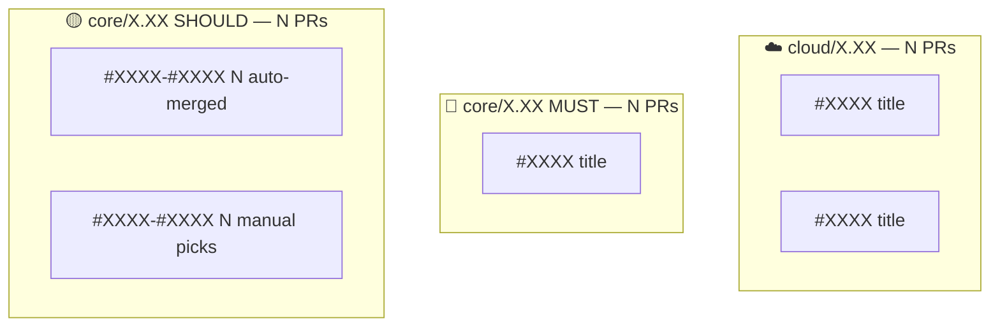

# Logging & Session Reports

## During Execution

Maintain `execution-log.md` with per-branch tables:

```markdown
| PR#   | Title | Status                            | Backport PR | Notes   |
| ----- | ----- | --------------------------------- | ----------- | ------- |
| #XXXX | Title | ✅ Merged / ⏭️ Skip / ⏸️ Deferred | #YYYY       | Details |
```

## Wave Verification Log

Track verification results per wave:

```markdown
## Wave N Verification — TARGET_BRANCH

- PRs merged: #A, #B, #C
- Typecheck: ✅ Pass / ❌ Fail
- Issues found: (if any)
- Human review needed: (list any non-trivial conflict resolutions)
```

## Session Report Template

```markdown
# Backport Session Report

## Summary

| Branch | Candidates | Merged | Skipped | Deferred | Rate |
| ------ | ---------- | ------ | ------- | -------- | ---- |

## Deferred Items (Needs Human)

| PR# | Title | Branch | Issue |

## Conflict Resolutions Requiring Review

| PR# | Branch | Conflict Type | Resolution Summary |

## Automation Performance

| Metric                      | Value |
| --------------------------- | ----- |
| Auto success rate           | X%    |
| Manual resolution rate      | X%    |
| Overall clean rate          | X%    |
| Wave verification pass rate | X%    |

## Process Recommendations

- Were there clusters of related PRs that should have been backported together?
- Any PRs that should have been backported sooner (continuous backporting candidates)?
- Feature branches that need tracking for future sessions?
```

## Final Deliverable: Visual Summary

At session end, generate a **mermaid diagram** showing all backported PRs organized by target branch and category (MUST/SHOULD), plus a summary table. Present this to the user as the final output.



Use the `mermaid` tool to render this diagram and present it alongside the summary table as the session's final deliverable.

## Files to Track

- `candidate_list.md` — all candidates per branch
- `decisions.md` — MUST/SHOULD/SKIP with rationale
- `wave-plan.md` — execution order
- `execution-log.md` — real-time status
- `backport-session-report.md` — final summary

All in `~/temp/backport-session/`.
