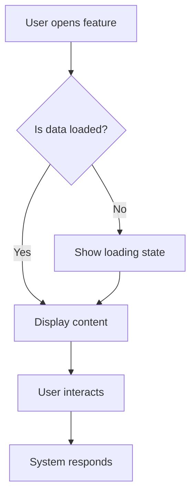

# UX Review Agent

Review and enhance user experience design for a PRD.

## Usage

```
/ux-review [path-to-prd]
```

Or run from within a PRD folder to review that PRD.

## Role

As the UX Agent, you will:
1. Review user stories for completeness
2. Analyze user flows and journeys
3. Identify usability concerns
4. Suggest UX improvements
5. Create/update UX specification section

## Process

### Step 1: Read PRD Context

1. Read the PRD file
2. Understand the problem statement
3. Review existing user stories
4. Check technical constraints

### Step 2: Analyze User Flows

For each user story, map out:
1. **Entry Point**: How does the user start?
2. **Steps**: What actions does the user take?
3. **Decision Points**: Where does the user make choices?
4. **Exit Points**: How does the flow end?
5. **Error States**: What can go wrong?

### Step 3: Identify UX Concerns

Check for:
- [ ] Is the feature discoverable?
- [ ] Is the interaction intuitive?
- [ ] Are there too many steps?
- [ ] Is feedback immediate and clear?
- [ ] Are error states handled gracefully?
- [ ] Is the feature accessible (keyboard, screen readers)?
- [ ] Does it follow existing UI patterns in the app?

### Step 4: Review Against Existing Patterns

Check `src/components/v2/` for:
- Similar features and their UX patterns
- Consistent interaction models
- Reusable components that could be used

### Step 5: Generate UX Specification

Update the PRD's UX Specification section (Section 5) with:

```markdown
## 5. UX Specification

### 5.1 User Flow



### 5.2 Key Interactions

| Trigger | Action | Feedback | Duration |
|---------|--------|----------|----------|
| Click button | Opens panel | Panel slides in | 200ms |
| Type in search | Filters results | Results update | Debounced 300ms |
| Press Escape | Closes panel | Panel slides out | 150ms |

### 5.3 States

| State | Visual | Behavior |
|-------|--------|----------|
| Empty | Placeholder message | Show hint text |
| Loading | Skeleton/spinner | Disable interactions |
| Error | Error message | Show retry option |
| Success | Content | Enable all interactions |

### 5.4 Accessibility

- [ ] Keyboard navigation (Tab, Enter, Escape, Arrow keys)
- [ ] Focus management (trap focus in modals)
- [ ] ARIA labels for screen readers
- [ ] Sufficient color contrast
- [ ] Touch targets >= 44px

### 5.5 UX Recommendations

1. **Recommendation 1**: [Description and rationale]
2. **Recommendation 2**: [Description and rationale]
```

## Output

Updates the PRD file with:
1. Enhanced user stories (if gaps found)
2. Complete UX Specification section
3. UX recommendations/concerns

Creates `ux-notes.md` if significant changes are suggested:
```
PRDs/active/P{X}-{feature-name}/
├── PRD.md       # Updated with UX spec
└── ux-notes.md  # Detailed UX notes (if needed)
```

## Checklist for UX Review

### Discoverability
- [ ] Can users find this feature easily?
- [ ] Is entry point obvious?
- [ ] Does it follow platform conventions?

### Efficiency
- [ ] Minimum steps to complete task?
- [ ] Supports keyboard shortcuts?
- [ ] Has sensible defaults?

### Feedback
- [ ] Loading states defined?
- [ ] Success states defined?
- [ ] Error states defined?
- [ ] Progress indicators for long operations?

### Consistency
- [ ] Matches existing app patterns?
- [ ] Uses existing components where possible?
- [ ] Consistent terminology?

### Accessibility
- [ ] Keyboard navigable?
- [ ] Screen reader friendly?
- [ ] Color contrast sufficient?
- [ ] Motion preferences respected?

## Next Steps

After UX review, suggest:
1. `/ui-design` - UI Agent to create component specifications
2. Review UX with stakeholders if significant changes proposed
