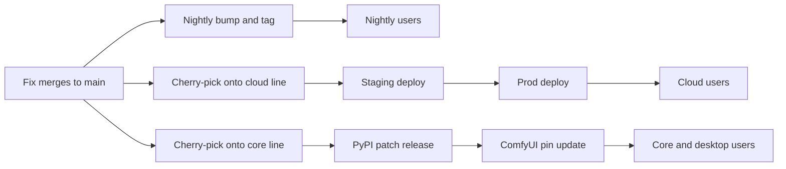
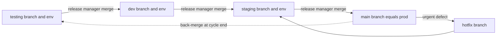
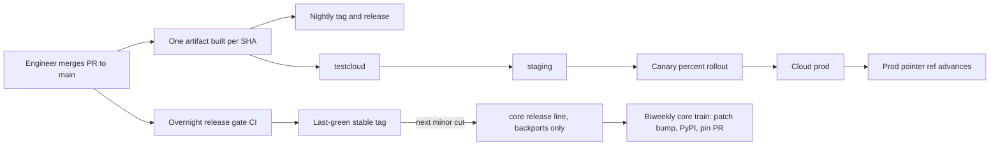
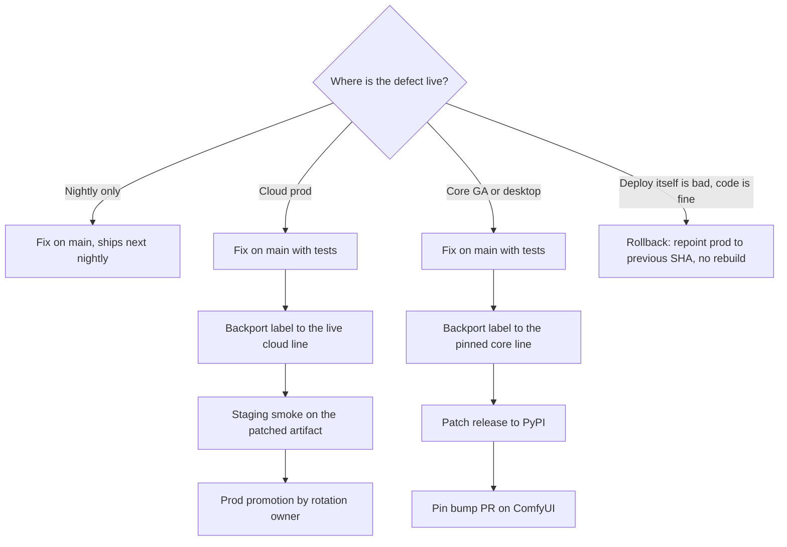

# Git Branching and Release Strategy

Status: Proposed
Scope: ComfyUI_frontend branching, release management, and environment promotion
Audience: frontend engineers, release rotation, QA, cloud and core release stakeholders

This document does three things:

1. Maps the current branching and release process and its measured pain points.
2. Reviews a draft proposal to replace it with a 4-tier environment-branch model
   (testing, dev, staging, main), including an honest scorecard and a
   keep-or-reject disposition for every element of that proposal.
3. Specifies the recommended strategy, how it addresses each pain point, and a
   phased rollout plan with risks and open questions.

## 1. Executive summary

The current process is not "only main". The repo runs one eternal development
branch plus 55 frozen release branches (38 core lines, core/1.6 through
core/1.47 with gaps; 17 cloud lines, cloud/1.31 through cloud/1.47), a
label-driven cherry-pick backport pipeline,
and a biweekly promotion train into ComfyUI core. The pain is real but it is
not caused by a missing environment hierarchy. It is caused by the distance
between main and the shipped lines: the longer a pinned release line lives,
the more cherry-picks it needs, the harder each one gets, and the bigger and
riskier each release batch becomes.

The draft 4-tier proposal is reviewed in section 4. Verdict: do not adopt as
written (overall 4/10 for this repo), because it models a single-track web
application while this product permanently ships three concurrent version
tracks, and its central promise (eliminating backports) is unachievable while
ComfyUI core pins an exact frontend package version. Eight of its underlying
instincts are correct and are adopted into the recommendation.

The recommended strategy (section 6) is: one eternal branch (main), short-lived
version branches only where a pinned version demands them (core/x.y), pipeline
promotion of build-once artifacts for cloud environments instead of environment
branches, hard freeze-as-code and drift limits, invariant checks instead of
notification bots, and a machine-maintained production pointer that gives git
visibility into what is deployed without human merge ceremony. This direction
aligns with and extends the org's existing shipping-speed initiative rather
than relitigating it.

## 2. Current topology: three concurrent tracks

Any branching strategy for this repo must first model what actually ships.
There is no single production. Three tracks run concurrently, each with its own
consumers, artifact, and patch path:

| Track | Consumers | Artifact | Deploys via | Patch path today |
| --- | --- | --- | --- | --- |
| Nightly | Community users running `--front-end-version @latest` (thousands) | GitHub release built from main | Nightly version-bump PR, tag, release | Fix merges to main, ships next nightly |
| Cloud | cloud.comfy.org users | Static assets built per commit SHA into GCS by the cloud repo | testcloud tracks the active `cloud/x.y` tip; staging and prod promote a SHA pointer via overlays and ArgoCD | Cherry-pick to `cloud/x.y` via backport label, then staged deploy |
| Core GA / desktop | ComfyUI stable and desktop installs | `comfyui-frontend-package` wheel on PyPI, pinned exactly in ComfyUI `requirements.txt` | Biweekly train: patch bump on `core/x.y`, PyPI publish, pin-bump PR on ComfyUI | Cherry-pick to `core/x.y`, patch release, new pin PR |

As of mid July 2026: main is at 1.48.x, cloud runs the 1.47 line, and the
ComfyUI pin is still on 1.45.x. Three minors of distance between main and core
GA is the normal operating state, not an anomaly.

Key mechanics worth naming because the strategy must preserve or deliberately
replace each one:

- Every minor bump on main automatically freezes the previous minor into paired
  `core/x.y` and `cloud/x.y` branches and rotates the matching backport labels.
- Backports are label-driven: `needs-backport` plus a target label triggers an
  automated cherry-pick PR; conflicts fall back to a documented manual path.
- The cloud deploy already promotes build-once artifacts: assets are built one
  time per SHA, and staging and prod move by repointing that SHA. Rollback is a
  pointer revert with no rebuild.
- Core GA promotion is a biweekly scheduled train that publishes to PyPI and
  drafts the ComfyUI pin-bump PR.
- A rotating release owner (the "sheriff") drives promotions; per-PR backport
  ownership was deliberately moved to feature pods in June 2026.
- Frontend builds destined for core GA soak in the core nightly channel
  (about two weeks for graph-touching changes) because there is no automated
  signal when a change breaks a community custom node. The soak is a
  compensating control for missing telemetry, not a property of safe code.

These mechanics are documented operationally in `docs/release-process.md`,
which remains the runbook of record for day-to-day releases. This document
governs the target strategy, and that runbook gets updated as each phase in
section 8 lands.

## 3. Pain points of the current process

Numbered for traceability to section 7. All are observed, not hypothetical.

- **PP1. Drift compounds on long-lived lines.** The 1.45 line spans 69 days
  from its minor cut to its latest patch and is still the pinned line: 19
  patch releases, 61 commits landed on it after it froze (54 backport
  cherry-picks plus 7 patch-release bumps), and main-vs-stable divergence of
  428 PRs by the latest patch. Backports onto old lines increasingly do not
  apply cleanly, and some do not even work once applied because the
  surrounding code diverged (a fix was backported to a GA line where it could
  not function without a second dependency PR, and was ultimately abandoned
  as a known issue).
- **PP2. Per-PR cherry-picks can silently miss a target.** A fix that needed
  two cloud lines landed on only one; the next release shipped the regression
  back to users. Three independent safeguards (notification bot, sweep check,
  PR comment) all failed to catch it (FE-713).
- **PP3. Release batches grow superlinearly risky.** Missing one train window
  meant a double-minor release: 401 PRs validated in a single QA pass, the
  largest surface the team has ever had to certify, including high-risk
  subsystem rewrites.
- **PP4. The backport tooling itself fails silently.** The notification bot was
  down for six weeks without anyone noticing; the repo-level auto-merge setting
  is off, which silently turned the backport auto-merge flag into a no-op and
  required a workaround workflow; the manual retry path of the backport
  workflow was broken (FE-1282).
- **PP5. Freeze state lives in conversation, not tooling.** A verbally frozen
  line was bumped past by an engineer who reasonably read stalled automation as
  a missed dispatch. The resulting premature minor cut cost one to two weeks of
  recovery. The post-mortem's first action item: encode freeze state durably.
- **PP6. Human bottlenecks and burnout.** One engineer ran the release rotation
  for roughly two months straight; urgent core releases have required chasing
  approvals late at night. Backport PRs add review friction (authors cannot
  always self-approve, approvers are asleep, label permissions vary).
- **PP7. Latency invites bypasses.** A simple graph change takes a minimum of
  about 16 days to reach core GA (review, two-week soak, release), up to 27 if
  it just misses a window. Under deadline pressure a customer demo was shipped
  via a one-off deployment that routed around the release process entirely,
  creating an unowned production surface.
- **PP8. Release state is hard to read.** Answering "what exactly is on cloud
  prod" requires cross-referencing a branch tip, a deploy tag, and a SHA in
  another repo's values file. Public release surfaces (GitHub releases, docs
  changelog, in-app update notice) have drifted out of sync.
- **PP9. QA involvement is ad hoc.** Test plans are hand-built per release
  (one release needed a bespoke plan naming 84 high-risk PRs); there is no
  standing definition of entry and exit criteria per promotion gate.
- **PP10. Everything above burns cross-team trust.** Slow stable releases are
  a recurring source of cross-team friction, and the release rotation absorbs
  that pressure personally.

## 4. Review of the draft 4-tier proposal

### 4.1 The proposed model

The draft proposes four long-lived branches, each auto-deploying to its own
standing environment, promoted wholesale (no cherry-picks) by a release
manager, with hotfixes cut from main re-entering through staging, and a
main-to-testing back-merge closing each cycle:

Claimed properties: engineers merge freely into testing; dev is a guaranteed
stable baseline; staging mirrors production for UAT; main is 1-to-1 with what
is deployed, "eliminating the complicated and error-prone process of
back-porting entirely."

This model was reviewed against the org context in sections 2 and 3, the
industry evidence in section 5, and an adversarial defense pass (a reviewer
whose explicit job was to defend the proposal and refute the critique; several
initial critique points were withdrawn or narrowed as a result and are noted
below).

### 4.2 What the proposal gets right

These instincts are correct, and each is adopted in section 6 via a cheaper
mechanism than a branch tier:

- **K1. Deployed state should be inspectable in git.** Today it is not (PP8).
  Adopted as a machine-maintained prod pointer (6.5).
- **K2. Freezes must be enforced by tooling, not by verbal agreement.** The
  premature-bump incident (PP5) proves it. Adopted as freeze-as-code (6.6).
- **K3. Promotions need named owners and explicit gates.** Adopted via GitHub
  Environments protection rules and the existing rotation (6.4).
- **K4. Engineers need a guaranteed-good base to branch from when trunk is
  red.** Adopted as last-green stable tags on main (6.7).
- **K5. Fix propagation needs a hard discipline.** The draft's down-merge SLA
  becomes the inverse and industry-standard rule: upstream first, fix lands on
  main before any release line (6.3).
- **K6. Whole-unit promotion beats per-PR picking wherever a track allows it.**
  Wholesale promotion makes the PP2 failure class (a missed per-PR pick)
  unrepresentable. Adopted for the cloud track as whole-artifact promotion,
  and bounded on the core track by a drift SLO (6.8).
- **K7. Every promotion should auto-deploy its surface.** Directionally right
  and already sanctioned by in-flight work that removes no-value manual steps
  (FE-1176). Adopted throughout.
- **K8. QA deserves a first-class, named slot in the release path.** The only
  document in this debate that gives QA an explicit stage. Adopted as defined
  entry/exit criteria per gate instead of a dedicated environment (6.4).

### 4.3 Findings

Ordered by severity. "Withdrawn" notes mark initial critiques that did not
survive the adversarial defense, kept here so the review is honest about its
own error bars.

**Fatal (any one of these blocks adoption as written):**

- **F1. The central claim is false for this product.** "Eliminates
  back-porting entirely" cannot hold while ComfyUI core pins an exact
  `comfyui-frontend-package` version and desktop users run pinned installs.
  A linear four-tier chain holds exactly one version in flight; it has no
  mechanism to patch a shipped 1.45 while 1.47 is mid-promotion and 1.48 is
  on nightly. Fixes to pinned lines remain cherry-picks plus PyPI patch
  releases, that is, backports. The proposal eliminates the word by omitting
  the surface that needs it: nowhere does it mention the pin, PyPI, desktop,
  the soak, or custom nodes. (Narrowed but confirmed under defense: wholesale
  trains do reduce drift-driven backport volume; they do not remove the
  pinned-version axis.)
- **F2. It re-models an existing artifact pipeline as merge ceremony, and
  regresses it.** Cloud promotion is already build-once: one SHA-keyed asset
  build, promoted by pointer, rollback with no rebuild. Branch-tier CD means
  each tier builds its own merge commit, so the artifact validated on staging
  is provably not the artifact deployed from main. Worse, GitHub pull request
  merges never fast-forward, so gated promotion PRs mint a new SHA at every
  tier: "human-gated promotion" and "main is SHA-identical to prod" are
  mutually exclusive with native GitHub mechanics. One of the model's two
  core promises must break.
- **F3. The soak has no home.** The two-week custom-node soak is the org's
  central regression control for its worst historical failure class. In a
  linear chain it either occupies the staging tier permanently (capping all
  release cadence at soak length and colliding with the hotfix path) or
  silently disappears while its automated replacement remains unstaffed.
- **F4. It rows against the org's sanctioned direction.** The shipping-speed
  initiative targets PR-to-prod under 48 hours, backport rate under 10
  percent, and stable tags cut from main every 24 to 48 hours, backed by an
  internal PRD and in-flight Linear work (FE-1176, FE-602/BE-800, release
  gate automation). The draft adds an N-day merge freeze (at roughly 330
  merged PRs per month across all targets, about 230 of them on main, that
  is a real stall), three human promotion gates,
  and full-cycle latency for every change. DORA's trunk research lists "no
  code freezes" as a success criterion for elite delivery.

**Major:**

- **F5. The hotfix path is inoperable mid-cycle.** Hotfixes cut from main
  re-enter through staging. Whenever staging holds next-cycle content in UAT
  (most of the calendar), an urgent prod fix either waits out UAT or drags
  unreleased work to production. At the observed fix rate on live lines
  (54 backports in the 53 days after the 1.45 line froze, about one per
  day), "restart UAT on every hotfix" is a validation livelock. Notably, both parents of this model do it differently:
  GitLab Flow is strictly upstream-first, and GitFlow merges hotfixes to
  master directly. The draft inherits the weaker property of each.
- **F6. "Guaranteed stable dev" is a smoke test, not a guarantee.** dev
  receives testing wholesale, so at promotion time dev is byte-identical to
  testing at freeze. The only stability delta is whatever a quick smoke pass
  catches, and the tier's only unique content comes from direct-to-dev
  hotfixes, which is the environment-drift anti-pattern. A second standing
  environment running identical code adds configuration-drift false positives,
  not signal. (Narrowed under defense: as a lagged checkpoint, dev does have
  value mid-cycle; but a last-green tag delivers the same checkpoint without
  a branch, an environment, or a gate.)
- **F7. Every gate is human and every suite is undefined.** The model's
  stability claims rest entirely on "smoke tests," "all regression and
  acceptance tests," and release-manager judgment. No suite, owner, or pass
  criterion is named anywhere. Against roughly 330 PRs per month with a
  two-person QA function, undefined manual gates become either the bottleneck
  or a rubber stamp; the 401-PR pass (PP3) becomes the steady state, since
  biweekly wholesale promotion at current velocity is roughly 110 to 165 PRs
  per batch (main-line content alone runs about 110 per two weeks).
- **F8. No rollback story, and env-branch rollback poisons future
  promotions.** The draft never mentions rollback. Reverting a bad promotion
  merge makes git treat that content as already-merged, silently dropping it
  from the next wholesale promotion until someone reverts the revert. And the
  moment a prod deploy fails after the staging-to-main merge, main is ahead of
  prod again, the exact state the model claims to abolish.
- **F9. The four auto-deploy pipelines do not exist and cannot be driven from
  this repo.** This repo never deploys anything; it fire-and-forgets a
  dispatch to the cloud repo, which owns builds, secrets, and ArgoCD. Standing
  up per-branch CD means building four cross-repo deploy paths while the
  backend concurrently moves to per-service delivery with its own promotion
  model. The proposal is also purely additive: since it cannot serve the
  pinned-package axis (F1), all existing release machinery keeps running
  beside it, and the net delta is plus three eternal branches, plus one or two
  standing environments, plus three human gates.

**Spec gaps and smaller issues:**

- **F10. Wholesale-minus-exceptions needs a written procedure.** Excluding one
  bad PR from a promotion is revert-then-reland (and revert-the-revert later),
  a known git footgun that will otherwise be improvised for the first time
  during a release emergency. The draft's own exception clause re-authorizes
  the cherry-picking it bans. (Initial claim "this is not a git operation" was
  withdrawn: revert/reland is standard practice; the finding is that the
  procedure is unwritten and its failure mode, silently dropped features, has
  no detecting check.)
- **F11. Freeze semantics are underspecified rather than contradictory.**
  (Initial "rules 1.c and 1.d contradict" was withdrawn.) The real gap:
  stabilization fixes must merge during the freeze, so the freeze is porous by
  design, with no tooling-enforced definition of what may enter, which is
  exactly the un-encoded-freeze failure mode of PP5.
- **F12. Naming and contract frictions.** A tier named dev that is more stable
  than testing inverts every industry convention; repointing main's semantics
  would break the nightly channel contract, though the model does not actually
  require the top tier to be named main (withdrawn as a fatal objection: tier
  names are free variables; kept as a migration note). Rule 6.a's ancestry
  policy has no native GitHub primitive and needs a small custom status check;
  cheap, but this org's post-mortems document exactly this class of bespoke
  automation failing silently (PP4).

### 4.4 Scorecard

| Dimension | Score | Basis |
| --- | --- | --- |
| Internal coherence | 5/10 | F5, F8, F10, F11 are real; several initial coherence critiques were withdrawn under defense |
| Fit to this product's topology | 3/10 | F1, F3: the pinned-package axis and the soak are unmodeled |
| Operability on GitHub with current infra | 2/10 | F2 SHA exclusivity, F9 pipelines do not exist, additive process surface |
| Alignment with current industry evidence | 3/10 | Section 5; env-branch promotion is a documented anti-pattern for continuously deployed surfaces, with narrow exceptions that map to pipeline approval gates |
| Quality of underlying instincts | 8/10 | K1 through K8 are correct and adopted |
| **Overall, as written, for this repo** | **4/10** | Fatal findings F1 through F4 |

For fairness: as a generic process for a single-track web application in the
era it comes from, this model rates roughly 6.5/10; GitLab Flow's environment
branch variant, which it closely resembles, remains documented practice. The
low score here is about fit to this product, not about the model's pedigree.

### 4.5 Disposition of each proposal element

| Proposal element | Disposition | Why |
| --- | --- | --- |
| Four long-lived environment branches | Reject | F1, F2, F3, F9; environments become pipeline stages instead |
| Wholesale promotion, no cherry-picks | Adapt | Correct for cloud as whole-artifact promotion (K6); impossible for the pinned core axis (F1) |
| Release-manager gated merges at three tiers | Adapt | One named human gate per surface via GitHub Environments required reviewers; no new role hierarchy (PP6) |
| N-day code freeze on the integration branch | Reject | F4; freezes are the documented anti-pattern and main never freezes today |
| Anything in testing ships in the current cycle | Adapt | Correct WIP-limit instinct; becomes the enforceable drift SLO in 6.8 |
| dev tier as stable baseline | Replace | Last-green stable tags on main (K4, F6) |
| staging tier for UAT and alpha access | Keep the capability | Already exists as the staging environment plus auth-gated and per-PR preview deploys; formalize QA criteria (K8) |
| main equals prod, 1-to-1 | Replace | Machine-maintained prod pointer ref (K1); merge-based parity is unenforceable on GitHub (F2) |
| Hotfix via branch from main through staging | Reject | F5; hotfix path per track defined in 6.9 |
| Back-merge main to testing at cycle end | Reject | Unnecessary once there is a single eternal branch; upstream-first makes down-merges structural (K5) |
| GitHub-enforced containment policy (6.a) | Adopt the idea | As a 20-line ancestry status check plus release-content verification (6.8), with heartbeat alerts given PP4 |
| Version tag on every prod deploy | Already exists | Cloud deploy tags and nightly tags; kept and unified in the prod pointer spec |

## 5. What the industry does

Genealogy first, because the draft cites a remembered decade-old post with
detailed charts. No post titled "a better git branching strategy" from that
era appears to exist. The remembered title and charts almost certainly belong
to Vincent Driessen's "A successful Git branching model" (nvie.com, 2010, the
GitFlow post). The remembered content, four auto-deploying environment tiers
promoted by wholesale merge, matches GitLab Flow's environment-branches
variant (2014). The hotfix-from-prod and back-merge mechanics are GitFlow's.
The draft is therefore a hybrid of two models from 2010 to 2014, both of whose
authors have since published significant caveats:

- Driessen added a note to the GitFlow post in 2020: teams shipping
  continuously delivered web software should use a much simpler flow such as
  GitHub Flow; GitFlow-style models remain reasonable for explicitly versioned
  software with multiple versions in the wild. Both halves apply here, because
  this product is both.
- GitLab's own docs now describe the environment-branch variant alongside a
  release-branch variant with an explicit upstream-first rule (fix on main,
  cherry-pick down), the same policy Google and Red Hat practice.

The current consensus, by product shape:

- **Continuously deployed services** (GitHub, Shopify, Google, the DORA
  research corpus): one mainline, short-lived topic branches, merge queue,
  feature flags, canary or percentage rollout. Environments are deployment
  pipeline stages or GitOps folders, not branches. DORA's trunk criteria:
  three or fewer active branches, daily merges, no code freezes; elite
  performers correlate strongly with this shape. Environment-branch promotion
  is repeatedly documented as an anti-pattern (Fowler's branching patterns;
  the GitOps literature: merge-order skew, unintended config riding along,
  undocumented prod drift from direct-to-branch hotfixes, per-branch rebuilds
  violating build-once). The one conceded exception, regulated sign-off audit
  trails, is satisfied by pipeline approval gates with deployment history.
- **Versioned or embedded software** (Chrome, Firefox, Microsoft Release
  Flow): trunk plus short-lived per-release branches, cut just in time,
  fix-only, upstream-first cherry-picks with approval, never merged back,
  retired when the version leaves support. Chrome ships a milestone every four
  weeks this way; Firefox calls the cherry-pick an uplift and gates it on
  release management approval. The heavyweight tooling both maintain is
  evidence that backports are a cost to be minimized, not a routine channel.
- **Hybrid products like this one** split the axes: trunk plus pipeline
  promotion and flags for the continuously deployed surface; trunk plus
  short-lived release branches for the pinned, versioned surface. That is
  Microsoft Release Flow on one side and Chrome-style trains on the other,
  sharing one trunk.

Sources: nvie.com/posts/a-successful-git-branching-model,
about.gitlab.com/topics/version-control/what-is-gitlab-flow,
dora.dev/capabilities/trunk-based-development,
martinfowler.com/articles/branching-patterns.html,
trunkbaseddevelopment.com/branch-for-release,
octopus.com/blog/stop-using-branches-deploying-different-gitops-environments,
beyond.minimumcd.org/docs/reference/practices/immutable-artifacts,
devblogs.microsoft.com/devops/release-flow-how-we-do-branching-on-the-vsts-team,
chromium.googlesource.com/chromium/src/+/master/docs/process/release_cycle.md,
wiki.mozilla.org/Release_Management/Release_Process,
github.blog/engineering/engineering-principles/deploying-branches-to-github-com,
shopify.engineering/successfully-merging-work-1000-developers.

## 6. Recommended strategy

### 6.1 Principles

- **P1. One eternal branch.** main is the single integration branch and the
  nightly channel. Its semantics are a locked contract: nightly releases,
  npm type publishing, cloud build dispatch, CI triggers, and community
  tooling all key off it.
- **P2. Build once, promote artifacts.** Every merge to main produces one
  SHA-keyed artifact. Environments receive that artifact by pointer; nothing
  is ever rebuilt per environment. The artifact that passes staging and canary
  is byte-identical to the artifact in production.
- **P3. Upstream first, always.** Every fix lands on main first, with tests.
  Release lines receive changes only via the backport pipeline. Direct commits
  to `core/*` and `cloud/*` are blocked for humans (release automation
  excepted). This is the rule that prevents the PP2 class.
- **P4. Branches only where a version demands one.** A long-lived branch
  exists only to serve a pinned, shipped version (`core/x.y` while ComfyUI
  pins it). No branch exists to represent an environment.
- **P5. Invariants over notifications.** Every policy in this document that
  matters is enforced by a required check or a reconciling audit with
  heartbeat alerting, not by a bot that posts a message. PP4 is the reason.
- **P6. Gates are automation-first, with at most one named human approval per
  surface,** held by the existing release rotation. No new role hierarchy.
- **P7. Small batches on a fixed cadence.** The unit of release stays as small
  as the gates allow. The 401-PR batch is the documented anti-goal.

### 6.2 Branch roles

| Branch | Lifetime | Purpose | Who writes to it |
| --- | --- | --- | --- |
| `main` | Eternal | Integration, nightly channel, source of all builds | Engineers via peer-approved PRs |
| `core/x.y` | Weeks; dies when the ComfyUI pin moves off x.y | Serve the pinned PyPI line | Backport automation and release bumps only |
| `cloud/x.y` | Interim only; retired per 6.10 | Cloud release train until cloud CD lands | Backport automation only |
| `feature/*`, `fix/*` | Days | Topic branches off main (or a last-green tag when main is red) | The author |
| Prod pointer ref (`deployed/cloud-prod`) | Eternal, machine-written | Mirrors the verified deployed SHA after every prod sync, rollbacks included | Deploy pipeline only |

Target state, Phase 2 and later (until the cloud branch retirement in 6.10
lands, the cloud leg still promotes from the interim cloud/x.y line):

### 6.3 The two release axes, explicitly separated

- **Cloud axis (continuous):** main to testcloud to staging to prod is
  artifact promotion through pipeline stages. Gates live in the pipeline: the
  overnight release-gate suite for candidate selection, a staging smoke
  checklist with named QA criteria, and canary metrics with automatic
  rollback once the canary program lands. Incomplete features land on main
  dark behind feature flags so the trunk stays releasable while work is in
  progress. No environment branches.
- **Core axis (versioned):** `core/x.y` branches exist because an exact
  version is pinned by another product and shipped to desktops. They are cut
  automatically (as today; in the target state the cut is taken from the
  newest last-green tag rather than the raw pre-bump commit), receive fixes
  only via upstream-first backports, and are retired when the pin moves. The fix for PP1 is not a new topology;
  it is shortening how long these lines live and how far they drift (6.8).

### 6.4 Promotion gates

Implemented as GitHub Environments deployment protection rules (required
reviewers plus deployment history), not as branch merges. This natively
provides the audit trail that is the one legitimate case for human-gated
promotion, and it is the same primitive the draft's release-manager gates
actually wanted.

| Gate | Trigger | Automated criteria | Human |
| --- | --- | --- | --- |
| PR into main | Every PR | Unit, component, lint, typecheck | One peer approval |
| Release-gate verdict | Nightly | Behavioral suite, critical-path browser tests, custom-node harness when live | None; red verdict is an incident |
| Staging promotion | On green candidate | Artifact exists, gate verdict green | None (auto) |
| Prod promotion | Sheriff action | Staging smoke checklist green | One: rotation owner |
| Core GA train | Biweekly schedule | Line is green, soak or harness criteria met | One: pin PR merge in ComfyUI |

QA's slot (K8): the staging smoke checklist and the release regression scope
are standing documents with named QA owners and defined entry and exit
criteria, replacing hand-built per-release plans (PP9).

### 6.5 Production visibility (adopts K1)

A machine-maintained ref, `deployed/cloud-prod`, is written by the deploy
pipeline only after the production sync reports healthy, and it mirrors the
deployed SHA in both directions: a verified rollback moves the ref backward
to the rolled-back SHA (a recorded, non-fast-forward move with the rollback
reason logged, which the reconciler treats as healthy), so the ref never lies
about production during an incident. A reconciling check compares the ref against the cloud repo's
deployed SHA on every deploy and alerts on mismatch (P5). Answering "what is on prod" becomes
`git log deployed/cloud-prod`, which is the legitimate requirement behind the
draft's main-equals-prod rule, delivered without merge ceremony and immune to
the F2 impossibility.

### 6.6 Freeze-as-code (adopts K2)

Freeze state is a first-class marker (a repo variable or protected file) that
release automation checks before acting: the minor-bump dispatch refuses to
cut past a frozen line, and backport targeting warns on frozen targets. All
release bots carry heartbeat alerts; silence is an incident. These are the
premature-bump post-mortem action items, promoted into the strategy.

### 6.7 Stable base for engineers (adopts K4)

The nightly release-gate verdict stamps an immutable dated tag (for example
`stable/2026-07-18`) on the newest commit that passed the full gate and
advances a `stable/latest-green` branch-style ref to it. A moving ref, not a
moving tag, on purpose: git clients do not force-update moved tags by
default, so a moving tag would silently go stale locally. When main is red,
engineers branch from the ref or the dated tag instead of a standing dev
branch. Red main is itself an incident
with a named owner, which is what actually keeps the trunk usable.

### 6.8 Drift limits and content verification (adopts K6 and the containment idea)

- **Drift SLO:** the pinned release line being older than 28 days, or the pin
  sitting more than two minors behind main, pages the rotation owner and
  forces a train decision. This is the WIP limit that the draft expressed as
  "anything in testing ships this cycle," made enforceable. PP1's 69-day line
  becomes structurally impossible to reach silently. A breach also blocks the
  next minor cut until acknowledged. The SLO activates with a burn-in
  exemption for the already-breached 1.45 line, and a breach that traces to
  an unmerged ComfyUI pin PR escalates per risk R2 instead of paging the
  rotation, because that lever is not frontend-side.
- **Convergence invariant:** a scheduled check asserts every commit on a live
  release line is an ancestor of main or arrived via the backport pipeline,
  and that every prod-deployed SHA is reachable from a release line. Roughly
  20 lines of CI; catches what three notification bots missed (PP2).
- **Release-content verification:** before a train departs, an automated
  check confirms every PR labeled for that line actually landed on it, and
  posts the diff of intent versus content. FE-713 becomes a failing check
  instead of a user report.

### 6.9 Hotfix and rollback runbooks

Interim topology (while cloud/x.y lines exist; after the 6.10 retirement the
cloud leg promotes last-green artifacts from main instead):

Rules: hotfixes never restart full UAT and never bundle unreleased content;
validation scope is the affected area plus the standing smoke checklist. The
sanctioned path must stay hours-scale (target: under 8 working hours from
fix merged on main to prod promotion), because the org has already
demonstrated that a slower sanctioned path manufactures shadow deploy surfaces
(PP7). Rollback is always a pointer move, never a git revert of a promotion;
revert is reserved for code defects on main with an explicit reland step.

### 6.10 Cloud branch retirement (the end state for the cloud axis)

`cloud/x.y` branches exist today because cloud deploys from a frozen line.
Once the release-gate suite plus canary auto-rollback are proven (several
clean ramps and at least one real auto-rollback in production), cloud promotes
last-green artifacts from main directly and the cloud branch family retires.
The cutover checklist must cover: release-branch creation stops cutting
`cloud/<minor>` and rotating cloud labels, the cloud deploy tag workflow
retires, build dispatch keys on main SHAs and promotion events, and testcloud
repoints from the cloud line tip to last-green tags. Until then, cloud/x.y
continues exactly as today; this document changes nothing about it yet.

## 7. How this solves the current pain points

| Pain point | Mechanism in this strategy | Status |
| --- | --- | --- |
| PP1 drift on long lines | Drift SLO (6.8) caps line age; shorter trains; upstream-first keeps lines fix-only | Mitigated; fully solved only if ComfyUI adopts pin bumps at train cadence (risk R2) |
| PP2 missed per-PR backports | Release-content verification plus convergence invariant (6.8); whole-artifact promotion on cloud removes per-PR picks there entirely | Solved: becomes a failing check, and unrepresentable on the cloud axis post 6.10 |
| PP3 giant QA batches | Fixed cadence with drift SLO forces small trains (P7); release-gate CI carries per-merge burden | Mitigated; batch size cannot silently grow past the SLO, and drops under 100 if the 13.1 decision moves the core train to weekly |
| PP4 silent tooling failure | Invariants and reconciling audits with heartbeat alerts replace notification-only bots (P5); prerequisite fixes named in 8 | Mitigated; bots can still break, but silence itself now alarms |
| PP5 verbal freezes | Freeze-as-code guards the bump and backport paths (6.6) | Solved: the premature-bump incident becomes mechanically impossible |
| PP6 human bottleneck | One human gate per surface on the existing rotation; merge-on-green everywhere else; backport approval rules simplified by making automation the only writer to release lines | Mitigated; the rotation remains, its late-night surface shrinks |
| PP7 latency invites bypasses | Hours-scale sanctioned hotfix lane (6.9); canary replaces calendar soak for cloud; core latency shrinks as the harness replaces the soak | Partially solved now, fully contingent on the custom-node harness (risk R1) |
| PP8 unreadable release state | Prod pointer ref (6.5); unified tags; one strategy document | Solved |
| PP9 ad hoc QA | Standing gate criteria with named QA owners (6.4) | Solved by process definition |
| PP10 cross-team trust | Publish the delivery metrics (9) on a fixed cadence so progress is legible instead of argued | Mitigated; trust follows the numbers |

The honest line on backports: this strategy does not eliminate them, because
nothing can while another product pins an exact version. It makes them rare
(drift SLO plus faster trains), safe (upstream-first plus content
verification), and boring (automation is the only writer to release lines).
The draft's promise was elimination; the achievable promise is a backport
rate under 10 percent with no silent misses.

## 8. Rollout plan

Prerequisites (fix before anything else changes): repair the manual backport
retry workflow (FE-1282), turn on the repo auto-merge setting and retire the
cron workaround, add heartbeat alerts to every release bot, and correct the
stale PyPI-attribution in docs/release-process.md so the runbook of record
matches the actual workflows.

- **Phase 0, immediately:** adopt this document; freeze-as-code; prod pointer
  ref; drift SLO alerting; convergence invariant check; standing QA gate
  criteria drafted (their operational acceptance is P1 item 9). No branch
  topology changes at all.
- **Phase 1, with the release gate:** overnight release-gate suite produces
  last-green tags; stable tags become the engineer base and the cloud
  candidate source; staging promotion goes automatic on green.
- **Phase 2, with the canary:** percentage rollout with metric-gated
  auto-ramp and auto-rollback on cloud prod; hotfix lane switches to
  canary-validated promotion.
- **Phase 3, retirement:** cloud/x.y family retires per 6.10. Core/x.y
  remains, on shorter trains, as long as ComfyUI pins exact versions; the
  calendar soak retires only when the custom-node harness is live, staffed,
  and has held the escaped-regression guardrail flat for two full cycles.

## 9. Goals and success metrics

| Goal | Metric | Target | Horizon |
| --- | --- | --- | --- |
| Ship fast | PR merge to cloud prod | Under 48 hours median | Phase 2 |
| Backports rare | Backported PRs / merged PRs | Under 10 percent | Phase 2 |
| Lines stay young | Max live release-line age | Under 28 days | Phase 1 |
| No silent misses | Escaped regressions from missed backports | Zero | Phase 0 |
| Batches stay small | PRs per QA-certified release | Under 100 | Phase 2, after the 13.1 cadence decision |
| Prod is legible | Time to answer "what is on prod" | One git command | Phase 0 |
| No shadow deploys | Unowned one-off production surfaces | Zero new | Phase 0 |

Leading indicators are the first three; report all seven on a fixed cadence in
the cross-team channel (PP10).

## 10. Non-goals

- Renaming or repointing main. Its contract is locked (P1).
- Eliminating release branches while ComfyUI pins exact frontend versions.
  That coupling is a product decision owned elsewhere; this strategy minimizes
  its cost rather than pretending it away.
- Standing up new long-lived environments. Existing surfaces (testcloud,
  staging, per-PR previews) cover every tier the draft wanted.
- Changing ComfyUI core's own release process, cadence, or the soak policy it
  requires; this document only defines what the frontend does on each axis.
- Prescribing the backend or cloud repo's deployment architecture (per-service
  delivery work proceeds independently).

## 11. Requirements

**P0 (the strategy is not adopted without these):**

1. Freeze-as-code marker checked by version-bump and backport automation.
   Acceptance: a bump dispatch against a frozen line fails with a clear error;
   verified by test.
2. Prod pointer ref written only by the deploy pipeline after verified sync,
   with a reconciling audit. Acceptance: mismatch alarms within one deploy
   cycle.
3. Convergence invariant and release-content verification checks, with
   heartbeat alerting. Acceptance: a deliberately mislabeled test PR is caught
   before a train departs.
4. Drift SLO alerting at 28 days of line age or two minors of pin divergence.
   Acceptance: alert fires in a rehearsal against a stale line.
5. Documented hotfix and rollback runbooks (6.9) with an hours-scale SLA.
   Acceptance: one rehearsed hotfix per quarter meets the SLA.
6. Prerequisite tooling fixes: FE-1282, auto-merge setting, bot heartbeats.
   Acceptance: a manually dispatched backport retry succeeds end to end; a
   backport PR merges via repo auto-merge with the cron workaround retired;
   killing a release bot raises its heartbeat alert.

**P1 (fast follows):**

7. Overnight release-gate suite stamping last-green tags; red verdict is an
   incident with a named owner. Acceptance: a green run stamps the dated tag
   within an hour; a red run opens an owned incident.
8. Automatic staging promotion on green; GitHub Environments protection rules
   with deployment history as the prod gate. Acceptance: a green candidate
   reaches staging with zero human actions, and a prod promotion without the
   required reviewer is blocked in rehearsal.
9. Standing QA gate criteria with named owners replacing per-release plans.
   Acceptance: the next release runs from the standing criteria with no
   bespoke test plan authored.

**P2 (future, explicitly sequenced):**

10. Canary with metric-gated auto-ramp and auto-rollback. Acceptance: one
    production auto-rollback triggered by canary metrics in a game day.
11. cloud/x.y retirement per the 6.10 checklist. Acceptance: the cutover
    checklist fully executed, verified by a workflow inventory showing no
    half-dead machinery.
12. Soak retirement gated on the custom-node harness guardrail. Acceptance:
    the harness holds the escaped-regression guardrail flat for two full
    cycles before any soak shortening.

## 12. Risk register

| ID | Risk | L | I | Level | Mitigation | Owner |
| --- | --- | --- | --- | --- | --- | --- |
| R1 | Custom-node harness stays unstaffed, so soak cannot shrink and core latency persists | High | High | Critical | Escalate staffing as the single gating dependency of the whole program; do not shorten the soak before the harness holds the guardrail | Eng leadership |
| R2 | ComfyUI pin adoption lags frontend trains, so drift SLO breaches are unresolvable frontend-side | High | High | Critical | Agree a pin-adoption SLA with core release stakeholders; SLO breaches tracing to an unmerged pin PR escalate to leadership instead of paging the rotation | FE eng manager with core stakeholders |
| R3 | Canary program slips; cloud branches linger in a half-retired state | Med | High | High | Retirement is the last step with explicit cutover criteria; interim state is exactly today's process | Release pipeline owner |
| R4 | Prod pointer or invariant checks silently break, recreating PP4 | Med | High | High | Heartbeat alerts plus reconciliation against the deploy system on every run; silence pages | DevOps |
| R5 | Drift SLO is ignored under deadline pressure | Med | Med | Medium | SLO breach pages the rotation and blocks the next minor cut until acknowledged | Rotation owner |
| R6 | Incremental rollout gives no visible "fixed" moment; cross-team pressure continues | Med | Med | Medium | Publish the section 9 metrics on a fixed cadence; make progress legible | FE eng manager |
| R7 | Flag debt accumulates as flags gate incomplete work on trunk | Med | Low | Low | Review-for-deletion date on every flag; monthly cleanup | FE leads |

Doing nothing carries its own critical risks (drift compounds, the next
missed backport ships another regression, rotation burnout continues); the
status quo is not the safe option.

## 13. Open questions

1. Cadence of the core train once the drift SLO lands: stay biweekly or move
   to weekly? At current velocity the under-100 batch target in section 9 is
   reachable only with weekly trains, so this question blocks that one
   metric's horizon. (Rotation owner plus core release stakeholders; blocking
   for the batch-size target, non-blocking for everything else.)
2. Should the prod pointer cover core GA and desktop as refs too
   (`deployed/core-ga`), or is PyPI plus the pin authoritative enough?
   (Frontend leads; non-blocking.)
3. Who owns the standing QA gate criteria documents long-term as QA staffing
   changes? (QA plus FE eng manager; blocking for Phase 0 sign-off.)
4. Does the org-admin limitation on separate go-live approvers (surfaced
   during FE-1176) need resolution before GitHub Environments become the prod
   gate? (DevOps plus org admins; blocking for P1 item 8.)

## 14. References

Internal: `docs/release-process.md` (the operational runbook of record,
updated as phases land); the shipping-speed initiative and its release-gate
and canary design docs; the release rotation runbook; the
premature-version-bump post-mortem; FE-713, FE-1176, FE-1282, FE-602/BE-800;
the draft 4-tier proposal this document reviews.

External: see section 5 source list.
