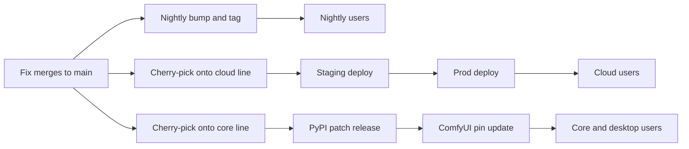
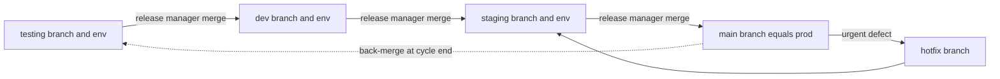
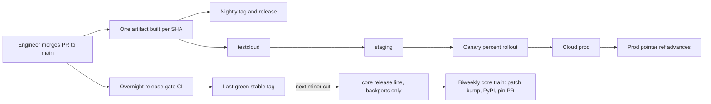
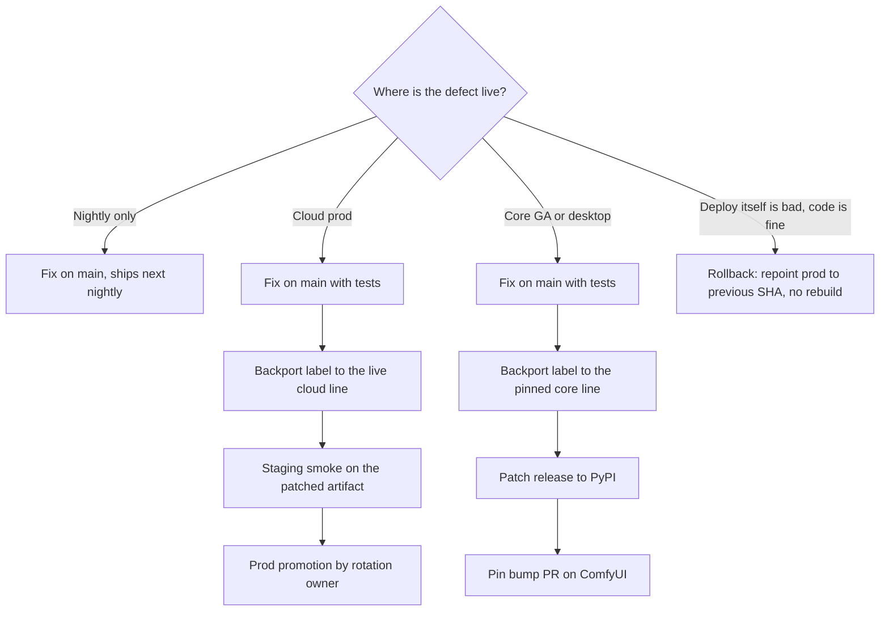

# Git Branching and Release Strategy

Status: Proposed
Scope: ComfyUI_frontend branching, release management, environment promotion
Audience: frontend engineers, release rotation, QA, cloud and core release stakeholders

## 1. Executive summary

The current process is not "only main": one eternal development branch plus 55
frozen release branches (38 core lines, core/1.6 through core/1.47 with gaps;
17 cloud lines, cloud/1.31 through cloud/1.47), a label-driven cherry-pick
backport pipeline, and a biweekly promotion train into ComfyUI core. The pain
is not a missing environment hierarchy; it is the distance between main and
the shipped lines. The longer a pinned line lives, the more cherry-picks it
needs, the harder each one gets, and the riskier each release batch becomes.

The draft 4-tier proposal (testing, dev, staging, main) is reviewed in
section 4. Verdict: do not adopt as written (4/10 for this repo; rubric in
4.4). It models a single-track web app while this product ships three
concurrent version tracks, and its central promise, eliminating backports, is
unachievable while ComfyUI pins an exact frontend version. Eight of its
instincts are correct and are adopted.

The recommendation (section 6): one eternal branch, version branches only
where a pin demands them, pipeline promotion of build-once artifacts for
cloud, freeze-as-code, drift limits, invariant checks instead of notification
bots, and a machine-maintained prod pointer. This extends the org's existing
shipping-speed direction rather than relitigating it.

## 2. Current topology: three concurrent tracks

There is no single production. Three tracks ship concurrently:

| Track | Consumers | Artifact | Deploys via | Patch path today |
| --- | --- | --- | --- | --- |
| Nightly | Community users on `--front-end-version @latest` (thousands) | GitHub release built from main | Nightly version-bump PR, tag, release | Fix merges to main, ships next nightly |
| Cloud | cloud.comfy.org users | Static assets built per commit SHA into GCS by the cloud repo | testcloud tracks the active `cloud/x.y` tip; staging and prod promote a SHA pointer via overlays and ArgoCD | Cherry-pick to `cloud/x.y` via backport label, then staged deploy |
| Core GA / desktop | ComfyUI stable and desktop installs | `comfyui-frontend-package` wheel on PyPI, pinned exactly in ComfyUI `requirements.txt` | Biweekly train: patch bump on `core/x.y`, PyPI publish, pin-bump PR on ComfyUI | Cherry-pick to `core/x.y`, patch release, new pin PR |

As of mid July 2026: main is at 1.48.x, cloud runs the 1.47 line, the ComfyUI
pin is on 1.45.x. Three minors of distance is the normal state, not an
anomaly.

```mermaid
flowchart LR
    FIX[Fix merges to main] --> NB[Nightly bump and tag] --> NU[Nightly users]
    FIX --> CLB[Cherry-pick onto cloud line] --> STG[Staging deploy] --> PRD[Prod deploy] --> CU[Cloud users]
    FIX --> COB[Cherry-pick onto core line] --> PYP[PyPI patch release] --> PIN[ComfyUI pin update] --> DU[Core and desktop users]
```

Mechanics the strategy must preserve or deliberately replace:

- A minor bump on main auto-freezes the previous minor into paired `core/x.y`
  and `cloud/x.y` branches and rotates backport labels.
- Backports are label-driven auto-cherry-picks with a manual conflict path.
- Cloud already promotes build-once artifacts: one build per SHA, staging and
  prod repoint that SHA, rollback is a pointer revert with no rebuild.
- Core GA is a biweekly train: PyPI publish plus a pin-bump PR on ComfyUI.
- A rotating release owner (the sheriff) drives promotions; per-PR backport
  ownership moved to feature pods in June 2026.
- Builds bound for core GA soak about two weeks in core nightly because there
  is no automated signal when a change breaks a community custom node. The
  soak is a compensating control for missing telemetry, not a property of
  safe code.

`docs/release-process.md` remains the operational runbook of record; this
document governs the target strategy and the runbook is updated as each phase
in section 8 lands.

## 3. Pain points of the current process

Numbered for traceability to section 7. All observed, none hypothetical.

- **PP1. Drift compounds on long-lived lines.** The 1.45 line spans 69 days
  from minor cut to latest patch and is still the pinned line: 19 patch
  releases, 61 commits after it froze (54 backport cherry-picks plus 7 patch
  bumps), 428 PRs of main-vs-stable divergence. Backports onto old lines
  increasingly fail to apply, and some do not work once applied (one fix was
  backported to a GA line where it could not function without a second
  dependency PR, and was abandoned as a known issue).
- **PP2. Per-PR cherry-picks silently miss targets.** A fix needing two cloud
  lines landed on one; the next release shipped the regression back to users.
  Three independent safeguards all failed to catch it (FE-713).
- **PP3. Batches grow superlinearly risky.** One missed train window produced
  a double-minor release: 401 PRs certified in a single QA pass, including
  high-risk subsystem rewrites.
- **PP4. The backport tooling fails silently.** Notification bot down six
  weeks unnoticed; repo auto-merge setting off, silently no-oping the
  backport auto-merge flag (a workaround workflow exists); manual retry path
  broken (FE-1282).
- **PP5. Freeze state lives in conversation.** A verbally frozen line was
  bumped past by an engineer who reasonably read stalled automation as a
  missed dispatch; recovery cost one to two weeks. The post-mortem's first
  action item: encode freeze state durably.
- **PP6. Human bottlenecks and burnout.** One engineer ran the rotation about
  two months straight; urgent releases chase approvals late at night;
  backport PRs add review friction.
- **PP7. Latency invites bypasses.** A graph change takes 16 to 27 days to
  reach core GA. Under deadline pressure a customer demo shipped via a
  one-off deployment around the release process, creating an unowned
  production surface.
- **PP8. Release state is hard to read.** "What is on cloud prod" requires a
  branch tip, a deploy tag, and a SHA in another repo's values file. Public
  release surfaces have drifted out of sync.
- **PP9. QA involvement is ad hoc.** Test plans are hand-built per release
  (one needed a bespoke plan naming 84 high-risk PRs); no standing entry and
  exit criteria per gate.
- **PP10. All of the above burns cross-team trust**, and the release rotation
  absorbs that pressure personally.

## 4. Review of the draft 4-tier proposal

### 4.1 The proposed model

Four long-lived branches, each auto-deploying to its own standing
environment, promoted wholesale (no cherry-picks) by a release manager;
hotfixes cut from main re-enter through staging; a main-to-testing back-merge
closes each cycle. Claimed properties: dev is a guaranteed stable baseline,
staging mirrors production for UAT, and main stays 1-to-1 with prod,
"eliminating the complicated and error-prone process of back-porting
entirely."

```mermaid
flowchart LR
    T[testing branch and env] -->|release manager merge| D[dev branch and env]
    D -->|release manager merge| S[staging branch and env]
    S -->|release manager merge| M[main branch equals prod]
    M -.->|back-merge at cycle end| T
    M -->|urgent defect| H[hotfix branch] --> S
```

### 4.2 What the proposal gets right

Each instinct is adopted in section 6 via a cheaper mechanism than a branch
tier:

- **K1.** Deployed state should be inspectable in git (PP8): prod pointer, 6.5.
- **K2.** Freezes must be tool-enforced, not verbal (PP5): freeze-as-code, 6.6.
- **K3.** Promotions need named owners and explicit gates: 6.4.
- **K4.** Engineers need a guaranteed-good base when trunk is red: last-green
  tags, 6.7.
- **K5.** Fix propagation needs hard discipline: inverted to upstream-first, 6.3.
- **K6.** Whole-unit promotion beats per-PR picking where a track allows it
  (makes the PP2 class unrepresentable): whole-artifact promotion on cloud,
  drift SLO on core, 6.8.
- **K7.** Every promotion should auto-deploy its surface: adopted throughout
  (already sanctioned by FE-1176).
- **K8.** QA deserves a first-class named slot: standing gate criteria, 6.4.

### 4.3 Findings

Ordered by severity. An adversarial defense pass argued the proposal's side;
only findings that survived it appear here.

**Fatal (each independently blocks adoption as written):**

- **F1. The central claim is false for this product.** "Eliminates
  back-porting entirely" cannot hold while ComfyUI pins an exact
  `comfyui-frontend-package` version and desktop users run pinned installs. A
  linear chain holds one version in flight; it cannot patch a shipped 1.45
  while 1.47 is mid-promotion and 1.48 is on nightly. Fixes to pinned lines
  remain cherry-picks plus PyPI patch releases, that is, backports. The
  proposal never mentions the pin, PyPI, desktop, the soak, or custom nodes.
  Wholesale trains reduce drift-driven backport volume; they do not remove
  the pinned-version axis.
- **F2. It re-models an existing artifact pipeline as merge ceremony, and
  regresses it.** Cloud promotion is already build-once by SHA pointer with
  rebuild-free rollback. Branch-tier CD rebuilds each tier's own merge
  commit, so the artifact validated on staging is provably not the artifact
  deployed from main. And GitHub PR merges never fast-forward, so gated
  promotion PRs mint a new SHA at every tier: human-gated promotion and
  "main is SHA-identical to prod" are mutually exclusive on GitHub. One of
  the model's two core promises must break.
- **F3. The soak has no home.** The two-week custom-node soak is the org's
  central regression control. In a linear chain it either occupies staging
  permanently (capping all cadence at soak length and colliding with the
  hotfix path) or silently disappears while its automated replacement is
  unstaffed.
- **F4. It rows against the sanctioned direction.** The shipping-speed
  initiative targets PR-to-prod under 48 hours, backport rate under 10
  percent, stable tags off main every 24 to 48 hours (FE-1176, FE-602/BE-800,
  release-gate automation in flight). The draft adds an N-day merge freeze
  (about 330 merged PRs per month across targets, about 230 on main: a real
  stall), three human gates, and full-cycle latency per change. DORA lists
  "no code freezes" as an elite-delivery criterion.

**Major:**

- **F5. The hotfix path is inoperable mid-cycle.** Hotfixes re-enter through
  staging; whenever staging holds next-cycle content in UAT, an urgent fix
  waits or drags unreleased work to prod. At the observed fix rate (54
  backports in the 53 days after the 1.45 line froze, about one per day),
  "restart UAT per hotfix" is a validation livelock. Both parent models do
  this differently: GitLab Flow is upstream-first, GitFlow merges hotfixes to
  master directly; the draft inherits the weaker property of each.
- **F6. "Guaranteed stable dev" is a smoke test, not a guarantee.** dev
  receives testing wholesale, so at promotion it is byte-identical to testing
  at freeze; its only unique content comes from direct-to-dev hotfixes, the
  environment-drift anti-pattern. A last-green tag delivers the same lagged
  checkpoint without a branch, an environment, or a gate.
- **F7. Every gate is human and every suite undefined.** Stability claims
  rest on "smoke tests" and "all regression and acceptance tests" with no
  suite, owner, or pass criterion named. At about 330 PRs per month against
  a two-person QA function, biweekly wholesale promotion is roughly 110 to
  165 PRs per batch: the PP3 batch becomes the steady state.
- **F8. No rollback story, and env-branch rollback poisons future
  promotions.** Reverting a bad promotion merge makes git treat that content
  as already-merged, silently dropping it from the next wholesale promotion
  until someone reverts the revert. And a failed prod deploy after the
  staging-to-main merge leaves main ahead of prod, the exact state the model
  abolishes.
- **F9. The four auto-deploy pipelines do not exist and cannot be driven from
  this repo.** This repo only fire-and-forgets a dispatch to the cloud repo,
  which owns builds, secrets, and ArgoCD. The model is also purely additive:
  it cannot serve the pinned axis (F1), so all existing release machinery
  keeps running beside plus-three eternal branches, one or two standing
  environments, and three human gates.

**Spec gaps:**

- **F10. Wholesale-minus-exceptions needs a written procedure.** Excluding a
  bad PR is revert-then-reland, a footgun otherwise improvised during an
  emergency, and a silently dropped feature has no detecting check. The
  exception clause also re-authorizes the cherry-picking the model bans.
- **F11. Freeze semantics are underspecified.** Stabilization fixes must merge
  during the freeze, so it is porous by design with no tooling-enforced
  definition of what may enter: the PP5 failure mode again.
- **F12. Naming and contract frictions.** A dev tier more stable than testing
  inverts industry convention, and repointing main breaks the nightly channel
  contract; the model does not strictly require those names, so this is
  migration friction, not fatal. Rule 6.a's ancestry policy needs a small
  custom status check; cheap, but this org's post-mortems document exactly
  this class of bespoke automation failing silently (PP4).

### 4.4 Scorecard

Scale: 10 on a dimension means adoptable as written for this product on that
axis; each score is distance from that bar, with cited findings as evidence.
The overall row is not an average: any fatal finding caps it, because a
process is adopted whole.

| Dimension | Score | Basis |
| --- | --- | --- |
| Internal coherence | 5/10 | F5, F8, F10, F11 |
| Fit to this product's topology | 3/10 | F1, F3: pinned axis and soak unmodeled |
| Operability on GitHub with current infra | 2/10 | F2 SHA exclusivity, F9 pipelines missing, additive surface |
| Alignment with current industry evidence | 3/10 | Section 5: env branches are a documented anti-pattern for continuously deployed surfaces |
| Quality of underlying instincts | 8/10 | K1 through K8, all adopted |
| **Overall, as written, for this repo** | **4/10** | Fatal findings F1 through F4 |

As a generic single-track web-app process of its era it rates roughly 6.5/10;
the low score is about fit to this product, not pedigree.

### 4.5 Disposition of each proposal element

| Proposal element | Disposition | Why |
| --- | --- | --- |
| Four long-lived environment branches | Reject | F1, F2, F3, F9; environments become pipeline stages |
| Wholesale promotion, no cherry-picks | Adapt | Right for cloud as whole-artifact promotion (K6); impossible for the pinned core axis (F1) |
| Release-manager gated merges at three tiers | Adapt | One named human gate per surface via GitHub Environments; no new role hierarchy (PP6) |
| N-day code freeze on the integration branch | Reject | F4; main never freezes today |
| Anything in testing ships in the current cycle | Adapt | Correct WIP-limit instinct; becomes the drift SLO (6.8) |
| dev tier as stable baseline | Replace | Last-green tags (K4, F6) |
| staging tier for UAT and alpha access | Keep the capability | Already exists: staging env, auth gating, per-PR previews; formalize QA criteria (K8) |
| main equals prod, 1-to-1 | Replace | Machine-maintained prod pointer (K1); merge-based parity unenforceable (F2) |
| Hotfix from main through staging | Reject | F5; per-track hotfix paths in 6.9 |
| Back-merge main to testing at cycle end | Reject | Moot with a single eternal branch; upstream-first (K5) |
| GitHub-enforced containment policy (6.a) | Adopt the idea | As an ancestry status check plus content verification (6.8), with heartbeat alerts (PP4) |
| Version tag on every prod deploy | Already exists | Cloud deploy tags and nightly tags; unified by the prod pointer |

## 5. What the industry does

Genealogy: no post titled "a better git branching strategy" appears to exist.
The remembered title and charts belong to Vincent Driessen's "A successful
Git branching model" (nvie.com, 2010, GitFlow); the remembered content, four
auto-deploying tiers promoted wholesale, is GitLab Flow's environment-branches
variant (2014); the hotfix-from-prod and back-merge mechanics are GitFlow's.
Both authors have published caveats since: Driessen's 2020 note steers
continuously delivered apps to simpler flows while allowing GitFlow-style
models for versioned software (this product is both), and GitLab documents an
upstream-first release-branch variant (fix on main, cherry-pick down), the
policy Google and Red Hat practice.

Current consensus by product shape:

- **Continuously deployed services** (GitHub, Shopify, Google, DORA): one
  mainline, short-lived branches, merge queue, feature flags, canary rollout.
  Environments are pipeline stages or GitOps folders, never branches. DORA's
  trunk criteria: three or fewer active branches, daily merges, no code
  freezes. Env-branch promotion is a documented anti-pattern (Fowler, the
  GitOps literature: merge-order skew, config riding along, undocumented prod
  drift, per-branch rebuilds violating build-once); the one conceded
  exception, regulated sign-off, is satisfied by pipeline approval gates.
- **Versioned or embedded software** (Chrome, Firefox, Microsoft Release
  Flow): trunk plus short-lived per-release branches, cut just in time,
  fix-only, upstream-first cherry-picks with approval, never merged back,
  retired when support ends.
- **Hybrid products like this one** split the axes: trunk plus pipeline
  promotion and flags for the continuous surface; trunk plus short release
  branches for the pinned surface. One trunk under both.

Sources: nvie.com/posts/a-successful-git-branching-model,
about.gitlab.com/topics/version-control/what-is-gitlab-flow,
dora.dev/capabilities/trunk-based-development,
martinfowler.com/articles/branching-patterns.html,
trunkbaseddevelopment.com/branch-for-release,
octopus.com/blog/stop-using-branches-deploying-different-gitops-environments,
beyond.minimumcd.org/docs/reference/practices/immutable-artifacts,
devblogs.microsoft.com/devops/release-flow-how-we-do-branching-on-the-vsts-team,
chromium.googlesource.com/chromium/src/+/master/docs/process/release_cycle.md,
wiki.mozilla.org/Release_Management/Release_Process,
github.blog/engineering/engineering-principles/deploying-branches-to-github-com,
shopify.engineering/successfully-merging-work-1000-developers.

## 6. Recommended strategy

### 6.1 Principles

- **P1. One eternal branch.** main is the integration branch and nightly
  channel; its semantics are a locked contract (releases, npm types, cloud
  dispatch, CI, community tooling all key off it).
- **P2. Build once, promote artifacts.** One SHA-keyed artifact per merge;
  environments receive it by pointer; nothing rebuilds per environment.
- **P3. Upstream first, always.** Every fix lands on main first; release
  lines change only via the backport pipeline; humans cannot push to
  `core/*` or `cloud/*` directly. Prevents the PP2 class.
- **P4. Branches only where a version demands one.** Long-lived branches
  serve pinned shipped versions; none represent environments.
- **P5. Invariants over notifications.** Every load-bearing policy is a
  required check or reconciling audit with heartbeat alerting, never a bot
  that merely posts (PP4).
- **P6. Automation-first gates,** at most one named human approval per
  surface, held by the existing rotation.
- **P7. Small batches on a fixed cadence.** The 401-PR batch is the
  documented anti-goal.

### 6.2 Branch roles

| Branch | Lifetime | Purpose | Who writes |
| --- | --- | --- | --- |
| `main` | Eternal | Integration, nightly channel, source of all builds | Engineers via peer-approved PRs |
| `core/x.y` | Weeks; dies when the pin moves off x.y | Serve the pinned PyPI line | Backport automation and release bumps only |
| `cloud/x.y` | Interim; retired per 6.10 | Cloud train until cloud CD lands | Backport automation only |
| `feature/*`, `fix/*` | Days | Topic branches off main (or a last-green tag when main is red) | The author |
| `deployed/cloud-prod` ref | Eternal, machine-written | Mirrors the verified deployed SHA, rollbacks included | Deploy pipeline only |

Target state, Phase 2 and later (until 6.10 lands, the cloud leg still
promotes from the interim cloud/x.y line):

```mermaid
flowchart LR
    ENG[Engineer merges PR to main] --> BUILD[One artifact built per SHA]
    BUILD --> NIGHT[Nightly tag and release]
    BUILD --> TC[testcloud] --> SC[staging] --> CAN[Canary percent rollout] --> PROD[Cloud prod]
    PROD --> PTR[Prod pointer ref advances]
    ENG --> GATE[Overnight release gate CI] --> TAGS[Last-green stable tag]
    TAGS -->|next minor cut| LINE[core release line, backports only] --> TRAIN[Biweekly core train: patch bump, PyPI, pin PR]
```

### 6.3 Two release axes, separated

- **Cloud (continuous):** main to testcloud to staging to prod is artifact
  promotion through pipeline stages; gates are the overnight release-gate
  suite, a standing staging smoke checklist, and canary metrics with
  auto-rollback once the canary lands. Incomplete features ship dark behind
  flags. No environment branches.
- **Core (versioned):** `core/x.y` exists because another product pins an
  exact version. Cut automatically (in the target state from the newest
  last-green tag rather than the raw pre-bump commit), fix-only via
  upstream-first backports, retired when the pin moves. The fix for PP1 is
  not new topology; it is shortening how long lines live and drift (6.8).

### 6.4 Promotion gates

Implemented as GitHub Environments deployment protection rules (required
reviewers plus deployment history), the primitive the draft's release-manager
gates actually wanted, and the audit trail that satisfies the one legitimate
human-gating case.

| Gate | Trigger | Automated criteria | Human |
| --- | --- | --- | --- |
| PR into main | Every PR | Unit, component, lint, typecheck | One peer approval |
| Release-gate verdict | Nightly | Behavioral suite, critical-path browser tests, custom-node harness when live | None; red is an incident |
| Staging promotion | Green candidate | Artifact exists, gate green | None (auto) |
| Prod promotion | Sheriff action | Staging smoke checklist green | One: rotation owner |
| Core GA train | Biweekly | Line green, soak or harness criteria met | One: pin PR merge in ComfyUI |

QA's slot (K8): the smoke checklist and regression scope are standing
documents with named QA owners and entry/exit criteria, replacing per-release
plans (PP9).

### 6.5 Production visibility (K1)

`deployed/cloud-prod` is written by the deploy pipeline only after a healthy
prod sync and mirrors the deployed SHA in both directions: a verified
rollback moves it backward (a recorded non-fast-forward move the reconciler
treats as healthy), so the ref never lies during an incident. A reconciling
check compares it to the cloud repo's deployed SHA every deploy and alarms on
mismatch (P5). "What is on prod" becomes `git log deployed/cloud-prod`.

### 6.6 Freeze-as-code (K2)

Freeze state is a first-class marker checked by automation: the minor-bump
dispatch refuses to cut past a frozen line, backport targeting warns on
frozen targets, and every release bot has a heartbeat alert. These are the
premature-bump post-mortem action items, promoted into policy.

### 6.7 Stable base for engineers (K4)

The nightly gate stamps an immutable dated tag (`stable/2026-07-18`) on the
newest fully-green commit and advances a `stable/latest-green` branch-style
ref (a ref, not a moving tag: git clients do not force-update moved tags).
When main is red, engineers branch from either; red main is itself an owned
incident.

### 6.8 Drift limits and content verification (K6)

- **Drift SLO:** pinned line older than 28 days, or pin more than two minors
  behind main, pages the rotation owner, forces a train decision, and blocks
  the next minor cut until acknowledged. This is the draft's "anything in
  testing ships this cycle" made enforceable; PP1's 69-day line cannot recur
  silently. Activates with a burn-in exemption for the already-breached 1.45
  line; breaches tracing to an unmerged ComfyUI pin PR escalate per R2.
- **Convergence invariant:** a scheduled check asserts every commit on a live
  release line arrived via the backport pipeline or is an ancestor of main,
  and every prod SHA is reachable from a release line. About 20 lines of CI;
  catches what three notification bots missed (PP2).
- **Release-content verification:** before a train departs, a check confirms
  every PR labeled for the line actually landed on it. FE-713 becomes a
  failing check instead of a user report.

### 6.9 Hotfix and rollback runbooks

Interim topology (while cloud/x.y lines exist; after 6.10 the cloud leg
promotes last-green artifacts from main):

```mermaid
flowchart TD
    Q1{Where is the defect live?} -->|Nightly only| A1[Fix on main, ships next nightly]
    Q1 -->|Cloud prod| A2[Fix on main with tests] --> A3[Backport label to the live cloud line] --> A4[Staging smoke on the patched artifact] --> A5[Prod promotion by rotation owner]
    Q1 -->|Core GA or desktop| A6[Fix on main with tests] --> A7[Backport label to the pinned core line] --> A8[Patch release to PyPI] --> A9[Pin bump PR on ComfyUI]
    Q1 -->|Deploy itself is bad, code is fine| R1[Rollback: repoint prod to previous SHA, no rebuild]
```

Hotfixes never restart full UAT and never bundle unreleased content;
validation is the affected area plus the standing smoke checklist. The
sanctioned path stays hours-scale (target: under 8 working hours from fix
merged to prod promotion), because a slower sanctioned path manufactures
shadow deploys (PP7). Rollback is always a pointer move, never a git revert
of a promotion; revert is reserved for code defects on main, with reland.

### 6.10 Cloud branch retirement

Once the release-gate suite plus canary auto-rollback are proven (several
clean ramps and at least one real production auto-rollback), cloud promotes
last-green artifacts from main directly and the cloud/x.y family retires.
Cutover checklist: release-branch creation stops cutting `cloud/<minor>` and
rotating cloud labels; the cloud deploy tag workflow retires; build dispatch
keys on main SHAs and promotion events; testcloud repoints from the cloud
line tip to last-green tags. Until then, cloud/x.y continues exactly as
today.

## 7. How this solves the current pain points

| Pain point | Mechanism | Status |
| --- | --- | --- |
| PP1 drift | Drift SLO caps line age (6.8); shorter trains; upstream-first keeps lines fix-only | Mitigated; fully solved only if ComfyUI adopts pin bumps at train cadence (R2) |
| PP2 missed backports | Content verification plus convergence invariant (6.8); whole-artifact promotion removes per-PR picks on cloud | Solved: a failing check, and unrepresentable on cloud post 6.10 |
| PP3 giant batches | Drift SLO forces small trains (P7); release-gate CI carries per-merge burden | Mitigated; cannot silently grow past the SLO; under 100 if 13.1 lands on weekly |
| PP4 silent tooling | Invariants and audits with heartbeats replace notification bots (P5) | Mitigated; silence itself now alarms |
| PP5 verbal freezes | Freeze-as-code guards bump and backport paths (6.6) | Solved: the premature-bump incident becomes mechanically impossible |
| PP6 human bottleneck | One human gate per surface; merge-on-green elsewhere; automation is the only writer to release lines | Mitigated; the rotation's late-night surface shrinks |
| PP7 bypass pressure | Hours-scale hotfix lane (6.9); canary replaces the calendar soak for cloud | Partially solved; fully contingent on the custom-node harness (R1) |
| PP8 unreadable state | Prod pointer (6.5); unified tags; one strategy doc | Solved |
| PP9 ad hoc QA | Standing gate criteria with named owners (6.4) | Solved by process definition |
| PP10 trust | Publish section 9 metrics on a fixed cadence | Mitigated; trust follows numbers |

Honest line on backports: nothing eliminates them while another product pins
an exact version. This strategy makes them rare (drift SLO, faster trains),
safe (upstream-first, content verification), and boring (automation is the
only writer to release lines). The achievable promise is a backport rate
under 10 percent with no silent misses, not elimination.

## 8. Rollout plan

Prerequisites: fix FE-1282 (manual backport retry), turn on repo auto-merge
and retire the cron workaround, add heartbeat alerts to every release bot,
and correct the stale PyPI attribution in docs/release-process.md.

- **Phase 0, immediately:** adopt this document; freeze-as-code; prod
  pointer; drift SLO alerting; convergence invariant; standing QA gate
  criteria drafted (operational acceptance is P1 item 9). No topology
  changes.
- **Phase 1, with the release gate:** overnight suite produces last-green
  tags; tags become the engineer base and cloud candidate source; staging
  promotion goes automatic on green.
- **Phase 2, with the canary:** metric-gated auto-ramp and auto-rollback on
  cloud prod; hotfix lane switches to canary-validated promotion.
- **Phase 3, retirement:** cloud/x.y retires per 6.10. core/x.y remains on
  shorter trains as long as ComfyUI pins exact versions; the calendar soak
  retires only when the custom-node harness is live, staffed, and has held
  the escaped-regression guardrail flat for two full cycles.

## 9. Goals and success metrics

| Goal | Metric | Target | Horizon |
| --- | --- | --- | --- |
| Ship fast | PR merge to cloud prod | Under 48 hours median | Phase 2 |
| Backports rare | Backported PRs / merged PRs | Under 10 percent | Phase 2 |
| Lines stay young | Max live release-line age | Under 28 days | Phase 1 |
| No silent misses | Escaped regressions from missed backports | Zero | Phase 0 |
| Batches stay small | PRs per QA-certified release | Under 100 | Phase 2, after the 13.1 cadence decision |
| Prod is legible | Time to answer "what is on prod" | One git command | Phase 0 |
| No shadow deploys | Unowned one-off production surfaces | Zero new | Phase 0 |

Report all seven on a fixed cadence in the cross-team channel (PP10).

## 10. Non-goals

- Renaming or repointing main (P1).
- Eliminating release branches while ComfyUI pins exact versions; this
  strategy minimizes their cost instead of pretending them away.
- New long-lived environments; existing surfaces cover every tier the draft
  wanted.
- Changing ComfyUI core's release process, cadence, or the soak policy it
  requires.
- Prescribing the backend or cloud repo's deployment architecture.

## 11. Requirements

**P0 (not adopted without these):**

1. Freeze-as-code marker checked by version-bump and backport automation.
   Acceptance: a bump dispatch against a frozen line fails with a clear
   error, verified by test.
2. Prod pointer written only by the deploy pipeline after verified sync, with
   a reconciling audit. Acceptance: mismatch alarms within one deploy cycle.
3. Convergence invariant and release-content verification with heartbeat
   alerting. Acceptance: a deliberately mislabeled test PR is caught before a
   train departs.
4. Drift SLO alerting at 28 days of line age or two minors of pin divergence.
   Acceptance: alert fires in rehearsal against a stale line.
5. Hotfix and rollback runbooks (6.9) with the hours-scale SLA. Acceptance:
   one rehearsed hotfix per quarter meets the SLA.
6. Prerequisite tooling fixes (FE-1282, auto-merge, heartbeats). Acceptance:
   a manual backport retry succeeds end to end; a backport PR merges via repo
   auto-merge with the cron workaround retired; killing a bot raises its
   alert.

**P1 (fast follows):**

7. Overnight release-gate suite stamping last-green tags; red is an owned
   incident. Acceptance: green stamps the tag within an hour; red opens an
   incident.
8. Auto staging promotion; GitHub Environments rules as the prod gate.
   Acceptance: a green candidate reaches staging with zero human actions; an
   unapproved prod promotion is blocked in rehearsal.
9. Standing QA gate criteria with named owners. Acceptance: the next release
   runs with no bespoke test plan.

**P2 (sequenced):**

10. Canary with metric-gated auto-ramp and rollback. Acceptance: one
    production auto-rollback in a game day.
11. cloud/x.y retirement per 6.10. Acceptance: cutover checklist fully
    executed; workflow inventory shows no half-dead machinery.
12. Soak retirement gated on the harness guardrail. Acceptance: guardrail
    flat for two full cycles before any shortening.

## 12. Risk register

| ID | Risk | L | I | Level | Mitigation | Owner |
| --- | --- | --- | --- | --- | --- | --- |
| R1 | Custom-node harness stays unstaffed; soak cannot shrink; core latency persists | High | High | Critical | Escalate staffing as the program's single gating dependency; never shorten the soak first | Eng leadership |
| R2 | ComfyUI pin adoption lags trains; drift SLO breaches unresolvable frontend-side | High | High | Critical | Pin-adoption SLA with core stakeholders; unmerged-pin breaches escalate to leadership, not the rotation | FE eng manager with core stakeholders |
| R3 | Canary slips; cloud branches linger half-retired | Med | High | High | Retirement is the last step with explicit criteria; interim equals today | Release pipeline owner |
| R4 | Prod pointer or invariant checks silently break (PP4 redux) | Med | High | High | Heartbeats plus per-deploy reconciliation; silence pages | DevOps |
| R5 | Drift SLO ignored under deadline pressure | Med | Med | Medium | Breach pages rotation and blocks the next minor cut | Rotation owner |
| R6 | No visible "fixed" moment; cross-team pressure continues | Med | Med | Medium | Publish section 9 metrics on a fixed cadence | FE eng manager |
| R7 | Flag debt accumulates | Med | Low | Low | Review-for-deletion date per flag; monthly cleanup | FE leads |

Doing nothing carries its own critical risks: drift compounds, the next
missed backport ships another regression, rotation burnout continues.

## 13. Open questions

1. Core train cadence: biweekly or weekly? Under-100 batches are reachable
   only with weekly trains, so this blocks that one metric. (Rotation owner
   plus core stakeholders; blocking for the batch target only.)
2. Should the prod pointer also cover core GA (`deployed/core-ga`), or is
   PyPI plus the pin authoritative enough? (Frontend leads; non-blocking.)
3. Who owns the standing QA gate criteria long-term? (QA plus FE eng manager;
   blocking for Phase 0 sign-off.)
4. Does the org-admin limitation on separate go-live approvers (FE-1176) need
   resolution before GitHub Environments gate prod? (DevOps plus org admins;
   blocking for P1 item 8.)

## 14. References

Internal: `docs/release-process.md` (operational runbook of record); the
shipping-speed initiative's release-gate and canary design docs; the release
rotation runbook; the premature-version-bump post-mortem; FE-713, FE-1176,
FE-1282, FE-602/BE-800; the draft 4-tier proposal this document reviews.

External: section 5 source list.
