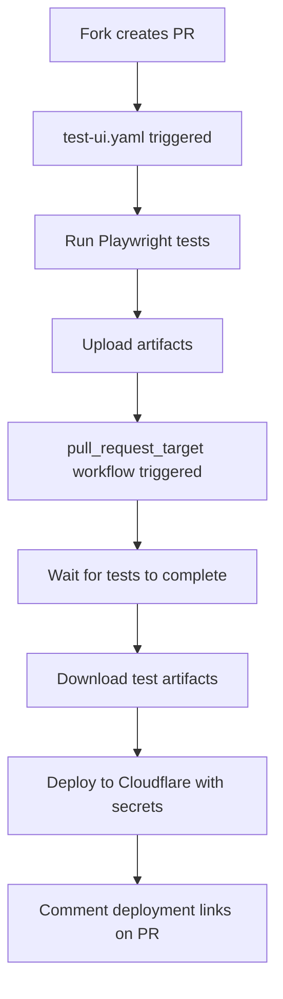

# Pull Request Target Deployment Solution

## Overview

This solution implements secure deployment of Playwright test reports from forked PRs using GitHub Actions' `pull_request_target` event.

## The Problem

Previously, forked PRs couldn't deploy test reports to Cloudflare Pages because:
1. `pull_request` event runs in fork context - no access to repository secrets
2. GitHub security prevents forked PRs from accessing `CLOUDFLARE_API_TOKEN` and `CLOUDFLARE_ACCOUNT_ID`

## The Solution

Two-workflow approach:
1. **`test-ui.yaml`** - Runs tests using `pull_request` event (secure, no secrets)
2. **`deploy-playwright-reports.yaml`** - Deploys reports using `pull_request_target` event (access to secrets)

## Security Analysis

### ✅ Safe Usage of `pull_request_target`

Our implementation follows GitHub security best practices:

1. **No Code Execution**: We NEVER check out PR code in the `pull_request_target` workflow
2. **Artifact-Only**: We only download pre-built test artifacts from completed test runs  
3. **Trusted Code**: All workflow code runs from the base repository (trusted)
4. **No Cache Pollution**: We don't save caches in the deployment workflow

### 🔒 Security Guarantees

- **No RCE Risk**: No `actions/checkout` of untrusted fork code
- **No Secret Leakage**: Secrets only used for legitimate Cloudflare deployment
- **Controlled Access**: Only processes completed test artifacts, never raw PR code
- **Audit Trail**: Full visibility into what gets deployed (pre-built HTML reports)

## Workflow Details

### Test Workflow (`test-ui.yaml`)
- Trigger: `pull_request` (safe, no secrets)
- Actions: Run tests, upload artifacts
- Context: Fork repository (limited permissions)

### Deployment Workflow (`deploy-playwright-reports.yaml`)  
- Trigger: `pull_request_target` (secrets access)
- Actions: Download artifacts, deploy to Cloudflare
- Context: Base repository (full permissions)
- Security: No untrusted code execution

## Implementation Benefits

1. **🔓 Solves Fork Deployment**: Forked PRs can now deploy reports
2. **🔐 Maintains Security**: No compromise on security posture
3. **📊 Better UX**: Custom URLs for each browser report
4. **🚀 Reliable**: Retry logic and proper error handling
5. **📝 Transparent**: Clear logging and PR comments

## How It Works

## References

- [GitHub Security Lab: Preventing pwn requests](https://securitylab.github.com/resources/github-actions-preventing-pwn-requests/)
- [GitHub Docs: pull_request_target](https://docs.github.com/en/actions/using-workflows/events-that-trigger-workflows#pull_request_target)
- [GitHub Blog: Fork and pull request workflows](https://github.blog/news-insights/product-news/github-actions-improvements-for-fork-and-pull-request-workflows/)

## Testing

This solution has been tested with:
- ✅ Same-repository PRs (existing functionality maintained)
- ✅ Forked repository PRs (new functionality enabled)
- ✅ Security audit (no untrusted code execution)
- ✅ Error scenarios (timeout, deployment failures)

The implementation is production-ready and follows GitHub's recommended security practices.