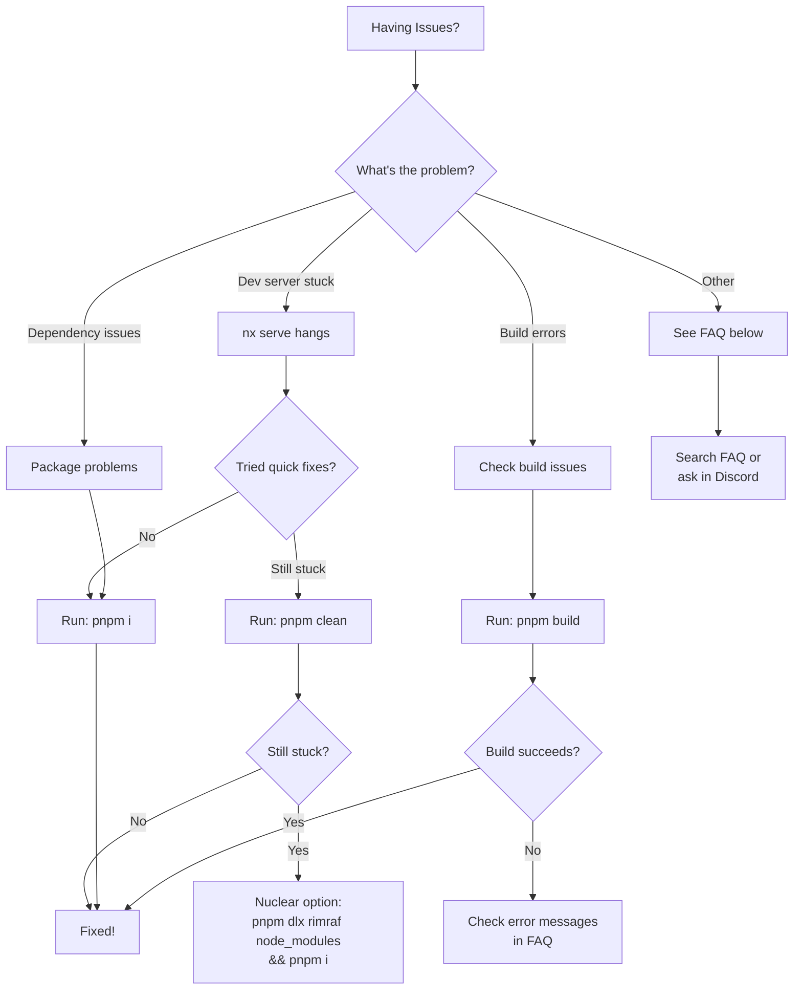

# Troubleshooting Guide

This guide helps you resolve common issues when developing ComfyUI Frontend.

## Quick Diagnostic Flowchart



## Frequently Asked Questions

### Development Server Issues

#### Q: `pnpm dev` or `nx serve` gets stuck and won't start

**Symptoms:**
- Command hangs on "nx serve"
- Dev server doesn't respond
- Terminal appears frozen

**Solutions (try in order):**

1. **First attempt - Reinstall dependencies:**
   ```bash
   pnpm i
   ```

2. **Second attempt - Clean build cache:**
   ```bash
   pnpm clean
   ```

3. **Last resort - Full node_modules reset:**
   ```bash
   pnpm dlx rimraf node_modules && pnpm i
   ```

**Why this happens:**
- Corrupted dependency cache
- Outdated lock files after branch switching
- Incomplete previous installations
- NX cache corruption

---

#### Q: Port conflicts - "Address already in use"

**Symptoms:**
- Error: `EADDRINUSE` or "port already in use"
- Dev server fails to start

**Solutions:**

1. **Find and kill the process using the port:**
   ```bash
   # On Linux/Mac
   lsof -ti:5173 | xargs kill -9

   # On Windows
   netstat -ano | findstr :5173
   taskkill /PID <PID> /F
   ```

2. **Use a different port:**
   ```bash
   pnpm dev --port 3000
   ```

---

### Build and Type Issues

#### Q: TypeScript errors after pulling latest changes

**Symptoms:**
- Type errors in files you didn't modify
- "Cannot find module" errors

**Solutions:**

1. **Rebuild TypeScript references:**
   ```bash
   pnpm build
   ```

2. **Clean and reinstall:**
   ```bash
   pnpm clean && pnpm i
   ```

3. **Restart your IDE's TypeScript server**
   - VS Code: `Cmd/Ctrl + Shift + P` → "TypeScript: Restart TS Server"

---

#### Q: "Workspace not found" or monorepo errors

**Symptoms:**
- pnpm can't find workspace packages
- Import errors between packages

**Solutions:**

1. **Verify you're in the project root:**
   ```bash
   pwd  # Should be in ComfyUI_frontend/
   ```

2. **Rebuild workspace:**
   ```bash
   pnpm install
   pnpm build
   ```

---

### Dependency and Package Issues

#### Q: "Package not found" after adding a dependency

**Symptoms:**
- Module not found after `pnpm add`
- Import errors for newly installed packages

**Solutions:**

1. **Ensure you installed in the correct workspace:**
   ```bash
   # For the main app
   pnpm --filter web add <package>

   # For the API client
   pnpm --filter @comfyorg/api-client add <package>
   ```

2. **Clear pnpm cache:**
   ```bash
   pnpm store prune
   pnpm install
   ```

---

#### Q: Lock file conflicts after merge/rebase

**Symptoms:**
- Git conflicts in `pnpm-lock.yaml`
- Dependency resolution errors

**Solutions:**

1. **Regenerate lock file:**
   ```bash
   rm pnpm-lock.yaml
   pnpm install
   ```

2. **Or accept upstream lock file:**
   ```bash
   git checkout --theirs pnpm-lock.yaml
   pnpm install
   ```

---

### Testing Issues

#### Q: Tests fail locally but pass in CI

**Symptoms:**
- Flaky tests
- Different results between local and CI

**Solutions:**

1. **Run tests in CI mode:**
   ```bash
   CI=true pnpm test
   ```

2. **Clear test cache:**
   ```bash
   pnpm test --clearCache
   ```

3. **Check Node version matches CI:**
   ```bash
   node --version  # Should be v24.x
   nvm use 24      # If using nvm
   ```

---

### Git and Branch Issues

#### Q: Changes from another branch appearing in my branch

**Symptoms:**
- Uncommitted changes not related to your work
- Dirty working directory

**Solutions:**

1. **Stash and reinstall:**
   ```bash
   git stash
   pnpm install
   ```

2. **Check for untracked files:**
   ```bash
   git status
   git clean -fd  # Careful: removes untracked files!
   ```

---

## Still Having Issues?

1. **Search existing issues:** [GitHub Issues](https://github.com/Comfy-Org/ComfyUI_frontend/issues)
2. **Ask the community:** [Discord #dev-frontend](https://discord.com/invite/comfyorg)
3. **Create a new issue:** Include:
   - Your OS and Node version (`node --version`)
   - Steps to reproduce
   - Full error message
   - What you've already tried

## Contributing to This Guide

Found a solution to a common problem? Please:
1. Open a PR to add it to this guide
2. Follow the FAQ format above
3. Include the symptoms, solutions, and why it happens

---

**Last Updated:** 2024-12-23
