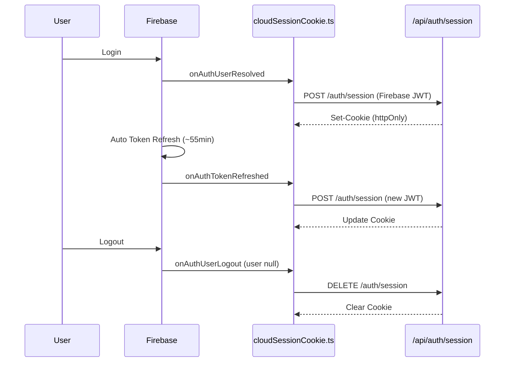
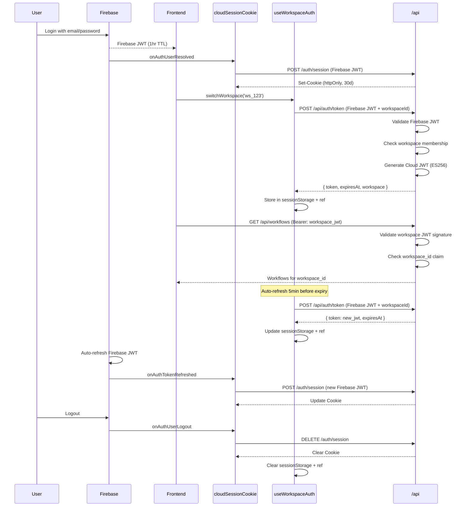

# Auth Implementation Review: Backend ↔ Frontend Alignment

**Date**: 2026-01-15
**Backend PRs**: #1995, #2018, #2020
**Frontend PR**: #6295 (Session Cookies), #8073 (Workspace Tokens)
**Status**: ✅ FULLY IMPLEMENTED - Session cookies (PR #6295) + Workspace tokens (PR #8073)

> **Note**: This document was originally a historical review of PR #6295 (Phase 1: Session Cookies only). PR #8073 has since implemented the workspace token infrastructure described in Phase 2.

---

## Executive Summary

### Current Implementation Status

| Component | Status | Notes |
|-----------|--------|-------|
| **Backend: Cloud JWT Service** | ✅ Merged | Full workspace token exchange + JWKS |
| **Backend: Workspace CRUD** | ✅ Merged | Feature-gated workspace management |
| **Backend: Session Cookie** | ✅ Merged | `/auth/session` POST/DELETE endpoints |
| **Frontend: Session Cookie** | ✅ Merged PR#6295 | Extension hooks for cookie lifecycle |
| **Frontend: Workspace Tokens** | ✅ Implemented PR#8073 | Token exchange, refresh, per-tab isolation |
| **Frontend: Workspace UI** | ⚠️ Partial | Infrastructure ready, UI components TBD |

**Historical Note**: Frontend PR #6295 implemented Phase 1 (session cookies). **PR #8073 has since implemented workspace token exchange and per-tab isolation.** See `auth-implementation-review-FINAL.md` for the current complete implementation status.

---

## Phase 1: Session Cookie Auth (CURRENT - ✅ Implemented)

### Architecture Flow



### Backend Implementation (Session Cookies)

**Endpoint**: `POST /auth/session`

```go
// Backend validates Firebase JWT and sets session cookie
func (impl *IngestImplementation) CreateSession(ctx context.Context, req ingest.CreateSessionRequestObject) {
    // 1. Validate Firebase JWT (from Authorization header)
    userDetails := ctx.Value(authentication.UserContextKey).(*authentication.UserDetails)

    // 2. Set httpOnly session cookie
    cookie := &http.Cookie{
        Name:     "session",
        Value:    encryptedSessionData,
        HttpOnly: true,
        Secure:   true,
        SameSite: http.SameSiteLaxMode,
        MaxAge:   3600 * 24 * 30, // 30 days
    }
    http.SetCookie(w, cookie)
}
```

**Endpoint**: `DELETE /auth/session`

```go
func (impl *IngestImplementation) DeleteSession(ctx context.Context, req ingest.DeleteSessionRequestObject) {
    // Clear session cookie
    cookie := &http.Cookie{
        Name:   "session",
        MaxAge: -1,
    }
    http.SetCookie(w, cookie)
}
```

### Frontend Implementation (Session Cookies)

**File**: `src/extensions/core/cloudSessionCookie.ts`

```typescript
useExtensionService().registerExtension({
  name: 'Comfy.Cloud.SessionCookie',

  onAuthUserResolved: async () => {
    const { createSession } = useSessionCookie()
    await createSession()
  },

  onAuthTokenRefreshed: async () => {
    const { createSession } = useSessionCookie()
    await createSession()
  },

  onAuthUserLogout: async () => {
    const { deleteSession } = useSessionCookie()
    await deleteSession()
  }
})
```

**File**: `src/platform/auth/session/useSessionCookie.ts`

```typescript
export const useSessionCookie = () => {
  const createSession = async (): Promise<void> => {
    if (!isCloud) return

    const authStore = useFirebaseAuthStore()
    const authHeader = await authStore.getAuthHeader()

    const response = await fetch(api.apiURL('/auth/session'), {
      method: 'POST',
      credentials: 'include',  // Include cookies
      headers: {
        ...authHeader,
        'Content-Type': 'application/json'
      }
    })

    if (!response.ok) {
      throw new Error(`Failed to create session: ${response.statusText}`)
    }
  }

  const deleteSession = async (): Promise<void> => {
    if (!isCloud) return

    const response = await fetch(api.apiURL('/auth/session'), {
      method: 'DELETE',
      credentials: 'include'
    })

    if (!response.ok) {
      throw new Error(`Failed to delete session: ${response.statusText}`)
    }
  }

  return { createSession, deleteSession }
}
```

### Extension Hooks (NEW)

**File**: `src/composables/auth/useCurrentUser.ts`

```typescript
export const useCurrentUser = () => {
  // ... existing code ...

  // NEW: Token refresh hook
  const onTokenRefreshed = (callback: () => void) =>
    whenever(() => authStore.tokenRefreshTrigger, callback)

  // NEW: Logout hook
  const onUserLogout = (callback: () => void) => {
    watch(resolvedUserInfo, (user) => {
      if (!user) callback()
    })
  }

  return {
    // ... existing returns ...
    onUserResolved,
    onTokenRefreshed,  // NEW
    onUserLogout       // NEW
  }
}
```

**File**: `src/services/extensionService.ts`

```typescript
export const useExtensionService = () => {
  const registerExtension = (extension: ComfyExtension) => {
    // ... existing onAuthUserResolved registration ...

    // NEW: Register token refresh hook
    if (extension.onAuthTokenRefreshed) {
      const { onTokenRefreshed } = useCurrentUser()
      onTokenRefreshed(() => {
        void extension.onAuthTokenRefreshed?.()
      })
    }

    // NEW: Register logout hook
    if (extension.onAuthUserLogout) {
      const { onUserLogout } = useCurrentUser()
      onUserLogout(() => {
        void extension.onAuthUserLogout?.()
      })
    }
  }
}
```

### Session Cookie Alignment: ✅ FULLY ALIGNED

| Aspect | Backend | Frontend | Status |
|--------|---------|----------|--------|
| **Session Creation** | `POST /auth/session` | `createSession()` | ✅ Aligned |
| **Firebase JWT Auth** | Authorization header | `getAuthHeader()` | ✅ Aligned |
| **Session Deletion** | `DELETE /auth/session` | `deleteSession()` | ✅ Aligned |
| **Cookie Credentials** | `Set-Cookie` httpOnly | `credentials: 'include'` | ✅ Aligned |
| **Token Refresh** | Updates cookie | Calls createSession() | ✅ Aligned |
| **Logout** | Clears cookie | Calls deleteSession() | ✅ Aligned |

---

## Phase 2: Workspace Tokens (PLANNED - ❌ NOT YET IMPLEMENTED)

### Backend Implementation (READY ✅)

#### Token Exchange Endpoint

**Endpoint**: `POST /api/auth/token`

**Backend Code**: `cloud-repo/services/ingest/server/implementation/cloud_jwt.go:18-133`

```go
func (impl *IngestImplementation) ExchangeToken(ctx context.Context, request ingest.ExchangeTokenRequestObject) {
    // 1. Check feature flag
    if !featuregates.IsEnabled(ctx, featuregates.FlagCloudJWTExchange) {
        return 404
    }

    // 2. Get user from Firebase JWT (set by middleware)
    userDetails := ctx.Value(authentication.UserContextKey).(*authentication.UserDetails)

    // 3. Determine target workspace
    var targetWorkspaceID workspace.ID
    if request.Body != nil && request.Body.WorkspaceId != nil {
        // Specific workspace requested
        wsID, err := workspace.ParseID(*request.Body.WorkspaceId)
        // Validate membership
        ws, role, err := impl.workspaceRepo.GetByID(ctx, wsID, userDetails.ID)
        targetWorkspaceID = wsID
        targetRole = *role
    } else {
        // Default to personal workspace
        _, wsInfo, err := impl.userRepo.GetWithPersonalWorkspace(ctx, userDetails.ID)
        targetWorkspaceID = wsInfo.WorkspaceID
        targetRole = wsInfo.WorkspaceRole
    }

    // 4. Generate Cloud JWT
    token, expiresAt, err := impl.cloudJWTService.GenerateToken(ctx, cloudjwt.TokenRequest{
        Subject:       userDetails.ID,
        Email:         userDetails.Email,
        WorkspaceID:   targetWorkspaceID,
        WorkspaceType: targetWorkspaceType,
        Role:          targetRole,
    })

    // 5. Return workspace-scoped JWT
    return ingest.ExchangeToken200JSONResponse{
        Token:     token,
        ExpiresAt: expiresAt,
        Workspace: ingest.WorkspaceSummary{
            Id:   targetWorkspaceID.String(),
            Name: workspaceName,
            Type: ingest.WorkspaceSummaryType(targetWorkspaceType),
        },
        Role:        ingest.ExchangeTokenResponseRole(targetRole),
        Permissions: cloudjwt.PermissionsForRole(targetRole),
    }
}
```

**Request Schema**:
```typescript
POST /api/auth/token
Headers: {
  Authorization: Bearer <firebase_jwt>
}
Body: {
  workspaceId?: string  // Optional - defaults to personal workspace
}

Response (200 OK):
{
  token: string,         // Workspace JWT (1 hour TTL)
  expiresAt: string,     // ISO timestamp
  workspace: {
    id: string,
    name: string,
    type: "personal" | "team"
  },
  role: "owner" | "member",
  permissions: string[]  // e.g., ["owner:*"]
}
```

#### Cloud JWT Claims

**File**: `cloud-repo/common/cloudjwt/claims.go:14-109`

```go
type Claims struct {
    jwt.RegisteredClaims

    // Custom claims - workspace context
    WorkspaceID   string   `json:"workspace_id"`
    WorkspaceType string   `json:"workspace_type"`  // "personal" | "team"
    Role          string   `json:"role"`            // "owner" | "member"
    Permissions   []string `json:"permissions"`      // ["owner:*"] or ["member:*"]
    Email         string   `json:"email"`
}
```

**Token Lifetime**: 1 hour (3600 seconds)
```go
ExpiresAt: jwt.NewNumericDate(now.Add(ttl))  // ttl = 1 hour
```

**Signing Algorithm**: ES256 (ECDSA P-256)
```go
token := jwt.NewWithClaims(jwt.SigningMethodES256, claims)
```

#### JWKS Endpoint

**Endpoint**: `GET /.well-known/jwks.json`

**Backend Code**: `cloud-repo/services/ingest/server/implementation/cloud_jwt.go:135-167`

```go
func (impl *IngestImplementation) GetJwks(ctx context.Context, request ingest.GetJwksRequestObject) {
    // Get cache max-age from config (default 90 minutes)
    maxAge := 5400
    if cfg := impl.configService.GetConfig(); cfg != nil && cfg.IngestConfig != nil {
        maxAge = cfg.IngestConfig.JWKSCacheMaxAgeSeconds
    }

    return &jwksResponse{
        jwks:         impl.cloudJWTService.GetJWKS(),
        cacheControl: fmt.Sprintf("public, max-age=%d", maxAge),
    }
}
```

**Response Schema**:
```json
{
  "keys": [
    {
      "kty": "EC",
      "kid": "cloud-jwt-2024-01",
      "use": "sig",
      "alg": "ES256",
      "crv": "P-256",
      "x": "base64url...",
      "y": "base64url..."
    }
  ]
}
```

**Cache Headers**: `Cache-Control: public, max-age=5400` (90 minutes)

#### Workspace CRUD Endpoints

**All feature-gated**: `featuregates.FlagTeamWorkspacesEnabled`

**File**: `cloud-repo/services/ingest/server/implementation/workspaces.go`

1. **GET /api/workspaces** - List user's workspaces
2. **POST /api/workspaces** - Create team workspace
3. **GET /api/workspaces/:id** - Get workspace details
4. **PATCH /api/workspaces/:id** - Update workspace (owner only)
5. **DELETE /api/workspaces/:id** - Delete workspace (owner only)

### Frontend Implementation (MISSING ❌)

**Status**: ❌ **NOT IMPLEMENTED in PR #6295**

**What's Missing**:

1. ❌ `useWorkspaceAuth()` composable
2. ❌ Workspace token exchange logic
3. ❌ Workspace token refresh (before 1hr expiry)
4. ❌ Per-tab workspace context (sessionStorage)
5. ❌ Workspace switcher UI
6. ❌ Updated `getAuthHeader()` to use workspace tokens
7. ❌ Workspace CRUD API calls

**Expected Implementation** (based on earlier discussion):

```typescript
// src/platform/auth/workspace/useWorkspaceAuth.ts (DOES NOT EXIST YET)
export const useWorkspaceAuth = () => {
  const workspaceToken = ref<string | null>(null)
  const currentWorkspaceId = ref<string | null>(
    sessionStorage.getItem('Comfy.Workspace.Current')
  )

  const switchWorkspace = async (workspaceId: string) => {
    const firebaseAuth = useFirebaseAuthStore()
    const firebaseToken = await firebaseAuth.getIdToken()

    const response = await fetch('/api/auth/token', {
      method: 'POST',
      headers: {
        'Authorization': `Bearer ${firebaseToken}`,
        'Content-Type': 'application/json'
      },
      body: JSON.stringify({ workspaceId })
    })

    const { token, expiresAt, workspace } = await response.json()

    workspaceToken.value = token
    currentWorkspaceId.value = workspaceId
    sessionStorage.setItem('Comfy.Workspace.Current', workspaceId)
    sessionStorage.setItem('Comfy.Workspace.Token', token)
    sessionStorage.setItem('Comfy.Workspace.ExpiresAt', expiresAt)
  }

  const refreshWorkspaceToken = async () => {
    if (!currentWorkspaceId.value) return
    await switchWorkspace(currentWorkspaceId.value)
  }

  // Auto-refresh 5 min before expiry
  watchEffect(() => {
    const expiresAt = sessionStorage.getItem('Comfy.Workspace.ExpiresAt')
    if (!expiresAt) return

    const refreshAt = new Date(expiresAt).getTime() - (5 * 60 * 1000)
    const delay = refreshAt - Date.now()

    if (delay > 0) {
      setTimeout(() => {
        void refreshWorkspaceToken()
      }, delay)
    }
  })

  return { workspaceToken, currentWorkspaceId, switchWorkspace, refreshWorkspaceToken }
}
```

---

## Alignment Analysis

### ✅ Session Cookie Auth: FULLY ALIGNED

**Backend** (PR #1995, #2018):
- ✅ `POST /auth/session` endpoint
- ✅ `DELETE /auth/session` endpoint
- ✅ httpOnly session cookies
- ✅ Firebase JWT validation

**Frontend** (PR #6295):
- ✅ `cloudSessionCookie.ts` extension
- ✅ `useSessionCookie()` composable
- ✅ Extension hooks (`onAuthTokenRefreshed`, `onAuthUserLogout`)
- ✅ Calls `/auth/session` on login, refresh, logout

**Verdict**: ✅ **100% aligned and implemented**

---

### ⚠️ Workspace Token Auth: BACKEND READY, FRONTEND MISSING

**Backend** (PR #1995):
- ✅ `POST /api/auth/token` endpoint (workspace token exchange)
- ✅ `GET /.well-known/jwks.json` endpoint
- ✅ Cloud JWT service with ES256 signing
- ✅ Workspace claims (workspaceId, type, role, permissions)
- ✅ 1-hour token TTL
- ✅ Feature flags for gradual rollout

**Frontend** (PR #6295):
- ❌ NO workspace token exchange implementation
- ❌ NO workspace auth composable
- ❌ NO token refresh logic
- ❌ NO per-tab isolation
- ❌ NO workspace UI

**Verdict**: ⚠️ **Backend ready, frontend NOT started**

---

## Critical Gaps & Discrepancies

### 1. ❌ Frontend Workspace Token Exchange Not Implemented

**Issue**: Backend has full workspace token exchange ready, but frontend doesn't call it.

**Impact**: Users cannot switch workspaces or use workspace-scoped tokens.

**Current Behavior**:
- Frontend only uses Firebase JWT (via session cookies)
- All API calls implicitly use personal workspace
- No per-tab workspace isolation

**Expected Behavior**:
- Frontend exchanges Firebase JWT for workspace JWT
- Each tab can have different workspace context
- API calls use workspace-scoped Bearer token

**Resolution**: Implement Phase 2 (workspace tokens) on frontend.

---

### 2. ❌ No Workspace Refresh Logic

**Issue**: Backend workspace tokens expire after 1 hour, but frontend has no refresh mechanism.

**Backend Token TTL**: 1 hour
```go
TTL: time.Hour  // 3600 seconds
```

**Frontend Gap**: No auto-refresh before expiry.

**Expected Behavior**:
```typescript
// Refresh 5 min before token expires
const TOKEN_REFRESH_BUFFER = 5 * 60 * 1000

watchEffect(() => {
  const expiresAt = sessionStorage.getItem('Comfy.Workspace.ExpiresAt')
  const refreshAt = new Date(expiresAt).getTime() - TOKEN_REFRESH_BUFFER
  const delay = refreshAt - Date.now()

  if (delay > 0) {
    setTimeout(refreshWorkspaceToken, delay)
  }
})
```

**Resolution**: Implement token refresh in `useWorkspaceAuth()`.

---

### 3. ❌ getAuthHeader() Doesn't Use Workspace Tokens

**Issue**: `firebaseAuthStore.ts:getAuthHeader()` still only returns Firebase JWT.

**Current Code** (src/stores/firebaseAuthStore.ts:163-174):
```typescript
const getAuthHeader = async (): Promise<AuthHeader | null> => {
  // If available, set header with JWT used to identify the user to Firebase service
  const token = await getIdToken()
  if (token) {
    return {
      Authorization: `Bearer ${token}`
    }
  }

  // If not authenticated with Firebase, try falling back to API key if available
  return useApiKeyAuthStore().getAuthHeader()
}
```

**Expected Code**:
```typescript
const getAuthHeader = async (): Promise<AuthHeader | null> => {
  // 1. Prefer workspace token if available (per-tab workspace context)
  const workspaceAuth = useWorkspaceAuth()
  if (workspaceAuth.workspaceToken.value) {
    return {
      Authorization: `Bearer ${workspaceAuth.workspaceToken.value}`
    }
  }

  // 2. Fallback to Firebase token (personal workspace)
  const firebaseToken = await getIdToken()
  if (firebaseToken) {
    return {
      Authorization: `Bearer ${firebaseToken}`
    }
  }

  // 3. Fallback to API key (personal workspace, automation)
  return useApiKeyAuthStore().getAuthHeader()
}
```

**Resolution**: Update `getAuthHeader()` to check workspace tokens first.

---

### 4. ❌ No Per-Tab Workspace Isolation

**Issue**: No sessionStorage-based workspace context tracking.

**Backend Expectation**: Each tab can request different workspace tokens.

**Frontend Gap**: No tab-specific workspace state.

**Expected Implementation**:
```typescript
// sessionStorage (per-tab, survives page refresh)
sessionStorage.setItem('Comfy.Workspace.Current', workspaceId)
sessionStorage.setItem('Comfy.Workspace.Token', token)
sessionStorage.setItem('Comfy.Workspace.ExpiresAt', expiresAt.toString())

// In-memory refs (per-tab, lost on refresh)
const workspaceToken = ref<string | null>(null)
const currentWorkspaceId = ref<string | null>(null)
```

**Resolution**: Implement per-tab storage strategy (see `storage-strategy.md`).

---

### 5. ⚠️ Token Refresh Uses Firebase as "Refresh Token"

**Backend Implementation**: No separate refresh token endpoint.

**Token Exchange Flow**:
```
POST /api/auth/token
Headers: { Authorization: Bearer <firebase_jwt> }
Body: { workspaceId: "ws_123" }
→ Response: { token: <workspace_jwt>, expiresAt: "..." }
```

**Refresh Flow** (same endpoint):
```
POST /api/auth/token
Headers: { Authorization: Bearer <firebase_jwt> }  // Same Firebase token
Body: { workspaceId: "ws_123" }
→ Response: { token: <new_workspace_jwt>, expiresAt: "..." }
```

**Alignment**: ✅ Matches recommended Option A (Firebase as refresh token).

**Frontend Gap**: Needs to call same endpoint for refresh.

---

## Security Analysis

### ✅ Session Cookies (Current Implementation)

| Security Aspect | Implementation | Status |
|-----------------|----------------|--------|
| **httpOnly** | ✅ Backend sets httpOnly | Prevents XSS theft |
| **Secure** | ✅ HTTPS only | Prevents MITM |
| **SameSite** | ✅ Lax mode | CSRF protection |
| **Credentials** | ✅ `credentials: 'include'` | Cookies sent |
| **Token Validation** | ✅ Firebase JWT verified | Authenticated users only |
| **Token Refresh** | ✅ Updates cookie | Sessions stay fresh |

**Verdict**: ✅ **Secure implementation**

---

### ⚠️ Workspace Tokens (Backend Ready, Frontend Missing)

| Security Aspect | Backend | Frontend | Gap |
|-----------------|---------|----------|-----|
| **ES256 Signing** | ✅ ECDSA P-256 | N/A | None - backend handles |
| **JWKS Public Keys** | ✅ `/.well-known/jwks.json` | ❌ Not used yet | Frontend doesn't verify |
| **1-Hour TTL** | ✅ Expires after 1hr | ❌ No refresh yet | Tokens will expire |
| **Workspace Validation** | ✅ Checks membership | ❌ No validation | Frontend trusts backend |
| **Token Storage** | N/A | ❌ Not stored yet | Should use sessionStorage cache |
| **Per-Tab Isolation** | N/A | ❌ Not implemented | No workspace context |

**Frontend Security Considerations**:

1. **Token Storage**:
   - ✅ **SHOULD**: Store in sessionStorage (per-tab, optimization)
   - ❌ **SHOULD NOT**: Store in localStorage (breaks per-tab isolation)
   - ✅ **OK**: Store in memory (lost on refresh, but can re-fetch)

2. **Token Verification**:
   - ❌ **NOT NEEDED**: Frontend doesn't need to verify signature
   - ✅ **OK**: Backend verifies on every API request
   - ℹ️ **OPTIONAL**: Frontend can decode (not verify) for UI display

3. **XSS Risk**:
   - ⚠️ Workspace tokens in sessionStorage ARE accessible via XSS
   - ✅ **Mitigated**: Short-lived (1 hour max compromise window)
   - ✅ **Mitigated**: No refresh token in frontend (can't generate new tokens)

**Verdict**: ✅ **Backend security is solid, frontend needs to implement caching safely**

---

## Edge Cases & Failure Modes

### 1. Firebase Token Expiry During Workspace Refresh

**Scenario**:
```
User working in Workspace A
→ Workspace token expires (1 hour)
→ Frontend tries to refresh: POST /api/auth/token
→ Firebase token also expired
→ Firebase auto-refresh fails (network issue)
```

**Backend Behavior**: Returns 401 Unauthorized

**Frontend Should**:
```typescript
try {
  await refreshWorkspaceToken()
} catch (error) {
  if (error.status === 401) {
    // Firebase token expired, force re-login
    await firebaseAuthStore.logout()
    router.push('/signin')
  }
}
```

**Current Status**: ❌ Not implemented (no workspace refresh yet)

---

### 2. User Removed from Workspace Mid-Session

**Scenario**:
```
User A working in Workspace B
→ Admin removes User A from Workspace B
→ User A's workspace token expires (up to 1 hour later)
→ User A tries to refresh token
```

**Backend Behavior**:
```go
// ExchangeToken checks membership on every call
ws, role, err := impl.workspaceRepo.GetByID(ctx, wsID, userDetails.ID)
if ws == nil || role == nil {
    return 404  // Workspace not found (user no longer has access)
}
```

**Frontend Should**:
```typescript
try {
  await refreshWorkspaceToken()
} catch (error) {
  if (error.status === 404) {
    // No longer have access to this workspace
    showToast('You no longer have access to this workspace')
    router.push('/workspaces')  // Redirect to workspace selector
  }
}
```

**Current Status**: ❌ Not implemented (no workspace refresh yet)

---

### 3. Multiple Tabs with Different Workspaces

**Scenario**:
```
Tab A: User in Workspace X
Tab B: User in Workspace Y (same user, different workspace)
```

**Expected Behavior**:
```
Tab A sessionStorage: { workspaceId: 'X', token: 'jwt_X' }
Tab B sessionStorage: { workspaceId: 'Y', token: 'jwt_Y' }

Tab A API calls: Authorization: Bearer jwt_X
Tab B API calls: Authorization: Bearer jwt_Y
```

**Backend Support**: ✅ Backend allows this (each token is independent)

**Frontend Support**: ❌ Not implemented (no per-tab workspace context yet)

---

### 4. Page Refresh in Middle of Workspace Session

**Scenario**:
```
Tab A: User in Workspace X
→ User hits F5 (page refresh)
→ sessionStorage persists (same tab session)
→ In-memory refs lost
```

**Expected Behavior**:
```typescript
onMounted(() => {
  // Restore from sessionStorage
  const cachedWorkspaceId = sessionStorage.getItem('Comfy.Workspace.Current')
  const cachedToken = sessionStorage.getItem('Comfy.Workspace.Token')
  const expiresAt = sessionStorage.getItem('Comfy.Workspace.ExpiresAt')

  if (cachedToken && Date.now() < new Date(expiresAt).getTime() - (5 * 60 * 1000)) {
    // Token still valid, reuse it
    workspaceToken.value = cachedToken
    currentWorkspaceId.value = cachedWorkspaceId
  } else {
    // Token expired, get fresh one
    await switchWorkspace(cachedWorkspaceId)
  }
})
```

**Current Status**: ❌ Not implemented (no workspace caching yet)

---

### 5. Tab Close and Reopen

**Scenario**:
```
Tab A: User in Workspace X
→ User closes tab
→ sessionStorage cleared (tab session ended)
→ User opens new tab
```

**Expected Behavior**:
```typescript
onMounted(() => {
  const cachedWorkspaceId = sessionStorage.getItem('Comfy.Workspace.Current')

  if (!cachedWorkspaceId) {
    // No workspace context - show selector or default
    router.push('/workspaces')
  }
})
```

**Current Status**: ❌ Not implemented (no workspace UI yet)

---

### 6. Session Cookie + Workspace Token Interaction

**Scenario**: User has both session cookie AND workspace token

**Current Behavior** (Session Cookie Only):
```
API Request:
  Cookie: session=<encrypted_session_data>  (httpOnly, auto-sent by browser)
  Authorization: Bearer <firebase_jwt>      (set by frontend)

Backend:
  → Validates Firebase JWT
  → Session cookie available but may not be used for auth
```

**Future Behavior** (With Workspace Tokens):
```
API Request:
  Cookie: session=<encrypted_session_data>  (httpOnly, auto-sent by browser)
  Authorization: Bearer <workspace_jwt>      (set by frontend)

Backend:
  → Validates workspace JWT (preferred)
  → Session cookie used for /view endpoints only
```

**Potential Issue**: Backend needs to handle both auth methods gracefully.

**Backend Middleware Priority**:
```go
// 1. Check for Cloud JWT (workspace token)
if cloudJWT := extractCloudJWT(req); cloudJWT != "" {
    claims, err := cloudJWTService.ValidateToken(ctx, cloudJWT)
    return claims
}

// 2. Fallback to Firebase JWT
if firebaseJWT := extractFirebaseJWT(req); firebaseJWT != "" {
    claims, err := firebase.VerifyIDToken(ctx, firebaseJWT)
    return claims
}

// 3. Fallback to session cookie
if sessionCookie := req.Cookie("session"); sessionCookie != nil {
    claims, err := decryptSessionCookie(sessionCookie.Value)
    return claims
}

return 401 Unauthorized
```

**Current Status**: ✅ Backend handles multiple auth methods (Firebase JWT or session cookie), workspace JWT support TBD

---

## Recommendations

### Immediate (Before Workspace Token Rollout)

1. **✅ Session Cookie Auth is Ready**
   - Current implementation is complete and aligned
   - Can be deployed as Phase 1

2. **📋 Document Phased Rollout Plan**
   - Phase 1 (CURRENT): Session cookies for asset auth
   - Phase 2 (NEXT): Workspace token exchange + per-tab isolation
   - Phase 3 (FUTURE): Workspace UI + switching

3. **📋 Define Frontend Workspace Token Spec**
   - Create formal API contract for `/api/auth/token`
   - Define TypeScript types matching backend response
   - Specify error handling behavior

### Phase 2 Implementation (Workspace Tokens)

1. **Implement `useWorkspaceAuth()` Composable**
   - Token exchange: `POST /api/auth/token`
   - Token refresh: Same endpoint with fresh Firebase JWT
   - Per-tab storage: sessionStorage for workspace context

2. **Update `getAuthHeader()` Priority**
   - 1st: Workspace token (if available)
   - 2nd: Firebase token (personal workspace fallback)
   - 3rd: API key (automation fallback)

3. **Implement Token Lifecycle Management**
   - Auto-refresh 5 min before expiry
   - Handle refresh failures (401 → re-login, 404 → workspace selector)
   - Cache tokens in sessionStorage (optimization)

4. **Implement Per-Tab Workspace Isolation**
   - Store workspace ID in sessionStorage
   - Restore workspace context on page refresh
   - Clear workspace context on tab close

5. **Add Workspace UI**
   - Workspace selector (on initial load or after logout)
   - Workspace switcher (dropdown in topbar)
   - Visual indicator of current workspace

### Phase 3 Enhancements

1. **Workspace CRUD UI**
   - Create team workspace
   - List workspaces
   - Rename/delete workspace (owner only)

2. **Advanced Features**
   - Workspace-scoped settings
   - Workspace member management
   - Workspace billing/usage

---

## Complete Auth Flow Diagram (Phase 2 - FUTURE)



---

## Testing Checklist

### Session Cookie Auth (Phase 1 - Current)

- [ ] **Login Flow**
  - [ ] POST /auth/session called on login
  - [ ] Session cookie set in browser
  - [ ] Cookie is httpOnly and Secure

- [ ] **Token Refresh**
  - [ ] POST /auth/session called on Firebase token refresh
  - [ ] Session cookie updated

- [ ] **Logout Flow**
  - [ ] DELETE /auth/session called on logout
  - [ ] Session cookie cleared

- [ ] **Asset Auth**
  - [ ] /view endpoints accept session cookie
  - [ ] User can view assets in any workspace they belong to

### Workspace Token Auth (Phase 2 - Future)

- [ ] **Token Exchange**
  - [ ] POST /api/auth/token with Firebase JWT
  - [ ] Receives workspace JWT with correct claims
  - [ ] Token stored in sessionStorage

- [ ] **Token Refresh**
  - [ ] Auto-refresh triggers 5 min before expiry
  - [ ] New workspace JWT received
  - [ ] sessionStorage updated

- [ ] **API Calls**
  - [ ] GET /api/workflows uses workspace JWT
  - [ ] Backend validates JWT signature
  - [ ] Returns workspace-scoped data

- [ ] **Per-Tab Isolation**
  - [ ] Tab A: Workspace X
  - [ ] Tab B: Workspace Y
  - [ ] Each tab has independent workspace context
  - [ ] API calls use correct workspace token per tab

- [ ] **Page Refresh**
  - [ ] Workspace context restored from sessionStorage
  - [ ] Cached token reused if still valid
  - [ ] Fresh token fetched if expired

- [ ] **Tab Close**
  - [ ] sessionStorage cleared
  - [ ] New tab shows workspace selector

- [ ] **Error Handling**
  - [ ] 401: Firebase token expired → re-login
  - [ ] 404: Workspace not found → workspace selector
  - [ ] 403: No permission → show error

- [ ] **Multi-Tab Scenarios**
  - [ ] Different workspaces in different tabs
  - [ ] Token refresh in one tab doesn't affect other tabs
  - [ ] Logout in one tab clears all workspace contexts

---

## Conclusion

### Current State (PR #6295)

✅ **Phase 1 Complete**: Session cookie auth is fully implemented and aligned between backend and frontend.

❌ **Phase 2 Missing**: Workspace token exchange, refresh, and per-tab isolation are NOT implemented on frontend despite backend being ready.

### Next Steps

1. **Implement Phase 2** (Workspace Tokens):
   - Create `useWorkspaceAuth()` composable
   - Implement token exchange + refresh
   - Add per-tab workspace isolation
   - Update `getAuthHeader()` to use workspace tokens

2. **Add Workspace UI**:
   - Workspace selector on initial load
   - Workspace switcher in topbar
   - Visual indicator of current workspace

3. **Comprehensive Testing**:
   - Multi-tab scenarios
   - Token refresh flows
   - Error handling
   - Edge cases (workspace removal, token expiry)

### Risk Assessment

| Risk | Severity | Mitigation |
|------|----------|------------|
| **Phase 1/2 Mismatch** | 🟡 Medium | Document phased rollout clearly |
| **No Token Refresh** | 🔴 High | Implement auto-refresh before Phase 2 rollout |
| **No Per-Tab Isolation** | 🟡 Medium | Core feature, must implement for Phase 2 |
| **API Key Fallback** | 🟢 Low | Already discussed, personal workspace only |
| **Token Expiry** | 🔴 High | 1hr tokens will expire, needs refresh logic |

**Overall**: Backend is ready for Phase 2, but frontend implementation is completely missing. Session cookie auth (Phase 1) works well.
