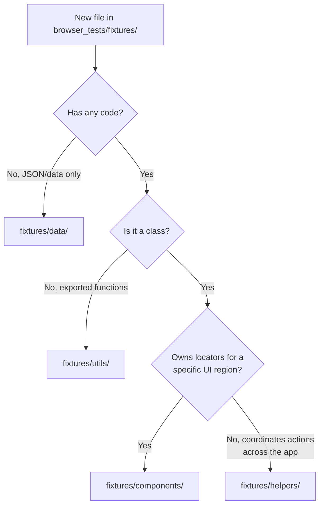

# E2E Testing Guidelines

See `browser_tests/FLAKE_PREVENTION_RULES.md` when triaging or editing
flaky browser tests.

## Core Rules

- Follow [Playwright Best Practices](https://playwright.dev/docs/best-practices)
- Never use `waitForTimeout` — use retrying assertions (`toBeVisible`,
  `toHaveText`), `expect.poll()`, or `toPass()`
- Prefer specific selectors (role, label, test-id)
- Prefer helpers from `fixtures/helpers/` that wrap real user interactions
  (`comfyPage.settings.setSetting`, `comfyPage.workflow.loadWorkflow`,
  `comfyPage.nodeOps`) over hand-rolled equivalents
- Tag viewport-specific tests: `@mobile` (mobile viewport), `@2x` (high DPI)

## Directory Structure

```text
browser_tests/
├── assets/           - Test data (JSON workflows, images)
├── fixtures/
│   ├── ComfyPage.ts      - Main fixture (delegates to helpers)
│   ├── ComfyMouse.ts     - Mouse interaction helper
│   ├── VueNodeHelpers.ts - Vue Nodes 2.0 helpers
│   ├── selectors.ts      - Centralized TestIds
│   ├── data/             - Static test data (mock API responses, workflow JSONs, node definitions)
│   ├── components/       - Page object classes (locators, user interactions)
│   │   ├── Actionbar.ts
│   │   ├── ContextMenu.ts
│   │   ├── SettingDialog.ts
│   │   ├── SidebarTab.ts
│   │   ├── Templates.ts
│   │   ├── Topbar.ts
│   │   └── ...
│   ├── helpers/          - Focused helper classes (domain-specific actions)
│   │   ├── CanvasHelper.ts
│   │   ├── CommandHelper.ts
│   │   ├── KeyboardHelper.ts
│   │   ├── NodeOperationsHelper.ts
│   │   ├── SettingsHelper.ts
│   │   ├── WorkflowHelper.ts
│   │   └── ...
│   └── utils/            - Standalone utility functions (used by tests or fixtures)
│       ├── builderTestUtils.ts
│       ├── clipboardSpy.ts
│       ├── fitToView.ts
│       ├── perfReporter.ts
│       └── ...
└── tests/            - Test files (*.spec.ts)
```

### Architectural Separation

- **`fixtures/data/`** — Static test data only. Mock API responses, workflow JSONs, node definitions. No code, no imports from Playwright.
- **`fixtures/components/`** — Page object components. Classes that own locators for a specific UI region (e.g. `Actionbar`, `ContextMenu`, `SettingDialog`).
- **`fixtures/helpers/`** — Helper classes that coordinate actions across multiple regions without owning a locator surface of their own (e.g. `CanvasHelper`, `WorkflowHelper`, `NodeOperationsHelper`).
- **`fixtures/utils/`** — Standalone utility functions. Exported functions (not classes) used by tests or fixtures (e.g. `fitToView`, `clipboardSpy`, `builderTestUtils`).

### Placement Rule

When adding a new file, use this decision tree:



## Test Structure: Arrange/Act/Assert

1. All mock setup, state resets, and fixture arrangement belongs in `test.beforeEach()` or Playwright fixtures
2. Inside `test()`, only act (user actions) and assert
3. Never call `clearAllMocks` or reset mock state mid-test

```typescript
test.beforeEach(async ({ comfyPage }) => {
  await comfyPage.workflow.loadWorkflow('test.json')
})
test('should do something', async ({ comfyPage }) => {
  await comfyPage.menu.topbar.click()
  await expect(comfyPage.menu.nodeLibraryTab.root).toBeVisible()
})
```

## Creating New Test Helpers

New domain-specific test helpers (e.g., `AssetHelper`, `JobHelper`) must be
registered as Playwright fixtures via `base.extend()` — do **not** add them as
properties on `ComfyPage`. Extend `@playwright/test` directly (not
`comfyPageFixture`) so fixtures stay composable via `mergeTests`; the callback
after `use()` gives automatic teardown.

```typescript
// browser_tests/fixtures/assetFixture.ts
import { test as base } from '@playwright/test'

export const test = base.extend<{
  assetHelper: AssetHelper
}>({
  assetHelper: async ({ page }, use) => {
    const helper = new AssetHelper(page)
    await helper.setup()
    await use(helper)
    await helper.cleanup() // automatic teardown
  }
})
```

## Page Object Locator Style

Define UI element locators as `public readonly` properties assigned in the constructor — not as getter methods. Getters that simply return a locator add unnecessary indirection and hide the object shape from IDE auto-complete.

```typescript
// ✅ Correct — public readonly, assigned in constructor
export class MyDialog extends BaseDialog {
  public readonly submitButton: Locator
  public readonly cancelButton: Locator

  constructor(page: Page) {
    super(page)
    this.submitButton = this.root.getByRole('button', { name: 'Submit' })
    this.cancelButton = this.root.getByRole('button', { name: 'Cancel' })
  }
}

// ❌ Avoid — getter-based locators
export class MyDialog extends BaseDialog {
  get submitButton() {
    return this.root.getByRole('button', { name: 'Submit' })
  }
}
```

**Keep as getters only when:**

- Lazy initialization is needed (`this._tab ??= new Tab(this.page)`)
- The value is computed from runtime state (e.g. `get id() { return this.userIds[index] }`)
- It's a private convenience accessor (e.g. `private get page() { return this.comfyPage.page }`)

When a class has cached locator properties, prefer reusing them in methods rather than rebuilding locators from scratch.

## Assertions

Prefer `expect.poll()` over `expect(async () => { ... }).toPass()` when the block contains a single async call with a single assertion. `expect.poll()` is more readable and gives better error messages (shows actual vs expected on failure).

```typescript
// ✅ Correct — single async call + single assertion
await expect
  .poll(() => comfyPage.nodeOps.getGraphNodesCount(), { timeout: 250 })
  .toBe(0)

// ❌ Avoid — nested expect inside toPass
await expect(async () => {
  expect(await comfyPage.nodeOps.getGraphNodesCount()).toBe(0)
}).toPass({ timeout: 250 })
```

Reserve `toPass()` for blocks with multiple assertions or complex async logic that can't be expressed as a single polled value.

Assert preconditions explicitly with a custom message so failures point to the
broken assumption; use `expect.soft()` to verify multiple invariants without
aborting on the first failure:

```typescript
expect(node.widgets, 'Widget count changed — update test fixture').toHaveLength(
  4
)
expect.soft(menuItem1).toBeVisible()
expect.soft(menuItem2).toBeVisible()
```

Add assertion methods directly on the page object or helper class
(`await node.expectPinned()`) — do not add custom matchers to `comfyExpect`.
Page object methods are discoverable via IntelliSense without special imports.

## Window Globals & Type Assertions

`window.app`, `window.graph`, and `window.LiteGraph` are optional in the main
app types. Non-null assertions (`!`) are allowed in E2E tests only:
`window.app!.graph!.nodes`. Specific assertions like
`id: 'TestSetting' as TestSettingId` are acceptable; `as any` and
`as unknown as SomeType` are forbidden. Access internal state via
`page.evaluate` and stores directly — don't change public API types to expose
internals.

## When to Use `page.evaluate`

Acceptable (use sparingly): reading internal state that has no UI
representation, or setting up test fixtures (registering extensions, mock
error handlers). Never for actions that have a UI equivalent.

```typescript
// ✅ Reading internal state
const nodeCount = await page.evaluate(() => window.app!.graph!.nodes.length)

// ❌ Bad: setting a widget value programmatically
await page.evaluate(() => { node.widgets![0].value = 512 })
// ✅ Good: interact like a user
await widgetLocator.click()
await widgetLocator.fill('512')
```

## Test Data

- Check `browser_tests/assets/` for fixtures; use realistic ComfyUI workflows
- When multiple nodes share the same title, use
  `vueNodes.getNodeByTitle(name).nth(n)` — Playwright strict mode will fail on
  ambiguous locators
- When creating fixture data, import existing Zod schemas and types from
  `src/` instead of inventing ad-hoc shapes: `src/schemas/apiSchema.ts` (API
  responses, WebSocket messages), `src/schemas/nodeDefSchema.ts` and
  `src/schemas/nodeDef/nodeDefSchemaV2.ts` (node definitions),
  `src/platform/remote/comfyui/jobs/jobTypes.ts` (Jobs API),
  `src/platform/workflow/validation/schemas/workflowSchema.ts` (workflows),
  `src/types/metadataTypes.ts` (asset metadata)

## Typed API Mocks

Type every `route.fulfill()` response body using existing schemas or generated
types — never untyped inline JSON. This catches shape mismatches at compile
time instead of through flaky runtime failures.

| Endpoint category                                   | Type source                                                                                         |
| --------------------------------------------------- | --------------------------------------------------------------------------------------------------- |
| Cloud-only (hub, billing, workflows)                | `@comfyorg/ingest-types` (`packages/ingest-types`, auto-generated from OpenAPI)                     |
| Registry (releases, nodes, publishers)              | `@comfyorg/registry-types` (`packages/registry-types`, auto-generated from OpenAPI)                 |
| Manager (queue tasks, packages)                     | `generatedManagerTypes.ts` (`src/workbench/extensions/manager/types/`, auto-generated from OpenAPI) |
| Python backend (queue, history, settings, features) | Manual Zod schemas in `src/schemas/apiSchema.ts`                                                    |
| Node definitions                                    | `src/schemas/nodeDefSchema.ts`                                                                      |
| Templates                                           | `src/platform/workflow/templates/types/template.ts`                                                 |

```typescript
// ✅ Import the type and annotate mock data
import type { ReleaseNote } from '@/platform/updates/common/releaseService'

const mockRelease: ReleaseNote = {
  id: 1,
  project: 'comfyui',
  version: 'v0.3.44',
  attention: 'medium',
  content: '## New Features',
  published_at: new Date().toISOString()
}
body: JSON.stringify([mockRelease])

// ❌ Untyped inline JSON — schema drift goes unnoticed
body: JSON.stringify([{ id: 1, project: 'comfyui', version: 'v0.3.44', ... }])
```

## Gotchas

| Symptom                                            | Cause                                       | Fix                                                                                                     |
| -------------------------------------------------- | ------------------------------------------- | ------------------------------------------------------------------------------------------------------- |
| `subtree intercepts pointer events` on DOM widgets | Canvas `z-999` overlay intercepts `click()` | Use Playwright's `locator.dispatchEvent('contextmenu', { bubbles: true, cancelable: true, button: 2 })` |
| Context menu empty or wrong items                  | Node not selected                           | Select node first: `vueNodes.selectNode()` or `nodeRef.click('title')`                                  |
| `navigateIntoSubgraph` timeout                     | Node too small in test asset JSON           | Use node size `[400, 200]` minimum                                                                      |

## Running Tests

```bash
pnpm test:browser:local                 # Run all E2E tests
pnpm test:browser:local --ui            # Interactive UI mode
```

## After Making Changes

- Run `pnpm typecheck:browser` after modifying TypeScript files in this directory
- Run `pnpm exec eslint browser_tests/path/to/file.ts` to lint specific files
- Run `pnpm exec oxlint browser_tests/path/to/file.ts` to check with oxlint

## Skill Documentation

A Playwright test-writing skill exists at `.claude/skills/writing-playwright-tests/SKILL.md`.

The skill documents **meta-level guidance only** (gotchas, anti-patterns, decision guides). It does **not** duplicate fixture APIs - agents should read the fixture code directly in `browser_tests/fixtures/`.
