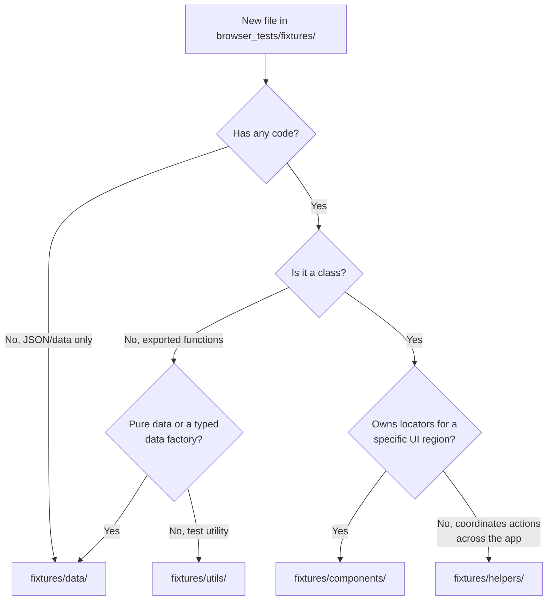

# Browser (Playwright / E2E) Tests — Single Source of Truth

This is the **canonical guide** for Playwright browser tests in ComfyUI_frontend.
Setup, running, structure, conventions, flake prevention, typed mocks, and the
screenshot workflow all live here. Other test docs are short stubs that redirect
to a section below.

**Where guidance lives**

| Concern                                     | Location                                                     |
| ------------------------------------------- | ----------------------------------------------------------- |
| Everything about writing/running E2E tests  | **This file** (canonical)                                   |
| Agent auto-load in `browser_tests/`         | `browser_tests/AGENTS.md` (stub → this file)                |
| Agent auto-load on `*.spec.ts` edit         | `docs/guidance/playwright.md` (stub → this file)            |
| Flake triage checklist                      | [Flake Prevention](#flake-prevention) (was `FLAKE_PREVENTION_RULES.md`) |
| Mock data fixtures                          | [Test Data & Typed Mocks](#test-data--typed-api-mocks) (was `fixtures/data/README.md`) |
| Authoring skill (agents)                    | `.claude/skills/writing-playwright-tests/SKILL.md`          |
| Flake-hardening skill (agents)              | `.claude/skills/hardening-flaky-e2e-tests/SKILL.md`         |
| Review rulebook (subagent)                  | `.agents/checks/playwright-e2e.md` (references this file)   |

---

## Prerequisites

**CRITICAL**: Start the ComfyUI backend with `--multi-user`:

```bash
python main.py --multi-user
```

Without this flag, parallel tests conflict and fail randomly.

## Setup

### ComfyUI devtools

ComfyUI_devtools ships in this repo under `tools/devtools/` and is copied into
`custom_nodes` automatically during CI. It adds API endpoints and nodes used by
browser tests. For local development, copy it into your ComfyUI install (create the target
directory first — it won't exist on a fresh install):

```bash
mkdir -p /path/to/your/ComfyUI/custom_nodes/ComfyUI_devtools
cp -r tools/devtools/* /path/to/your/ComfyUI/custom_nodes/ComfyUI_devtools/
```

### Node.js & Playwright

Install the Node version in `.nvmrc`, then the workspace dependencies and the
Chromium and WebKit drivers (run from the repository root):

```bash
pnpm install
pnpm exec playwright install chromium webkit --with-deps
```

### Environment

Create `.env` from the template and set the debugging keys:

```bash
cp .env_example .env
```

```bash
# Remove Vue dev overlay that blocks UI elements
DISABLE_VUE_PLUGINS=true

# Test against dev server (recommended) or backend directly
PLAYWRIGHT_TEST_URL=http://localhost:5173      # Dev server
# PLAYWRIGHT_TEST_URL=http://localhost:8188     # Direct backend
PLAYWRIGHT_SETUP_API_URL=http://localhost:8188 # Setup/auth API when using the dev server

# Path to ComfyUI for backing up user data/settings before tests
TEST_COMFYUI_DIR=/path/to/your/ComfyUI
```

### Release API mocking

By default all tests mock `api.comfy.org/releases` so release popups don't cover
UI elements. To test real release data:

```typescript
await comfyPage.setup({ mockReleases: false })
```

See `tests/releaseNotifications.spec.ts` for release-specific tests.

## Running Tests

```bash
pnpm test:browser:local                     # Run all E2E tests
pnpm test:browser:local widget.spec.ts      # Run a specific file
pnpm test:browser:local --ui                # Interactive UI mode (use for development)
```

**Use UI mode while developing.** It provides:

- **Locator picker** — click an element to get its exact locator code
- **Step debugging** — step through a test line by line via the _Source_ tab
- **Time travel** — click any step in _Actions_ to see browser state at that moment
- **Console / Network / Attachments** tabs — logs, API calls, and snapshot diffs

### Slowing the browser down

With `--headed` or `--ui`, set `SLOW_MO` (ms) to slow every action. Applies only
when `PLAYWRIGHT_LOCAL` is set (the default for `test:browser:local`):

```bash
SLOW_MO=250 pnpm test:browser:local --headed widget.spec.ts
```

## Directory Structure

```text
browser_tests/
├── assets/           - Test data (JSON workflows, images)
├── fixtures/
│   ├── ComfyPage.ts      - Main fixture (delegates to helpers)
│   ├── ComfyMouse.ts     - Mouse interaction helper
│   ├── VueNodeHelpers.ts - Vue Nodes 2.0 helpers
│   ├── selectors.ts      - Centralized TestIds
│   ├── data/             - Static test data (mock API responses, workflow JSONs, node definitions)
│   ├── components/       - Page object classes (locators, user interactions)
│   ├── helpers/          - Focused helper classes (domain-specific actions)
│   └── utils/            - Standalone utility functions (used by tests or fixtures)
└── tests/            - Test files (*.spec.ts), nested by feature
```

### Architectural Separation

- **`fixtures/data/`** — Test data: mock API responses, workflow JSONs, node
  definitions, and the typed factory builders that produce them (e.g.
  `createMockNodeDefinitions`). No Playwright imports and no test logic — data
  and the functions that assemble it, nothing else.
- **`fixtures/components/`** — Page object components. Classes that own locators
  for a specific UI region (e.g. `Actionbar`, `ContextMenu`, `SettingDialog`,
  `Templates`).
- **`fixtures/helpers/`** — Helper classes that coordinate actions across
  multiple regions without owning a locator surface of their own (e.g.
  `CanvasHelper`, `WorkflowHelper`, `NodeOperationsHelper`).
- **`fixtures/utils/`** — Standalone exported functions (not classes) used by
  tests or fixtures (e.g. `fitToView`, `clipboardSpy`, `builderTestUtils`).

### File Placement Rule



## Writing Tests

### Golden rules

1. **Look at existing tests first.** Search `tests/` for similar patterns.
2. **Read the fixture code.** APIs live in `fixtures/` — read them directly
   instead of guessing.
3. **Use premade JSON workflow assets** instead of building graphs
   programmatically. Assets live in `assets/`; create new ones by copying
   `assets/default.json` and editing the JSON.

### Test structure — Arrange / Act / Assert

- All mock setup, state resets, and fixture arrangement belong in
  `test.beforeEach()` or Playwright fixtures.
- Inside `test()`, only **act** (user actions) and **assert**.
- Never call `clearAllMocks` or reset mock state mid-test.

```typescript
import {
  comfyPageFixture as test,
  comfyExpect as expect
} from '@e2e/fixtures/ComfyPage'

test.describe('Feature', { tag: ['@canvas'] }, () => {
  test.beforeEach(async ({ comfyPage }) => {
    await comfyPage.workflow.loadWorkflow('test.json')
  })

  test('should do something', async ({ comfyPage }) => {
    await comfyPage.menu.topbar.click()
    await expect(comfyPage.menu.nodeLibraryTab.root).toBeVisible()
  })
})
```

### Import conventions

- Prefer `@e2e/*` for imports within `browser_tests/`.
- Use `@/*` for imports from `src/`.
- Avoid new deep relative imports when an alias is available.

### Leverage existing fixtures and helpers

Check for existing helpers before writing new ones — most needs are covered:

- **ComfyPage** — main fixture; delegates to helper objects:
  `comfyPage.workflow.loadWorkflow()`, `comfyPage.settings.setSetting()`,
  `comfyPage.command.executeCommand()`, `comfyPage.nodeOps.getNodeRefById()`,
  `comfyPage.canvasOps.resetView()`, `comfyPage.vueNodes.waitForNodes()`.
- **Component page objects** — `fixtures/components/` (e.g. `Actionbar`,
  `ContextMenu`, `Templates`).
- **Helper classes** — `fixtures/helpers/` (e.g. `CanvasHelper`,
  `WorkflowHelper`).
- **Utilities** — `fixtures/utils/` (e.g. `fitToView`, `clipboardSpy`).

### Creating new test helpers

Register **new** domain-specific helpers as Playwright fixtures via
`base.extend()` — do **not** attach them as new properties on `ComfyPage`.
Fixtures get automatic setup/teardown and compose via `mergeTests`.

```typescript
// browser_tests/fixtures/assetFixture.ts
import { test as base } from '@playwright/test'

export const test = base.extend<{ assetHelper: AssetHelper }>({
  assetHelper: async ({ page }, use) => {
    const helper = new AssetHelper(page)
    await helper.setup()
    await use(helper)
    await helper.cleanup() // automatic teardown
  }
})
```

Extend `@playwright/test` base (not `comfyPageFixture`) so helpers can be
composed. The existing `comfyPage.*` helpers predate this rule and remain on
`ComfyPage`; new ones should be fixtures.

### Page object locator style

Define locators as `public readonly` properties assigned in the constructor —
not as getter methods. Getters that just return a locator add indirection and
hide the object shape from IDE auto-complete.

```typescript
// ✅ public readonly, assigned in constructor
export class MyDialog extends BaseDialog {
  public readonly submitButton: Locator
  constructor(page: Page) {
    super(page)
    this.submitButton = this.root.getByRole('button', { name: 'Submit' })
  }
}
```

Keep getters only for lazy init (`this._tab ??= new Tab(this.page)`),
runtime-computed values, or private convenience accessors. Reuse cached locator
properties in methods rather than rebuilding locators.

### Selectors

- Prefer role, label, or test-id selectors over CSS/DOM-structure selectors.
- Hard-coded `data-testid` strings should reference `fixtures/selectors.ts` when
  a matching entry exists.
- When multiple nodes share a title, disambiguate:
  `vueNodes.getNodeByTitle(name).nth(n)` — strict mode fails on ambiguous
  locators.

### Node references over coordinates

Node references from `fixtures/utils/litegraphUtils.ts` are stable; raw
coordinates are fragile.

```typescript
// ✅ Prefer — target by id, or by type when exactly one match is expected
const node = await comfyPage.nodeOps.getNodeRefById('12')
await node.click('title')

// ❌ Avoid
await comfyPage.canvas.click({ position: { x: 100, y: 100 } })
```

When selecting by type and more than one node can match, don't index `[0]` on
the returned array — the order is non-deterministic (see the
[Flake Prevention](#flake-prevention) patterns table). Use `getNodeRefById()`,
or guard with `toHaveLength(1)` first.

### Vue Nodes vs LiteGraph — decision guide

Choose based on **what you're testing**:

| Testing…                                        | Use                    | Why                                    |
| ----------------------------------------------- | ---------------------- | -------------------------------------- |
| Vue-rendered node UI, DOM widgets, CSS states   | `comfyPage.vueNodes.*` | Nodes are DOM elements; use locators   |
| Canvas interactions, connections, legacy nodes  | `comfyPage.nodeOps.*`  | Canvas-based; use coordinates/refs     |
| Both in one test                                | Pick primary, minimize switching | Mixing both is a smell       |

Vue Nodes requires explicit opt-in:

```typescript
await comfyPage.settings.setSetting('Comfy.VueNodes.Enabled', true)
await comfyPage.vueNodes.waitForNodes()
```

Vue Node state is expressed via CSS classes:

```typescript
const BYPASS_CLASS = /before:bg-bypass\/60/
await expect(node).toHaveClass(BYPASS_CLASS)
```

### Canvas timing

- After canvas ops (`drag`, canvas `click`, `resizeNode`, `pan`, `zoom`, or a
  `page.evaluate` graph mutation that changes visuals), call
  `await comfyPage.nextFrame()` before asserting. `loadWorkflow()` does **not**
  need it. Prefer encapsulating `nextFrame()` inside page-object methods.
- Focus the canvas before keyboard input: `await comfyPage.canvas.click()`
  before `page.keyboard.press(...)`, or keys go nowhere.
- Mark the canvas dirty after programmatic state changes:
  `window['app'].graph.setDirtyCanvas(true, true)`.
- `dblclick()` on canvas needs a small `{ delay: 5 }`; drags need
  `{ steps: 10 }` not `{ steps: 1 }`.

### Custom assertions

Prefer adding assertion methods directly on the page object or helper class —
they're discoverable via IntelliSense without special imports.

```typescript
// ✅ Page-object assertions for new code
await node.expectPinned()
```

The existing `comfyExpect` matchers (`toBePinned`, `toBeBypassed`,
`toBeCollapsed`, `toHaveFocus`, `toHaveScreenshot`) in
`fixtures/utils/customMatchers.ts` remain supported and are used across the
suite — keep using them. Do **not** extend `comfyExpect` with new matchers;
add new assertions as page-object methods instead.

### Test tags

Two tiers. **Project-routing tags are load-bearing** — `playwright.config.ts`
selects which project/run a test lands in by grepping these, so a test only runs
where its tags place it:

| Tag           | Effect (per `playwright.config.ts`)                    |
| ------------- | ------------------------------------------------------ |
| `@mobile`     | Runs in the mobile-chrome (Pixel 5) project            |
| `@mobile-ios` | Runs in the mobile-safari (iPhone 15 / WebKit) project |
| `@2x`         | Runs in the 2x-scale project                           |
| `@0.5x`       | Runs in the 0.5x-scale project                         |
| `@perf`       | Runs in the perf project                               |
| `@audit`      | Runs in the audit project                              |
| `@cloud`      | Runs in the cloud project                              |
| `@oss`        | Excluded from the cloud project                        |

Use `@mobile-ios` sparingly — only for regressions that reproduce under
iOS-shaped conditions (WKWebView bridge exposure, WebKit-only quirks). Playwright's
WebKit engine does not expose embedded-WKWebView globals such as
`window.webkit.messageHandlers`; inject them via `page.addInitScript()` and set the
context `userAgent`. See `browser_tests/tests/cloudLoginIosWebview.spec.ts` for the
reference pattern.

Organizational tags are used for manual `--grep` filtering (not project
routing). Common ones in the suite: `@smoke`, `@slow`, `@screenshot`, `@canvas`,
`@node`, `@widget`, `@vue-nodes`, `@subgraph`, `@ui`. Apply them so a test is
findable by its area; add a project-routing tag whenever the test must run in
that project.

```typescript
test.describe('Feature', { tag: ['@screenshot', '@canvas'] }, () => {
```

### Type safety

Never use `any` or `as any` in E2E code.

Browser tests read `window.app`, `window.graph`, `window.LiteGraph` (optional in
app types). Use non-null assertions in E2E tests only:

```typescript
window.app!.graph!.nodes
window.LiteGraph!.registered_node_types
```

Acceptable type assertions:

```typescript
window.app!.extensionManager
id: 'TestSetting' as TestSettingId
type TestSettingId = keyof Settings
```

Forbidden: `settings: testData as any`, `data as unknown as SomeType`. Read
internal state via `page.evaluate` and stores directly — don't widen public API
types to expose internals.

### Assertion messages & soft assertions

Attach a message to precondition checks so a failure points at the broken
assumption, and use `expect.soft()` to verify several invariants without
aborting on the first failure:

```typescript
expect(node.widgets, 'Widget count changed — update test fixture').toHaveLength(4)

expect.soft(menuItem1).toBeVisible()
expect.soft(menuItem2).toBeVisible()
```

### When to use `page.evaluate`

**Acceptable (sparingly)** — reading internal state with no UI representation, or
setting up fixtures:

```typescript
const nodeCount = await page.evaluate(() => window.app!.graph!.nodes.length)
await page.evaluate(() => useWorkflowStore().activeWorkflow)
await page.evaluate(() => window.app!.registerExtension({ name: 'TestExt' }))
```

**Avoid** — performing actions that have a UI equivalent; use locators instead:

```typescript
// ❌ node.widgets![0].value = 512     ✅ widgetLocator.click(); widgetLocator.fill('512')
// ❌ btn.dispatchEvent(new MouseEvent('click'))  ✅ page.getByTestId('...').click()
// ❌ app.queuePrompt(0)               ✅ page.getByRole('button', { name: 'Queue' }).click()
```

**Preferred** — helper methods from `fixtures/helpers/` that wrap real user
interactions.

### Minimal workflows & cleanup

- Load the smallest workflow the test needs (`loadWorkflow('single_ksampler')`),
  not the full default graph.
- Server-persisted state (settings, uploaded files, saved workflows) leaks
  across tests. Reset it in `afterEach` (or a fixture) and clean up files:

```typescript
await comfyPage.settings.setSetting('Comfy.ColorPalette', 'dark')
comfyPage.deleteFileAfterTest({ filename: 'image.png' })
```

- Tests that manipulate canvas view should `resetView()` in `afterEach`:

```typescript
test.afterEach(async ({ comfyPage }) => {
  await comfyPage.canvasOps.resetView()
})
```

### Debug helpers (remove before committing)

`comfyPage.debugAddMarker(pos)`, `debugAttachScreenshot(testInfo, name)`,
`debugShowCanvasOverlay()`, `debugGetCanvasDataURL()` are for local debugging
only. Never commit them.

## Test Data & Typed API Mocks

Mock data in `fixtures/data/` exports **typed** objects that conform to
generated types or Zod schemas — never ad-hoc inline JSON. Typing mocks catches
shape drift at compile time instead of through flaky runtime failures.

> `comfyPageFixture` navigates during `setup()`, before the test body. Destructuring
> `{ comfyPage }` in a hook triggers that setup **before the hook body runs**, so a
> `page.route()` placed there misses the first navigation. Register routes **before**
> navigation — from a custom fixture, or a `beforeEach` that takes only `{ page }`
> and registers routes before `comfyPage` is ever set up — to intercept initial
> page-load requests.

```typescript
import { createMockNodeDefinitions } from '@e2e/fixtures/data/nodeDefinitions'

const nodeDefs = createMockNodeDefinitions({ MyCustomNode: {/* ... */} })
await page.route('**/api/object_info', (route) => route.fulfill({ json: nodeDefs }))
```

### Sources of truth for mock types

The three generated-type packages are auto-generated from OpenAPI specs — prefer
them for any mock targeting their endpoints:

| Endpoint category                                   | Type source                                                                                         |
| --------------------------------------------------- | --------------------------------------------------------------------------------------------------- |
| Cloud-only (hub, billing, workflows)                | `@comfyorg/ingest-types` (`packages/ingest-types`)                                                  |
| Registry (releases, nodes, publishers)              | `@comfyorg/registry-types` (`packages/registry-types`)                                              |
| Manager (queue tasks, packages)                     | `generatedManagerTypes.ts` (`src/workbench/extensions/manager/types/`)                              |
| Python backend (queue, history, settings, features) | Manual Zod schemas in `src/schemas/apiSchema.ts`                                                     |
| Node definitions                                    | `src/schemas/nodeDefSchema.ts`, `src/schemas/nodeDef/nodeDefSchemaV2.ts`                            |
| Templates                                           | `src/platform/workflow/templates/types/template.ts`                                                 |
| Jobs API                                            | `src/platform/remote/comfyui/jobs/jobTypes.ts` (`zJobDetail`, `zJobsListResponse`)                  |
| Workflow validation                                 | `src/platform/workflow/validation/schemas/workflowSchema.ts`                                        |
| Asset metadata                                      | `src/types/metadataTypes.ts`                                                                         |

```typescript
// ✅ Import the type and annotate mock data
import type { ReleaseNote } from '@/platform/updates/common/releaseService'
const mockRelease: ReleaseNote = { id: 1, project: 'comfyui', version: 'v0.3.44', /* ... */ }

// ❌ Untyped inline JSON — schema drift goes unnoticed
body: JSON.stringify([{ id: 1, project: 'comfyui', version: 'v0.3.44' }])
```

The example annotates with the app-facing `ReleaseNote` (which the release
service derives from the registry response) to show the pattern. When you mock
the **raw** endpoint response body, annotate with the generated type from the
table above — for releases that is `@comfyorg/registry-types` — so the mock
tracks the API shape directly.

Keep fixture values realistic but stable — avoid dates, random IDs, or anything
that would cause flakiness. When adding a fixture, locate the generated type or
Zod schema first, then create a `.ts` file that satisfies it.

## Flake Prevention

Distilled from the PR 10817 stabilization thread. Reference this section when
triaging or editing flaky tests.

### Quick checklist

Before merging a flaky-test fix, confirm all of these:

- the latest CI artifact was inspected directly
- the root cause is stated as a race or readiness mismatch
- the fix waits on the real readiness boundary
- the assertion primitive matches the job
- the fix stays local unless a shared helper truly owns the race
- local verification uses a targeted rerun

### 1. Start with CI evidence

- Don't trust the top-level GitHub check alone. Inspect the latest Playwright
  `report.json` directly, even on a green run.
- Treat tests marked `flaky` in `report.json` as real work.
- Use `error-context.md`, traces, and page snapshots before editing code.
- Pull the newest run after each push — the flaky set changes.

### 2. Wait for the real readiness boundary

- Visible is not always ready. If behavior depends on internal state, wait on
  that state.
- After canvas interactions, `await comfyPage.nextFrame()` unless the helper
  already guarantees a settled frame.
- After workflow reloads or node-def refreshes, wait for the reload to finish.
- Common boundaries: `node.imgs` populated before image context menus; settings
  cleanup finished before asserting persisted state; locale-triggered reload
  finished before selecting nodes; real builder UI ready (not transient helper
  metadata).

### 3. Choose the smallest correct assertion

- **Locator state** → built-in retrying assertions (`toBeVisible`,
  `toHaveText`, `toHaveCount`, `toHaveClass`).
- **Single async value** → `expect.poll(() => asyncFn()).toBe(expected)`.
- **Multiple assertions that must settle together** → `expect(async () => {
  ... }).toPass()`.
- Never make immediate assertions right after async UI mutations, settings
  writes, clipboard writes, or graph updates.
- Never use `waitForTimeout()` to hide a race — it is always wrong.

Prefer `expect.poll()` over `toPass()` for a single async call + single
assertion (better error messages). Use the default poll timeout (5000 ms);
never tighten below ~2000 ms.

```typescript
await expect
  .poll(() => comfyPage.settings.getSetting('Comfy.NodeLibrary.Bookmarks.V2'))
  .toEqual([])
```

### 4. Prefer behavioral assertions

Use screenshots only when appearance is the behavior under test. Otherwise
assert on link counts, positions, visible menu items, persisted settings, or
node state.

### 5. Keep helper changes narrow

- Shared helpers should drive setup to a stable boundary.
- Don't encode one-spec timing assumptions into generic helpers — prefer a local
  wait in that spec.
- If a helper fails before the real test begins, relax the brittle precondition
  and let downstream UI interaction prove readiness.

### 6. Verify narrowly

- Targeted reruns via `pnpm test:browser:local`.
- On Windows, prefer `file:line` or whole-spec args over `--grep` (quoting
  issues).
- Use `--repeat-each 5` for targeted flake verification.

### Common flake patterns

| Pattern                               | Bad                                                              | Fix                                                                      |
| ------------------------------------- | ---------------------------------------------------------------- | ------------------------------------------------------------------------ |
| **Snapshot-then-assert**              | `expect(await evaluate()).toBe(x)`                               | `await expect.poll(() => evaluate()).toBe(x)`                            |
| **Immediate boundingBox/layout read** | `const box = await loc.boundingBox(); expect(box!.width).toBe(w)`| `await expect.poll(() => loc.boundingBox().then(b => b?.width)).toBe(w)` |
| **Immediate graph state after drop**  | `expect(await getLinkCount()).toBe(1)`                           | `await expect.poll(() => getLinkCount()).toBe(1)`                        |
| **Fake readiness helper**             | Helper that clicks but doesn't assert state                      | Remove; poll the actual value                                           |
| **nextFrame after menu click**        | `clickMenuItem(x); nextFrame()`                                  | `clickMenuItem(x); contextMenu.waitForHidden()`                         |
| **Tight poll timeout**                | `expect.poll(..., { timeout: 250 })`                             | ≥2000 ms; prefer default (5000 ms)                                     |
| **Immediate count()**                 | `const n = await loc.count(); expect(n).toBe(3)`                 | `await expect(loc).toHaveCount(3)`                                       |
| **Immediate evaluate after mutation** | `setSetting(); expect(await evaluate()).toBe(x)`                 | `await expect.poll(() => evaluate()).toBe(x)`                           |
| **Screenshot without readiness**      | `loadWorkflow(); nextFrame(); toHaveScreenshot()`                | `waitForNodes()` or poll state first                                   |
| **Non-deterministic node order**      | `getNodeRefsByType('X')[0]` with >1 match                        | `getNodeRefById(id)` or guard `toHaveLength(1)`                         |

### Local noise (not automatic CI root causes)

Missing local input fixtures/models, teardown `EPERM` while restoring the local
user-data dir, and local screenshot baseline diffs on Windows are local
distractions. Confirm whether they block the exact flaky path before acting.
Never commit temporary local assets or local screenshot baselines.

## Gotchas

| Symptom                                            | Cause                                       | Fix                                                                                                     |
| -------------------------------------------------- | ------------------------------------------- | ------------------------------------------------------------------------------------------------------- |
| `subtree intercepts pointer events` on DOM widgets | Canvas `z-999` overlay intercepts `click()` | Use `locator.dispatchEvent('contextmenu', { bubbles: true, cancelable: true, button: 2 })`             |
| Context menu empty or wrong items                  | Node not selected                           | Select node first: `vueNodes.selectNode()` or `nodeRef.click('title')`                                  |
| `navigateIntoSubgraph` timeout                     | Node too small in test asset JSON           | Use node size `[400, 200]` minimum                                                                      |
| Keyboard shortcuts don't work                      | Missing focus                               | `await comfyPage.canvas.click()` first                                                                  |
| Widget value wrong after drag-drop                 | Upload incomplete                           | Add `{ waitForUpload: true }`                                                                           |

## Screenshot / Visual Regression Testing

Screenshot expectations are **platform-specific** (font rendering). We maintain
**Linux** baselines because CI runs on Linux.

- **Do not commit local screenshot baselines.**
- Prefer functional assertions; use screenshots only when appearance is the
  behavior under test.

```typescript
await expect(comfyPage.canvas).toHaveScreenshot('state.png')
// Mask dynamic content (timestamps, versions) to avoid flakes:
await expect(comfyPage.canvas).toHaveScreenshot('page.png', {
  mask: [page.locator('.timestamp')]
})
```

### Working with screenshots locally

Skip screenshot tests locally:

```typescript
// playwright.config.ts
export default defineConfig({
  grep: process.env.CI ? undefined : /^(?!.*screenshot).*$/
})
```

`grep` matches the test title and its tags, not the test body — a call to
`toHaveScreenshot()` alone won't be detected. Tag every screenshot test
`@screenshot` (or put "screenshot" in its title) for this filter to exclude it.

Or generate local baselines for comparison (do not commit them). If you added
the screenshot-skipping `grep` above, remove it (or override `--grep` for this
run) — otherwise `--update-snapshots` won't regenerate the excluded baselines:

```bash
pnpm test:browser:local --update-snapshots
```

### Creating new baselines in CI

1. Write the test with `toHaveScreenshot('filename.png')`.
2. Open the PR and add the **`New Browser Test Expectations`** label.
3. CI generates and commits the Linux baselines.

Fork PRs can't auto-commit screenshots — a maintainer commits them for you.

## Debugging in CI

1. Download artifacts from the failed run.
2. View the trace: `pnpm dlx playwright show-trace trace.zip`.
3. CI deploys an HTML report to Cloudflare Pages (link in the PR comment).
4. Reproduce CI locally: `CI=true pnpm test:browser`.

## Test Reports (Cloudflare Pages)

Reports deploy automatically for every PR and push to main branches, one
Cloudflare Pages project per browser configuration
(`comfyui-playwright-chromium`, `-mobile-chrome`, `-chromium-2x`,
`-chromium-0-5x`), with branch-specific URLs
(`https://[branch].comfyui-playwright-[browser].pages.dev`). PR comments carry
✅/❌ status and direct report links per browser.

## After Making Changes

- `pnpm typecheck:browser` after modifying TypeScript in this directory.
- `pnpm exec eslint browser_tests/path/to/file.ts` to lint specific files.
- `pnpm exec oxlint browser_tests/path/to/file.ts` for oxlint.

## Resources

- [Playwright Best Practices](https://playwright.dev/docs/best-practices)
- [Playwright UI Mode](https://playwright.dev/docs/test-ui-mode) ·
  [Debugging](https://playwright.dev/docs/debug) ·
  [Auto-retrying assertions](https://playwright.dev/docs/test-assertions#auto-retrying-assertions)
- [act](https://github.com/nektos/act) — run GitHub Actions locally
</content>
