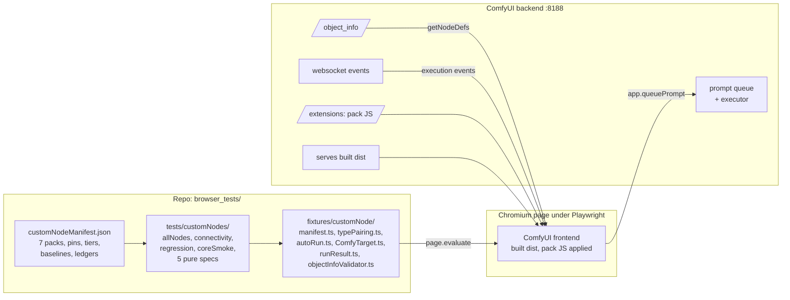
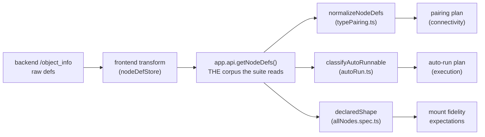
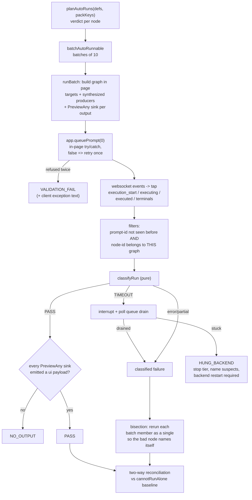
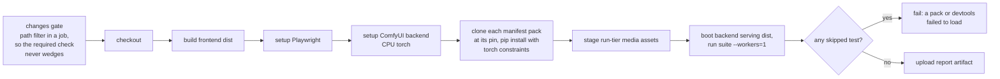

# Custom-node suite architecture

The system design behind the custom-node regression suite: what the pieces
are, how data flows through them, and why each invariant exists. Companion
docs: [README.md](README.md) (how to run it),
[ADDING_CUSTOM_NODES.md](ADDING_CUSTOM_NODES.md) (how to onboard a pack).
Every file path and symbol here names real code; if this doc and the code
disagree, the code wins and this doc has rotted - fix it in the same PR.

## 1. What this suite proves, and deliberately does not

For every node that 7 community packs register on the backend (823 nodes at
the current pins), on every PR:

- the node **mounts completely** in both renderers: the instance materializes
  every input and output its definition declares, and under Vue Nodes the DOM
  renders at least the instance's widget and slot counts
- the node **survives save/reload**: no widget disappears, no serialized
  value changes, and a programmatic non-default write sticks and survives a
  second reload, under both renderers
- the node's concrete slots **wire type-correctly** through the real
  connection validator, and the wires survive serialize, configure, and
  graphToPrompt
- the node **executes on a real backend** when its inputs allow it, and its
  output observably arrives at a preview sink

Every browser test also asserts the app shows **zero visible errors** while
doing this (except the auto-run tier, which provokes expected failures - see
section 6).

Deliberately out of scope: whether a node's OUTPUT is semantically correct
(does a blur actually blur), frontend-virtual nodes that never register on
the backend (rgthree's Fast Groups Bypasser), and hour-scale soak behavior.
The suite is a compatibility and regression gate, not a behavior certifier.

## 2. System overview



The specs iterate the manifest; the fixtures drive the live frontend inside
the page; the frontend talks to a real backend. Nothing is mocked.

## 3. The environment contract

The backend must run with exactly these properties, or the suite lies:

| Requirement                                                                                               | Why                                                                                                                                                                                                                                                                      |
| --------------------------------------------------------------------------------------------------------- | ------------------------------------------------------------------------------------------------------------------------------------------------------------------------------------------------------------------------------------------------------------------------ |
| Backend **serves the built dist** (`--front-end-root <repo>/dist`) and the tests point at the backend URL | The Vite dev server's `/extensions` lists core extensions only, so pack frontend JS NEVER loads under `pnpm dev`. Packs that restyle nodes, rebuild widgets, or hook the queue behave completely differently. Both early "green locally, red on CI" incidents were this. |
| `--cache-none`                                                                                            | `executing` websocket events are the only cache-safe "this node actually ran" signal; cached nodes replay `executed` but never emit `executing`.                                                                                                                         |
| `--multi-user`                                                                                            | Isolates test users; `ComfyPage.createUser` is idempotent on duplicates.                                                                                                                                                                                                 |
| Playwright `--workers=1`                                                                                  | The backend queue is a shared, exclusive resource. Two workers interrupt each other's prompts and misattribute events.                                                                                                                                                   |

## 4. Node-definition data flow: one corpus, two schema forms



The transformed corpus emits **two schema forms for the same concept**, and
every parser must handle both (this shipped one real bug before it became a
rule):

- combo inputs appear as an option-list literal `[["a","b"], opts]` (classic)
  AND as `["COMBO", { options: ["a","b"], ... }]` (V2 schema)
- V2 combos may carry NO static options (`remote` lazy combos): unknown
  vocabulary, excluded from pairing, unverifiable default for execution
- `forceInput` makes ANY form a socket (no widget materializes)
- autogrow template inputs (`COMFY_AUTOGROW_*`) materialize as dot-qualified
  expansion slots (`variables.a`), not as their container name
- `socketless` inputs have no slot; `defaultInput` is deprecated and ignored
  by the frontend (checked against source, deliberately unhandled)

Evidence rules for touching any of these parsers are in
[ADDING_CUSTOM_NODES.md](ADDING_CUSTOM_NODES.md) ("Evidence rules for
changing the harness itself").

## 5. The tiers

Two kinds of coverage per manifest pack: every-node tiers (zero config,
enumerate the live corpus) and curated tiers (the manifest row's
`expectedNodes` + `workflow`).

| Tier (spec)                                     | Scope                                                                                  | Renderers                                                                                   | Asserts                                                                                                                                                                                                                                                                                                                                                                                                      |
| ----------------------------------------------- | -------------------------------------------------------------------------------------- | ------------------------------------------------------------------------------------------- | ------------------------------------------------------------------------------------------------------------------------------------------------------------------------------------------------------------------------------------------------------------------------------------------------------------------------------------------------------------------------------------------------------------ |
| Mount (`allNodes.spec.ts`)                      | all 823                                                                                | both                                                                                        | createNode succeeds; def-vs-instance completeness (every declared input exists as widget or socket, autogrow via expansion slots, declared outputs exist); Vue pass additionally: node visible in DOM, DOM widget/slot counts >= instance's; console errors filtered by ledger                                                                                                                               |
| Save/reload (`allNodes.spec.ts`)                | all 823                                                                                | both                                                                                        | pristine pass: reload never loses a node, never shrinks its widgets, never changes a serialized value (appends by `control_after_generate` and value-driven dynamic widgets are legal); set-and-stick pass: every plain-typed widget holds a programmatic non-default write, and writes survive reload where widget topology stayed stable; console errors collected                                         |
| Connectivity (`connectivity.spec.ts`)           | every concrete slot                                                                    | one (renderer-independent: graph API + stores; drags cover both)                            | one representative typed pair per slot (5,030 pairs at current pins) connects through the real `isValidConnection`, survives serialize -> configure -> graphToPrompt; COMBO slots pair only on identical option SETS; wildcards/unknown-vocab combos/orphans recorded, never silently dropped; self-check proves the executor rejects broken pairs; curated drags run real mouse wiring under both renderers |
| Auto-run (`allNodes.spec.ts`)                   | every runnable node (~440 execute clean at current pins; exact counts printed per run) | one (execution is a backend contract; values flow through the same store in both renderers) | see section 6                                                                                                                                                                                                                                                                                                                                                                                                |
| Curated T0/T1 (`customNode.regression.spec.ts`) | manifest `expectedNodes` + `workflow`                                                  | both (T0)                                                                                   | sentinels register and render; the hand-authored workflow executes end to end; a forced-error self-check proves the harness detects real failures (positive control)                                                                                                                                                                                                                                         |
| Core smoke (`coreSmoke.spec.ts`)                | core workflow                                                                          | both                                                                                        | app loads a workflow with zero console errors while packs are installed                                                                                                                                                                                                                                                                                                                                      |

Pure specs (`*.pure.spec.ts`) pin the planner/classifier/outcome logic with
fixtures copied from real census examples of BOTH schema forms.

## 6. The execution harness

The most complex machine in the suite. One diagram, then the pieces.



**Verdicts** (`autoRun.ts`): `AUTO_RUNNABLE` (widgets satisfy every required
input), `CHAINABLE` (every required socket type has a model-free producer),
`NEEDS_WIRES` (some required type has no producer: MODEL, SEGS,
CONDITIONING...), `NEEDS_MODELS` (a required combo has no options on this
backend, including remote/lazy combos), `NO_OBSERVABLE_OUTPUT` (no outputs
and not an OUTPUT_NODE). Nothing is silently dropped; the plan is printed
per pack.

**Chain synthesis**: `SYNTH_PRODUCERS` maps socket types to self-sufficient
core producers (IMAGE -> EmptyImage, LATENT -> EmptyLatentImage, MASK ->
SolidMask, INT/FLOAT/STRING/BOOLEAN -> Primitive*, AUDIO -> EmptyAudio,
NUMBER -> Constant Number, `*`-> PrimitiveInt). A producer only counts if
the live backend actually registers it. Non-OUTPUT_NODE targets get a`PreviewAny`sink on output 0; the sink's`executed` payload is the proof
that data flowed, not just that execution finished.

**Outcome taxonomy** (`runResult.ts`): `PASS`, `PARTIAL` (an expected node
never emitted `executing`), `EXECUTION_ERROR`, `VALIDATION_FAIL` (client
refused twice, or threw - the exception text is carried), `TIMEOUT`, plus
spec-level `NO_OUTPUT` and `HUNG_BACKEND`.

**Event integrity**: the tap records `execution_start`, `executing`,
`executed`, and the three terminal events. Two filters make attribution
sound: events whose `prompt_id` was ever seen before are ignored (late
websocket delivery, flap-retry double-queues), and error/terminal events
naming a `node_id` outside the current graph's id set are ignored (a prior
prompt finishing mid-window). Node ids are globally unique within a page
(section 8), which makes the id filter airtight.

## 7. Reconciliation and the ledger doctrine

The suite's honesty mechanism: every escape hatch is a reviewed list whose
entries carry the causal mechanism, and every list is guarded against rot.

**Two-way baseline** (`cannotRunAlone` per manifest row): a planned node
that fails and is not listed fails the suite (regression or new baseline
entry, attach the run log); a listed node that runs clean, or is no longer
plannable, ALSO fails the suite (stale entry must be removed). The baseline
can neither hide regressions nor accumulate dead entries.

| Ledger                                                   | Lives in             | Meaning                                                                                                                                                                                                           |
| -------------------------------------------------------- | -------------------- | ----------------------------------------------------------------------------------------------------------------------------------------------------------------------------------------------------------------- |
| `cannotRunAlone`                                         | manifest row         | deterministic execution failure on synthesized inputs; confidence is "cannot run alone", not "broken"                                                                                                             |
| `vueIncompatibleNodes`                                   | manifest row         | cannot mount under Vue Nodes (evidence rule in ADDING doc)                                                                                                                                                        |
| `AUTO_RUN_EXCLUDE`                                       | allNodes.spec.ts     | unsafe or unstable to execute: runtime downloads and pip installs, infinite loops, non-interruptible hangs, environment-variable results (macOS vs Linux), state-dependent combos, flip-flopping executed signals |
| `WIDGET_SET_ALLOWLIST`                                   | allNodes.spec.ts     | plain-typed widget whose value pack JS owns (menu-action combos, canonicalized refs); set-and-stick does not apply                                                                                                |
| `ROUNDTRIP_VALUE_ALLOWLIST`                              | allNodes.spec.ts     | node whose serialized values legitimately change on reload (pack JS initializes or rebuilds them); shrink check still applies; also exempts the node from probe writes                                            |
| `MOUNT_WIDGET_ALLOWLIST`                                 | allNodes.spec.ts     | pack JS renders custom editor/preview widgets outside the DOM widget rows; slot fidelity still applies                                                                                                            |
| `CONSOLE_ERROR_ALLOWLIST`                                | allNodes.spec.ts     | pack-attributed console noise with no visible error surface                                                                                                                                                       |
| `CONNECT_REJECTED_ALLOWLIST`, `ROUNDTRIP_LOST_ALLOWLIST` | connectivity.spec.ts | pack JS legitimately vetoes a planned wire / drops links it manages itself                                                                                                                                        |

Every spec-local ledger has a stale guard: an entry naming a node the pack
no longer registers fails the suite.

## 8. Hard-won invariants (and the incident behind each)

These rules look arbitrary until you know what forced them. Do not remove
one without re-reading its incident.

- **Never reuse node ids within a page.** The frontend widgetValueStore keys
  widget state by node id and survives `graph.clear()`; a recreated node
  that reuses an id inherits a deleted node's same-named widget values (a
  combo received another node's option and failed backend validation).
  Every in-page builder restores a monotonic id base (`window.__cnIdBase`)
  after clear. Core bug, reported separately.
- **Filter events by prompt id AND graph membership.** Without both, a late
  terminal event or a flap-retry double-queue pins node A's failure on node
  B (observed: ImpactMakeImageList blamed for ImpactMakeMaskBatch's error).
- **Catch inside `queuePrompt`.** Pack JS that hooks the queue can THROW mid
  graphToPrompt (VHS applyToGraph assumed downstream inputs have widgets and
  crashed on a PreviewAny sink). Uncaught, one bad node aborts the whole
  tier; caught, it classifies as VALIDATION_FAIL with the exception text and
  names itself.
- **Stage the save/reload rig with frame yields.** Vue widget components run
  mount/configure effects that write back into the value store; a single
  synchronous evaluate serializes before any of that flushes and tests
  nothing renderer-specific.
- **Batch with bisection, and treat a jammed queue as a tripwire.** Batches
  of 10 amortize queue latency; on failure each member reruns alone so the
  bad node names itself. A TIMEOUT interrupts then polls for queue drain; a
  queue that will not drain is `HUNG_BACKEND` (non-interruptible execution:
  model downloads, pip installs at execute, pure-Python infinite loops) -
  the tier stops immediately because everything queued behind the offender
  would false-fail, and the offender must be identified from the backend
  log or `/queue` before excluding victims.
- **Probe values respect the widget's own contract.** Numeric writes step by
  `options.step2`; pack-owned widget types and value-drift-ledgered nodes
  are never probed (writing `_cn` markers into editor JSON widgets just
  makes pack JS choke on the probe).
- **Renderer policy is stated where it narrows.** Values flow through the
  same store in both renderers (proven by probe), so single-renderer tiers
  (auto-run, connectivity breadth) are justified in-code; the tiers where
  Vue lifecycle can change outcomes (mount, save/reload) run both.

## 9. CI pipeline

`.github/workflows/ci-tests-custom-nodes.yaml`, gating check
`custom-nodes-e2e`:



Pack pins live in the manifest; CI installs exactly the audited SHAs. Fork
PRs skip the job (the install loop is a code-execution surface) and keep
coverage via the main e2e shards. Sharding is deliberately deferred: setup
(~4.5 min) dominates the suite (~8 min at 7 packs); revisit when the
manifest grows.

## 10. File map

```
browser_tests/
  fixtures/
    data/customNodeManifest.json   the manifest: packs, pins, tiers, baselines, ledgers
    customNode/
      manifest.ts                  loader + field validation (rendererPassesFor, uniqueness)
      typePairing.ts               def normalization (both schema forms), pack attribution,
                                   isValidConnection mirror, pairing planner
      autoRun.ts                   input classifier, verdicts, SYNTH_PRODUCERS, batching
      ComfyTarget.ts               in-page IO: event tap, prompt-id/graph-id filters,
                                   queuePrompt catch + flap retry
      runResult.ts                 pure outcome classifier (cache-safe executing signal,
                                   outputsByNode, error attribution)
      objectInfoValidator.ts       raw object_info shape checks
  tests/customNodes/
    allNodes.spec.ts               every-node tiers: mount, save/reload, auto-run + 5 ledgers
    connectivity.spec.ts           pair sweep, executor self-check, curated drags + 2 allowlists
    customNode.regression.spec.ts  curated T0/T1 + forced-error positive control
    coreSmoke.spec.ts              core workflow under installed packs
    *.pure.spec.ts                 census-derived fixtures for every parser/classifier
    README.md                      how to run
    ADDING_CUSTOM_NODES.md         how to onboard a pack; ledger + evidence rules
    ARCHITECTURE.md                this file
.github/workflows/ci-tests-custom-nodes.yaml   the gating job
```
