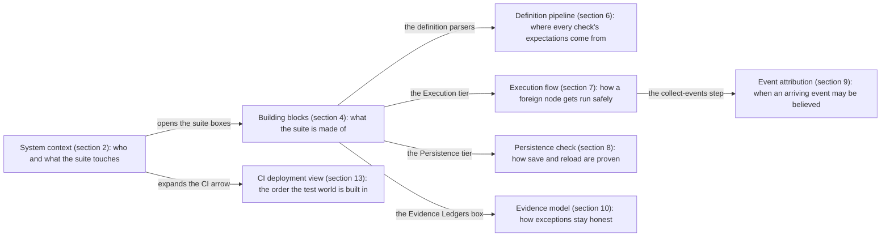
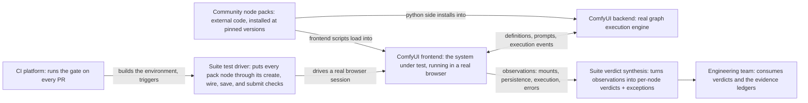
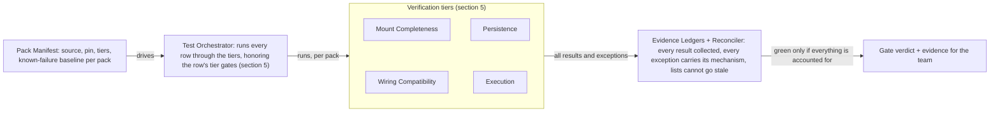
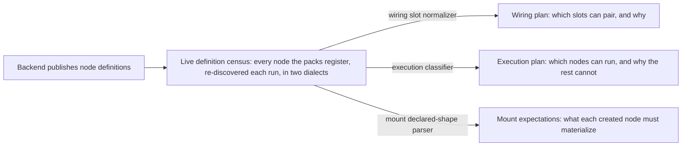
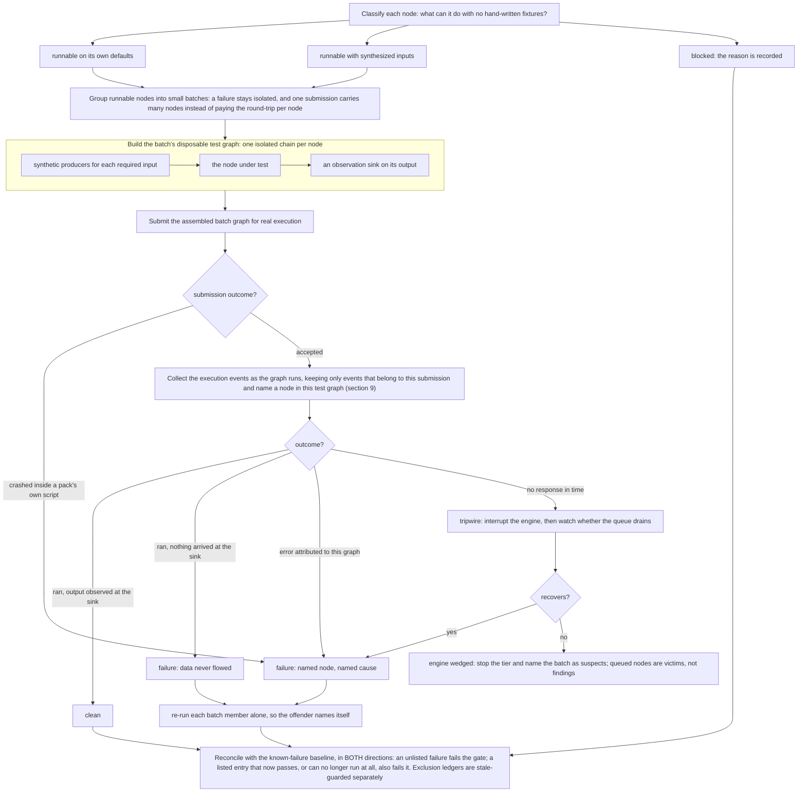
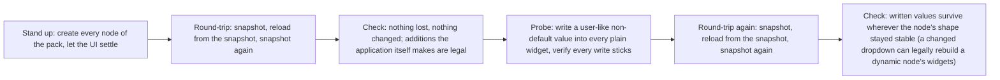
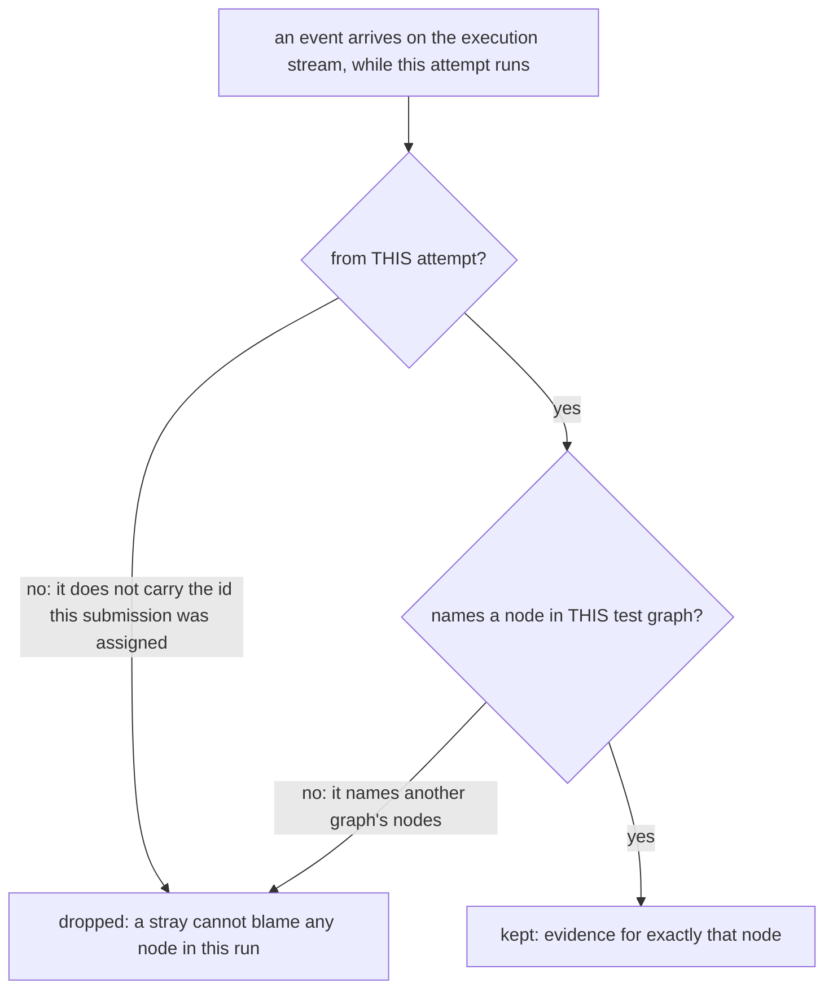
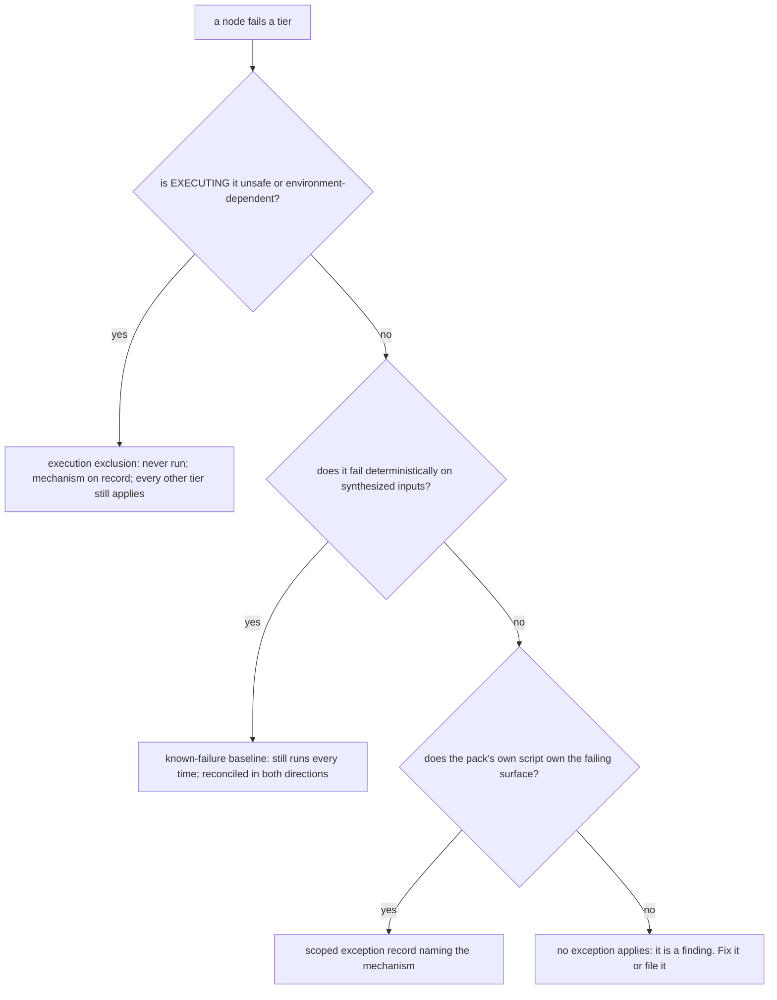
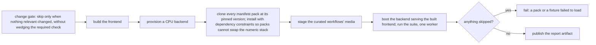

# Custom-node regression suite architecture

The design of the custom-node regression suite: what it is made of, how the
pieces cooperate, the decisions behind them, and the gotchas that shaped
them. Companion docs: [README.md](README.md) (how to run it),
[ADDING_CUSTOM_NODES.md](ADDING_CUSTOM_NODES.md) (how to onboard a pack).

The document is organized as eight architecture views; the diagram map
under "Reading paths" shows what question each answers and how they nest.
Implementation symbols live in one place: the implementation map at the
end (section 14).

## What / Why / How, in one minute

**What it proves.** On every PR, for every node that the manifest's
community packs register on a real backend, the suite proves four concrete
things: the node mounts completely in both renderers (the canvas renderer,
LiteGraph, and the DOM renderer, Vue Nodes 2.0), it survives save/reload,
its slots wire type-correctly, and it executes when its inputs allow.
Section 1 states each proof precisely.

> **Scale snapshot (example, at the time of writing):** 7 packs, 823
> registered nodes, about 5,000 planned wiring checks, about 440 nodes
> executing clean per run. These are observations printed by the run, not
> properties of the design; they move whenever the manifest or a pin moves.

**What it does NOT prove.** Output semantics, frontend-only nodes, and
hour-scale soak behavior are out of scope; section 1 states the non-goals
precisely. Green means "every registered node still mounts, saves, wires,
and runs," and nothing wider: a compatibility and regression gate, not a
behavior certifier.

**Why it exists.** Regressions against real community packs used to be
invisible: the frontend could break widely installed packs and no test
would fail, because nothing exercised those packs at all. Claims about
which packs worked were anecdotes with no receipts. The suite turns "most
packs are broken" or "this one is fine" from an opinion into a per-node,
reproducible result attached to a PR.

**How it works, in one paragraph.** One manifest row per pack (source,
pinned version, tiers, a tiny curated workflow) drives everything; there is
no per-pack test code. The suite reads each pack's real node list live from
the backend, derives what every node should be able to do, and verifies it
in a real browser against a real backend with the pack's own frontend
scripts active. Every exception is a reviewed record that carries its
causal mechanism, every exception list is guarded against going stale
(section 10 grades the strength of each guard), and execution results are
reconciled in both directions against a known-failure baseline, so the
gate can neither hide a regression nor accumulate dead exemptions.
Nothing is ever skipped; a skip fails the job.

## Reading paths

- **Skeptical about what green actually covers?** Section 1 (what it proves
  and the non-goals) and section 12 (the gotchas: every real incident, its
  root cause, and the defense).
- **Deciding pack strategy** (which packs to keep, which renderers to
  support): section 11 (design decisions and their trade-offs) and the Vue
  Nodes compatibility policy in ADDING_CUSTOM_NODES.md. A pack is one
  manifest row to add or remove.
- **Onboarding a pack:** ADDING_CUSTOM_NODES.md, not this doc. This doc is
  the why; that doc is the step-by-step.
- **Debugging a red run:** the failure-class list in ADDING_CUSTOM_NODES.md
  maps each red message to a cause; sections 7 and 10 show where in the pipeline it
  happened; section 12 gives symptom-first triage.

How to read the diagrams: a rectangle is one step, named by its purpose; a
diamond is a short question, drawn only where the flow genuinely forks; a
check that cannot fork is a "Check:" step, not a diamond; a titled group
is a thing with internal structure; mechanism detail lives in the prose
under each diagram, not stacked inside boxes.

The eight views are zoom levels of one mental model, not eight parallel
pictures. Every arrow below names the element of the parent view that the
child expands. The map is ordered by zoom, not by page order: arrows say
what contains what, section numbers say where to read.

The mount and wiring tiers have no diagram on purpose: each is a
single-shot comparison with nothing to sequence, so they live as prose and
tables in section 5.

## 1. What this suite proves, and deliberately does not

For every node that the manifest's packs register on the backend,
re-discovered live on every run:

- the node **mounts completely** in both renderers: the instance
  materializes every input and output its definition declares, and under
  the DOM renderer the page renders at least the instance's widget and
  slot counts
- the node **survives save/reload**: no widget silently disappears and no
  serialized value silently changes across a save/reload round-trip, and a
  user-like non-default write sticks and survives a second reload, under
  both renderers (dynamic widgets the application itself adds on reload are
  expected and allowed, see section 8)
- the node's concrete slots **wire type-correctly** through the real
  connection validator, and the wires survive save, reload, and prompt
  serialization
- the node **executes on a real backend** when its inputs allow it, and its
  output observably arrives at an observation sink
- the pack's **frontend extensions actually load**: every extension name the
  manifest declares (`expectedExtensions`) is registered in the browser.
  Backend nodes can register while the pack's JS silently fails to load
  (wrong web dir, a loadExtensions regression), which would strip every
  JS-driven behavior and quietly downgrade this suite to testing vanilla
  nodes
- **dynamic input slots grow and shrink** for the curated autogrow nodes:
  connecting the last input adds a slot (via both a real drag and a
  programmatic connect, under both renderers, in the graph AND, in the Vue
  renderer, as a rendered row), disconnecting removes the trailing empty. This behavior lives in
  pack JS (`onConnectionsChange` overrides), invisible to `/object_info`, so
  the def-driven tiers above cannot see it

Every tier also asserts the app shows **zero visible errors** while doing
this, except the execution tier, which deliberately provokes expected
failures (section 7).

Deliberately out of scope: output semantics (does a blur actually blur),
frontend-virtual nodes that never register on the backend, and hour-scale
soak behavior. A rare intermittent glitch that only surfaces after long
interactive use (a widget that occasionally shrinks on its own) is soak
behavior: this per-PR gate will not catch it, and does not claim to.

## 2. System context

Who and what the suite touches.

The two "Suite" boxes are the same system, split so the flow reads one way:
the driver puts the frontend through its paces, and verdict synthesis turns
what came back into the per-node verdicts and mechanism-carrying exceptions
the team consumes. Nothing flows backwards.

The load-bearing property: the suite tests the same stack a user runs. The
pack's own frontend scripts are active, the backend actually executes
graphs, and nothing is mocked.

## 3. The verification environment

The environment must have these properties, or the suite reports green
while testing the wrong thing:

| Requirement                                                               | Why                                                                                                                                                                                                                                                             |
| ------------------------------------------------------------------------- | --------------------------------------------------------------------------------------------------------------------------------------------------------------------------------------------------------------------------------------------------------------- |
| The backend serves the **built** frontend, and tests point at the backend | The dev server loads core extension scripts only, so pack frontend scripts never run under it. Packs that restyle nodes, rebuild widgets, or hook the submission path behave completely differently. Both early "green locally, red on CI" incidents were this. |
| Execution caching disabled                                                | Per-node "it actually ran" signals are only emitted for non-cached executions; with caching on, a node can pass without running.                                                                                                                                |
| Isolated test users                                                       | Test state must not leak between runs or into a developer's real workspace.                                                                                                                                                                                     |
| One test worker                                                           | The backend's execution queue is a shared, exclusive resource. Two workers interrupt each other's work and misattribute events.                                                                                                                                 |

## 4. Building blocks

What the suite is made of. The main flow is a straight pipeline; the shared
services that support the tiers are listed in the table below it.

The shared services behind the tiers:

| Service               | Used by                                                                 | Responsibility                                                                                                                                                          |
| --------------------- | ----------------------------------------------------------------------- | ----------------------------------------------------------------------------------------------------------------------------------------------------------------------- |
| Definition Normalizer | Wiring (slot model); every all-nodes tier (pack attribution, node keys) | one canonical connectable-slot model out of the multiple definition dialects (section 6), feeding the pairing planner                                                   |
| Capability Classifier | Execution                                                               | decides, per node, what it can do without hand-written fixtures: run on its own defaults, run with synthesized inputs, or blocked, with the reason recorded (section 7) |
| Execution Harness     | Execution                                                               | runs nodes for real and attributes every outcome to the right node despite an asynchronous, noisy event stream (sections 7 and 9)                                       |

Two further tiers (curated workflows, core smoke) sit alongside these four
but are fixture-driven rather than derived from the node corpus; section 5
lists all six.

Dialect handling is deliberately not centralized. Mount and the Capability
Classifier read the raw definitions through their own purpose-built
parsers (`declaredShape`, `classifyInput`), because each needs a different
slice of a definition (declared parts vs. runnability); the normalizer's
slot model feeds the wiring planner alone, though the all-nodes tiers
also call it for pack attribution and node-key derivation. What keeps the
three parsers from drifting is shared evidence, not shared code: each is
pinned by fixtures copied from a live census of both definition dialects
(section 6).

- **Pack Manifest**: the single extension point. Adding a pack is one row;
  no tier knows pack names.
- **Evidence Ledgers**: the honesty mechanism. An exception without a
  recorded mechanism is not allowed to exist (section 10).

## 5. The verification tiers

| Tier                 | Verifies                                                                                                                                                                                 | Renderers                                               | Notes                                                                                   |
| -------------------- | ---------------------------------------------------------------------------------------------------------------------------------------------------------------------------------------- | ------------------------------------------------------- | --------------------------------------------------------------------------------------- |
| Mount Completeness   | every declared input and output actually materializes on the created node; the DOM renderer additionally shows at least the instance's widget/slot counts                                | both; a pack declared Vue-incompatible runs canvas only | missing parts fail; extras are tolerated                                                |
| Persistence          | save/reload loses nothing and changes nothing; user-like writes stick and survive reload                                                                                                 | both; a pack declared Vue-incompatible runs canvas only | application-added dynamic widgets are legal; see section 8                              |
| Wiring Compatibility | one representative typed wire per slot connects through the real validator and survives save, reload, and prompt serialization                                                           | breadth sweep: one, by decision 7; curated drags: both  | dropdown slots pair only on identical option sets; see section 10 for exception routing |
| Execution            | the node runs on a real backend and its output arrives at an observation sink                                                                                                            | one, by decision 7                                      | the full flow is section 7                                                              |
| Curated workflows    | a small hand-authored graph per pack executes end to end; its named must-exist nodes are asserted present (a missing one fails the tier, catching a pack that renamed or dropped a node) | both (render pass)                                      | plus a forced-error self-check proving the harness detects real failures                |
| Core smoke           | the core app loads a workflow cleanly with packs installed                                                                                                                               | both                                                    | guards against packs breaking the base app                                              |

One vocabulary bridge, because the manifest predates these tier names: the
manifest row's `tiers` field takes `load`, `run`, `connectivity`, and
`io`. Today `run` gates the curated workflow execution, `connectivity`
gates the wiring tier, and everything else ignores the field: mount,
persistence, execution, and the curated render pass run for every row
unconditionally, and core smoke is pack-independent. `load` and `io` are
accepted by the schema but currently gate nothing.

## 6. The node-definition pipeline

Where the suite's knowledge of every node comes from: definitions flow left
to right, and three independent parsers derive three plans from one live
census.

The three plans are independent consumers of the same census, each through
its own dialect-aware parser (section 4 names the symbols): the wiring
plan feeds the Wiring Compatibility tier, the execution plan feeds the
Execution tier, and the mount expectations feed Mount Completeness.

Design rule that came from a real bug: every consumer must handle **both
definition dialects** (legacy list-form and V2 object-form), and anything
with an unknown shape is excluded with a record, never silently matched or
skipped. The dialects differ in where dropdown options live, how "must be
wired" is flagged, and how growable input groups are declared; details and
evidence rules are in ADDING_CUSTOM_NODES.md.

## 7. The execution flow

How the suite runs hundreds of foreign nodes safely, with no fixtures, and
still attributes every failure to the right node.

Synthesized inputs are produced by a small set of self-sufficient producer
nodes (an empty image, an empty latent, a solid mask, primitive values), so
"runnable with synthesized inputs" needs no per-node authoring. The
observation sink is what upgrades "it finished" to "its output actually
arrived somewhere."

The submission guard is why a crash inside a pack's own script can never
abort the tier: the throw is caught in the page, recorded as that node's
failure with the client error text, and the run moves on.

## 8. The persistence check

Why it is staged: the DOM renderer's widget components react to creation
and reload on their own schedule, and a check that snapshots synchronously
would compare state those reactions never touched. The whole pass runs once
per renderer.

Between phases the rig yields to the UI so renderer effects flush before
the next snapshot; those settle points are what makes the staging real.

Widgets whose values the pack's own script owns (canonicalized references,
embedded editors) are exempt from probe writes, each with a recorded
mechanism: writing probe markers into them only makes the pack's script
choke on the probe.

## 9. Event attribution

Real execution reports back over an asynchronous event stream, and the
stream can mislead in two specific ways. Both produced real misattributed
failures before the filters existed. The primary defense is positive: when
the harness submits a graph, it captures the id the backend assigns to
that submission from the submission response itself, so an event's
ownership is checked against a known id, never inferred from history.
Every arriving event passes the same two questions before it may count as
evidence:

Both no-answers are checkable, not hopeful. The first is a comparison
against the captured submission id: an event either carries it or it does
not. If that capture ever misses, the harness says so on the console and
falls back to identity bookkeeping, recording every attempt identity it
has ever seen so a late event from an observed attempt still identifies
itself. The second question defeats the one stray the first cannot: a
retried duplicate arriving under a never-seen identity. Node identities
are never reused within a session, so such an event can only name an
earlier graph's nodes. Membership is decisive.

## 10. The evidence model

The suite's honesty mechanism. Every exception is a reviewed record that
names its causal mechanism, and every list is guarded: an entry naming a
node the pack no longer registers fails the suite. Full per-record
semantics live in the ledger table in
[ADDING_CUSTOM_NODES.md](ADDING_CUSTOM_NODES.md).

What the first question means in practice: runtime downloads or installs,
infinite loops, host-specific results, mutable-content dropdowns,
unreliable completion signals. What a pack script owning the failing
surface looks like: rewritten values, custom widgets, vetoed wires,
console noise.

The two-way baseline is what stops the whole evidence model from rotting: a
failure that is not listed fails the gate, and a listed node that starts
passing ALSO fails the gate until its stale entry is removed. Exemptions
cannot silently accumulate.

Not every ledger can earn that two-way strength; the guards come in three
grades. Ledgers whose nodes still execute (the known-failure baseline) are
two-way behavioral: a new failure and a stale entry both flip the gate.
Ledgers that stop a path from running at all (execution exclusions,
probe-write exemptions) are registration guarded: the suite proves the
named node still exists, but the excluded path never runs, so an entry
that stopped being necessary cannot be observed; staleness there is
caught by review, not observation. Weakest are the pattern allowlists
(the console-error ledger): an entry that no longer matches anything
simply filters nothing, and usage tracking cannot be naively bolted on,
because some patterns are environment conditional (a missing-model 404
fires only on hosts without the model), so an entry can be legitimately
idle in one environment and load-bearing in the next.

The console-error ledger also has a bounded window, not just bounded
strength. Collection starts inside each tier, so it covers that tier's
own actions (load, run, wire, save); console noise a pack logs at app
boot, before the first tier action, is outside it - the shared app
fixture navigates once at setup, so boot output predates any per-pack
collector. This is deliberate: boot breakage that reaches a visible
surface is still caught by the startup zero-visible-errors check, and
invisible boot console noise is exactly what the ledger exists to
tolerate rather than gate on.

## 11. Design decisions

The decisions that define the suite, with their trade-offs. Each is
deliberate, and each is cheap to reverse or narrow later. The suite's one
deliberate extension seam is the curated-workflow fixture: anything the
manifest cannot derive from the live node corpus (pack-specific semantics,
multi-node behavior) is expressed there (decisions 6 and 11).

| #   | Decision                                                                                                                                                                                                    | Why                                                                                                                                                   | Trade-off accepted                                                                                                                          |
| --- | ----------------------------------------------------------------------------------------------------------------------------------------------------------------------------------------------------------- | ----------------------------------------------------------------------------------------------------------------------------------------------------- | ------------------------------------------------------------------------------------------------------------------------------------------- |
| 0   | Drive a real browser, not just the backend API                                                                                                                                                              | Pack frontend scripts (widget rebuilds, restyles, submission hooks) are half of what breaks; only a browser running the built frontend exercises them | Browser e2e is the slowest, most race-prone tier; mitigated by the attribution filters (section 9) and the staged settle points (section 8) |
| 1   | Real environment only: real browser, real backend, pack scripts active, nothing mocked                                                                                                                      | The failures worth catching live in the integration, not in units                                                                                     | Slower than unit tests; needs a backend in CI                                                                                               |
| 2   | The backend serves the built frontend                                                                                                                                                                       | The dev server never loads pack scripts, so it tests a different product                                                                              | Local iteration needs a build + restart for pack-script changes                                                                             |
| 3   | One test worker                                                                                                                                                                                             | The execution queue is exclusive; parallel workers corrupt each other's evidence                                                                      | Wall-clock time grows with the manifest                                                                                                     |
| 4   | Execution caching disabled                                                                                                                                                                                  | The per-node "actually ran" signal only exists for uncached executions                                                                                | Every run pays full execution cost                                                                                                          |
| 5   | Packs installed at pinned, verified versions                                                                                                                                                                | An upstream push must not change what the gate tests mid-flight                                                                                       | Pins need deliberate bumps; a nightly canary against pack HEADs is the planned complement                                                   |
| 6   | One manifest row per pack, zero per-pack test code                                                                                                                                                          | Extension cost stays constant as coverage grows                                                                                                       | The generic tiers cannot assert pack-specific semantics; curated workflows exist for that                                                   |
| 7   | Both renderers only where the renderer can change the outcome: mount, persistence, the curated render pass, the curated pointer drags, core smoke; one renderer elsewhere (breadth wiring sweep, execution) | Widget values flow through the same store under both renderers (verified by probe), so doubling execution buys no new failure surface                 | If that store unification ever changes, revisit this decision                                                                               |
| 8   | Every exception carries its mechanism and is stale-guarded                                                                                                                                                  | An unexplained exemption is indistinguishable from a hidden bug                                                                                       | Onboarding a flaky pack takes more effort than a blanket skip                                                                               |
| 9   | Known-failure baseline reconciled in both directions                                                                                                                                                        | One-way baselines rot into permanent blind spots                                                                                                      | A node that gets fixed upstream turns the gate red until its entry is removed (by design)                                                   |
| 10  | Small batches with single-node bisection                                                                                                                                                                    | Batching amortizes queue latency; bisection restores per-node attribution on failure                                                                  | A failing batch costs one extra pass over its members                                                                                       |
| 11  | Scope excludes output semantics and frontend-virtual nodes                                                                                                                                                  | Both need per-node knowledge a manifest cannot derive; curated workflows and future behavior tests are the extension point                            | "Green" is narrower than "the pack fully works," and says so                                                                                |

## 12. Gotchas: every incident, its root cause, and the defense

These failure modes shaped the suite. Each was real: something passed that
should have failed, or failed for a reason that had nothing to do with the
node under test. Named nodes below are worked examples of their class,
kept because specifics are what make a mechanism checkable. Do not remove
a defense without re-reading its incident. The two recurring team concerns
these answer: "green but broken" and "tests can never catch random bugs."

### G1. Dev-server pack-script blindspot

- **You hit it when**: a node behaves perfectly in local dev but breaks on
  CI, or vice versa, on any pack that restyles nodes, rebuilds widgets, or
  hooks the submission path.
- **Root cause**: the dev server loads core extension scripts only; pack
  frontend scripts never run under it. The node tested there is a
  different node than the one users get.
- **Defense**: the environment contract (section 3): the backend serves the
  built frontend and tests point at the backend. CI does exactly this (section 13).
- **Answers**: green but broken.

### G2. Widget-state bleed through recycled node identities

- **You hit it when**: a node fails validation with a value it was never
  given, specifically a dropdown carrying an option that belongs to some
  OTHER node created earlier in the same session.
- **Root cause**: the frontend keeps widget state keyed by node identity,
  and that state survives clearing the graph. A new node that reuses a
  cleared node's identity inherits its same-named widget values. Core
  frontend bug, distinct from this suite; the defense below stands
  regardless of when it is fixed.
- **Defense**: the suite never reuses a node identity within a browser
  session: every builder hands out monotonically increasing identities
  across graph clears.
- **Answers**: green but broken (a neighbor's leftover value produces a
  false failure and hides the real store bug).

### G3. Event misattribution races

- **You hit it when**: node A is reported failing, but the error belongs to
  node B tested just before it, or to a duplicate submission of an earlier
  graph.
- **Root cause**: two races over the asynchronous event stream: late
  arrivals from a previous attempt, and duplicate attempts created by a
  submission retry erroring under a fresh identity.
- **Defense**: the positive submission-id match plus the graph-membership
  filter of section 9, made decisive by G2's never-reuse-identities rule.
- **Answers**: tests can never catch random bugs (a misattributed error is
  noise that erodes trust in every verdict).

### G4. Pack scripts crashing the submission path

- **You hit it when**: an entire pack's execution tier aborts, not just one
  node.
- **Root cause**: pack scripts can hook workflow submission and throw on a
  graph shape they do not expect. Observed example: a video pack's
  "apply to graph" hook copies its latest file into downstream widget
  inputs and throws when its output feeds a plain socket while matching
  files exist; the trigger is content-dependent.
- **Defense**: submission runs guarded; a throw records as that node's
  failure, carrying the exception text, so the node names itself instead
  of aborting the tier. The proven case is also excluded with its
  mechanism in the exclusion ledger, and remains an upstream-report
  candidate.
- **Answers**: tests can never catch random bugs (uncaught, one crash masks
  every node queued behind it).

### G5. Two definition dialects

- **You hit it when**: a set of nodes silently never executes: they are
  classified as needing wires they do not need, so the planner skips them
  and nothing goes red.
- **Root cause**: node definitions reach the suite in two dialects (legacy
  list-form and V2 object-form), and a parser written against one dialect
  misreads the other. Measured example: 8 nodes of one pack were invisibly
  unexecuted until the classifier learned the second dialect.
- **Defense**: each consumer's parser handles both dialects
  (`declaredShape` for mount, `classifyInput` for execution, the
  normalizer for wiring; section 4); parser fixtures are copied from a
  live census of the real corpus so tests cannot self-confirm a parser's
  assumptions; unknown shapes are excluded with a record, never silently
  matched (section 6).
- **Answers**: green but broken (a whole class of nodes was uncovered while
  the tier stayed green).

### G6. "Must be wired" beats every dialect

- **You hit it when**: an input the pack marked as wire-only is treated as
  a widget, so the node runs without the wire it requires.
- **Root cause**: the wire-only flag can appear on any input form; a
  classifier that checks the form before the flag misreads it.
- **Defense**: the classifier checks the wire-only flag first, before any
  form-specific branch; fixtures pin the ordering.
- **Answers**: green but broken.

### G7. Dropdown pairing semantics

- **You hit it when**: the wiring tier pairs two unrelated dropdowns (a
  checkpoint list into a scheduler list), a pass that proves nothing, or
  refuses to pair two dropdowns that differ only in menu order.
- **Root cause**: a wired dropdown input bypasses its own menu, so the wire
  contract is set membership of options, not their order. And dropdowns
  whose options are not statically known cannot prove anything by pairing.
- **Defense**: dropdowns pair only on identical option SETS
  (order-insensitive); dropdowns with unknown option lists are excluded
  from pairing with a record instead of blind-matched.
- **Answers**: green but broken.

### G8. Environment flips

- **You hit it when**: a node fails on one OS but is clean on another, run
  to run, with no code change. A subtle variant is the warm-cache
  illusion: a node that downloads model weights inside execution runs
  clean only where the cache is already warm.
- **Root cause**: execution depends on the host, not on the node's
  frontend contract: numeric-stack differences, codec differences, cached
  downloads, directory-handling differences.
- **Defense**: the environment-variable class of execution exclusions,
  each entry naming its per-host mechanism, reconciled against observation
  runs on both hosts. The node keeps every non-execution tier.
- **Answers**: tests can never catch random bugs (host-dependent flips are
  flake that trains people to ignore red).

### G9. Queue jams from non-interruptible execution

- **You hit it when**: the execution tier hangs and every node queued
  BEHIND one offender reports failure.
- **Root cause**: some execution paths never respond to interrupt:
  installing packages at runtime, pure-Python infinite loops (observed
  example: a text-replace node spinning forever on an empty search
  string), minutes-long per-pixel loops, non-interruptible weight
  downloads.
- **Defense**: a timeout interrupts and checks that the queue recovers; a
  queue that will not drain stops the tier immediately and names the batch
  as suspects. Triage is explicitly offender-versus-victims, and a
  preflight asserts the queue is idle before the tier starts. Proven
  offenders are excluded with their mechanism.
- **Answers**: tests can never catch random bugs (a jam failing a whole
  batch is pure noise; the tripwire converts it into one named offender).

### G10. Renderer effect timing

- **You hit it when**: the persistence tier passes under the canvas
  renderer but silently tests nothing under the DOM renderer.
- **Root cause**: DOM-renderer widget components react to creation and
  reload asynchronously, writing back into the value store on frame
  boundaries; a synchronous snapshot compares state those reactions never
  touched.
- **Defense**: the persistence check is staged with explicit settle points
  between build, snapshot, reload, and write phases (section 8), and runs once
  per renderer.
- **Answers**: green but broken (a synchronous pass certifies a value path
  it never observed).

### G11. Growable input groups materialize under expanded names

- **You hit it when**: mount completeness reports a declared input missing
  on a node that uses growable input groups, when the renderer actually
  materialized it under expanded per-slot names.
- **Root cause**: growable input groups do not materialize under their
  declared group name; they expand into per-slot names derived from it.
- **Defense**: mount expectations accept either the group name or its
  required expansion; this was the only definition-shape special case
  found across the full corpus.
- **Answers**: keeps mount fidelity strict without false-failing
  group-typed nodes.

### G12. Legal dynamic growth on reload

- **You hit it when**: a node legitimately gains a widget on reload (the
  application attaches a seed-control widget; a pack appends a
  value-driven widget) and a naive equality check flags it as a
  regression.
- **Root cause**: reload is allowed to APPEND; what must never happen is
  the inverse: a widget disappearing or a saved value changing.
- **Defense**: the persistence comparison is asymmetric by design: growth
  passes, loss or mutation fails; after probe writes, values are compared
  only where the node's shape stayed stable, because a changed dropdown
  can legally rebuild a dynamic node.
- **Answers**: green but broken, from the other side: a check that
  rejected legal growth would get relaxed into uselessness.

### G13. Mutable-content dropdowns

- **You hit it when**: a file-list node flips between clean and failing
  across runs, tracking whatever content the backend happens to hold.
- **Root cause**: some dropdowns populate from mutable backend content
  (file listings, run history), so their default value and validity change
  as content changes.
- **Defense**: the state-dependent class of execution exclusions, with the
  mechanism on record; where the same dropdown also re-resolves on reload,
  a scoped persistence exception skips the value comparison while the
  no-shrink rule still applies. All other tiers are retained.
- **Answers**: tests can never catch random bugs.

### G14. Unreliable completion signals

- **You hit it when**: a node reports clean on one run and incomplete on
  the next with no change to anything.
- **Root cause**: the per-node "actually ran" signal is reliable for
  ordinary nodes with caching disabled, but list-expanded and
  remote-control nodes do not emit it on every run.
- **Defense**: only nodes with a PROVEN signal flip are excluded from
  execution, each recorded with the shared mechanism, so an incomplete
  result stays meaningful everywhere else.
- **Answers**: tests can never catch random bugs.

## 13. The CI deployment view

In today's implementation, the suite is Playwright driving bundled
Chromium, and the CI platform is GitHub Actions.

Fork PRs skip the job (the install loop is a code-execution surface) and
keep coverage via the main test shards. Sharding is deliberately deferred:
every shard would pay the full environment setup, which is a large share of
the job; the workflow states the threshold at which sharding starts paying.
Ballpark at the time of writing, moving like the scale snapshot: about
eight minutes of suite on top of about four and a half minutes of
environment setup, with sharding starting to pay once the whole job
passes roughly twelve minutes.

## 14. Implementation map

The one place where architecture names meet code symbols.

| Building block                        | File                                                                       | Key symbols                                                                                                                                                                                                                     |
| ------------------------------------- | -------------------------------------------------------------------------- | ------------------------------------------------------------------------------------------------------------------------------------------------------------------------------------------------------------------------------- |
| Pack Manifest                         | `browser_tests/fixtures/data/customNodeManifest.json`                      | one row per pack: `pack`, `repo`, `pin`, `tiers`, `workflow`, `expectedNodes`, `expectedExtensions`, `requiresGpu`, `requiresModels`, `timeoutMs`, plus optional `vueNodesCompatible`, `vueIncompatibleNodes`, `cannotRunAlone` |
| Manifest loader                       | `browser_tests/fixtures/customNode/manifest.ts`                            | `loadManifest`, `rendererPassesFor`                                                                                                                                                                                             |
| Test Orchestrator                     | each spec file                                                             | the `for (const entry of loadManifest())` loop heading allNodes.spec.ts, connectivity.spec.ts, customNode.regression.spec.ts                                                                                                    |
| Evidence Ledgers + Reconciler         | `browser_tests/tests/customNodes/allNodes.spec.ts`, `connectivity.spec.ts` | the `*_ALLOWLIST` maps, `AUTO_RUN_EXCLUDE`, the `cannotRunAlone` two-way reconciliation, stale-entry guards                                                                                                                     |
| Definition Normalizer                 | `browser_tests/fixtures/customNode/typePairing.ts`                         | `normalizeNodeDefs`, `packOf`                                                                                                                                                                                                   |
| Wiring planner                        | `browser_tests/fixtures/customNode/typePairing.ts`                         | `planPairs`, `isTypeCompatible`, `vocabOf`                                                                                                                                                                                      |
| Capability Classifier                 | `browser_tests/fixtures/customNode/autoRun.ts`                             | `classifyAutoRunnable`, `classifyInput`, `planAutoRuns`, `batchAutoRunnable`, `SYNTH_PRODUCERS`                                                                                                                                 |
| Execution Harness                     | `browser_tests/fixtures/customNode/ComfyTarget.ts`                         | `LocalDesktopTarget.runWorkflow`: event tap, attempt + graph-membership filters, guarded submission                                                                                                                             |
| Outcome classification                | `browser_tests/fixtures/customNode/runResult.ts`                           | `classifyRun`, `RunResult`                                                                                                                                                                                                      |
| Mount / Persistence / Execution tiers | `browser_tests/tests/customNodes/allNodes.spec.ts`                         | `addChunk`, `declaredShape`, the staged rig on `window.__cnRt`, `runBatch`, monotonic identities via `window.__cnIdBase`, five in-spec exception ledgers                                                                        |
| Wiring tier                           | `browser_tests/tests/customNodes/connectivity.spec.ts`                     | breadth sweep, executor self-check, curated drags, two allowlists                                                                                                                                                               |
| Curated workflows + self-check        | `browser_tests/tests/customNodes/customNode.regression.spec.ts`            | T0/T1 per pack, forced-error positive control                                                                                                                                                                                   |
| Core smoke                            | `browser_tests/tests/customNodes/coreSmoke.spec.ts`                        |                                                                                                                                                                                                                                 |
| Dynamic-input (autogrow) tier         | `browser_tests/tests/customNodes/dynamicInputs.spec.ts`                    | `AUTOGROW_CASES` (curated cases), `consumerShape` (graph + DOM census), per-path connect/disconnect loop                                                                                                                        |
| Parser/classifier fixtures            | `browser_tests/tests/customNodes/*.pure.spec.ts`                           | census-derived cases for both definition dialects                                                                                                                                                                               |
| CI job                                | `.github/workflows/ci-tests-custom-nodes.yaml`                             | gating check `custom-nodes-e2e`                                                                                                                                                                                                 |
