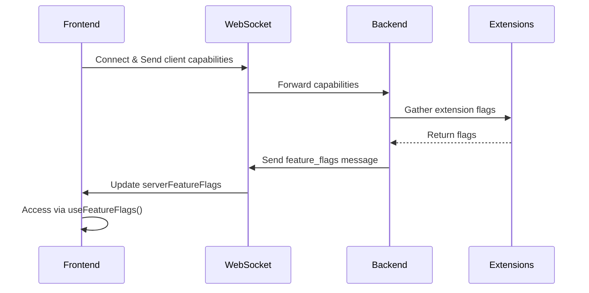

# Feature Flags in ComfyUI Frontend

This document explains the feature flags system in ComfyUI Frontend, which enables dynamic feature toggling based on server capabilities.

## Overview

The feature flags system allows the frontend to adapt its behavior based on what features the backend server supports. This enables:
- Graceful degradation when features aren't available
- Progressive enhancement with newer backend versions
- Safe rollout of experimental features
- Version compatibility across different ComfyUI installations

## Architecture



## How It Works

### 1. Client-Server Negotiation

When the WebSocket connection is established, the frontend sends its capabilities:

```typescript
// In api.ts - WebSocket connection
socket.send(JSON.stringify({
  type: 'feature_flags',
  data: {
    supports_preview_metadata: true
    // Other client capabilities
  }
}))
```

### 2. Server Response

The server responds with its supported features:

```typescript
// Server sends back
{
  type: 'feature_flags',
  data: {
    supports_preview_metadata: true,
    max_upload_size: 209715200,
    extension: {
      manager: {
        supports_v4: true,
        supports_batch_operations: true
      }
    }
  }
}
```

### 3. Accessing Feature Flags

Use the `useFeatureFlags` composable to access flags reactively:

```typescript
import { useFeatureFlags } from '@/composables/useFeatureFlags'

const { flags, featureFlag } = useFeatureFlags()

// Access known flags via the reactive object
if (flags.supportsPreviewMetadata) {
  // Enable preview metadata features
}

// Access custom flags with dot notation
const customFlag = featureFlag('extension.custom.feature', defaultValue)
```

## Known Feature Flags

### Core Flags

| Flag | Type | Description |
|------|------|-------------|
| `supports_preview_metadata` | boolean | Server can handle preview images with metadata |
| `max_upload_size` | number | Maximum file upload size in bytes |

### Extension Flags

| Flag | Type | Description |
|------|------|-------------|
| `extension.manager.supports_v4` | boolean | ComfyUI-Manager supports v4 API |

## Usage Examples

### Basic Usage

```vue
<template>
  <div>
    <ImageUpload v-if="flags.supportsPreviewMetadata" />
    <LegacyImageUpload v-else />
    
    <p>Max upload size: {{ formatBytes(flags.maxUploadSize) }}</p>
  </div>
</template>

<script setup lang="ts">
import { useFeatureFlags } from '@/composables/useFeatureFlags'

const { flags } = useFeatureFlags()

function formatBytes(bytes: number): string {
  return `${(bytes / 1024 / 1024).toFixed(2)} MB`
}
</script>
```

### Custom Feature Flags

```typescript
// Access nested extension features
const { featureFlag } = useFeatureFlags()

const supportsWebGL = featureFlag('client.rendering.webgl', false)
const maxNodes = featureFlag('limits.max_nodes', 1000)
const theme = featureFlag('ui.theme', 'dark')
```

### Service Integration

```typescript
export function useEnhancedService() {
  const { flags } = useFeatureFlags()
  
  async function uploadFile(file: File) {
    // Check file size against server limit
    if (file.size > flags.maxUploadSize) {
      throw new Error(`File too large. Max size: ${flags.maxUploadSize} bytes`)
    }
    
    // Use appropriate upload method
    if (flags.supportsPreviewMetadata) {
      return await uploadWithMetadata(file)
    } else {
      return await uploadLegacy(file)
    }
  }
  
  return { uploadFile }
}
```

## Adding New Feature Flags

### 1. Backend Implementation

Add the flag to the server's feature flags response:

```python
# In server.py or extension
def get_feature_flags():
    return {
        "my_new_feature": True,
        "my_feature_config": {
            "option1": "value1",
            "option2": 42
        }
    }
```

### 2. Frontend - Add to Enum (Optional)

For commonly used flags, add to the `ServerFeatureFlag` enum:

```typescript
// In useFeatureFlags.ts
export enum ServerFeatureFlag {
  SUPPORTS_PREVIEW_METADATA = 'supports_preview_metadata',
  MAX_UPLOAD_SIZE = 'max_upload_size',
  MY_NEW_FEATURE = 'my_new_feature' // Add your flag
}
```

### 3. Frontend - Add Reactive Getter (Optional)

For frequently accessed flags, add a getter to the reactive flags object:

```typescript
// In useFeatureFlags.ts
const flags = reactive({
  // ... existing getters
  get myNewFeature() {
    return api.getServerFeature(ServerFeatureFlag.MY_NEW_FEATURE)
  }
})
```

### 4. Use in Components

```vue
<template>
  <NewFeature v-if="flags.myNewFeature" />
</template>

<script setup lang="ts">
import { useFeatureFlags } from '@/composables/useFeatureFlags'
const { flags } = useFeatureFlags()
</script>
```

## Best Practices

1. **Always provide defaults**: When using `featureFlag()`, always provide a sensible default value
2. **Use reactive references**: The flags are reactive and will update if the server sends new flags
3. **Group related flags**: Use nested objects for related features (e.g., `extension.manager.*`)
4. **Document flags**: Add new flags to this documentation and include JSDoc comments
5. **Graceful degradation**: Always implement fallback behavior for when features aren't available

## Testing

When testing components that use feature flags:

```typescript
import { vi } from 'vitest'
import { api } from '@/scripts/api'

// Mock feature flags
vi.mocked(api.getServerFeature).mockImplementation((path) => {
  if (path === 'supports_preview_metadata') return true
  if (path === 'max_upload_size') return 104857600
  return undefined
})
```

## Migration Guide

When adding feature flag support to existing code:

1. Identify backend version-dependent code
2. Check if a flag already exists or create a new one
3. Wrap the code with feature flag checks
4. Implement fallback behavior
5. Test with flags both enabled and disabled

## Troubleshooting

### Flags not updating
- Check WebSocket connection is established
- Verify server sends `feature_flags` message
- Check browser console for errors

### Flag always undefined
- Ensure the flag path is correct (case-sensitive)
- Verify server includes the flag in response
- Check if using dot notation correctly for nested flags