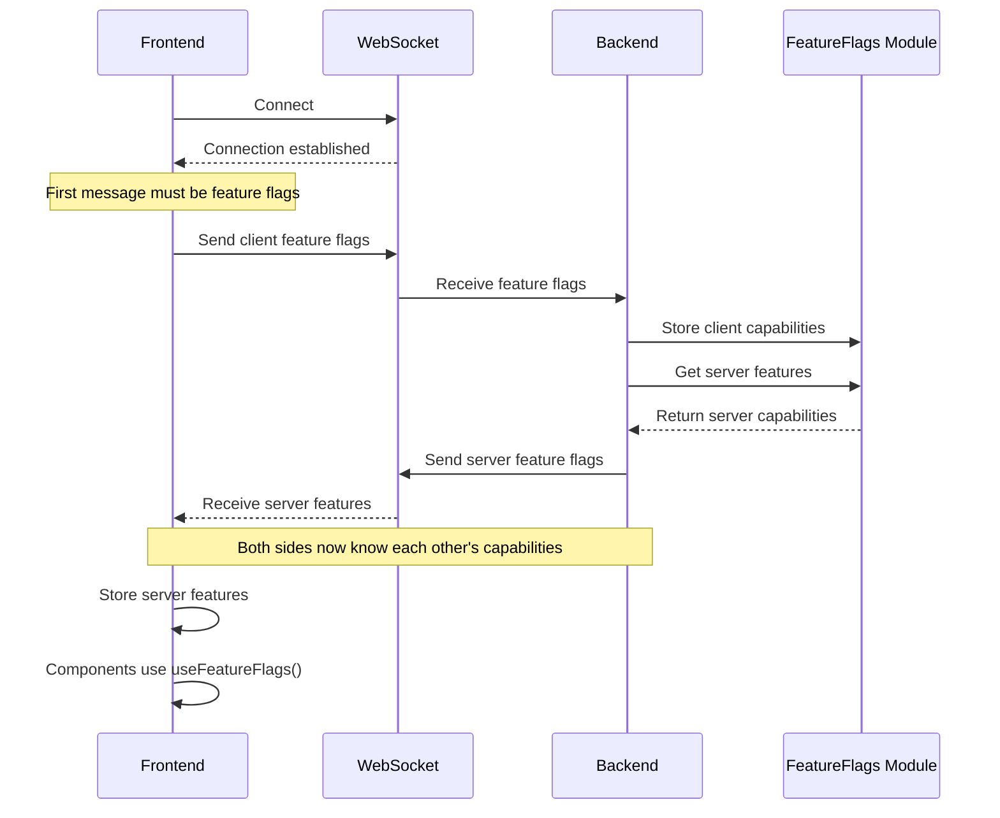
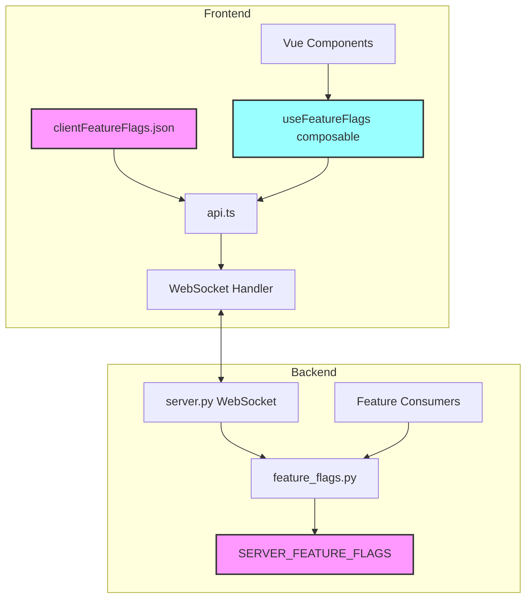
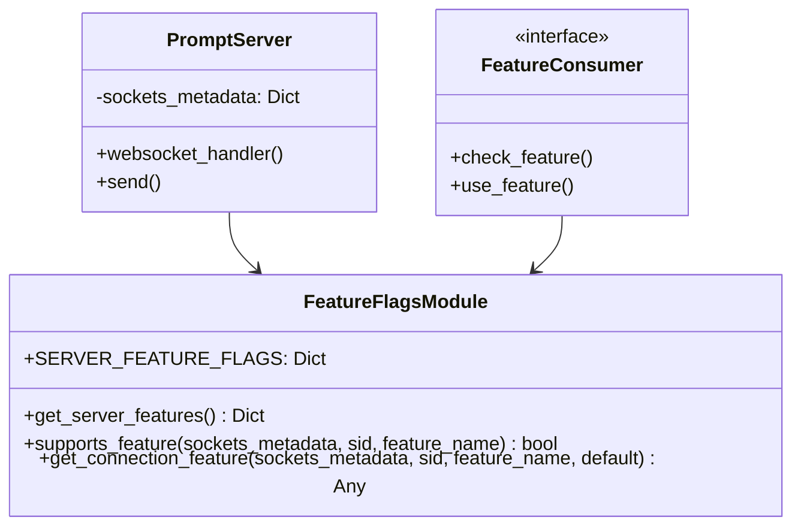
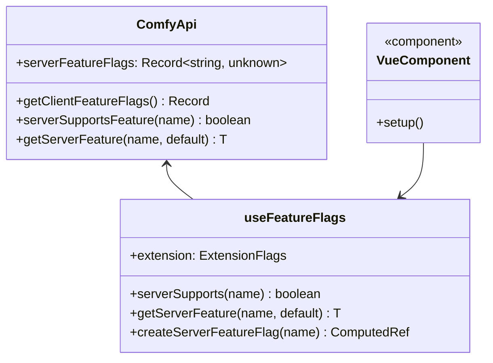
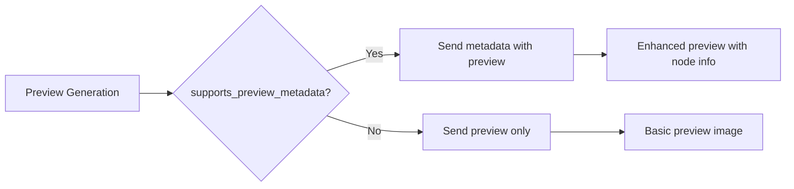
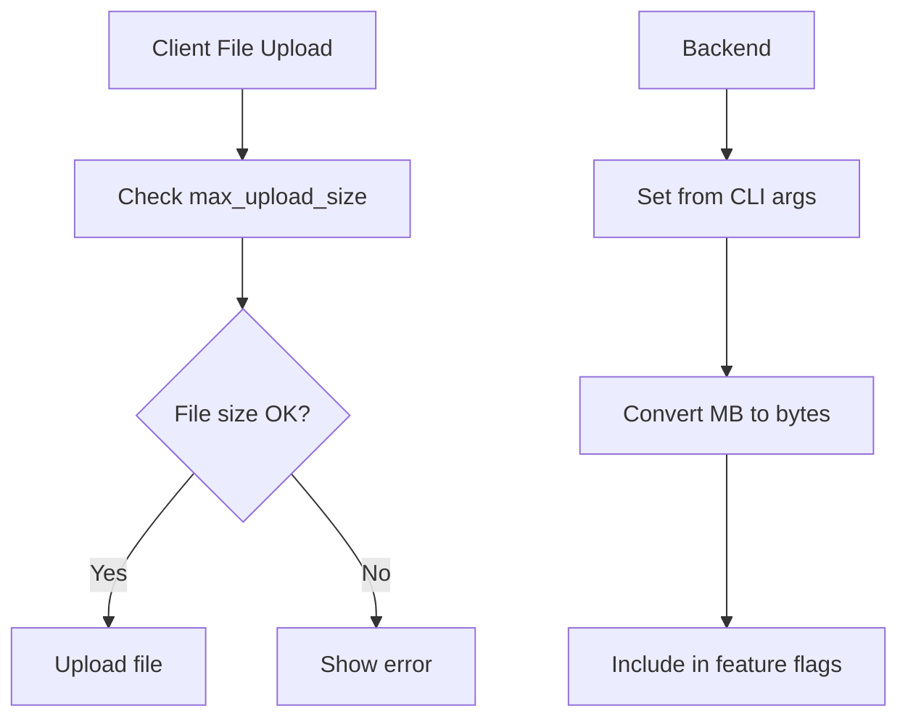
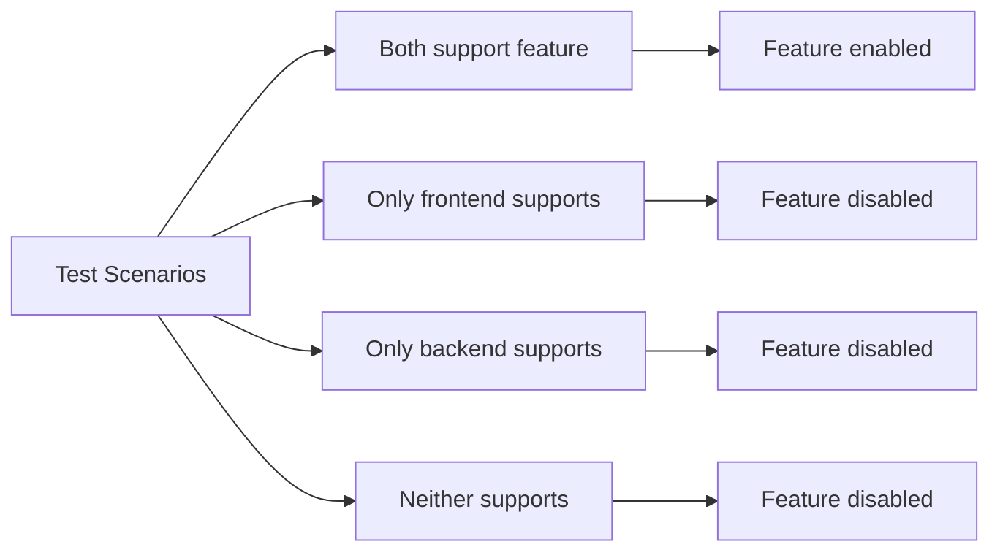

# ComfyUI Feature Flags System

## Overview

The ComfyUI feature flags system enables capability negotiation between frontend and backend, allowing both sides to communicate their supported features and adapt behavior accordingly. This ensures backward compatibility while enabling progressive enhancement of features.

## System Architecture

### High-Level Flow



### Component Architecture



## Feature Flag Structure

Feature flags are organized as a flat dictionary at the top level, with extensions nested under an `extension` object:

### Naming Convention

- **Core features**: Top-level keys (e.g., `"async_execution"`, `"supports_batch_queue"`)
- **Client features**: Top-level keys (e.g., `"supports_preview_metadata"`)
- **Extensions**: Nested under `"extension"` object (e.g., `extension.manager`)

### Structure Example

```json
{
  "async_execution": true,
  "supports_batch_queue": false,
  "supports_preview_metadata": true,
  "supports_websocket_v2": false,
  "max_upload_size": 104857600,
  "extension": {
    "manager": {
      "supports_v4": true,
      "supports_ai_search": false
    }
  }
}
```

## Implementation Details

### Backend Implementation



### Frontend Implementation

The `useFeatureFlags` composable provides reactive access to feature flags, meaning components will automatically update when feature flags change (e.g., during WebSocket reconnection).



## Examples

### 1. Preview Metadata Support



**Backend Usage:**
```python
# Check if client supports preview metadata
if feature_flags.supports_feature(
    self.server_instance.sockets_metadata,
    self.server_instance.client_id,
    "supports_preview_metadata"
):
    # Send enhanced preview with metadata
    metadata = {
        "node_id": node_id,
        "prompt_id": prompt_id,
        "display_node_id": display_node_id,
        "parent_node_id": parent_node_id,
        "real_node_id": real_node_id,
    }
    self.server_instance.send_sync(
        BinaryEventTypes.PREVIEW_IMAGE_WITH_METADATA,
        (image, metadata),
        self.server_instance.client_id,
    )
```

### 2. Max Upload Size



**Backend Configuration:**
```python
# In feature_flags.py
SERVER_FEATURE_FLAGS = {
    "supports_preview_metadata": True,
    "max_upload_size": args.max_upload_size * 1024 * 1024,  # Convert MB to bytes
}
```

**Frontend Usage:**
```typescript
const { getServerFeature } = useFeatureFlags()
const maxUploadSize = getServerFeature('max_upload_size', 100 * 1024 * 1024) // Default 100MB
```

## Using Feature Flags

### Frontend Access Patterns

1. **Direct API access:**
```typescript
// Check boolean feature
if (api.serverSupportsFeature('supports_preview_metadata')) {
    // Feature is supported
}

// Get feature value with default
const maxSize = api.getServerFeature('max_upload_size', 100 * 1024 * 1024)
```

2. **Using the composable (recommended for reactive components):**
```typescript
const { serverSupports, getServerFeature, extension } = useFeatureFlags()

// Check feature support
if (serverSupports('supports_preview_metadata')) {
    // Use enhanced previews
}

// Use reactive convenience properties (automatically update if flags change)
if (extension.manager.supportsV4.value) {
    // Use V4 manager API
}
```

3. **Reactive usage in templates:**
```vue
<template>
  <div v-if="featureFlags.extension.manager.supportsV4">
    <!-- V4-specific UI -->
  </div>
  <div v-else>
    <!-- Legacy UI -->
  </div>
</template>

<script setup>
import { useFeatureFlags } from '@/composables/useFeatureFlags'
const featureFlags = useFeatureFlags()
</script>
```

### Backend Access Patterns

```python
# Check if a specific client supports a feature
if feature_flags.supports_feature(
    sockets_metadata, 
    client_id, 
    "supports_preview_metadata"
):
    # Client supports this feature
    
# Get feature value with default
max_size = feature_flags.get_connection_feature(
    sockets_metadata,
    client_id,
    "max_upload_size",
    100 * 1024 * 1024  # Default 100MB
)
```

## Adding New Feature Flags

### Backend

1. **For server capabilities**, add to `SERVER_FEATURE_FLAGS` in `comfy_api/feature_flags.py`:
```python
SERVER_FEATURE_FLAGS = {
    "supports_preview_metadata": True,
    "max_upload_size": args.max_upload_size * 1024 * 1024,
    "your_new_feature": True,  # Add your flag
}
```

2. **Use in your code:**
```python
if feature_flags.supports_feature(sockets_metadata, sid, "your_new_feature"):
    # Feature-specific code
```

### Frontend

1. **For client capabilities**, add to `src/config/clientFeatureFlags.json`:
```json
{
    "supports_preview_metadata": false,
    "your_new_feature": true
}
```

2. **For extension features**, update the composable to add convenience accessors:
```typescript
// In useFeatureFlags.ts
const extension = {
    manager: {
        supportsV4: computed(() => getServerFeature('extension.manager.supports_v4', false))
    },
    yourExtension: {
        supportsNewFeature: computed(() => getServerFeature('extension.yourExtension.supports_new_feature', false))
    }
}

return {
    // ... existing returns
    extension
}
```

## Testing Feature Flags



Test your feature flags with different combinations:
- Frontend with flag + Backend with flag = Feature works
- Frontend with flag + Backend without = Graceful degradation
- Frontend without + Backend with flag = No feature usage
- Neither has flag = Default behavior

### Example Test

```typescript
// In tests-ui/tests/api.featureFlags.test.ts
it('should handle preview metadata based on feature flag', () => {
    // Mock server supports feature
    api.serverFeatureFlags = { supports_preview_metadata: true }
    
    expect(api.serverSupportsFeature('supports_preview_metadata')).toBe(true)
    
    // Mock server doesn't support feature
    api.serverFeatureFlags = {}
    
    expect(api.serverSupportsFeature('supports_preview_metadata')).toBe(false)
})