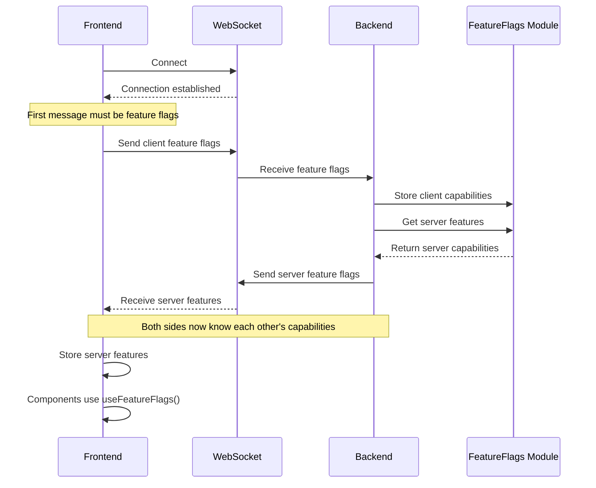
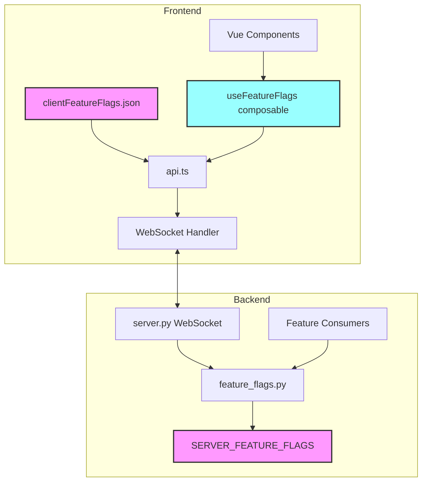
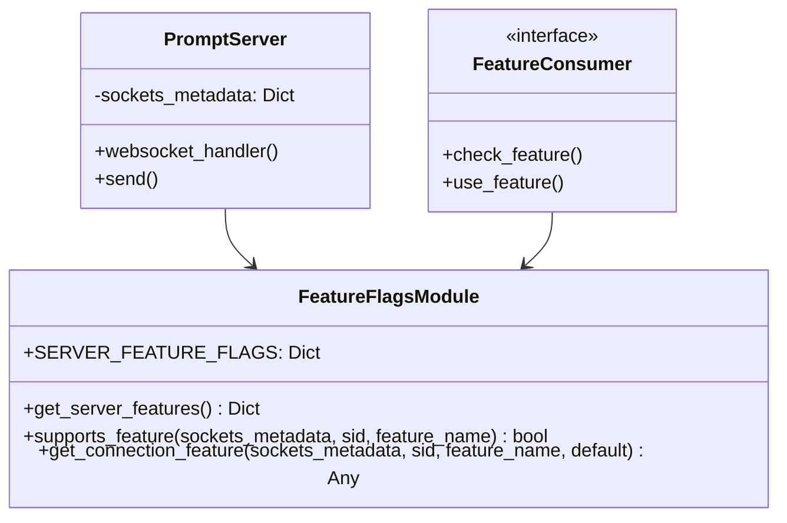
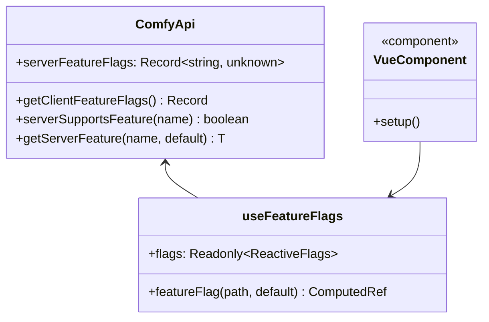
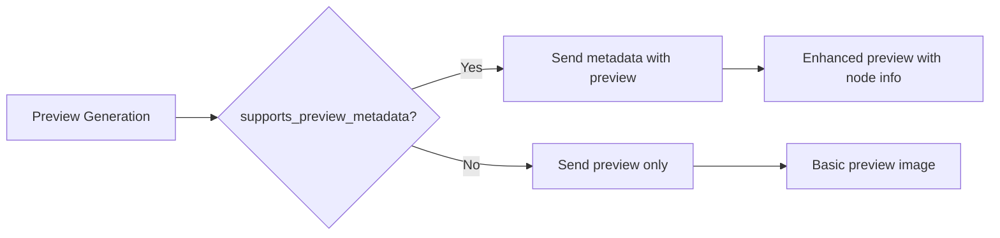
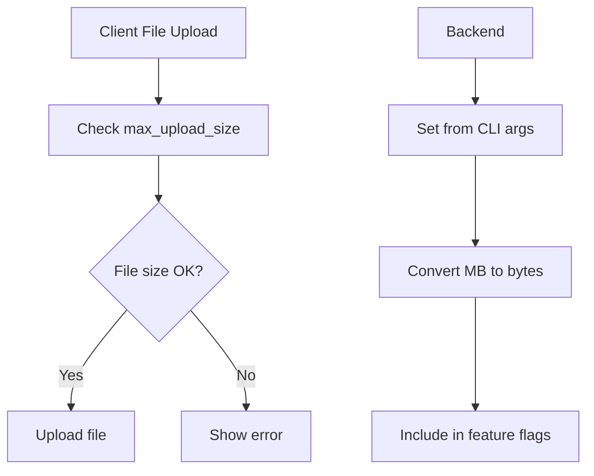
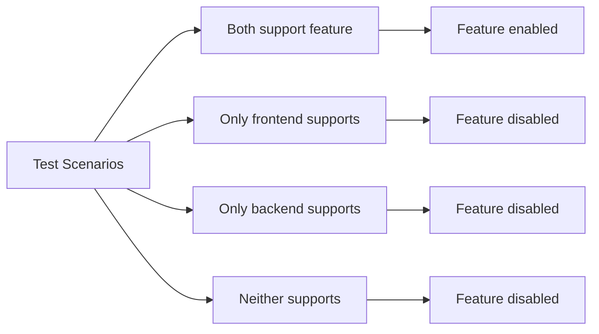

# ComfyUI Feature Flags System

## Overview

The ComfyUI feature flags system enables capability negotiation between frontend and backend, allowing both sides to communicate their supported features and adapt behavior accordingly. This ensures backward compatibility while enabling progressive enhancement of features.

## System Architecture

### High-Level Flow


```mermaid
sequenceDiagram
    participant Frontend
    participant WebSocket
    participant Backend
    participant FeatureFlags Module

    Frontend->>WebSocket: Connect
    WebSocket-->>Frontend: Connection established

    Note over Frontend: First message must be feature flags
    Frontend->>WebSocket: Send client feature flags
    WebSocket->>Backend: Receive feature flags
    Backend->>FeatureFlags Module: Store client capabilities

    Backend->>FeatureFlags Module: Get server features
    FeatureFlags Module-->>Backend: Return server capabilities
    Backend->>WebSocket: Send server feature flags
    WebSocket-->>Frontend: Receive server features

    Note over Frontend,Backend: Both sides now know each other's capabilities

    Frontend->>Frontend: Store server features
    Frontend->>Frontend: Components use useFeatureFlags()
```

### Component Architecture


```mermaid
graph TB
    subgraph Frontend
        A[clientFeatureFlags.json] --> B[api.ts]
        B --> C[WebSocket Handler]
        D[useFeatureFlags composable] --> B
        E[Vue Components] --> D
    end

    subgraph Backend
        F[feature_flags.py] --> G[SERVER_FEATURE_FLAGS]
        H[server.py WebSocket] --> F
        I[Feature Consumers] --> F
    end

    C <--> H

    style A fill:#f9f,stroke:#333,stroke-width:2px
    style G fill:#f9f,stroke:#333,stroke-width:2px
    style D fill:#9ff,stroke:#333,stroke-width:2px
```

## Feature Flag Structure

Feature flags are organized as a flat dictionary at the top level, with extensions nested under an `extension` object:

### Naming Convention

- **Core features**: Top-level keys (e.g., `"async_execution"`, `"supports_batch_queue"`)
- **Client features**: Top-level keys (e.g., `"supports_preview_metadata"`)
- **Extensions**: Nested under `"extension"` object (e.g., `extension.manager`)

### Structure Example

```json
{
  "async_execution": true,
  "supports_batch_queue": false,
  "supports_preview_metadata": true,
  "supports_websocket_v2": false,
  "max_upload_size": 104857600,
  "extension": {
    "manager": {
      "supports_v4": true,
      "supports_ai_search": false
    }
  }
}
```

## Implementation Details

### Backend Implementation


```mermaid
classDiagram
    class FeatureFlagsModule {
        +SERVER_FEATURE_FLAGS: Dict
        +get_server_features() Dict
        +supports_feature(sockets_metadata, sid, feature_name) bool
        +get_connection_feature(sockets_metadata, sid, feature_name, default) Any
    }

    class PromptServer {
        -sockets_metadata: Dict
        +websocket_handler()
        +send()
    }

    class FeatureConsumer {
        <<interface>>
        +check_feature()
        +use_feature()
    }

    PromptServer --> FeatureFlagsModule
    FeatureConsumer --> FeatureFlagsModule
```

### Frontend Implementation

The `useFeatureFlags` composable provides reactive access to feature flags, meaning components will automatically update when feature flags change (e.g., during WebSocket reconnection).


```mermaid
classDiagram
    class ComfyApi {
        +serverFeatureFlags: Record~string, unknown~
        +getClientFeatureFlags() Record
        +serverSupportsFeature(name) boolean
        +getServerFeature(name, default) T
    }

    class useFeatureFlags {
        +flags: Readonly~ReactiveFlags~
        +featureFlag(path, default) ComputedRef
    }

    class VueComponent {
        <<component>>
        +setup()
    }

    ComfyApi <-- useFeatureFlags
    VueComponent --> useFeatureFlags
```

## Examples

### 1. Preview Metadata Support


```mermaid
graph LR
    A[Preview Generation] --> B{supports_preview_metadata?}
    B -->|Yes| C[Send metadata with preview]
    B -->|No| D[Send preview only]

    C --> E[Enhanced preview with node info]
    D --> F[Basic preview image]
```

**Backend Usage:**

```python
# Check if client supports preview metadata
if feature_flags.supports_feature(
    self.server_instance.sockets_metadata,
    self.server_instance.client_id,
    "supports_preview_metadata"
):
    # Send enhanced preview with metadata
    metadata = {
        "node_id": node_id,
        "prompt_id": prompt_id,
        "display_node_id": display_node_id,
        "parent_node_id": parent_node_id,
        "real_node_id": real_node_id,
    }
    self.server_instance.send_sync(
        BinaryEventTypes.PREVIEW_IMAGE_WITH_METADATA,
        (image, metadata),
        self.server_instance.client_id,
    )
```

### 2. Max Upload Size


```mermaid
graph TB
    A[Client File Upload] --> B[Check max_upload_size]
    B --> C{File size OK?}
    C -->|Yes| D[Upload file]
    C -->|No| E[Show error]

    F[Backend] --> G[Set from CLI args]
    G --> H[Convert MB to bytes]
    H --> I[Include in feature flags]
```

**Backend Configuration:**

```python
# In feature_flags.py
SERVER_FEATURE_FLAGS = {
    "supports_preview_metadata": True,
    "max_upload_size": args.max_upload_size * 1024 * 1024,  # Convert MB to bytes
}
```

**Frontend Usage:**

```typescript
const { flags } = useFeatureFlags()
const maxUploadSize = flags.maxUploadSize
```

## Using Feature Flags

### Frontend Access Patterns

1. **Direct API access:**

```typescript
// Check boolean feature
if (api.serverSupportsFeature('supports_preview_metadata')) {
  // Feature is supported
}

// Get feature value with default
const maxSize = api.getServerFeature('max_upload_size', 100 * 1024 * 1024)
```

2. **Using the composable (recommended for reactive components):**

`useFeatureFlags()` returns `{ flags, featureFlag }`.

`flags` is a readonly reactive object of named, camelCase properties — one per
entry in the `ServerFeatureFlag` enum. Each is a getter, so reading it always
reflects the current value and tracks reactively:

```typescript
const { flags } = useFeatureFlags()

// Check feature support
if (flags.supportsPreviewMetadata) {
  // Use enhanced previews
}

// Nested extension flags are exposed as named properties too
if (flags.supportsManagerV4) {
  // Use V4 manager API
}
```

`featureFlag(path, defaultValue)` returns a `ComputedRef` for a flag that has no
named property yet. It accepts dot-separated paths for nested flags:

```typescript
const { featureFlag } = useFeatureFlags()

const customFlag = featureFlag('extension.custom.nested.feature', false)
console.log(customFlag.value)
```

3. **Reactive usage in templates:**

```vue
<template>
  <div v-if="flags.supportsManagerV4">
    <!-- V4-specific UI -->
  </div>
  <div v-else>
    <!-- Legacy UI -->
  </div>
</template>

<script setup>
import { useFeatureFlags } from '@/composables/useFeatureFlags'

const { flags } = useFeatureFlags()
</script>
```

### Backend Access Patterns

```python
# Check if a specific client supports a feature
if feature_flags.supports_feature(
    sockets_metadata,
    client_id,
    "supports_preview_metadata"
):
    # Client supports this feature

# Get feature value with default
max_size = feature_flags.get_connection_feature(
    sockets_metadata,
    client_id,
    "max_upload_size",
    100 * 1024 * 1024  # Default 100MB
)
```

## Adding New Feature Flags

### Cloud rollout review (advisory)

`feature-flag-policy` provides neutral rollout advice. It never reports a
passing test or blocks a merge. Do not add it to required checks.

The policy reads changed paths and the trusted default branch's risk map.
It does not consume risk labels, the risk grader's check output, or CI status.
This removes the dependency cycle between risk grading and flag policy.
The general risk grader still uses CI health as one advisory axis; its overall
grade is not a flag requirement or a statement that tests failed.

Test, documentation, tooling, CI, dependency, build, and website paths do not
require Cloud runtime flags. Their existing checks and reviews still apply.
Runtime paths matching R2/R3 rules receive rollout advice. Unknown paths need
human scope review, without automatically demanding a flag. Renames inspect
both old and new paths, and non-runtime files do not exempt a mixed runtime PR.
A path rule cannot determine whether shared code executes in Cloud.

For applicable Cloud changes, provide the exact rollout flag:

```markdown
## Feature flag

- **Flag**: unified_cloud_auth
```

A declaration is not evidence of safety. Reviewers verify containment,
fail-closed defaults, production-OFF state for every cohort, OFF-path test
coverage, and rollback. Client capability flags are not rollout controls.
If a flag is unsuitable (for example, a repair, removal, or migration), explain
why and supply validation and rollback evidence for reviewer approval.
`risk-dispute:*` and `flag-exempt` labels do not bypass or satisfy this advice.

The check lists applicable paths and matched risk classes. Missing declarations
produce `needs-flag`; declared flags or unclassified runtime paths produce
`review-required`; non-runtime-only changes produce `not-applicable`. All three
are neutral. API errors and incomplete file lists fail the workflow visibly
instead of producing a misleading policy result. Re-run after fixing the error.

This advisory replacement does not verify flags with regex or an AI model and
does not contact PostHog. Enforcement requires a separate design and approval,
including independent test evidence, safe exceptions, current-head evaluation,
and validation against representative real PRs.

### Backend

1. **For server capabilities**, add to `SERVER_FEATURE_FLAGS` in `comfy_api/feature_flags.py`:

```python
SERVER_FEATURE_FLAGS = {
    "supports_preview_metadata": True,
    "max_upload_size": args.max_upload_size * 1024 * 1024,
    "your_new_feature": True,  # Add your flag
}
```

2. **Use in your code:**

```python
if feature_flags.supports_feature(sockets_metadata, sid, "your_new_feature"):
    # Feature-specific code
```

### Frontend

1. **For client capabilities**, add to `src/config/clientFeatureFlags.json`:

```json
{
  "supports_preview_metadata": false,
  "your_new_feature": true
}
```

2. **For server or extension features**, add the flag path to the
   `ServerFeatureFlag` enum and expose a named getter on the `flags` object in
   `src/composables/useFeatureFlags.ts`. Nested extension flags use a
   dot-separated path:

```typescript
// In useFeatureFlags.ts
export enum ServerFeatureFlag {
  // ... existing entries
  YOUR_EXTENSION_NEW_FEATURE = 'extension.yourExtension.supports_new_feature'
}

export function useFeatureFlags() {
  const flags = reactive({
    // ... existing getters
    get yourExtensionNewFeature() {
      return api.getServerFeature(
        ServerFeatureFlag.YOUR_EXTENSION_NEW_FEATURE,
        false
      )
    }
  })
  // ...
}
```

Adding it to the enum also opts the flag into the telemetry sweep in
`startFeatureFlagTelemetry()`; add a matching entry there so its evaluated
value is reported.

For a one-off flag that does not warrant a named property, call
`featureFlag(path, defaultValue)` at the call site instead.

## Testing Feature Flags


```mermaid
graph LR
    A[Test Scenarios] --> B[Both support feature]
    A --> C[Only frontend supports]
    A --> D[Only backend supports]
    A --> E[Neither supports]

    B --> F[Feature enabled]
    C --> G[Feature disabled]
    D --> H[Feature disabled]
    E --> I[Feature disabled]
```

Test your feature flags with different combinations:

- Frontend with flag + Backend with flag = Feature works
- Frontend with flag + Backend without = Graceful degradation
- Frontend without + Backend with flag = No feature usage
- Neither has flag = Default behavior

### Example Test

```typescript
// Example from a colocated unit test
// `serverFeatureFlags` is a ref, so assign through `.value`
it('should handle preview metadata based on feature flag', () => {
  // Mock server supports feature
  api.serverFeatureFlags.value = { supports_preview_metadata: true }

  expect(api.serverSupportsFeature('supports_preview_metadata')).toBe(true)

  // Mock server doesn't support feature
  api.serverFeatureFlags.value = {}

  expect(api.serverSupportsFeature('supports_preview_metadata')).toBe(false)
})
```
