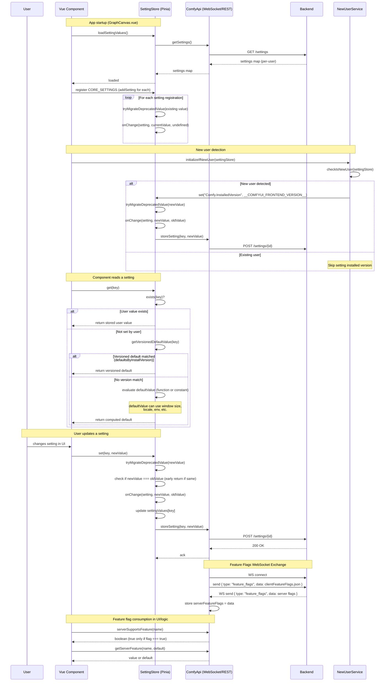

# Settings and Feature Flags Sequence Diagram

This diagram shows the flow of settings initialization, default resolution, persistence, and feature flags exchange.

This diagram accurately reflects the actual implementation in the ComfyUI frontend codebase.

