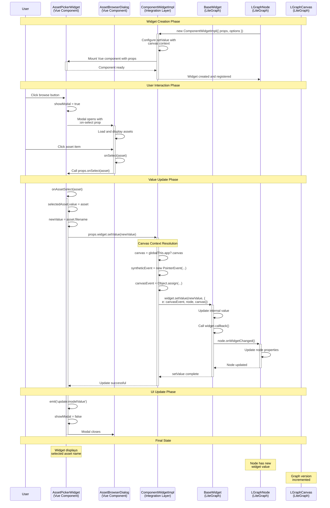

# Widget Integration Guide: Vue Components + LiteGraph

## Overview
This guide documents how to integrate Vue components with the LiteGraph widget system. The primary use case is replacing standard widgets (combo, text, number, etc.) with custom Vue components that provide enhanced UI experiences like modal dialogs, advanced selectors, or interactive controls.

**Common Use Cases:**
- Asset browsers (checkpoints, LoRAs, VAEs, schedulers)
- Advanced text editors with syntax highlighting  
- Interactive parameter controls with sliders and presets
- File upload interfaces with drag-and-drop
- Multi-select components with search and filtering
- Color pickers, date selectors, or other specialized inputs

**Core Pattern:** This guide demonstrates the complete pattern using an asset browser example, but the same architectural principles apply to any widget replacement scenario.

## Architecture Layers

```
┌─────────────────────────────────────┐
│           Vue App Layer             │
│  - YourCustomWidget.vue            │
│  - YourBrowserDialog.vue           │
│  - PrimeVue Components             │
└─────────────────────────────────────┘
                  ↕
┌─────────────────────────────────────┐
│         Integration Layer           │
│  - useYourCustomWidget()           │
│  - ComponentWidgetImpl             │
│  - ComfyWidgets registry           │
└─────────────────────────────────────┘
                  ↕
┌─────────────────────────────────────┐
│         LiteGraph Layer             │
│  - BaseWidget                      │
│  - Node widget system              │
│  - Graph canvas events             │
└─────────────────────────────────────┘
```

## Communication Flow Sequence

The following sequence diagram shows the complete communication pattern for widget value updates, using our working asset browser example:



**Key Communication Patterns:**

1. **Props Flow Down**: ComponentWidgetImpl → Vue Component via `props`
2. **Events Flow Up**: Vue Component → ComponentWidgetImpl via configured `setValue`
3. **Canvas Context**: ComponentWidgetImpl manages LiteGraph integration
4. **Value Updates**: BaseWidget handles the actual value change with proper context
5. **UI Reactivity**: Vue components update automatically via reactive getters

## Widget Replacement Pattern

### 1. Create Widget Composable (`useAssetComboWidget.ts`)

**✅ WORKING PATTERN:**
```typescript
export const useAssetComboWidget = (): ComfyWidgetConstructorV2 => {
  const standardComboWidget = useComboWidget()
  
  return (node: LGraphNode, inputSpec: InputSpec) => {
    // Eligibility check
    const shouldUseAssetBrowser = checkAssetBrowserEligibility(node, inputSpec)
    
    if (shouldUseAssetBrowser) {
      return createAssetPickerWidget(node, inputSpec)
    }
    
    // Fallback to standard widget
    return standardComboWidget(node, inputSpec)
  }
}

// Widget creation using ComponentWidgetImpl
function createAssetPickerWidget(node: LGraphNode, inputSpec: ComboInputSpec) {
  const widgetValue = ref<string>(inputSpec.default || '')
  const widget = new ComponentWidgetImpl({
    node,
    name: inputSpec.name,
    component: AssetPickerWidget,
    inputSpec,
    options: {
      getValue: () => widgetValue.value,
      setValue: (value: string) => {
        widgetValue.value = value
      },
      widget: {
        value: widgetValue.value,
        name: inputSpec.name,
        setValue: (value: string) => {
          widgetValue.value = value
        }
      }
    }
  })
  
  addWidget(node, widget as BaseDOMWidget<object | string>)
  return widget
}
```

**❌ BROKEN APPROACHES:**
- Direct DOM manipulation instead of ComponentWidgetImpl
- Modifying existing widgets in-place
- Intercepting at the UI level instead of widget system level

### 2. Register Widget in System (`widgets.ts`)

**✅ WORKING PATTERN:**
```typescript
export const ComfyWidgets: Record<string, ComfyWidgetConstructor> = {
  // Replace COMBO with enhanced version
  COMBO: transformWidgetConstructorV2ToV1(useAssetComboWidget()),
  // ... other widgets
}
```

**❌ BROKEN APPROACHES:**
- Adding new widget types instead of replacing existing ones
- Conditional registration based on settings (breaks consistency)

### 3. Vue Component Integration

**✅ WORKING MODAL PATTERN:**
```vue
<template>
  <div class="asset-picker-widget">
    <!-- Widget display -->
    <div class="selected-asset-display">
      <span class="asset-name">{{ displayName }}</span>
      <Button @click="openAssetBrowser" />
    </div>
    
    <!-- Modal wrapper - CRITICAL: Use PrimeVue Dialog -->
    <Dialog 
      v-model:visible="showModal"
      :modal="true"
      :style="{ width: '80vw', height: '80vh' }"
    >
      <AssetBrowserDialog 
        :onClose="closeAssetBrowser"
        :onSelect="onAssetSelect"
      />
    </Dialog>
  </div>
</template>
```

**❌ BROKEN APPROACHES:**
- Rendering modal content inline (shows as small popup)
- Using `@select` event instead of `:onSelect` prop
- Missing Dialog wrapper component

## ComponentWidgetImpl Structure Patterns

### ⚠️ CRITICAL: Props vs Options Distinction

The ComponentWidgetImpl uses two separate parameter objects: `options` for internal widget behavior and `props` for Vue component properties.

**✅ WORKING: Proper ComponentWidgetImpl Structure**
```typescript
function createAssetPickerWidget(node: LGraphNode, inputSpec: ComboInputSpec) {
  const widgetValue = ref<string>(inputSpec.default || '')
  
  const widget = new ComponentWidgetImpl({
    node,
    name: inputSpec.name,
    component: AssetPickerWidget,
    inputSpec,
    // OPTIONS: Internal widget behavior (for DOM widget system)
    options: {
      getValue: () => widgetValue.value,
      setValue: (value: string) => {
        widgetValue.value = value
        console.log('🔧 Widget value updated to:', value)
      }
    },
    // PROPS: Passed to Vue component (this is what your Vue component receives)
    props: {
      widget: {
        // ✅ CRITICAL: Use getter for reactivity in Vue component
        get value() { return widgetValue.value },
        name: inputSpec.name,
        setValue: (newValue: string) => {
          // Proper setValue implementation with canvas context
          const globalApp = globalThis as { app?: { canvas?: LGraphCanvas } }
          const canvas = globalApp.app?.canvas
          
          if (!canvas) {
            throw new Error('Canvas is required for setValue operation')
          }

          // Create synthetic CanvasPointerEvent
          const syntheticPointerEvent = new PointerEvent('pointerdown', {
            bubbles: false,
            cancelable: false,
            pointerId: -1,
            pointerType: 'mouse'
          })
          
          const canvasEvent = Object.assign(syntheticPointerEvent, {
            canvasX: 0,
            canvasY: 0,
            deltaX: 0,
            deltaY: 0,
            safeOffsetX: 0,
            safeOffsetY: 0
          })
          
          // Call inherited setValue with proper WidgetEventOptions context
          widget.setValue(newValue, {
            e: canvasEvent,
            node: node,
            canvas: canvas
          })
        }
      },
      nodeType: node.type || 'unknown',
      widgetName: inputSpec.name
    }
  })
  
  addWidget(node, widget as BaseDOMWidget<object | string>)
  return widget
}
```

**❌ BROKEN: Mixing Props and Options**
```typescript
// DON'T put Vue component props in options
options: {
  getValue: () => widgetValue.value,
  widget: { /* This belongs in props! */ }
}
```

**❌ BROKEN: Static Value in Props**
```typescript
props: {
  widget: {
    value: widgetValue.value,  // Snapshot - never updates!
    name: inputSpec.name
  }
}
```

## Communication Patterns

### Vue → LiteGraph (Widget Value Updates)

**✅ WORKING: Proper setValue with Canvas Context**
```typescript
const onAssetSelect = (asset: Asset) => {
  console.log('🎯 Asset selected in picker widget:', asset.name)
  selectedAsset.value = asset
  
  // Use the setValue method provided in props (this has proper canvas context)
  const newValue = asset.filename || asset.name
  console.log('🔧 Setting widget value to:', newValue)
  
  props.widget.setValue(newValue)
  console.log('✅ Widget value set via setValue with canvas context')
  
  // Emit update for Vue reactivity
  emit('update:modelValue', newValue)
  
  console.log('🔄 Modal should close now via onClose callback')
}
```

**✅ WORKING: Vue Component Props Interface**
```typescript
export interface AssetPickerWidgetProps {
  widget: {
    value: string                          // Current widget value (reactive)
    name: string                          // Widget name
    setValue: (newValue: string) => void  // Properly configured setValue function
  }
  nodeType?: string
  widgetName?: string
}
```

**❌ BROKEN: Calling setValue Without Proper Canvas Context**
```typescript
// This fails because setValue needs WidgetEventOptions
widget.setValue(newValue, {
  e: undefined,     // ❌ Invalid - needs proper CanvasPointerEvent  
  node: undefined,  // ❌ Invalid - needs actual LGraphNode
  canvas: undefined // ❌ Invalid - needs actual LGraphCanvas
})
```

**Why Our setValue Works:**
- Pre-configured in ComponentWidgetImpl props with proper canvas access
- Canvas obtained via `globalThis.app?.canvas` (the working path)
- Synthetic CanvasPointerEvent created with all required properties
- Proper WidgetEventOptions structure passed to BaseWidget.setValue()
- **No direct prop mutations - uses the LiteGraph widget system correctly**

### LiteGraph → Vue (Props Flow)

**✅ WORKING: Reactive Props via ComponentWidgetImpl**
```typescript
// In ComponentWidgetImpl props (what Vue component receives)
props: {
  widget: {
    // ✅ Reactive getter - updates when widgetValue.value changes
    get value() { return widgetValue.value },
    name: inputSpec.name,
    setValue: (newValue: string) => {
      // Properly configured with canvas context
    }
  },
  nodeType: node.type || 'unknown',
  widgetName: inputSpec.name
}

// Vue component receives these props automatically
const props = withDefaults(defineProps<AssetPickerWidgetProps>(), {
  nodeType: '',
  widgetName: ''
})
```

### Modal Communication Flow

**✅ WORKING: Prop chain pattern**
```
User clicks asset → AssetBrowserDialog.onSelect() 
     ↓ calls prop
AssetPickerWidget.onAssetSelect() 
     ↓ calls 
props.widget.setValue(newValue)
     ↓ triggers
BaseWidget.setValue() with proper canvas context
     ↓ updates
Node value + triggers callbacks + modal closes
```

**✅ WORKING: Prop-based modal communication**
```vue
<AssetBrowserDialog 
  :on-close="closeAssetBrowser"
  :on-select="onAssetSelect"  
/>
<!-- ✅ Using :on-select prop, not @select event -->
```

**❌ BROKEN: Event-based communication**
```vue
<!-- This doesn't work - prop vs event mismatch -->
<AssetBrowserDialog @select="onAssetSelect" />
```

## Eligibility Detection

**✅ WORKING: Widget name pattern matching**
```typescript
function checkAssetBrowserEligibility(node: LGraphNode, inputSpec: ComboInputSpec): boolean {
  // Focus on widget patterns rather than node types
  if (!isModelSelectionWidget(inputSpec)) {
    return false
  }
  
  // Optional: node type check as secondary filter
  if (node.type && node.type !== 'CheckpointLoaderSimple') {
    return false
  }
  
  return true
}

function isModelSelectionWidget(inputSpec: ComboInputSpec): boolean {
  const modelWidgetNames = ['ckpt_name', 'model_name', 'checkpoint']
  return modelWidgetNames.some(pattern => 
    inputSpec.name.toLowerCase().includes(pattern)
  )
}
```

**❌ BROKEN: Store-dependent eligibility**
```typescript
// This can cause initialization issues
const shouldUse = assetStore.isAssetApiAvailable.value
```

## Common Errors & Solutions

### 1. "Cannot destructure property 'e' of 'undefined'" / "Cannot read properties of undefined (reading 'graph_mouse')"
**Cause:** Calling setValue without proper WidgetEventOptions context  
**Root Issue:** BaseWidget.setValue expects complete WidgetEventOptions with valid canvas context  
**✅ Solution:** Configure setValue properly in ComponentWidgetImpl props:
```typescript
props: {
  widget: {
    setValue: (newValue: string) => {
      // Get canvas from global ComfyUI app instance
      const globalApp = globalThis as { app?: { canvas?: LGraphCanvas } }
      const canvas = globalApp.app?.canvas
      
      if (!canvas) {
        throw new Error('Canvas is required for setValue operation')
      }

      // Create synthetic CanvasPointerEvent
      const syntheticPointerEvent = new PointerEvent('pointerdown', {
        bubbles: false, cancelable: false, pointerId: -1, pointerType: 'mouse'
      })
      
      const canvasEvent = Object.assign(syntheticPointerEvent, {
        canvasX: 0, canvasY: 0, deltaX: 0, deltaY: 0, safeOffsetX: 0, safeOffsetY: 0
      })
      
      // Call with proper WidgetEventOptions
      widget.setValue(newValue, { e: canvasEvent, node: node, canvas: canvas })
    }
  }
}
```

### 2. **Widget value doesn't update reactively in UI**
**Cause:** Using static value assignment in ComponentWidgetImpl props: `value: widgetValue.value`  
**Root Issue:** Creates snapshot at creation time, never updates when underlying ref changes  
**✅ Solution:** Use getter pattern in props:
```typescript
props: {
  widget: {
    get value() { return widgetValue.value },  // ✅ Reactive
    name: inputSpec.name
  }
}
```

### 3. **TypeScript errors: "Property 'canvas' does not exist on type 'LGraph'"**  
**Cause:** Trying to access `node.graph?.canvas` which doesn't exist on LGraph type  
**Root Issue:** Canvas is not a direct property of LGraph  
**✅ Solution:** Use global app access:
```typescript
const globalApp = globalThis as { app?: { canvas?: LGraphCanvas } }
const canvas = globalApp.app?.canvas
```

### 4. **Modal shows as small popup instead of full screen**
**Cause:** Missing PrimeVue Dialog wrapper component
**✅ Solution:** Wrap content in `<Dialog>` with proper sizing:
```vue
<Dialog 
  v-model:visible="showModal"
  :modal="true"
  :style="{ width: '80vw', height: '80vh' }"
>
  <YourBrowserComponent />
</Dialog>
```

### 5. **Modal doesn't close on selection**
**Cause:** Prop vs event communication mismatch
**✅ Solution:** Use `:on-select` prop instead of `@select` event:
```vue
<AssetBrowserDialog 
  :on-close="closeModal"
  :on-select="onSelect"  
/>
```

### 6. **ESLint/TypeScript violations: "NEVER use 'as any' type assertions"**
**Cause:** Using `as any` to bypass type checking (violates CLAUDE.md guidelines)  
**Root Issue:** Improper typing approaches  
**✅ Solution:** Use proper typing strategies:
```typescript
// ❌ Wrong
const canvas = (globalThis as any).app.canvas

// ✅ Correct  
const globalApp = globalThis as { app?: { canvas?: LGraphCanvas } }
const canvas = globalApp.app?.canvas
```

### 7. **ComponentWidgetImpl structure confusion**
**Cause:** Mixing `options` and `props` parameters  
**Root Issue:** Not understanding the two-parameter structure  
**✅ Solution:** Use proper parameter separation:
```typescript
new ComponentWidgetImpl({
  // ... basic params
  options: {        // Internal widget behavior
    getValue: () => widgetValue.value,
    setValue: (v) => widgetValue.value = v
  },
  props: {          // What Vue component receives
    widget: { /* props for Vue */ }
  }
})
```

## Testing Strategy

### **⚠️ CRITICAL: Complete Flow Testing**

Always test the **ENTIRE user flow** - widget creation through final value persistence. Partial testing misses critical integration issues.

**✅ Complete Testing Sequence:**
1. **Widget Creation**: `window.LiteGraph.createNode('CheckpointLoaderSimple')`
2. **Widget Replacement Verification**: Check console for widget replacement logs
3. **Modal Opening**: Click browse button, verify 80vw x 80vh modal opens
4. **Asset Selection**: Click asset, verify no console errors
5. **Value Updates**: Confirm widget value updates to selected asset
6. **Modal Closing**: Verify modal automatically closes after selection
7. **Reactivity**: Confirm UI displays updated asset name

**Essential Console Log Pattern (Complete Success Flow):**
```
✅ Complete success flow from our working implementation:
🔧 useAssetComboWidget called for: {nodeType: CheckpointLoaderSimple, inputName: ckpt_name, inputType: COMBO}
✅ Eligible for asset browser enhancement for: ckpt_name  
🎯 Creating AssetPickerWidget for: CheckpointLoaderSimple ckpt_name
🎯 Opening asset browser for widget: ckpt_name
🎯 Asset selected in picker widget: Realistic Vision V5.1
🔧 AssetPickerWidget setValue called with: realisticVisionV51_v51VAE.safetensors
✅ Widget setValue called with proper context
✅ Widget value set via setValue with canvas context
🎯 closeAssetBrowser called for widget: ckpt_name
✅ Modal should be closed now, showModal.value = false

❌ Critical error indicators (should NOT appear):
- Cannot destructure property 'e' of 'undefined'
- Canvas is required for setValue operation (without proper context)
- TypeError: Cannot read properties of undefined (reading 'graph_mouse')
- Modal remains open after asset selection
- Widget value doesn't update in UI after selection
- ESLint errors about 'as any' type assertions

🎯 Key success indicators:
- "Widget setValue called with proper context" ✅
- "Widget value set via setValue with canvas context" ✅  
- Modal closes automatically after selection ✅
- No TypeScript or ESLint errors ✅
```

### **Debug Strategy**
When issues occur, add comprehensive console logs:

```typescript
// In onAssetSelect
console.log('🎯 Asset selected:', asset.name)
console.log('🔧 Setting widget value to:', newValue)
console.log('✅ Widget value set via direct assignment')
console.log('🔄 Modal should close now via onClose callback')

// In closeAssetBrowser  
console.log('🎯 closeAssetBrowser called')
console.log('✅ Modal should be closed now, showModal.value =', showModal.value)
```

## Key Files Reference

- `/src/composables/widgets/useAssetComboWidget.ts` - Widget replacement logic
- `/src/scripts/widgets.ts` - Widget registry
- `/src/components/graph/widgets/AssetPickerWidget.vue` - Vue widget component
- `/src/scripts/domWidget.ts` - ComponentWidgetImpl implementation
- `/src/lib/litegraph/src/widgets/BaseWidget.ts` - Base widget setValue behavior

## Critical Success Patterns Summary

### **🎯 The Golden Rules**

1. **ALWAYS use ComponentWidgetImpl with proper props/options structure** - separates Vue props from widget behavior
2. **ALWAYS configure setValue in props with proper canvas context** - enables proper LiteGraph integration  
3. **ALWAYS use getter pattern for reactive values** - `get value() { return widgetValue.value }`
4. **ALWAYS test the complete user flow** - partial testing misses integration issues
5. **NEVER use `as any` type assertions** - follow TypeScript compliance patterns

### **🔧 Essential Code Patterns**

**Widget Creation (ComponentWidgetImpl Structure):**
```typescript
const widget = new ComponentWidgetImpl({
  node, name: inputSpec.name, component: YourComponent, inputSpec,
  options: {                    // Internal widget behavior
    getValue: () => widgetValue.value,
    setValue: (v) => widgetValue.value = v
  },
  props: {                      // Vue component props
    widget: {
      get value() { return widgetValue.value },  // Reactive getter
      name: inputSpec.name,
      setValue: (newValue: string) => {
        // Proper setValue with canvas context (see Canvas Access Patterns)
        const canvas = getCanvasFromGlobalApp()
        const canvasEvent = createSyntheticPointerEvent()
        widget.setValue(newValue, { e: canvasEvent, node, canvas })
      }
    }
  }
})
```

**Value Updates (Proper setValue Call):**
```typescript
// In Vue component - use the configured setValue
props.widget.setValue(newValue)  // ✅ Has proper canvas context
```

**Modal Integration (PrimeVue Dialog):**
```vue
<Dialog v-model:visible="showModal" :style="{ width: '80vw', height: '80vh' }">
  <YourBrowserComponent :on-close="closeModal" :on-select="onSelect" />
</Dialog>
```

## Canvas Access Patterns

### **🎯 CRITICAL: Accessing Canvas Context for setValue**

The most common failure point in widget integration is accessing canvas context. The setValue method requires proper canvas context through WidgetEventOptions.

**✅ WORKING: Global App Canvas Access**
```typescript
function getCanvasFromGlobalApp(): LGraphCanvas {
  const globalApp = globalThis as { app?: { canvas?: LGraphCanvas } }
  const canvas = globalApp.app?.canvas
  
  if (!canvas) {
    throw new Error('Canvas is required for setValue operation')
  }
  
  return canvas
}
```

**✅ WORKING: Synthetic CanvasPointerEvent Creation**
```typescript
function createSyntheticPointerEvent(): CanvasPointerEvent {
  // Create base PointerEvent
  const syntheticPointerEvent = new PointerEvent('pointerdown', {
    bubbles: false,
    cancelable: false,
    pointerId: -1,
    pointerType: 'mouse'
  })
  
  // Add required canvas properties
  const canvasEvent = Object.assign(syntheticPointerEvent, {
    canvasX: 0,      // X coordinate in graph space
    canvasY: 0,      // Y coordinate in graph space  
    deltaX: 0,       // Delta movement X
    deltaY: 0,       // Delta movement Y
    safeOffsetX: 0,  // Firefox workaround offset X
    safeOffsetY: 0   // Firefox workaround offset Y
  })
  
  return canvasEvent as CanvasPointerEvent
}
```

**✅ WORKING: Complete setValue Implementation**
```typescript
// In ComponentWidgetImpl props
setValue: (newValue: string) => {
  const canvas = getCanvasFromGlobalApp()
  const canvasEvent = createSyntheticPointerEvent()
  
  // Call BaseWidget.setValue with proper WidgetEventOptions
  widget.setValue(newValue, {
    e: canvasEvent,
    node: node,
    canvas: canvas
  })
}
```

**❌ BROKEN: Failed Canvas Access Attempts**
```typescript
// These paths don't work:
const canvas = node.graph?.canvas           // ❌ Property doesn't exist on LGraph
const canvas = node.graph.list_of_graphcanvas?.[0]  // ❌ Unreliable
const canvas = someStore.getCanvas()        // ❌ Store dependency issues
```

### **Why Global App Access Works:**

1. **ComfyUI Architecture**: The global `app` object is the central ComfyUI application instance
2. **Canvas Singleton**: There's typically one main canvas instance accessible via `app.canvas`
3. **Reliable Access**: Available throughout the application lifecycle
4. **TypeScript Safe**: Proper typing without `as any` violations

## TypeScript Compliance Patterns

### **🚨 CRITICAL: Avoiding `as any` Type Assertions**

Following CLAUDE.md guidelines, we must avoid `as any` type assertions while maintaining proper typing.

**✅ WORKING: Proper Global Typing**
```typescript
// Define the shape we expect from globalThis
const globalApp = globalThis as { app?: { canvas?: LGraphCanvas } }
const canvas = globalApp.app?.canvas
```

**✅ WORKING: Structured Type Assertion**
```typescript
// For PointerEvent extension
const syntheticEvent = new PointerEvent('pointerdown', { /* ... */ })
const canvasEvent = Object.assign(syntheticEvent, {
  canvasX: 0, canvasY: 0, deltaX: 0, deltaY: 0,
  safeOffsetX: 0, safeOffsetY: 0
}) as CanvasPointerEvent  // Safe - we're adding the required properties
```

**❌ BROKEN: Type Assertion Violations**
```typescript
const app = (globalThis as any).app        // ❌ Violates CLAUDE.md rules
const canvas = app.canvas                  // ❌ No type safety
const event = {} as CanvasPointerEvent     // ❌ Empty object cast
```

### **Type Import Requirements**
```typescript
import type { LGraphCanvas, LGraphNode } from '@/lib/litegraph/src/litegraph'
import type { CanvasPointerEvent } from '@/lib/litegraph/src/types/events'  // If using the type
```

## Best Practices

1. **Always use ComponentWidgetImpl** for Vue component integration
2. **Replace existing widget types** rather than creating new ones  
3. **Use getter/setter pattern** for reactive widget values that support assignment
4. **Direct widget.value assignment** for programmatic updates (with lint suppression)
5. **Prop-based communication** between components, not events
6. **Pattern-based eligibility** rather than store-dependent logic
7. **Comprehensive console logging** for debugging complete widget lifecycle
8. **Test complete user flows** from node creation through final value persistence
9. **Use PrimeVue Dialog** for modal overlays with proper 80vw x 80vh sizing

### **🚨 Avoid These Anti-Patterns**
- ❌ Static value snapshots: `value: widgetValue.value`
- ❌ Read-only computed refs: `value: computed(() => widgetValue.value)`  
- ❌ Direct prop mutations without proper setValue
- ❌ Partial flow testing: Always test the complete user journey
- ❌ Using `as any` type assertions (violates CLAUDE.md guidelines)

## Adapting This Pattern to Other Widget Types

### **🎯 Generic Application Guide**

This asset browser example demonstrates the complete pattern, but you can adapt it for any widget replacement:

**1. LoRA Selector Widget:**
```typescript
// Eligibility: target 'lora_name' widgets
function isLoRASelectionWidget(inputSpec: ComboInputSpec): boolean {
  return ['lora_name', 'lora', 'adapter'].some(pattern => 
    inputSpec.name.toLowerCase().includes(pattern)
  )
}

// Component: LoRAPickerWidget.vue with modal LoRABrowser
// Same ComponentWidgetImpl structure, different UI content
```

**2. Advanced Text Editor Widget:**
```typescript
// Eligibility: target large text inputs
function isAdvancedTextWidget(inputSpec: InputSpec): boolean {
  return inputSpec.type === 'STRING' && 
         (inputSpec.multiline || inputSpec.name.includes('prompt'))
}

// Component: AdvancedTextEditor.vue with syntax highlighting
// No modal - inline editor with expanded features
```

**3. Color Picker Widget:**
```typescript  
// Eligibility: target color-related widgets
function isColorWidget(inputSpec: InputSpec): boolean {
  return inputSpec.type === 'STRING' && 
         inputSpec.name.toLowerCase().includes('color')
}

// Component: ColorPickerWidget.vue with color palette
// Props: widget.setValue for hex color values
```

### **🔧 Universal Adaptation Steps**

**Step 1: Widget Replacement Logic**
```typescript
export const useYourCustomWidget = (): ComfyWidgetConstructorV2 => {
  const standardWidget = useStandardWidget() // Whatever you're replacing
  
  return (node: LGraphNode, inputSpec: InputSpec) => {
    if (shouldUseCustomWidget(node, inputSpec)) {
      return createYourCustomWidget(node, inputSpec)
    }
    return standardWidget(node, inputSpec)
  }
}
```

**Step 2: Eligibility Function**
```typescript
function shouldUseCustomWidget(node: LGraphNode, inputSpec: InputSpec): boolean {
  // Adapt these conditions to your use case:
  const matchesWidgetPattern = /* your widget name/type pattern */
  const matchesNodeType = /* your target node types */
  const hasRequiredFeatures = /* any other conditions */
  
  return matchesWidgetPattern && matchesNodeType && hasRequiredFeatures
}
```

**Step 3: Component Creation**  
```typescript
function createYourCustomWidget(node: LGraphNode, inputSpec: InputSpec) {
  const widgetValue = ref<YourValueType>(inputSpec.default || '')
  
  const widget = new ComponentWidgetImpl({
    node, name: inputSpec.name,
    component: YourCustomComponent,  // Your Vue component
    inputSpec,
    options: {
      getValue: () => widgetValue.value,
      setValue: (value: YourValueType) => widgetValue.value = value
    },
    props: {
      widget: {
        get value() { return widgetValue.value },
        name: inputSpec.name,
        setValue: (newValue: YourValueType) => {
          // Same canvas access pattern for any widget type
          const canvas = getCanvasFromGlobalApp()
          const canvasEvent = createSyntheticPointerEvent()
          widget.setValue(newValue, { e: canvasEvent, node, canvas })
        }
      },
      // Add your component-specific props
      customProp1: /* your value */,
      customProp2: /* your value */
    }
  })
  
  addWidget(node, widget as BaseDOMWidget<object | string>)
  return widget
}
```

**Step 4: Vue Component Interface**
```typescript
export interface YourCustomWidgetProps {
  widget: {
    value: YourValueType
    name: string  
    setValue: (newValue: YourValueType) => void
  }
  // Your component-specific props
  customProp1?: YourType1
  customProp2?: YourType2
}
```

### **Key Principles (Universal)**

1. **ComponentWidgetImpl Structure**: Always separate `options` (internal) from `props` (Vue component)
2. **Canvas Context**: Always use the same canvas access pattern for setValue
3. **Reactive Values**: Always use getter pattern for reactive widget values
4. **TypeScript Compliance**: Always avoid `as any` type assertions
5. **Complete Testing**: Always test the full user interaction flow

These patterns work for **any** widget type - the architecture remains the same whether you're building asset browsers, text editors, color pickers, or any other custom widget interface.