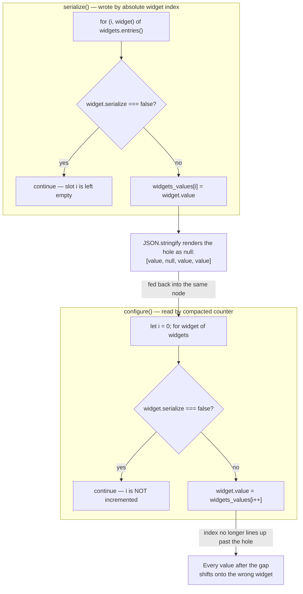

# Widget Serialization: `widget.serialize` vs `widget.options.serialize`

Two properties named `serialize` exist at different levels of a widget object. They control different serialization layers and are checked by completely different code paths.

**`widget.serialize`** — Controls **workflow persistence**. Checked by `LGraphNode.serialize()` and `configure()` when reading/writing `widgets_values` in the workflow JSON. When `false`, the widget is skipped in both serialization and deserialization. Used for UI-only widgets (image previews, progress text, audio players). Typed as `IBaseWidget.serialize` in `src/lib/litegraph/src/types/widgets.ts`.

**`widget.options.serialize`** — Controls **prompt/API serialization**. Checked by `executionUtil.ts` when building the API payload sent to the backend. When `false`, the widget is excluded from prompt inputs. Used for client-side-only controls (`control_after_generate`, combo filter lists) that the server doesn't need. Typed as `IWidgetOptions.serialize` in `src/lib/litegraph/src/types/widgets.ts`.

These correspond to the two data formats in `ComfyMetadata` embedded in output files (PNG, GLTF, WebM, AVIF, etc.): `widget.serialize` → `ComfyMetadataTags.WORKFLOW`, `widget.options.serialize` → `ComfyMetadataTags.PROMPT`.

## Permutation table

| `widget.serialize` | `widget.options.serialize` | In workflow? | In prompt? | Examples                                                             |
| ------------------ | -------------------------- | ------------ | ---------- | -------------------------------------------------------------------- |
| ✅ default         | ✅ default                 | Yes          | Yes        | seed, cfg, sampler_name                                              |
| ✅ default         | ❌ false                   | Yes          | No         | control_after_generate, combo filter list                            |
| ❌ false           | ✅ default                 | No           | Yes        | No current usage (would be a transient value computed at queue time) |
| ❌ false           | ❌ false                   | No           | No         | Image/video previews, audio players, progress text                   |

## Gotchas

- `addWidget('combo', name, value, cb, { serialize: false })` puts `serialize` into `widget.options`, **not** onto `widget` directly. These are different properties consumed by different systems.
- `LGraphNode.serialize()` checks `widget.serialize === false` (line 967). It does **not** check `widget.options.serialize`. A widget with `options.serialize = false` is still included in `widgets_values`.
- `LGraphNode.serialize()` only writes `widgets_values` if `this.widgets` is truthy. Nodes that create widgets dynamically (like `PrimitiveNode`) will have no `widgets_values` in serialized output if serialized before widget creation — even if `this.widgets_values` exists on the instance from a prior `configure()` call.
- `widget.options.serialize` is typed as `IWidgetOptions.serialize` — both properties share the name `serialize` but live at different levels of the widget object.

## PrimitiveNode and copy/paste

`PrimitiveNode` creates widgets dynamically on connection — it starts as an empty polymorphic node and morphs to match its target widget in `_onFirstConnection()`. This interacts badly with the copy/paste pipeline.

### The clone→serialize gap

`LGraphCanvas._serializeItems()` copies nodes via `item.clone()?.serialize()` (line 3911). For PrimitiveNode this fails:

1. `clone()` calls `this.serialize()` on the **original** node (which has widgets, so `widgets_values` is captured correctly).
2. `clone()` creates a **fresh** PrimitiveNode via `LiteGraph.createNode()` and calls `configure(data)` on it — this stores `widgets_values` on the instance.
3. But the fresh PrimitiveNode has no `this.widgets` (widgets are created only on connection), so when `serialize()` is called on the clone, `LGraphNode.serialize()` skips the `widgets_values` block entirely (line 964: `if (widgets && this.serialize_widgets)`).

Result: `widgets_values` is silently dropped from the clipboard data.

### Why seed survives but control_after_generate doesn't

When the pasted PrimitiveNode reconnects to the pasted target node, `_createWidget()` copies `theirWidget.value` from the target (line 254). This restores the **primary** widget value (e.g., `seed`).

But `control_after_generate` is a **secondary** widget created by `addValueControlWidgets()`, which reads its initial value from `this.widgets_values?.[1]` (line 263). That value was lost during clone→serialize, so it falls back to `'fixed'` (line 265).

See [ADR-0006](adr/0006-primitive-node-copy-paste-lifecycle.md) for proposed fixes and design tradeoffs.

## Write/read asymmetry: sparse `widgets_values` on round-trip

`serialize()` and `configure()` disagreed about how a `serialize: false` widget
affects the positions of the widgets around it:

- **`serialize()`** wrote `widgets_values` at each widget's **absolute**
  position in `this.widgets`, skipping `serialize: false` entries without
  reusing their slot. `JSON.stringify` renders the resulting array holes as
  `null`.
- **`configure()`** read `widgets_values` with a **compacted** counter that
  only advances for serializable widgets.

A node with a `serialize: false` widget ahead of a serializable one could not
round-trip its own `serialize()` output back through `configure()` — every
value after the gap landed one slot early.

### Where a `serialize: false` widget ends up ahead of another widget

Click-only usage on stock nodes rarely triggers this — `serialize: false`
widgets (image/audio previews, upload buttons) are normally the last widget
added. The gap becomes reachable through:

- **Subgraph promoted widgets** — `promotionUtils.ts` creates promoted
  preview widgets with `serialize: false`, and promotion order is
  user-controlled, so the hole can land mid-list through ordinary use.
- **Any external/programmatic graph builder** that constructs
  `node.widgets` or `widgets_values` positionally without replicating the
  exact skip-then-compact rule above — for example a converter that talks to
  this codebase's `serialize()`/`configure()` pair from outside the UI
  (agent/automation tooling that edits a graph and resubmits it). Because
  the write and read conventions disagreed, there was no single "correct"
  positional convention such a caller could implement.

### History

- [#12162](https://github.com/Comfy-Org/ComfyUI_frontend/pull/12162) first
  proposed compacting the write side to match the read side, but went stale
  before merging.
- A parallel `feature/ecs-migration` refactor chain
  (`#13963 → #14108 → #14110 → #14128 → #14133`) landed in the same period.
  It restructures node **geometry** (position/size) into dedicated stores
  under [ADR 0008](adr/0008-entity-component-system.md) and does not touch
  `widgets_values`, `serialize()`, or `configure()` — this bug and that
  refactor are in unrelated parts of the file.
- [#14239](https://github.com/Comfy-Org/ComfyUI_frontend/issues/14239)
  independently re-discovered and documented the same asymmetry.
- The fix: `serialize()` now writes a compacted array (matching
  `configure()`'s existing read), and `configure()` additionally recognizes
  the previous, longer, absolute-index shape (by comparing
  `widgets_values.length` against the number of serializable widgets) so
  workflows already saved with holes still load correctly.

## Code references

- `widget.serialize` checked: `src/lib/litegraph/src/LGraphNode.ts` serialize() and configure()
- `widget.options.serialize` checked: `src/utils/executionUtil.ts`
- `widget.options.serialize` set: `src/scripts/widgets.ts` addValueControlWidgets()
- `widget.serialize` set: `src/composables/node/useNodeImage.ts`, `src/extensions/core/previewAny.ts`, etc.
- Metadata types: `src/types/metadataTypes.ts`
- PrimitiveNode: `src/extensions/core/widgetInputs.ts`
- Copy/paste serialization: `src/lib/litegraph/src/LGraphCanvas.ts` `_serializeItems()`
- Clone: `src/lib/litegraph/src/LGraphNode.ts` `clone()`
