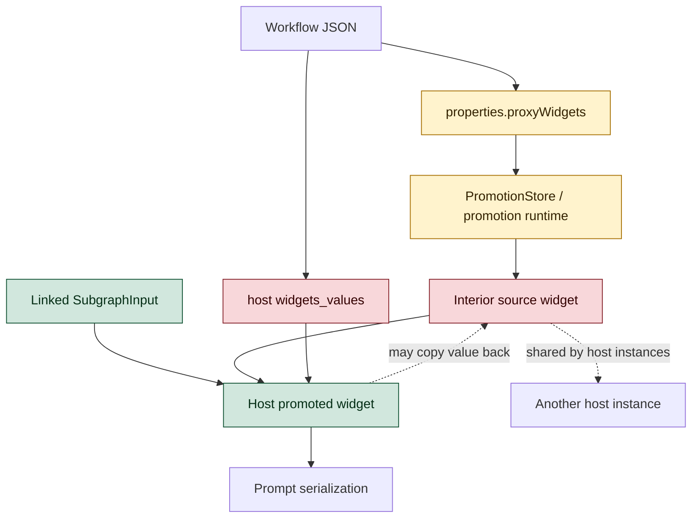
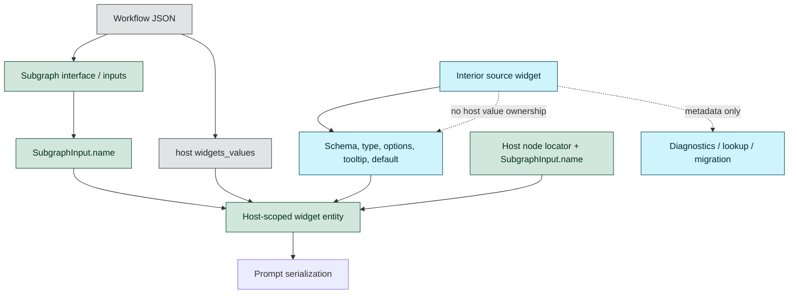
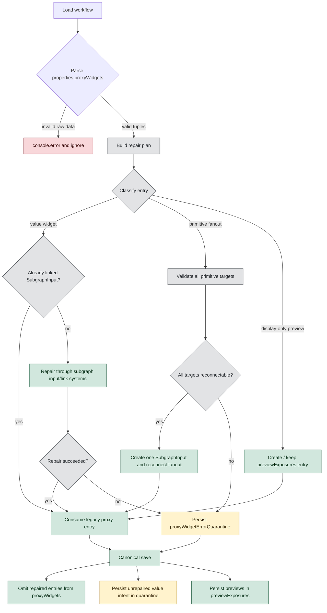
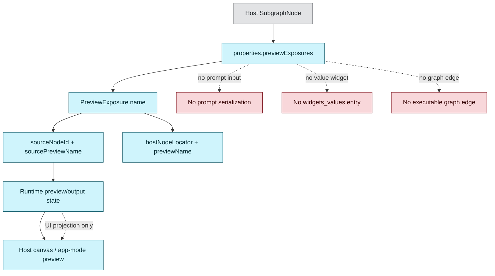
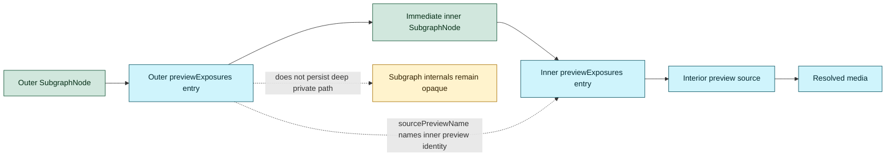
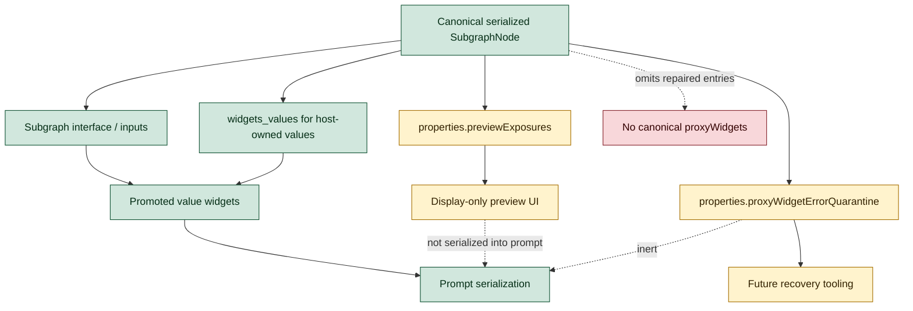

# Appendix: Before and after flows

This appendix visualizes the ownership and migration flows described in
[ADR 0009](../0009-subgraph-promoted-widgets-use-linked-inputs.md).

## Before: proxy widgets and linked inputs overlap

Historically, promoted widgets could be represented both as serialized
`properties.proxyWidgets` entries and as linked subgraph inputs. Runtime value
reads could collapse back to the interior source widget, while host
`widgets_values` could also carry an exterior value for the same promoted UI.

Key problems in the old flow:

- `properties.proxyWidgets` and linked `SubgraphInput` widgets could describe
  the same promotion.
- Interior source widgets supplied both schema metadata and, in some flows,
  persisted host values.
- Multiple host instances of the same subgraph could stomp one another through
  the shared interior widget value.
- Display-only previews were mixed into widget-promotion language even though
  they do not own values or feed prompt serialization.

## After: linked inputs are the promoted-widget boundary

Promoted value widgets are now represented only as standard linked
`SubgraphInput` widgets. The source widget remains the schema/default provider,
but the host `SubgraphNode` owns the promoted value.

Canonical ownership after the migration:

- UI/value identity is host-scoped: host node locator plus
  `SubgraphInput.name`.
- `SubgraphInput.name` is stable identity; labels and localized names are
  display-only.
- Host values win during repair, persistence, and prompt serialization.
- Source widgets provide metadata and defaults only.
- Canonical saves omit repaired `properties.proxyWidgets` entries.

## Legacy load migration

Loading a workflow with legacy `proxyWidgets` performs an idempotent repair. The
repair builds a plan before mutating graph state, then re-resolves against the
current graph when node IDs and links are stable.

## Preview exposures are separate from value widgets

Display-only previews, such as `$$canvas-image-preview`, are not promoted
widgets. They have host-scoped serialized identity, but they do not create
prompt inputs, do not create `widgets_values`, and do not own user values.

For nested subgraphs, preview exposures chain across immediate host boundaries
instead of persisting flattened deep paths.

## Serialization summary

