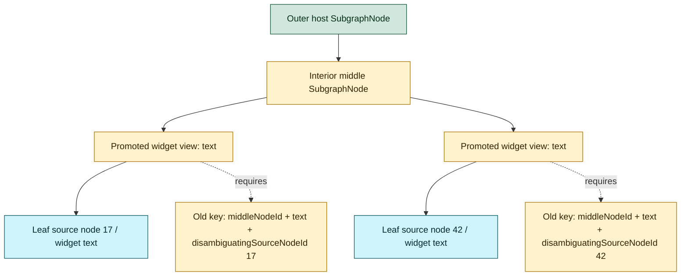
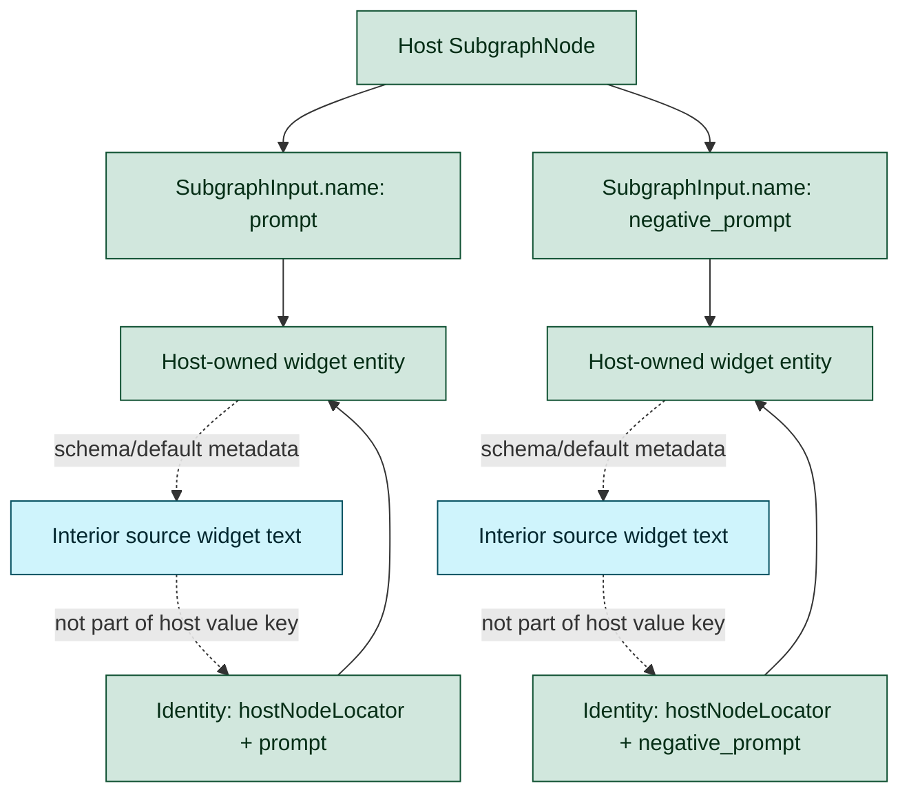
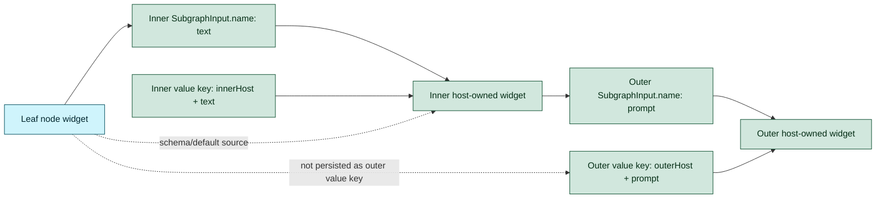

# Appendix: Removing `disambiguatingSourceNodeId`

This appendix explains where the existing promotion system needs
`disambiguatingSourceNodeId`, why that need appears, and how the canonical form
chosen by [ADR 0009](../0009-subgraph-promoted-widgets-use-linked-inputs.md)
removes the pattern from promoted-widget identity.

## Why the disambiguator exists

The legacy promotion model identifies a promoted widget by source location:

```ts
type PromotedWidgetSource = {
  sourceNodeId: string
  sourceWidgetName: string
  disambiguatingSourceNodeId?: string
}
```

`sourceNodeId` is the immediate interior node visible from the host subgraph.
That is not always the original widget owner. When promotions pass through
nested subgraphs, two promoted widgets can have the same immediate
`sourceNodeId` and `sourceWidgetName` while pointing at different leaf widgets.
`disambiguatingSourceNodeId` carries the deepest source node ID so the runtime
can choose the right promoted view.



The disambiguator is therefore not a domain concept. It is compensating for an
identity model that asks host UI state to identify private nested internals.

## Existing places that need it

| Area | Current use of `disambiguatingSourceNodeId` | Ambiguity being patched |
| --- | --- | --- |
| Promotion source types | `PromotedWidgetSource` and `PromotedWidgetView` carry the optional field. | Source identity needs more than immediate node ID plus widget name for nested promoted views. |
| Concrete widget resolution | `findWidgetByIdentity(...)` matches promoted views by `(disambiguatingSourceNodeId ?? sourceNodeId)` when a source node ID is supplied. | Multiple promoted views under the same intermediate node can share a widget name. |
| Legacy proxy normalization | Prefixed legacy names such as `123:widget_name` are converted into structured source identity and tested with candidate disambiguators. | Old serialized names encode leaf identity inside the widget name string. |
| Promotion store keys | `makePromotionEntryKey(...)`, `isPromoted(...)`, and `demote(...)` include the field in equality. | Store-level uniqueness would collapse distinct nested promotions without the leaf ID. |
| Linked promotion propagation | `SubgraphNode._resolveLinkedPromotionBySubgraphInput(...)` preserves the leaf ID when a linked input targets an inner subgraph promoted view. | The outer host otherwise sees only the immediate inner `SubgraphNode` and the promoted widget name. |
| Subgraph editor UI | The editor uses the field when resolving active widgets and when writing reordered/toggled promotions back to the store. | UI list operations must not merge same-name promoted views from different leaves. |

## New promoted-widget identity

ADR 0009 moves promoted value identity to the host boundary:

```ts
type PromotedWidgetUiIdentity = {
  hostNodeLocator: string
  subgraphInputName: string
}
```

The canonical widget is owned by a `SubgraphInput` on the host
`SubgraphNode`. The host widget no longer needs to identify the deepest source
node to preserve value identity. The source widget is consulted for schema,
defaults, diagnostics, and migration, but it is not the value owner.



This is the same rule the subgraph interface already uses: `name` is stable
identity, and `label` / `localized_name` are display-only.

## How the new form removes each need

| Previous disambiguation site | New canonical replacement |
| --- | --- |
| `PromotedWidgetSource.disambiguatingSourceNodeId` | Host value identity is `hostNodeLocator + SubgraphInput.name`; source locator fields become migration/diagnostic metadata only. |
| `PromotedWidgetView.disambiguatingSourceNodeId` | Host-scoped widget entities are derived from subgraph inputs, not from promoted views chained through nested source widgets. |
| `findWidgetByIdentity(...)` leaf matching | Runtime value lookup starts from the host input identity; source traversal is metadata resolution, not value identity resolution. |
| Legacy prefixed widget-name normalization | Load migration consumes legacy source-shaped entries and writes standard subgraph input state or quarantine metadata. |
| PromotionStore source-key equality | `PromotionStore` becomes a temporary derived index; canonical consumers query subgraph inputs directly. |
| Linked promotion propagation across nested hosts | Nested value composition is represented boundary-by-boundary by linked subgraph inputs with stable names. |
| Subgraph editor active widget matching | Editor state can operate on host boundary entries instead of matching leaf source widgets through same-name promoted views. |

## Boundary-by-boundary nested flow

The new form avoids flattened deep source paths. Each host boundary exposes its
own named input, and the next outer host links to that immediate boundary
contract.



Because each layer has its own stable `SubgraphInput.name`, two same-name leaf
widgets no longer require a persisted leaf-node disambiguator at the outer host.
If the user exposes both, the collision is resolved when the host inputs are
created by assigning distinct input names with the existing unique-name
behavior.
