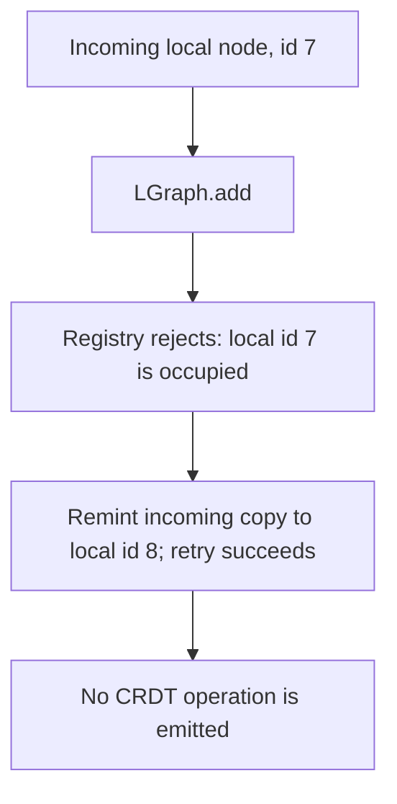
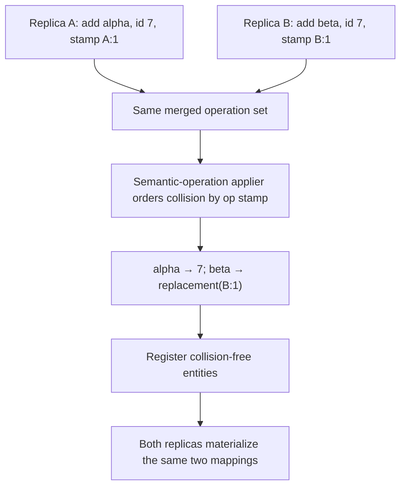

# 18. Node-ID Reminting at the Merge Boundary

Date: 2026-08-25

## Status

Proposed

This ADR records program decision D-gl-A6. ADR-0003's merge-boundary
reconciliation amendment (2026-08-23) already carries the direction. This ADR
separates the current local-import behavior from the future CRDT behavior so
their different materialization paths and responsibilities are explicit.
Formal sign-off remains pending.

## Context

### The id space is the problem, not the CRDT

ComfyUI mints node ids (`NodeId`) from a graph-local numeric counter. The
internal type is a branded string, while serialized workflows accept numbers
or strings. Neither representation is **actor-scoped**: nothing in the id
encodes which client or historical workflow file minted it. In a single-client
world this is harmless because the graph that mints an id is its only
authority.

The CRDT-based collaboration direction (ADR-0003) and the ECS store migration
(ADR-0008) break that assumption. Two replicas can each independently mint
node id `7` for two **different** entities. When one replica's content reaches
the other through a future semantic-operation applier, both entities would
claim the same key in every id-keyed registry. The same collision already
occurs locally when workflow import, paste, subgraph materialization, or
another merge-shaped operation inserts externally minted content.

### What a collision means

ADR-0008 defines two collision contracts:

- **Identity keys reject.** A collision on an identity key is two different
  entities claiming one name. They must never be merged; merging silently
  destroys one entity's history.
- **Structural keys resolve.** The same derived key and type identify the same
  logical slot, so the registry carries the existing value forward. For
  widgets, the key is `graphId:nodeId:name`.

A duplicate `NodeId` is an identity-key collision. The question this ADR
answers is _where_ the rejection-and-recovery happens.

## Decision

**CRDT duplicate-id reconciliation lives at the merge boundary. Registries
keep a strict no-collision invariant.**

Concretely:

1. Identity-keyed registries (`nodeDataStore`, `linkStore`, `rerouteStore`, and
   any future minted-id registry) reject a second _different_ object claiming
   a registered id; they never silently remap it. Idempotent re-registration
   may return the incumbent. Structural-keyed registries such as
   `widgetValueStore` keep their separate resolve-and-reuse contract.
2. The **current local-content boundary** is `LGraph.add` →
   `attachNodeToStores`. Workflow load, paste, and subgraph materialization
   reach that path. Its `nodeShellLifecycle` loop attempts registration; after
   the registry rejects a collision, the loop mints a fresh id for the
   incoming local copy and retries. The warning required by D-gl-A2 — naming
   the old id, replacement id, and root graph id — is pending in #15720;
   current `main` still remints silently. This local adapter does not receive
   remote semantic operations and does not emit a CRDT operation.
3. The **future CRDT boundary** is the semantic-operation applier described by
   ADR-0003. Nodes, widgets, links, and reroutes are not yet CRDT-replicated.
   When they are, the applier must reconcile concurrent identity collisions
   deterministically before calling the registration layer. The current
   `nodeShellLifecycle` loop is not that applier.
4. Future CRDT replacements must come from a globally collision-free space so
   every replica derives the same mapping and reconciliation terminates. The
   local path instead retries graph-local ids until registration succeeds.

### Local reminting and future CRDT convergence

The two materialization paths do not share propagation semantics. Today's
local adapter remints only the copy being inserted into one graph:

A future semantic-operation applier must instead derive one canonical mapping
from the same merged operation set on every replica. ADR-0003 requires
op-stamp ordering before registration. The concrete replacement encoding
belongs to that applier, but it must be deterministic and collision-free; for
example, it can retain the raw id for the winning stamp and derive an
actor-scoped replacement from the losing stamp:

This model has no replica-local echo-back step. Both original entities survive,
the same operation keeps id `7` everywhere, and the same losing operation gets
the same replacement everywhere. No raw duplicate reaches an in-memory
registry.

### Relationship to CRDT creator-minting

CRDT practice says the creator mints ids, actor-scoped (actor id + counter),
making collisions impossible by construction. Merge-boundary reminting does
not violate that principle — it **compensates for an id space that predates
it**. For local imports, `LGraph.add` creates a local copy and may assign that
copy a fresh local id; this mutation is not replicated. For future semantic
operations, the creator's immutable operation stamp gives every replica the
same input for choosing the incumbent and deriving the replacement.

**Future work (recorded, not scheduled):** make node ids actor-scoped at
creation. Once that lands, merge-boundary reminting decays to dead code for
new content and is retained only as the import adapter for legacy serialized
workflows. This is the durable fix; reminting is the bridge.

### Revisit trigger

If a Yjs document ever keys a **shared** map by raw `NodeId` across clients,
this decision stops being sufficient: ids would need to be globally unique at
creation time, which forces the actor-scoped refactor immediately rather than
eventually.

## Alternatives considered

### Store-side remap (rejected)

Let stores absorb collisions by remapping ids internally on registration.

- Violates D-gl-A2 directly: the remap is exactly the silent remint that
  decision forbids.
- Smears merge logic across every store instead of one boundary; every
  future store must reimplement it.
- Hides real data-model bugs behind auto-repair — a duplicate id caused by a
  lifecycle bug would be silently "fixed" instead of surfaced.
- Breaks the identity-keys-reject contract exercised by the pending #15720
  suite.

### Hybrid: registries tolerate duplicates temporarily (rejected)

Tag colliding entries with an epoch/namespace and reconcile lazily.

- Ids stop being unique within a replica window, which poisons every
  id-keyed map, cache, and lookup in the codebase for the duration.
- Largest implementation surface of the three options with the least
  predictable failure modes.

## Consequences

- Registries stay simple and their no-collision invariant is covered by the
  pending #15720 suite. Local collision handling stays in `LGraph.add`; future
  replicated collision handling stays in one semantic-operation applier.
- Every local remint must be observable so telemetry can count real-world
  collision frequency and inform the actor-scoped refactor's priority. That
  warning is pending in #15720; current `main` does not yet emit it.
- `LGraph.configure` records each unambiguous requested→final node-id remint
  and repoints link endpoints added by that payload before nodes configure
  their connections (#15882). If multiple payload nodes request the same id,
  there is no unambiguous mapping and the first claimant keeps the links.
  Reroutes reference link ids, and groups do not store node endpoints, so
  neither requires node-id remapping.
- Imports/pastes of colliding content mutate the incoming copy's id. Any
  external system that memorized the old id (e.g. a URL fragment or a test
  fixture) will miss; this is inherent to any rejection-based scheme and is
  the cost of never merging two distinct entities.

## References

- ADR-0003 — Centralized Layout Management with CRDT (merge-boundary
  reconciliation amendment, 2026-08-23). Cite ADR-0003 externally; this ADR
  is the derivation record.
- ADR-0008 — Entity Component System (identity and structural collision
  contracts).
- ADR-0017 — ID-Based Slot Records Own Slot State (the same
  identity-vs-structural key taxonomy, applied to slots).
- #15720 — pending collision-contract invariant test suite (registry rejection
  and remint warning).
- #15761 — pending collision-contract documentation fold.
- #15882 — serialized-reference remap after a local node-id remint (merged).
- Program decisions D-gl-A2 (no silent remints), D-gl-A4 (identity keys
  reject / structural keys resolve), D-gl-A6 (this decision).

## Glossary

- **Merge boundary** — any code path where content minted outside the local
  authority is materialized: today, local workflow import, paste, and subgraph
  instantiation reach `LGraph.add`; in the future, replicated semantic
  operations will reach a separate CRDT applier. The current node-shell path
  does not apply CRDT node operations.
- **Remint** — assigning a fresh id to an _incoming copy_ of an entity whose
  claimed id is already registered locally. Never applied to the incumbent.
- **Identity key** — a key whose collision means two different entities claim
  one name (e.g. `NodeId`). Contract: reject.
- **Structural key** — a key computed from an entity's context rather than
  minted. A collision means "same logical slot." `WidgetId`, for example, is
  derived from `graphId:nodeId:name`, with widget type used to choose the
  resolution. Contract: resolve.
- **Actor-scoped id** — an id embedding the minting client's identity
  (actor id + counter), collision-free by construction; the eventual
  replacement for graph-local node ids.
- **Operation stamp** — immutable actor and sequence metadata used to order
  concurrent semantic operations deterministically on every replica.
- **Registry no-collision invariant** — a store never holds two different
  live objects under one id; second different claimant is rejected.
