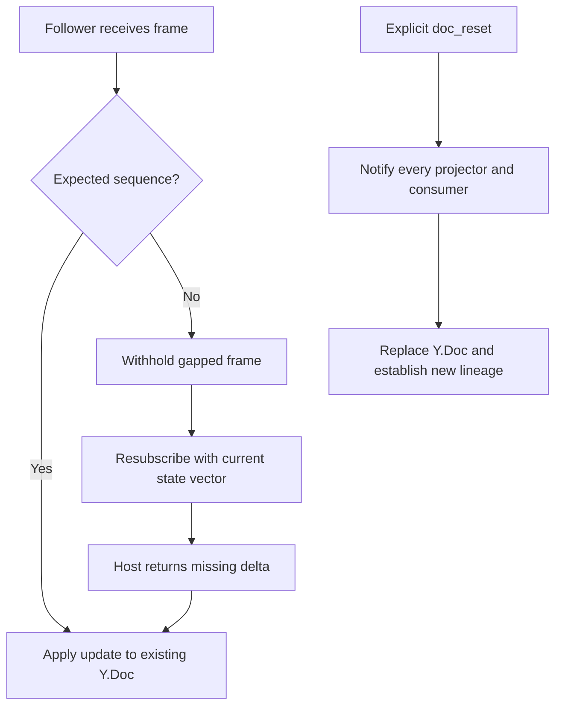

# 24. Sequence-Gap Recovery Uses State-Vector Replay

Date: 2026-08-28

## Status

Proposed

## Context

The In-App Agent follower receives host-authored Yjs updates and projects the shared semantic
document into frontend state. Transport frames also carry a sequence number so the follower can
detect a missed frame. A sequence gap or reconnect does not imply that the document's lineage has
changed: the follower's current Y.Doc remains a valid partial replica.

Yjs state vectors describe the updates a replica already contains. The follower can therefore
resubscribe with its current state vector and let the host return only the missing state-vector
delta. Destroying and replacing the Y.Doc on an ordinary gap would discard that recovery property,
cause visible canvas churn, and strand projectors or other consumers that observe the existing doc
instance.

This decision extends the follower boundary described by the In-App Agent CRDT architecture: raw
Yjs updates remain host to follower only, while recovery keeps and advances the same follower
document.

## Decision

On an ordinary sequence gap or reconnect, the follower keeps its existing Y.Doc and resubscribes
with that document's state vector. The host computes and returns the missing delta. The follower
withholds the out-of-sequence frame until recovery restores a continuous stream; it does not wipe
the canvas or replace the document.

Destroying or replacing the follower Y.Doc is reserved exclusively for an explicit `doc_reset`
frame representing a genuine document-lineage break. Before replacement, the reset must be
dispatched to every projector and consumer that observes the old document instance so each can
drop stale references and rebuild against the new lineage.

Implementations and reviews must treat Y.Doc replacement outside the `doc_reset` path as a
correctness defect. The recovery path must also distinguish the sequence used for transport-gap
detection from the Yjs state vector used to calculate document content that is actually missing.

## Consequences

### Positive

- Reconnect and packet-loss recovery transfer only missing CRDT state and preserve the live canvas.
- Projectors, subscriptions, and reactive bindings keep a stable Y.Doc identity during ordinary
  recovery.
- Recovery remains compatible with offline and peer-style replication because it uses native Yjs
  reconciliation rather than a server-only full-document replacement primitive.
- `doc_reset` becomes an explicit, auditable lineage transition instead of an implicit side effect
  of transport recovery.

### Negative

- The host must retain enough document state to encode a delta against a follower-provided state
  vector.
- The follower needs a small recovery state machine to withhold out-of-sequence frames and prevent
  overlapping resubscriptions.
- Every projector and consumer must implement explicit `doc_reset` handling before document
  replacement can be safe.

## Alternatives considered

### Wipe and refetch on a gap (rejected)

This is operationally simple, but it throws away the CRDT's incremental recovery capability,
causes visible canvas churn, and invalidates consumers of the existing Y.Doc without an explicit
lineage event.

### Buffer all frames indefinitely (rejected)

An unbounded buffer creates a memory risk and cannot recover frames that were lost before they
reached the client.

## Notes

This is the governed frontend copy of the In-App Agent program's workspace ADR-011,
"Seq-gap recovery is state-vector delta replay — never wipe or replace the follower doc." It also
codifies KEEP-ALIVE invariant #13 and FORECLOSE invariant #11 from that program. The frontend-local
number is ADR-0024 because ADR-0011 already governs derived credential lifecycle and ADR-0020
through ADR-0023 are also assigned in this repository.

## Glossary

- **Sequence gap**: A discontinuity in transport frame numbers indicating that one or more frames
  may have been missed.
- **State vector**: Compact Yjs metadata describing the document updates a replica already has.
- **State-vector delta**: The Yjs update containing document state absent from the requesting
  replica.
- **Follower**: A frontend replica that receives host-authored raw Yjs updates and does not write
  directly to the shared semantic document.
- **Projector**: A consumer that translates shared document state into another frontend model or
  renderable representation.
- **Document lineage**: The identity and history of a shared document. A new lineage cannot be
  reconciled as an ordinary continuation of the old one.
- **`doc_reset`**: An explicit protocol frame declaring a document-lineage break and authorizing
  replacement of the follower Y.Doc after consumers are notified.
- **KEEP-ALIVE #13 / FORECLOSE #11**: Cross-repository guardrails requiring state-vector replay for
  ordinary recovery and prohibiting silent follower-document replacement.
