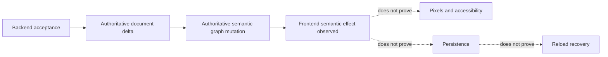
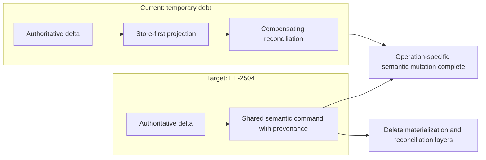
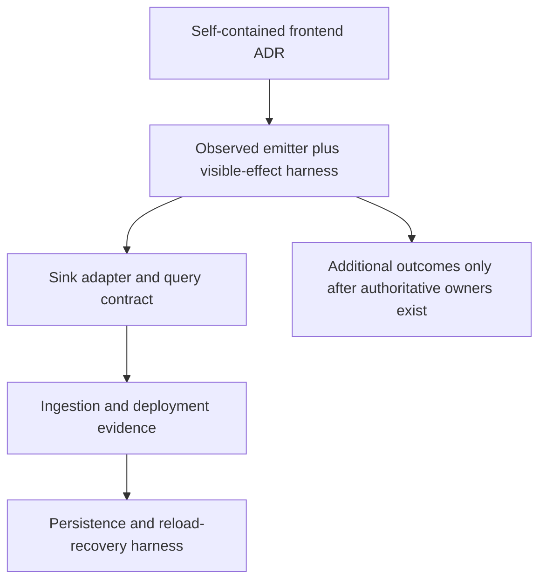

# ADR-AGENT-OBSERVABILITY-0034: Frontend Journey Effect Contract

Date: 2026-09-17

## Status

Proposed

## Context

The existing `app:agent_workflow_applied` event describes opening or switching an editor tab. It
does not prove that an authoritative semantic operation reached the frontend graph. Backend
acceptance, frontend semantic effect, pixels, persistence, and reload recovery are different
boundaries and need separate evidence.

The program's ratified ADR-034 requires a vendor-neutral, privacy-safe lifecycle contract. It also
preserves the distinction between transport, merge authority, and persistence. Telemetry must not
change any of those owners or treat a raw Yjs update as an observability primitive.

## Decision

Define the frontend-owned observation seam before defining an executable event. The first emitter
will expose only `frontend_semantic_effect.observed`: an authoritative document delta was accepted
and the corresponding authoritative semantic graph mutation completed. It does not attest pixels,
accessibility state, persistence, or reload.

| Fact                     | Owner                        | Version-one success signal                      |
| ------------------------ | ---------------------------- | ----------------------------------------------- |
| Backend acceptance       | Merge authority              | Outside this frontend contract                  |
| Frontend semantic effect | Frontend follower            | Authoritative semantic graph mutation completes |
| Pixels and accessibility | Renderer / black-box harness | Outside this contract                           |
| Persistence              | Persistence owner            | Outside this contract                           |
| Reload recovery          | Black-box harness            | Outside this contract                           |

The event contract is implementation-independent, but the implementations are not equally
acceptable. The current follower uses a store-first projection followed by live-graph
reconciliation. This is known temporary debt: it separates canonical store state from live graph
state and requires compensating materialization and reconciliation.

[FE-2504](https://linear.app/comfyorg/issue/FE-2504/agentcrdt-remove-store-first-remote-apply-and-every-reconciliation)
tracks migration to the unified frontend command path used by human and extension mutations. Until
that migration lands, an emitter may observe the operation-specific semantic effect on the current
path, but it must not make reconciliation, materialization, or store callbacks part of the event
meaning or add new dependencies on them.

The migration is complete when remote Agent mutations use the shared semantic command APIs with
provenance and the compensating store-first materialization and reconciliation layers are deleted.
That replacement does not change the event contract.

Host-side `applied`, `skipped`, and `failed` results retain their generated `DocOpsResultData`
meaning. Follower-side inactive-target and projection results are not remapped onto those names.
`superseded`, `reverted`, and any other terminal outcomes remain undefined until an authoritative
owner, source field, precedence rule, and terminality rule exist.

The emitter and its schema land together in a later slice, beside the semantic mutation seam and its
mandatory black-box Agent harness case. That slice must define its fields and validation against
the authoritative producer contracts and the sink's concrete query needs. The executable schema
must be versioned, and readers must reject unsupported versions. Sink adapters, added separately,
own retention, access controls, and vendor mappings.

The future serializer must allowlist named fields and reject content-shaped correlation values.
Operation correlation must use an authoritative upstream identifier type or factory that makes
content unrepresentable; if no such contract exists when the emitter lands, the emitter's
serialization boundary must pseudonymize the values before any sink receives them. Prompts,
responses, tool inputs or results, workflow JSON, Yjs bytes, node and widget content, filenames,
URLs, emails, credentials, raw errors, and arbitrary context are forbidden in every correlation
field, including operation identifiers. Stable identifiers may be event attributes but never
metric tags or event-name components.

Alternatives rejected:

- Reusing `app:agent_workflow_applied` would silently change an existing intent/tab contract.
- Emitting directly from the CRDT follower would combine contract review with product behavior and
  sink delivery before the schema is accepted.
- Treating the semantic receipt as visible or durable success would collapse distinct proof planes.

## Consequences

### Positive

- The first emitter has a reviewable frontend success seam and privacy requirements.
- Host results and future outcomes cannot be counted as frontend-observed semantic effects.
- Executable vocabulary is not committed before its owner and harness exist.

### Negative

- This ADR-only change proves no emission, ingestion, queryability, deployment, notification, or
  recovery.
- The emitter PR must define the legacy frame case where operation IDs are unavailable and include
  the mandatory black-box Agent harness case for visible behavior. Persistence and reload recovery
  remain separate later proof planes and require their own harness evidence.
- New observability work must not add reconciliation variants or depend on reconciliation-specific
  completion signals. Any temporary bridge must name its deletion owner and exit criterion.

## Delivery sequence

## Notes

The program's ADR-034 establishes the proof-plane separation summarized here; this ADR is
self-contained and does not require that external record to interpret its frontend decision. This
frontend ADR remains proposed until accepted through the repository's normal review process.
