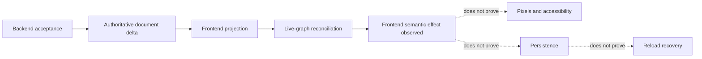

# ADR-AGENT-OBSERVABILITY-0034: Frontend Journey Effect Contract

Date: 2026-09-17

## Status

Proposed

## Context

The existing `app:agent_workflow_applied` event describes opening or switching an editor tab. It
does not prove that an authoritative semantic operation reached the follower projection. Backend
acceptance, frontend semantic effect, pixels, persistence, and reload recovery are different
boundaries and need separate evidence.

The program's ratified ADR-034 requires a vendor-neutral, privacy-safe lifecycle contract. It also
preserves the distinction between transport, merge authority, and persistence. Telemetry must not
change any of those owners or treat a raw Yjs update as an observability primitive.

## Decision

Define a versioned `AgentJourneyEvent` contract with an allowlist serializer and a stable event
name. Version 1 exposes only the frontend-owned `frontend_semantic_effect.observed` outcome. It
means an authoritative document delta was accepted into the follower projection and live-graph
reconciliation returned. It does not attest pixels, accessibility state, persistence, or reload.

| Fact                     | Owner                        | Version-one success signal                               |
| ------------------------ | ---------------------------- | -------------------------------------------------------- |
| Backend acceptance       | Merge authority              | Outside this frontend contract                           |
| Frontend semantic effect | Frontend follower            | Projection commits and live-graph reconciliation returns |
| Pixels and accessibility | Renderer / black-box harness | Outside this contract                                    |
| Persistence              | Persistence owner            | Outside this contract                                    |
| Reload recovery          | Black-box harness            | Outside this contract                                    |

Host-side `applied`, `skipped`, and `failed` results retain their generated `DocOpsResultData`
meaning. Follower-side inactive-target and projection results are not remapped onto those names.
`superseded`, `reverted`, and any other terminal outcomes remain undefined until an authoritative
owner, source field, precedence rule, and terminality rule exist.

Correlated effect events require a non-empty, deduplicated list of creator-minted operation IDs and
an opaque target reference. Optional session, thread, turn, mutation, and run identifiers are copied
only when upstream provides them. Readers reject unsupported schema versions. Sink adapters, added
separately, own pseudonymization, retention, access controls, and vendor mappings.

The contract forbids prompts, responses, tool inputs or results, workflow JSON, Yjs bytes, node and
widget content, filenames, URLs, emails, credentials, raw errors, and arbitrary context. Stable
identifiers may be event attributes but never metric tags or event-name components.

Alternatives rejected:

- Reusing `app:agent_workflow_applied` would silently change an existing intent/tab contract.
- Emitting directly from the CRDT follower would combine contract review with product behavior and
  sink delivery before the schema is accepted.
- Treating the semantic receipt as visible or durable success would collapse distinct proof planes.

## Consequences

### Positive

- Later emitters and adapters share one executable, privacy-bounded contract.
- Host results and future outcomes cannot be counted as frontend-observed semantic effects.
- Unit golden vectors can detect schema drift before provider or production work begins.

### Negative

- This contract-only change proves source and tests, not emission, ingestion, queryability,
  deployment, notification, or recovery.
- A later emitter PR must define the legacy frame case where operation IDs are unavailable and must
  include the mandatory black-box Agent harness case for visible and durable behavior.

## Notes

The governing program decision is ADR-034 in `christian-byrne/in-app-agent-program` PR 189. This
frontend ADR remains proposed until accepted through the repository's normal review process.
