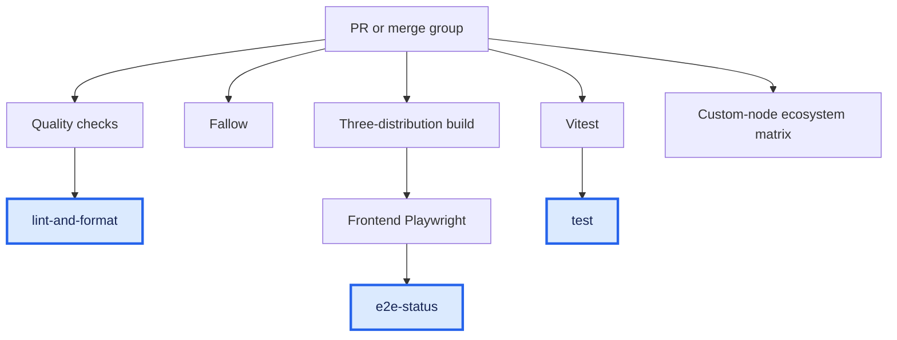
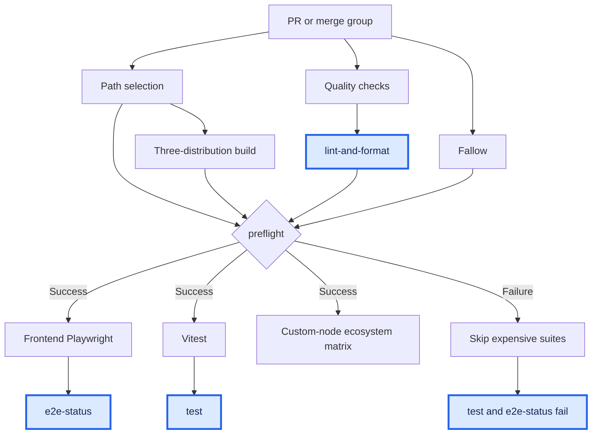

# ADR-CI-PREREQUISITES-0038: Gate expensive candidate tests

Date: 2026-09-25

## Status

Proposed

## Context

PR workflows start independently. A lint or Fallow failure can leave more than
300 runner-minutes of frontend tests running on a revision with failed checks.
The active main ruleset requires `lint-and-format`, `test`, `e2e-status`, and
`website-e2e`. Moving jobs into reusable workflows changes their check names.
Fallow is not in that required-context list; this prototype makes it an
indirect merge prerequisite through `test` and `e2e-status`.

The September 25 sample covers the five latest commits of 25 recently updated
PRs: 82 distinct source SHAs, 68 with measurable completed runs. Run creation
dates span September 15–25 UTC. The script selects the newest PR run per
workflow and source SHA, then its latest attempt. It counts cancelled jobs
with elapsed time, excludes skipped jobs, and records missing/in-progress runs.
This is a convenience sample, not a repository-wide billing audit.

| Workflow                      | Runs | Median wall minutes | p90 wall minutes | Median runner-minutes per run |
| ----------------------------- | ---: | ------------------: | ---------------: | ----------------------------: |
| Lint Format                   |   49 |                4.82 |            11.45 |                          7.97 |
| Fallow                        |   64 |                2.45 |             6.78 |                          1.93 |
| E2E, including build          |   45 |               23.97 |            36.82 |                        200.45 |
| Unit                          |   47 |               25.92 |            33.73 |                         21.87 |
| Custom Nodes Ecosystem Matrix |   46 |               14.48 |            31.45 |                         88.75 |

Runner-minutes sum the measured worker jobs, excluding core report/aggregate
jobs. Wall time includes queueing, dependencies, and reports. The existing
three-distribution E2E build takes a median 3.20 runner-minutes, p90 3.60.
Individual prerequisite medians are 2.35 for lint/format, 2.90 for application
typecheck, 1.82 for auxiliary typechecks, and 1.05 for repo-checks including Knip.

Eight sampled SHAs failed a prerequisite: seven Fallow failures and one lint
failure. Core tests consumed 1,057.05 runner-minutes on those SHAs, 8.45% of the
12,509.60 measured core test runner-minutes. That is a counterfactual upper
bound, not measured savings; it excludes new gate overhead, retries and queue
changes. Examples include [PR #18728's lint failure](https://github.com/Comfy-Org/ComfyUI_frontend/actions/runs/36058265501)
with 276.80 core test minutes on that SHA, and
[PR #17991's Fallow failure](https://github.com/Comfy-Org/ComfyUI_frontend/actions/runs/36075153555)
with 325.22 minutes.

Those eight SHAs come from four PRs. None had a recorded failed core-test job
in the selected runs, but missing runs and cancellations limit that observation.
The sample does not establish how often a prerequisite and an independent test
fail together, or how much diagnostic information gating would delay.

All sampled runners use `ubuntu-latest`. This repository is public, so standard
runner execution is [free under GitHub's billing policy](https://docs.github.com/en/billing/concepts/product-billing/github-actions).
The target is developer and merge-queue turnaround under shared runner limits.
Runner-minutes are a supporting metric. Storage and external service charges
are not measured.

### Queue evidence does not yet establish a net benefit

Dashboard screenshots reviewed on September 25 report average job queue times
of 4 seconds for August 1 through 31 and 32 seconds for the last 30 days, starting
August 26. These overlapping periods are not a controlled comparison. A job
screenshot shows an eligible unit-test job waiting for an `ubuntu-latest`
runner with a displayed elapsed time of 12m22s. Long waits exist alongside a
much lower average; neither measure establishes that queueing dominates
turnaround across PRs.

A queued-workflow count does not distinguish runner supply, concurrency limits,
or other scheduling delays. The dashboard's 126,725 failed-job minutes over
the last 30 days are also not an estimate of avoidable work: a failed test can
produce useful diagnostic information. The same-revision sample above is the
narrower estimate, and it remains a counterfactual upper bound.

## Decision

Prototype native `needs` dependencies in `CI: Tests E2E` for PRs and merge
groups. Run lint/format/Knip/typechecks, Fallow, and the existing build in
parallel. Only after they succeed, start frontend Playwright, Vitest, and the
custom-node ecosystem matrix. Keep path filtering inside each suite.

Treat this as a scheduling experiment, not a demonstrated improvement in
turnaround. Playwright already depends on the build in the existing workflow.
This prototype adds lint and Fallow dependencies, and makes unit and ecosystem
tests wait for the build too. Preventing Playwright shards from starting after
that build fails is not a new saving from this change.

Keep the E2E workflow name, file, and artifacts so existing `workflow_run`
report consumers still find the producing run. Reuse the other workflows with
`workflow_call`. Keep top-level `lint-and-format`, `test`, and `e2e-status`
checks; failed prerequisites must make the test gates fail rather than pass
because their expensive jobs were skipped. No ruleset change is needed.

Reject cross-workflow polling: it occupies idle runners and adds source-revision
and rerun matching logic. Reject `workflow_run` for executing PR tests: it
changes the event, ref, and permission boundary. A new umbrella workflow would
also require migrating the E2E report consumers; retaining the existing entry
point avoids that migration in this prototype.

### Shared capacity versus complete feedback

The strongest case for gating is the effect on other candidates. A revision
that fails a required prerequisite cannot merge. Starting large test matrices
on it consumes capacity that other PRs and merge candidates could use. Near
capacity, avoiding that work could reduce queue delays enough to offset the
new dependency delay. Free runner execution does not mean unlimited capacity.

The strongest case against gating is the value of independent diagnostics.
A revision with a lint failure can still expose a test failure. Parallel runs
let the author fix both in one iteration; a hard gate can require another
fix, push, and CI cycle. Newly dependent work also waits on passing candidates
when spare capacity is available. That wait includes prerequisite queue time
and summary jobs, not just the runtime of the cheap checks.

Local lint and typechecks can reduce prerequisite failures, but they are not
free for developers running many agents. Requiring them before a push moves
compute and waiting to the development environment. This proposal does not
assume that every contributor can use local checks instead of CI.

The following scheduling alternatives remain open for comparison:

- Keep Vitest parallel and gate only the expensive Playwright and ecosystem
  matrices. This retains some independent feedback with a smaller compute
  reduction than gating all three suites.
- Prioritize cheap checks over expensive work where runner scheduling permits.
  This could improve early feedback without suppressing later diagnostics;
  this prototype does not provide that priority mechanism.
- Start everything in parallel and cancel expensive work after a prerequisite
  fails. Passing candidates avoid the new dependency delay, but failing runs
  still consume capacity until cancellation and lose unfinished diagnostics.
- Keep the current parallel scheduling if queue savings do not compensate for
  slower passing candidates and additional diagnostic cycles.

### Dependency comparison

These diagrams show a relevant-source PR or merge-group run. Quality means
lint, format, Knip, application and auxiliary typechecks, and repo checks.
Path filters and report jobs are omitted. The gate waits for all prerequisites;
it does not cancel the remaining prerequisites on the first failure.

Blue nodes mark required status checks, including their failure outcome. The
color does not indicate success. `website-e2e` and `cla-assistant` are also
required but remain outside these graphs.

Before: independent workflows

After: prerequisites gate expensive suites

### Concurrency ownership

Reusable workflows inherit the caller's `github.workflow`, ref, and event.
[GitHub warns against sharing a cancelling group between caller and callee](https://docs.github.com/en/actions/reference/workflows-and-actions/reusing-workflow-configurations#supported-keywords-for-jobs-that-call-a-reusable-workflow).
Keeping the old lint, Fallow, or unit group inside a called workflow could
cancel `CI: Tests E2E` itself.

In the table, `W` means `github.workflow` and `R` means `github.ref`.

| Workflow or job  | Before → after group                 | Cancellation policy                                                                                                   |
| ---------------- | ------------------------------------ | --------------------------------------------------------------------------------------------------------------------- |
| E2E coordinator  | `W-R` → unchanged                    | `true`; owns cancellation of the candidate run, including called jobs                                                 |
| PR lint          | `W-R` → removed                      | Call-only; coordinator replaces the old independent cancellation group                                                |
| Fallow           | `W-R` → removed                      | Call-only; coordinator replaces the old independent cancellation group                                                |
| Queue/push lint  | `W-R` → `W-lint-R`                   | Still `true`; separates called merge-group lint from its coordinator and retains standalone push cancellation         |
| Unit             | `W-R` → `W-unit-R`                   | Still `true`; separates called candidate tests from their coordinator and retains standalone push/manual cancellation |
| Ecosystem        | `ecosystem-matrix-R` → unchanged     | Cancels on PR and merge-group events, not on standalone push/manual events                                            |
| E2E comment jobs | `pr-comment-<PR number>` → unchanged | Still `false`; serializes comment writers without cancelling an active writer                                         |

For a PR, the coordinator and unit keys start with `CI: Tests E2E-` and
`CI: Tests E2E-unit-`. Merge groups also use `CI: Tests E2E-lint-`.
Standalone lint and unit runs use their own workflow names. PR merge refs,
merge-group refs, and branch refs stay separate. Different merge-group refs
do not cancel each other through these groups.

The unchanged ecosystem push/manual group preserves an active baseline build.
With the default concurrency queue, however, a newer pending run can replace
an older pending run even when `cancel-in-progress` is `false`. The comment
groups have the same limitation. These groups do not guarantee execution of
every queued run or ordering by commit age. Rerunning an older candidate on
the same ref can cancel newer work.

Required `always()` summaries can survive cancellation and delay a replacement
run in a saturated runner queue. `preflight` uses `!cancelled()`; the redundant
inner PR lint summary is removed, and the inner queue lint summary runs only
on standalone pushes. On rollout, already-running independent lint, Fallow,
and unit workflows retain their old keys and may finish alongside the first
coordinated run. No new key retroactively cancels those runs.

## Consequences

### Positive

- One run owns candidate dependencies, cancellation, and artifacts.
- Failed prerequisites prevent test matrices from allocating runners.
- Forks retain the PR event's restricted token; no privileged event runs PR code.

### Negative

- Passing candidates wait for the slowest prerequisite. Unit tests and the
  ecosystem matrix now wait for the build as well as lint checks.
- Independent test failures can remain undiscovered until a later push,
  increasing the number of author feedback cycles.
- Unit-only edits now require a build, even when Playwright remains skipped.
- E2E workflow completion consumers now wait for unit and ecosystem jobs too.
- A rerun of the coordinator includes the other suites. Partial reruns need
  live GitHub validation before rollout.
- Required final checks still allocate runners after cancellation to reject
  incomplete results. A saturated runner queue can delay replacement runs.
- Website, billing, Storybook, performance, post-merge, and manual workflows
  remain independent in this first prototype. Browser-based custom-node tests
  are already nightly/manual-only and remain unchanged.

### Evaluate turnaround before rollout

The following is a proposed experiment plan, not an implemented collector or
an approved rollout. Measure developer feedback and merge-queue turnaround
alongside compute. A fast prerequisite failure does not count as complete
feedback about independent suites. The current sample cannot establish a net
benefit or isolate the cause of runner waits.

#### Compare scheduling policies with the same requirements

| Policy                        | Scheduling                                                                                                            | Question                                                                        |
| ----------------------------- | --------------------------------------------------------------------------------------------------------------------- | ------------------------------------------------------------------------------- |
| A: parallel control           | Keep suites independent, retaining existing build dependencies and the same final requirements as the other policies. | What does complete parallel feedback cost at current load?                      |
| B: full gate                  | Run this prototype's prerequisite gate before Playwright, Vitest, and the ecosystem matrix.                           | Does avoided compute compensate for delayed diagnostics and passing runs?       |
| C: matrix-only gate           | Gate Playwright and the ecosystem matrix; keep Vitest parallel.                                                       | Can most capacity savings coexist with earlier unit-test feedback?              |
| D: cancel on failure          | Start suites in parallel, then cancel expensive work on prerequisite failure.                                         | Does less delay on passing runs outweigh compute used before cancellation?      |
| E: reduced matrix concurrency | Keep parallel scheduling but test one concrete concurrency limit at a time, such as half the current matrix fan-out.  | Does a lower concurrent runner demand reduce queue tails despite longer suites? |

Keep required-check policy, path selection, runner types, and shard counts
identical except for each policy's intended scheduling change. In policy E,
limit concurrent shards without reducing total test coverage. Making Fallow
required must not confound the scheduling comparison. Apply the same final
requirement in the parallel control and report extra unit-only builds
separately. Do not credit B with the existing build-to-Playwright dependency.

Do not assume GitHub provides general job priority. Reserved runner pools would
be a separate infrastructure experiment with their own capacity and cost.

#### Extend collection before testing a policy

The current script selects the latest PR run and attempt per workflow and
source SHA. Extend collection to all runs and attempts, including merge groups,
superseded revisions, cancellations, skips, and incomplete work. Retain:

- PR number, source SHA, tested merge SHA, scheduling policy, workflow version,
  event type, and run, attempt, and job IDs.
- Creation, start, completion, and step timestamps; runner labels, conclusions,
  and selected suites, including the reason a suite did not execute.
- PR updates and merge-queue entry, group creation, removal, requeue, and merge
  events. Do not substitute workflow creation for queue entry.
- Failure identifiers from test reports. Classify independent test defects,
  prerequisite failures, setup failures, and infrastructure failures separately.

Use the REST per-attempt jobs endpoint for historical backfills. Collect future
events outside CI runners so saturated CI does not delay the measurement itself.
Record missing events and timestamps rather than silently excluding their runs.

Validate timestamp meanings before naming a metric. In
[run 36084625665](https://github.com/Comfy-Org/ComfyUI_frontend/actions/runs/36084625665),
the first `changes` job was created at `2026-09-25T02:07:08Z`, started at
`02:14:47Z`, and completed at `02:14:56Z`. The `Set up job` step also started at
`02:14:47Z`. That gives a 7m39s pre-start interval and 9s execution. Call it a
pre-start interval unless evidence separates dependency waits, concurrency
waits, and runner-supply waits. Dashboard queue aggregates are useful context,
not a substitute for these event-level measurements.

#### Report feedback, queueing, and compute separately

For each policy, separate PRs from merge groups, prerequisite-passing from
prerequisite-failing candidates, and busy from quiet periods. Define the busy
periods from load before treatment rather than from the resulting queue delay.
Use a recorded candidate event, such as a PR update or merge-group creation,
as the start of candidate-duration metrics.

| Metric                     | Definition and reporting                                                                                                                                                       |
| -------------------------- | ------------------------------------------------------------------------------------------------------------------------------------------------------------------------------ |
| First actionable feedback  | Candidate event to first actionable failure. For passing candidates, use the final selected-suite result. Report median and p95 separately for each outcome.                   |
| Diagnostic completeness    | Fraction of selected suites that executed and produced usable results. Distinguish path-based skips from gate-blocked suites and unfinished runs.                              |
| Passing-candidate latency  | Candidate event to all required checks succeeding. Report median and p95.                                                                                                      |
| Merge-queue turnaround     | Queue entry to merge, with checks-ready time reported separately. Include removals and requeues rather than analyzing only merged candidates.                                  |
| Job wait                   | Median, p95, and p99 pre-start intervals, plus the fraction over 5 and 15 minutes. Attribute dependency, concurrency, and runner waits only where observable.                  |
| Compute                    | Runner-minutes across every job and attempt, including summaries, extra builds, retries, cancellations, and diagnostic audits. Report per candidate and across the experiment. |
| Cancellation latency       | Prerequisite failure to actual expensive-job termination, plus expensive execution consumed after the failure.                                                                 |
| Additional feedback cycles | Pushes and elapsed time from a prerequisite failure to a fully checked passing revision. Separate observable CI wait from author time and unclassified intervals.              |

Retain cancelled, superseded, and incomplete observations with their status
and observation cutoff. Do not treat them as zero-duration successes or drop
them from denominators. Report completion rates and unresolved observations
alongside latency percentiles so a policy cannot look faster by finishing
fewer candidates. Skipped expensive suites never count as complete feedback.

#### Measure the diagnostics a gate would delay

In the parallel control, identify revisions with both prerequisite and
expensive-suite failures. Classify whether each test failure is an independent
defect, a common cause of both failures, a flake, or an infrastructure failure.
Record when each result became available, whether the test failure persisted
after the prerequisite fix, and the additional pushes after discovery.

If there are too few examples, predefine a small random sample of gate-failing
revisions whose expensive suites may finish for a diagnostic audit. Include
that audit's compute in the policy cost. The eight failing revisions in the
initial sample are insufficient to estimate additional diagnostic cycles.

#### Use separate experiments for author feedback and shared capacity

Stable random assignment per PR, retained across revisions, can compare
feedback cycles. It cannot isolate repository-wide queue savings: runners
freed by a gated PR also help parallel-control PRs.

For shared-capacity effects, randomly assign repository-wide time blocks to
policies. Use blocks longer than typical runs, balance weekdays and hours, and
record work carried over between blocks. Track other repositories sharing the
runner quota and GitHub incidents as possible confounders. Report uncertainty
with resampling at the PR or time-block level, not by treating matrix shards
as independent samples. Use a pilot to determine sample size and block length.

Start with A versus C, then compare the winner with B or D. Test E separately
instead of dividing a small sample among all five policies at once.

#### Agree on decision thresholds before rollout

These thresholds are provisional proposals, not measured results or agreed
acceptance criteria:

- At least 20% lower busy-period p95 time from merge-queue entry to checks ready.
- At most 2 minutes of median and 5 minutes of p95 passing-candidate slowdown.
- An agreed limit on additional diagnostic cycles, chosen before the trial.
  Report both how often independent failures are delayed and the added cycles.
- No missing required contexts, incorrect skips, or infrastructure regressions.

Report effect sizes with uncertainty, not only whether a point estimate crosses
a threshold. Lower runner-minutes alone do not justify adoption. The recommended
sequence is to improve collection, establish the parallel baseline, and then
trial the matrix-only gate. This PR still implements B as a prototype; it does
not implement those experiments or claim that full gating is the best policy.

## Notes

Reproduce the measurement with
`pnpm exec tsx scripts/cicd/analyze-pr-ci-runtime.ts --cohort 25 --commits 5 --refresh`.
Omit `--refresh` to reuse the local snapshot. JSON output includes source SHAs,
job/run URLs, runner labels, coverage gaps, and individual elapsed times.

Before rollout, verify a successful PR, a failed prerequisite, an irrelevant
diff, a fork, and a merge-group run. Local tests execute the gate scripts and
check the dependency wiring; they cannot prove GitHub's reusable-workflow
check naming, fork permissions, or merge-queue event behavior.
