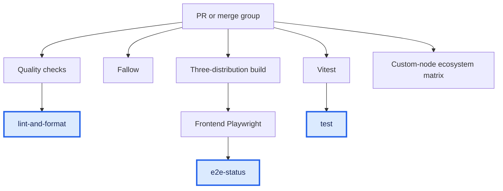
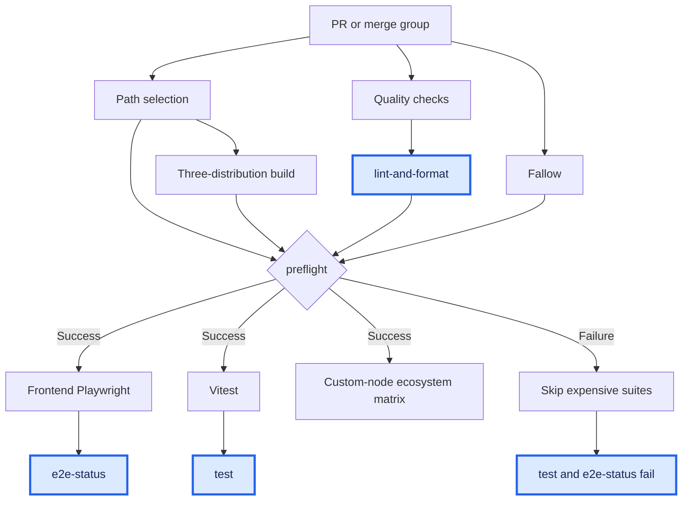

# ADR-CI-PREREQUISITES-0038: Gate expensive candidate tests

Date: 2026-09-25

## Status

Proposed

## Context

PR workflows start independently. A lint or Fallow failure can leave more than
300 runner-minutes of frontend tests running on a revision with failed checks.
The active main ruleset requires `lint-and-format`, `test`, `e2e-status`, and
`website-e2e`. Moving jobs into reusable workflows changes their check names.
Fallow is not in that required-context list; this prototype makes it an
indirect merge prerequisite through `test` and `e2e-status`.

The September 25 sample covers the five latest commits of 25 recently updated
PRs: 82 distinct source SHAs, 68 with measurable completed runs. Run creation
dates span September 15–25 UTC. The script selects the newest PR run per
workflow and source SHA, then its latest attempt. It counts cancelled jobs
with elapsed time, excludes skipped jobs, and records missing/in-progress runs.
This is a convenience sample, not a repository-wide billing audit.

| Workflow                      | Runs | Median wall minutes | p90 wall minutes | Median runner-minutes per run |
| ----------------------------- | ---: | ------------------: | ---------------: | ----------------------------: |
| Lint Format                   |   49 |                4.82 |            11.45 |                          7.97 |
| Fallow                        |   64 |                2.45 |             6.78 |                          1.93 |
| E2E, including build          |   45 |               23.97 |            36.82 |                        200.45 |
| Unit                          |   47 |               25.92 |            33.73 |                         21.87 |
| Custom Nodes Ecosystem Matrix |   46 |               14.48 |            31.45 |                         88.75 |

Runner-minutes sum the measured worker jobs, excluding core report/aggregate
jobs. Wall time includes queueing, dependencies, and reports. The existing
three-distribution E2E build takes a median 3.20 runner-minutes, p90 3.60.
Individual prerequisite medians are 2.35 for lint/format, 2.90 for application
typecheck, 1.82 for auxiliary typechecks, and 1.05 for repo-checks including Knip.

Eight sampled SHAs failed a prerequisite: seven Fallow failures and one lint
failure. Core tests consumed 1,057.05 runner-minutes on those SHAs, 8.45% of the
12,509.60 measured core test runner-minutes. That is a counterfactual upper
bound, not measured savings; it excludes new gate overhead, retries and queue
changes. Examples include [PR #18728's lint failure](https://github.com/Comfy-Org/ComfyUI_frontend/actions/runs/36058265501)
with 276.80 core test minutes on that SHA, and
[PR #17991's Fallow failure](https://github.com/Comfy-Org/ComfyUI_frontend/actions/runs/36075153555)
with 325.22 minutes.

All sampled runners use `ubuntu-latest`. This repository is public, so standard
runner execution is [free under GitHub's billing policy](https://docs.github.com/en/billing/concepts/product-billing/github-actions).
The target is wasted compute and concurrency. Storage and external service
charges are not measured.

## Decision

Prototype native `needs` dependencies in `CI: Tests E2E` for PRs and merge
groups. Run lint/format/Knip/typechecks, Fallow, and the existing build in
parallel. Only after they succeed, start frontend Playwright, Vitest, and the
custom-node ecosystem matrix. Keep path filtering inside each suite.

Keep the E2E workflow name, file, and artifacts so existing `workflow_run`
report consumers still find the producing run. Reuse the other workflows with
`workflow_call`. Keep top-level `lint-and-format`, `test`, and `e2e-status`
checks; failed prerequisites must make the test gates fail rather than pass
because their expensive jobs were skipped. No ruleset change is needed.

Reject cross-workflow polling: it occupies idle runners and adds source-revision
and rerun matching logic. Reject `workflow_run` for executing PR tests: it
changes the event, ref, and permission boundary. A new umbrella workflow would
also require migrating the E2E report consumers; retaining the existing entry
point avoids that migration in this prototype.

### Dependency comparison

These diagrams show a relevant-source PR or merge-group run. Quality means
lint, format, Knip, application and auxiliary typechecks, and repo checks.
Path filters and report jobs are omitted. The gate waits for all prerequisites;
it does not cancel the remaining prerequisites on the first failure.

Blue nodes mark required status checks, including their failure outcome. The
color does not indicate success. `website-e2e` and `cla-assistant` are also
required but remain outside these graphs.

Before: independent workflows

After: prerequisites gate expensive suites

### Concurrency ownership

Reusable workflows inherit the caller's `github.workflow`, ref, and event.
[GitHub warns against sharing a cancelling group between caller and callee](https://docs.github.com/en/actions/reference/workflows-and-actions/reusing-workflow-configurations#supported-keywords-for-jobs-that-call-a-reusable-workflow).
Keeping the old lint, Fallow, or unit group inside a called workflow could
cancel `CI: Tests E2E` itself.

In the table, `W` means `github.workflow` and `R` means `github.ref`.

| Workflow or job  | Before → after group                 | Cancellation policy                                                                                                   |
| ---------------- | ------------------------------------ | --------------------------------------------------------------------------------------------------------------------- |
| E2E coordinator  | `W-R` → unchanged                    | `true`; owns cancellation of the candidate run, including called jobs                                                 |
| PR lint          | `W-R` → removed                      | Call-only; coordinator replaces the old independent cancellation group                                                |
| Fallow           | `W-R` → removed                      | Call-only; coordinator replaces the old independent cancellation group                                                |
| Queue/push lint  | `W-R` → `W-lint-R`                   | Still `true`; separates called merge-group lint from its coordinator and retains standalone push cancellation         |
| Unit             | `W-R` → `W-unit-R`                   | Still `true`; separates called candidate tests from their coordinator and retains standalone push/manual cancellation |
| Ecosystem        | `ecosystem-matrix-R` → unchanged     | Cancels on PR and merge-group events, not on standalone push/manual events                                            |
| E2E comment jobs | `pr-comment-<PR number>` → unchanged | Still `false`; serializes comment writers without cancelling an active writer                                         |

For a PR, the coordinator and unit keys start with `CI: Tests E2E-` and
`CI: Tests E2E-unit-`. Merge groups also use `CI: Tests E2E-lint-`.
Standalone lint and unit runs use their own workflow names. PR merge refs,
merge-group refs, and branch refs stay separate. Different merge-group refs
do not cancel each other through these groups.

The unchanged ecosystem push/manual group preserves an active baseline build.
With the default concurrency queue, however, a newer pending run can replace
an older pending run even when `cancel-in-progress` is `false`. The comment
groups have the same limitation. These groups do not guarantee execution of
every queued run or ordering by commit age. Rerunning an older candidate on
the same ref can cancel newer work.

Required `always()` summaries can survive cancellation and delay a replacement
run in a saturated runner queue. `preflight` uses `!cancelled()`; the redundant
inner PR lint summary is removed, and the inner queue lint summary runs only
on standalone pushes. On rollout, already-running independent lint, Fallow,
and unit workflows retain their old keys and may finish alongside the first
coordinated run. No new key retroactively cancels those runs.

## Consequences

### Positive

- One run owns candidate dependencies, cancellation, and artifacts.
- Failed prerequisites prevent test matrices from allocating runners.
- Forks retain the PR event's restricted token; no privileged event runs PR code.

### Negative

- Passing candidates wait for the slowest prerequisite. Unit tests and the
  ecosystem matrix now wait for the build as well as lint checks.
- Unit-only edits now require a build, even when Playwright remains skipped.
- E2E workflow completion consumers now wait for unit and ecosystem jobs too.
- A rerun of the coordinator includes the other suites. Partial reruns need
  live GitHub validation before rollout.
- Required final checks still allocate runners after cancellation to reject
  incomplete results. A saturated runner queue can delay replacement runs.
- Website, billing, Storybook, performance, post-merge, and manual workflows
  remain independent in this first prototype. Browser-based custom-node tests
  are already nightly/manual-only and remain unchanged.

## Notes

Reproduce the measurement with
`pnpm exec tsx scripts/cicd/analyze-pr-ci-runtime.ts --cohort 25 --commits 5 --refresh`.
Omit `--refresh` to reuse the local snapshot. JSON output includes source SHAs,
job/run URLs, runner labels, coverage gaps, and individual elapsed times.

Before rollout, verify a successful PR, a failed prerequisite, an irrelevant
diff, a fork, and a merge-group run. Local tests execute the gate scripts and
check the dependency wiring; they cannot prove GitHub's reusable-workflow
check naming, fork permissions, or merge-queue event behavior.
