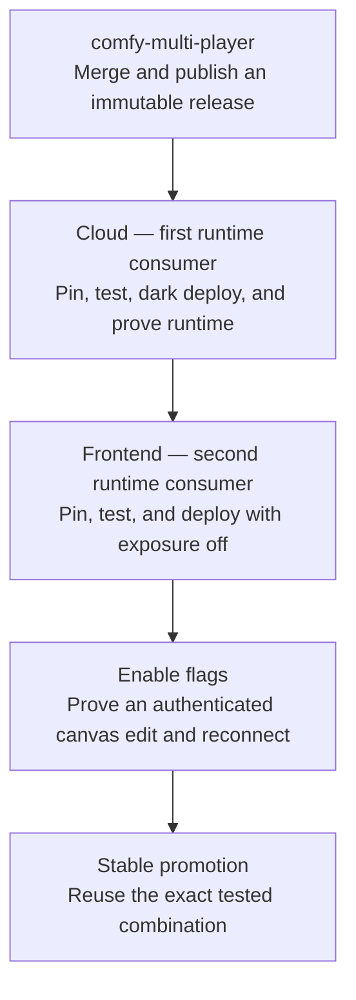

# Agent cross-repository release order

## Glossary

- **Dark deploy:** compatible code deployed while user exposure is disabled.
- **Integrated receipt:** exact revisions, package version, flags, and browser-visible proof.
- **Consumer pin:** the exact shared-package version recorded in the manifest and lockfile.

Agent protocol and applier changes must move in this order:

Cloud is the first runtime consumer, and frontend is the second. Update `package.json` and
`pnpm-lock.yaml` only after the accepted `@comfyorg/comfy-multi-player` version is installable and
the compatible cloud consumer has deployed. Run package-pin/parity checks, unit and browser tests,
and prove both product-flag states before normal frontend review and merge.

Deploy the frontend with user exposure off. The integration receipt names exact frontend/cloud
revisions, the shared package version, and flag values. `agent-in-app-experience` is the
product/cohort flag; `AGENT_CRDT_MODE` plus `workflows.crdt_enabled` selects the V1 storage path.
They are not interchangeable.

Acceptance requires an authenticated browser flow that causes a visible canvas edit and survives
reconnect. Package CI, frame tests, healthy services, or a served frontend alone do not satisfy the
gate. Stable promotion reuses the exact integrated combination, makes the backend compatible first,
verifies the served frontend revision, and expands product access last.

Backward-compatible frontend-only changes that do not emit, require, or expose a backend contract
may merge independently if the PR explains why. Documentation-only changes may proceed in parallel.
