# ECS Lifecycle Scenarios

This document walks through the major entity lifecycle operations — showing the current imperative implementation and how each transforms under the ECS architecture from [ADR 0008](../adr/0008-entity-component-system.md).

Each scenario follows the same structure: **Current Flow** (what happens today), **ECS Flow** (what it looks like with the World), and a **Key Differences** table.

## 1. Node Removal

### Current Flow

`LGraph.remove(node)` — 107 lines, touches 6+ entity types and 4+ external systems:

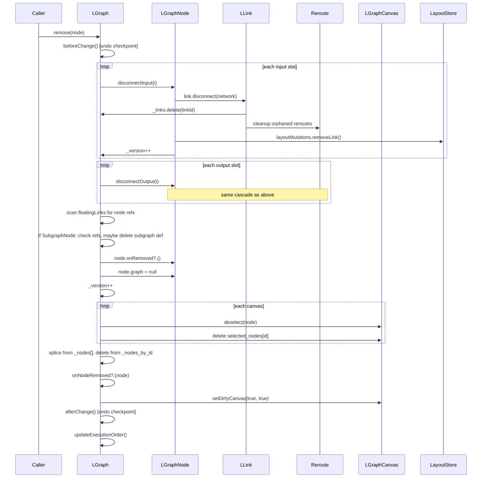
```mermaid
sequenceDiagram
    participant Caller
    participant G as LGraph
    participant N as LGraphNode
    participant L as LLink
    participant R as Reroute
    participant C as LGraphCanvas
    participant LS as LayoutStore

    Caller->>G: remove(node)
    G->>G: beforeChange() [undo checkpoint]

    loop each input slot
        G->>N: disconnectInput(i)
        N->>L: link.disconnect(network)
        L->>G: _links.delete(linkId)
        L->>R: cleanup orphaned reroutes
        N->>LS: layoutMutations.removeLink()
        N->>G: _version++
    end

    loop each output slot
        G->>N: disconnectOutput(i)
        Note over N,R: same cascade as above
    end

    G->>G: scan floatingLinks for node refs
    G->>G: if SubgraphNode: check refs, maybe delete subgraph def
    G->>N: node.onRemoved?.()
    G->>N: node.graph = null
    G->>G: _version++

    loop each canvas
        G->>C: deselect(node)
        G->>C: delete selected_nodes[id]
    end

    G->>G: splice from _nodes[], delete from _nodes_by_id
    G->>G: onNodeRemoved?.(node)
    G->>C: setDirtyCanvas(true, true)
    G->>G: afterChange() [undo checkpoint]
    G->>G: updateExecutionOrder()
```

Problems: the graph method manually disconnects every slot, cleans up reroutes, scans floating links, checks subgraph references, notifies canvases, and recomputes execution order — all in one method that knows about every entity type.

### ECS Flow

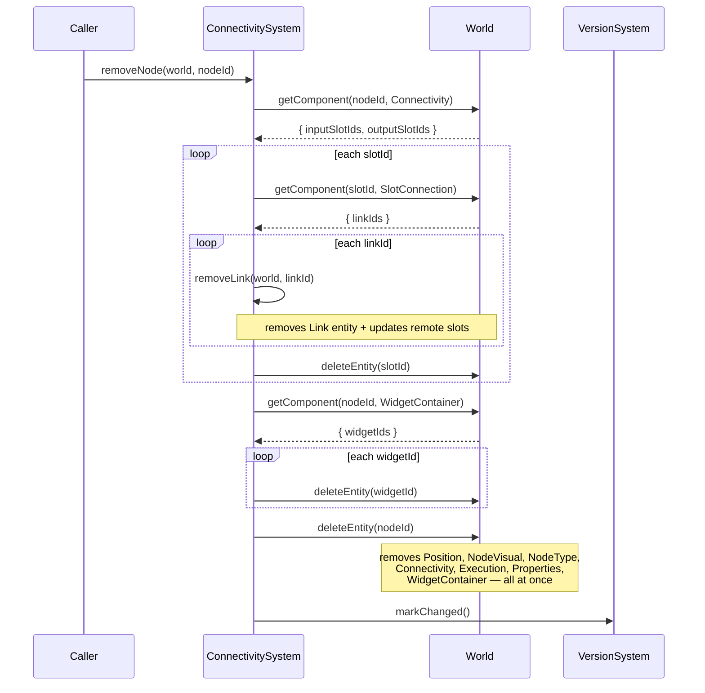
```mermaid
sequenceDiagram
    participant Caller
    participant CS as ConnectivitySystem
    participant W as World
    participant VS as VersionSystem

    Caller->>CS: removeNode(world, nodeId)

    CS->>W: getComponent(nodeId, Connectivity)
    W-->>CS: { inputSlotIds, outputSlotIds }

    loop each slotId
        CS->>W: getComponent(slotId, SlotConnection)
        W-->>CS: { linkIds }
        loop each linkId
            CS->>CS: removeLink(world, linkId)
            Note over CS,W: removes Link entity + updates remote slots
        end
        CS->>W: deleteEntity(slotId)
    end

    CS->>W: getComponent(nodeId, WidgetContainer)
    W-->>CS: { widgetIds }
    loop each widgetId
        CS->>W: deleteEntity(widgetId)
    end

    CS->>W: deleteEntity(nodeId)
    Note over W: removes Position, NodeVisual, NodeType,<br/>Connectivity, Execution, Properties,<br/>WidgetContainer — all at once

    CS->>VS: markChanged()
```

### Key Differences

| Aspect              | Current                                          | ECS                                                    |
| ------------------- | ------------------------------------------------ | ------------------------------------------------------ |
| Lines of code       | ~107 in one method                               | ~30 in system function                                 |
| Entity types known  | Graph knows about all 6+ types                   | ConnectivitySystem knows Connectivity + SlotConnection |
| Cleanup             | Manual per-slot, per-link, per-reroute           | `deleteEntity()` removes all components atomically     |
| Canvas notification | `setDirtyCanvas()` called explicitly             | RenderSystem sees missing entity on next frame         |
| Store cleanup       | WidgetValueStore/LayoutStore NOT cleaned up      | World deletion IS the cleanup                          |
| Undo/redo           | `beforeChange()`/`afterChange()` manually placed | System snapshots affected components before deletion   |
| Testability         | Needs full LGraph + LGraphCanvas                 | Needs only World + ConnectivitySystem                  |

## 2. Serialization

### Current Flow

`LGraph.serialize()` → `asSerialisable()` — walks every collection manually:

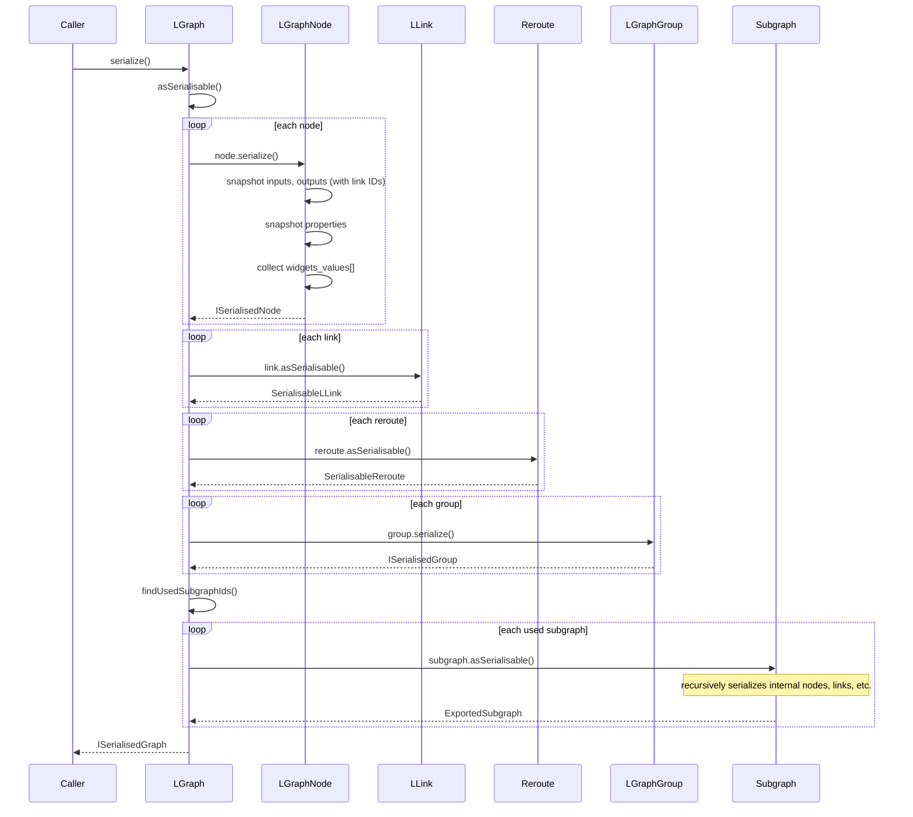
```mermaid
sequenceDiagram
    participant Caller
    participant G as LGraph
    participant N as LGraphNode
    participant L as LLink
    participant R as Reroute
    participant Gr as LGraphGroup
    participant SG as Subgraph

    Caller->>G: serialize()
    G->>G: asSerialisable()

    loop each node
        G->>N: node.serialize()
        N->>N: snapshot inputs, outputs (with link IDs)
        N->>N: snapshot properties
        N->>N: collect widgets_values[]
        N-->>G: ISerialisedNode
    end

    loop each link
        G->>L: link.asSerialisable()
        L-->>G: SerialisableLLink
    end

    loop each reroute
        G->>R: reroute.asSerialisable()
        R-->>G: SerialisableReroute
    end

    loop each group
        G->>Gr: group.serialize()
        Gr-->>G: ISerialisedGroup
    end

    G->>G: findUsedSubgraphIds()
    loop each used subgraph
        G->>SG: subgraph.asSerialisable()
        Note over SG: recursively serializes internal nodes, links, etc.
        SG-->>G: ExportedSubgraph
    end

    G-->>Caller: ISerialisedGraph
```

Problems: serialization logic lives in 6 different `serialize()` methods across 6 classes. Widget values are collected inline during node serialization. The graph walks its own collections — no separation of "what to serialize" from "how to serialize."

### ECS Flow

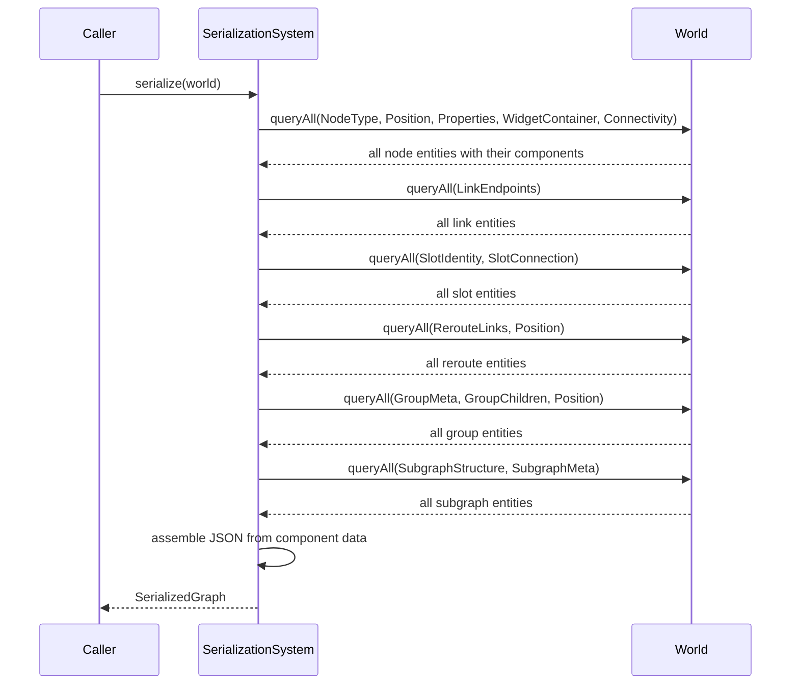
```mermaid
sequenceDiagram
    participant Caller
    participant SS as SerializationSystem
    participant W as World

    Caller->>SS: serialize(world)

    SS->>W: queryAll(NodeType, Position, Properties, WidgetContainer, Connectivity)
    W-->>SS: all node entities with their components

    SS->>W: queryAll(LinkEndpoints)
    W-->>SS: all link entities

    SS->>W: queryAll(SlotIdentity, SlotConnection)
    W-->>SS: all slot entities

    SS->>W: queryAll(RerouteLinks, Position)
    W-->>SS: all reroute entities

    SS->>W: queryAll(GroupMeta, GroupChildren, Position)
    W-->>SS: all group entities

    SS->>W: queryAll(SubgraphStructure, SubgraphMeta)
    W-->>SS: all subgraph entities

    SS->>SS: assemble JSON from component data
    SS-->>Caller: SerializedGraph
```

### Key Differences

| Aspect                 | Current                                         | ECS                                            |
| ---------------------- | ----------------------------------------------- | ---------------------------------------------- |
| Serialization logic    | Spread across 6 classes (`serialize()` on each) | Single SerializationSystem                     |
| Widget values          | Collected inline during `node.serialize()`      | WidgetValue component queried directly         |
| Subgraph recursion     | `asSerialisable()` recursively calls itself     | Flat query — SubgraphStructure has entity refs |
| Adding a new component | Modify the entity's `serialize()` method        | Add component to query in SerializationSystem  |
| Testing                | Need full object graph to test serialization    | Mock World with test components                |

## 3. Deserialization

### Current Flow

`LGraph.configure(data)` — ~180 lines, two-phase node creation:

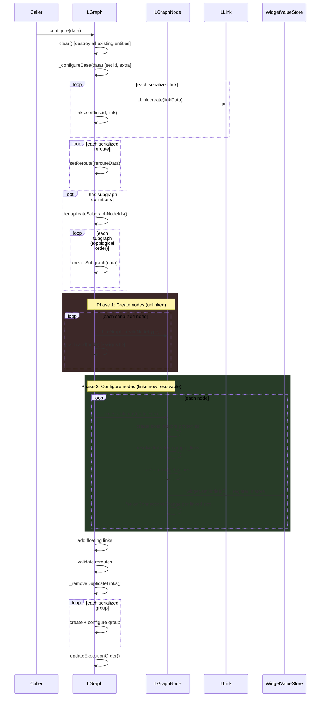
```mermaid
sequenceDiagram
    participant Caller
    participant G as LGraph
    participant N as LGraphNode
    participant L as LLink
    participant WVS as WidgetValueStore

    Caller->>G: configure(data)
    G->>G: clear() [destroy all existing entities]
    G->>G: _configureBase(data) [set id, extra]

    loop each serialized link
        G->>L: LLink.create(linkData)
        G->>G: _links.set(link.id, link)
    end

    loop each serialized reroute
        G->>G: setReroute(rerouteData)
    end

    opt has subgraph definitions
        G->>G: deduplicateSubgraphNodeIds()
        loop each subgraph (topological order)
            G->>G: createSubgraph(data)
        end
    end

    rect rgb(60, 40, 40)
        Note over G,N: Phase 1: Create nodes (unlinked)
        loop each serialized node
            G->>N: LiteGraph.createNode(type)
            G->>G: graph.add(node) [assigns ID]
        end
    end

    rect rgb(40, 60, 40)
        Note over G,N: Phase 2: Configure nodes (links now resolvable)
        loop each node
            G->>N: node.configure(nodeData)
            N->>N: create slots, restore properties
            N->>N: resolve links from graph._links
            N->>N: restore widget values
            N->>WVS: widget.setNodeId() → register in store
            N->>N: fire onConnectionsChange per linked slot
        end
    end

    G->>G: add floating links
    G->>G: validate reroutes
    G->>G: _removeDuplicateLinks()

    loop each serialized group
        G->>G: create + configure group
    end

    G->>G: updateExecutionOrder()
```

Problems: two-phase creation is necessary because nodes need to reference each other's links during configure. Widget value restoration happens deep inside `node.configure()`. Store population is a side effect of configuration. Subgraph creation requires topological sorting to handle nested subgraphs.

### ECS Flow

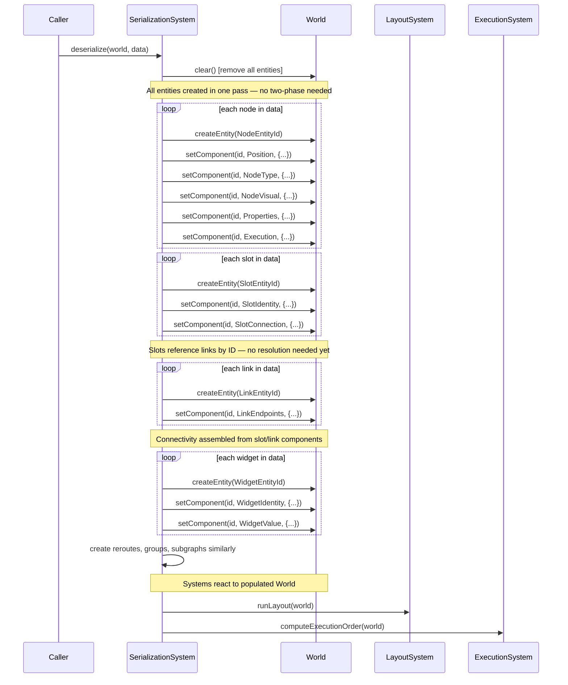
```mermaid
sequenceDiagram
    participant Caller
    participant SS as SerializationSystem
    participant W as World
    participant LS as LayoutSystem
    participant ES as ExecutionSystem

    Caller->>SS: deserialize(world, data)

    SS->>W: clear() [remove all entities]

    Note over SS,W: All entities created in one pass — no two-phase needed

    loop each node in data
        SS->>W: createEntity(NodeEntityId)
        SS->>W: setComponent(id, Position, {...})
        SS->>W: setComponent(id, NodeType, {...})
        SS->>W: setComponent(id, NodeVisual, {...})
        SS->>W: setComponent(id, Properties, {...})
        SS->>W: setComponent(id, Execution, {...})
    end

    loop each slot in data
        SS->>W: createEntity(SlotEntityId)
        SS->>W: setComponent(id, SlotIdentity, {...})
        SS->>W: setComponent(id, SlotConnection, {...})
    end

    Note over SS,W: Slots reference links by ID — no resolution needed yet

    loop each link in data
        SS->>W: createEntity(LinkEntityId)
        SS->>W: setComponent(id, LinkEndpoints, {...})
    end

    Note over SS,W: Connectivity assembled from slot/link components

    loop each widget in data
        SS->>W: createEntity(WidgetEntityId)
        SS->>W: setComponent(id, WidgetIdentity, {...})
        SS->>W: setComponent(id, WidgetValue, {...})
    end

    SS->>SS: create reroutes, groups, subgraphs similarly

    Note over SS,W: Systems react to populated World

    SS->>LS: runLayout(world)
    SS->>ES: computeExecutionOrder(world)
```

### Key Differences

| Aspect             | Current                                                                    | ECS                                                          |
| ------------------ | -------------------------------------------------------------------------- | ------------------------------------------------------------ |
| Two-phase creation | Required (nodes must exist before link resolution)                         | Not needed — components reference IDs, not instances         |
| Widget restoration | Hidden inside `node.configure()` line ~900                                 | Explicit: WidgetValue component written directly             |
| Store population   | Side effect of `widget.setNodeId()`                                        | World IS the store — writing component IS population         |
| Callback cascade   | `onConnectionsChange`, `onInputAdded`, `onConfigure` fire during configure | No callbacks — systems query World after deserialization     |
| Subgraph ordering  | Topological sort required                                                  | Flat write — SubgraphStructure just holds entity IDs         |
| Error handling     | Failed node → placeholder with `has_errors=true`                           | Failed entity → skip; components that loaded are still valid |

## 4. Pack Subgraph

### Current Flow

`LGraph.convertToSubgraph(items)` — clones nodes, computes boundaries, creates SubgraphNode:

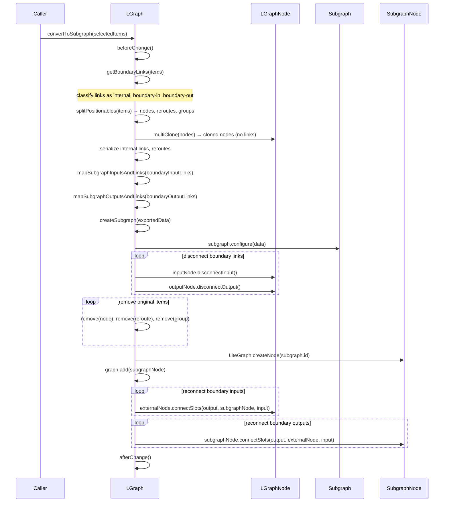
```mermaid
sequenceDiagram
    participant Caller
    participant G as LGraph
    participant N as LGraphNode
    participant SG as Subgraph
    participant SGN as SubgraphNode

    Caller->>G: convertToSubgraph(selectedItems)
    G->>G: beforeChange()

    G->>G: getBoundaryLinks(items)
    Note over G: classify links as internal, boundary-in, boundary-out

    G->>G: splitPositionables(items) → nodes, reroutes, groups
    G->>N: multiClone(nodes) → cloned nodes (no links)
    G->>G: serialize internal links, reroutes

    G->>G: mapSubgraphInputsAndLinks(boundaryInputLinks)
    G->>G: mapSubgraphOutputsAndLinks(boundaryOutputLinks)

    G->>G: createSubgraph(exportedData)
    G->>SG: subgraph.configure(data)

    loop disconnect boundary links
        G->>N: inputNode.disconnectInput()
        G->>N: outputNode.disconnectOutput()
    end

    loop remove original items
        G->>G: remove(node), remove(reroute), remove(group)
    end

    G->>SGN: LiteGraph.createNode(subgraph.id)
    G->>G: graph.add(subgraphNode)

    loop reconnect boundary inputs
        G->>N: externalNode.connectSlots(output, subgraphNode, input)
    end

    loop reconnect boundary outputs
        G->>SGN: subgraphNode.connectSlots(output, externalNode, input)
    end

    G->>G: afterChange()
```

Problems: 200+ lines in one method. Manual boundary link analysis. Clone-serialize-configure dance. Disconnect-remove-recreate-reconnect sequence with many intermediate states where the graph is inconsistent.

### ECS Flow

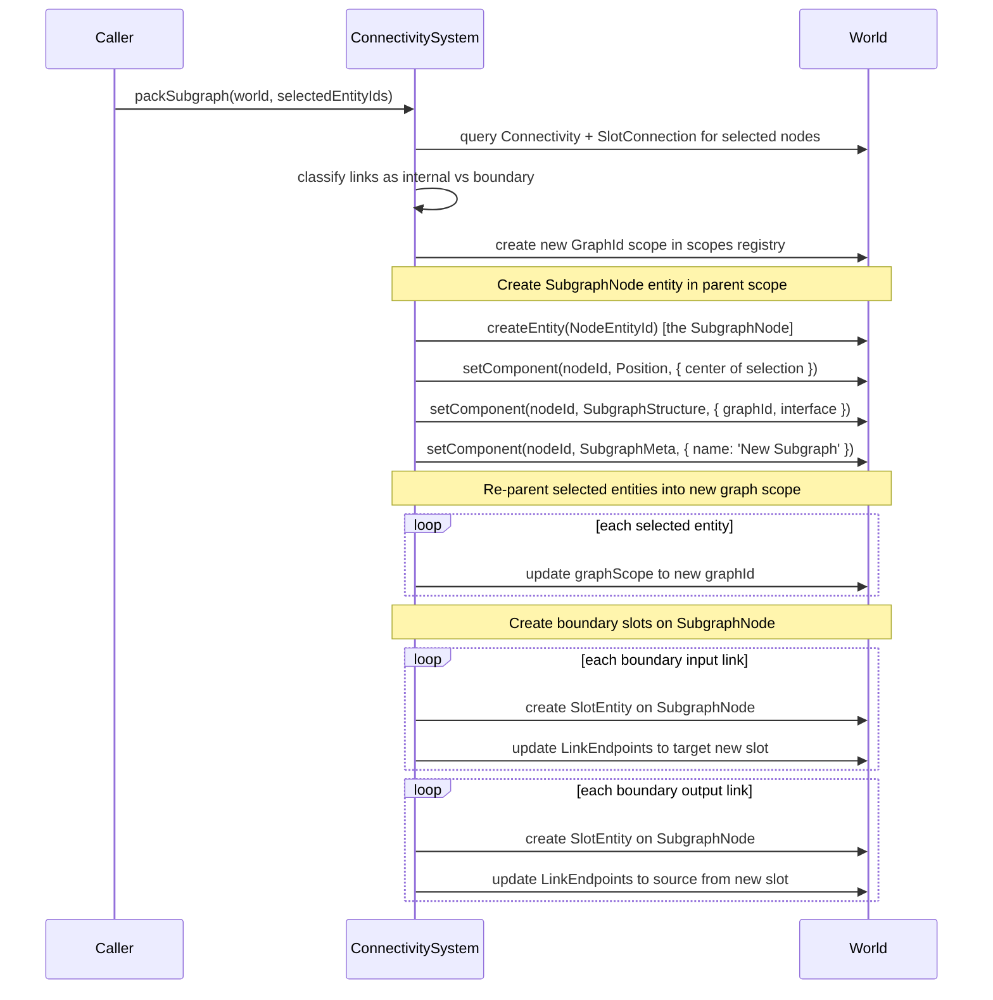
```mermaid
sequenceDiagram
    participant Caller
    participant CS as ConnectivitySystem
    participant W as World

    Caller->>CS: packSubgraph(world, selectedEntityIds)

    CS->>W: query Connectivity + SlotConnection for selected nodes
    CS->>CS: classify links as internal vs boundary

    CS->>W: create new GraphId scope in scopes registry

    Note over CS,W: Create SubgraphNode entity in parent scope

    CS->>W: createEntity(NodeEntityId) [the SubgraphNode]
    CS->>W: setComponent(nodeId, Position, { center of selection })
    CS->>W: setComponent(nodeId, SubgraphStructure, { graphId, interface })
    CS->>W: setComponent(nodeId, SubgraphMeta, { name: 'New Subgraph' })

    Note over CS,W: Re-parent selected entities into new graph scope

    loop each selected entity
        CS->>W: update graphScope to new graphId
    end

    Note over CS,W: Create boundary slots on SubgraphNode

    loop each boundary input link
        CS->>W: create SlotEntity on SubgraphNode
        CS->>W: update LinkEndpoints to target new slot
    end

    loop each boundary output link
        CS->>W: create SlotEntity on SubgraphNode
        CS->>W: update LinkEndpoints to source from new slot
    end
```

### Key Differences

| Aspect                     | Current                                           | ECS                                                     |
| -------------------------- | ------------------------------------------------- | ------------------------------------------------------- |
| Entity movement            | Clone → serialize → configure → remove originals  | Re-parent entities: update graphScope to new GraphId    |
| Boundary links             | Disconnect → remove → recreate → reconnect        | Update LinkEndpoints to point at new SubgraphNode slots |
| Intermediate inconsistency | Graph is partially disconnected during operation  | Atomic: all component writes happen together            |
| Code size                  | 200+ lines                                        | ~50 lines in system                                     |
| Undo                       | `beforeChange()`/`afterChange()` wraps everything | Snapshot affected components before mutation            |

## 5. Unpack Subgraph

### Current Flow

`LGraph.unpackSubgraph(subgraphNode)` — clones internal nodes, remaps IDs, reconnects boundary:

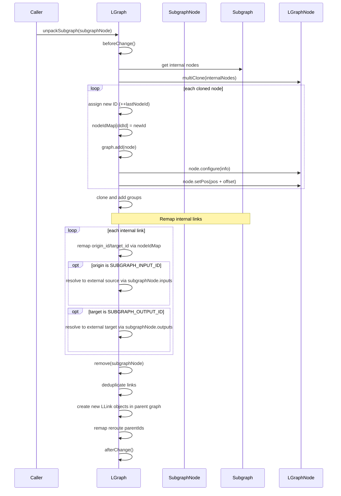
```mermaid
sequenceDiagram
    participant Caller
    participant G as LGraph
    participant SGN as SubgraphNode
    participant SG as Subgraph
    participant N as LGraphNode

    Caller->>G: unpackSubgraph(subgraphNode)
    G->>G: beforeChange()

    G->>SG: get internal nodes
    G->>N: multiClone(internalNodes)

    loop each cloned node
        G->>G: assign new ID (++lastNodeId)
        G->>G: nodeIdMap[oldId] = newId
        G->>G: graph.add(node)
        G->>N: node.configure(info)
        G->>N: node.setPos(pos + offset)
    end

    G->>G: clone and add groups

    Note over G,SG: Remap internal links

    loop each internal link
        G->>G: remap origin_id/target_id via nodeIdMap
        opt origin is SUBGRAPH_INPUT_ID
            G->>G: resolve to external source via subgraphNode.inputs
        end
        opt target is SUBGRAPH_OUTPUT_ID
            G->>G: resolve to external target via subgraphNode.outputs
        end
    end

    G->>G: remove(subgraphNode)
    G->>G: deduplicate links
    G->>G: create new LLink objects in parent graph
    G->>G: remap reroute parentIds
    G->>G: afterChange()
```

Problems: ID remapping is complex and error-prone. Magic IDs (SUBGRAPH_INPUT_ID = -10, SUBGRAPH_OUTPUT_ID = -20) require special-case handling. Boundary link resolution requires looking up the SubgraphNode's slots to find external connections.

### ECS Flow

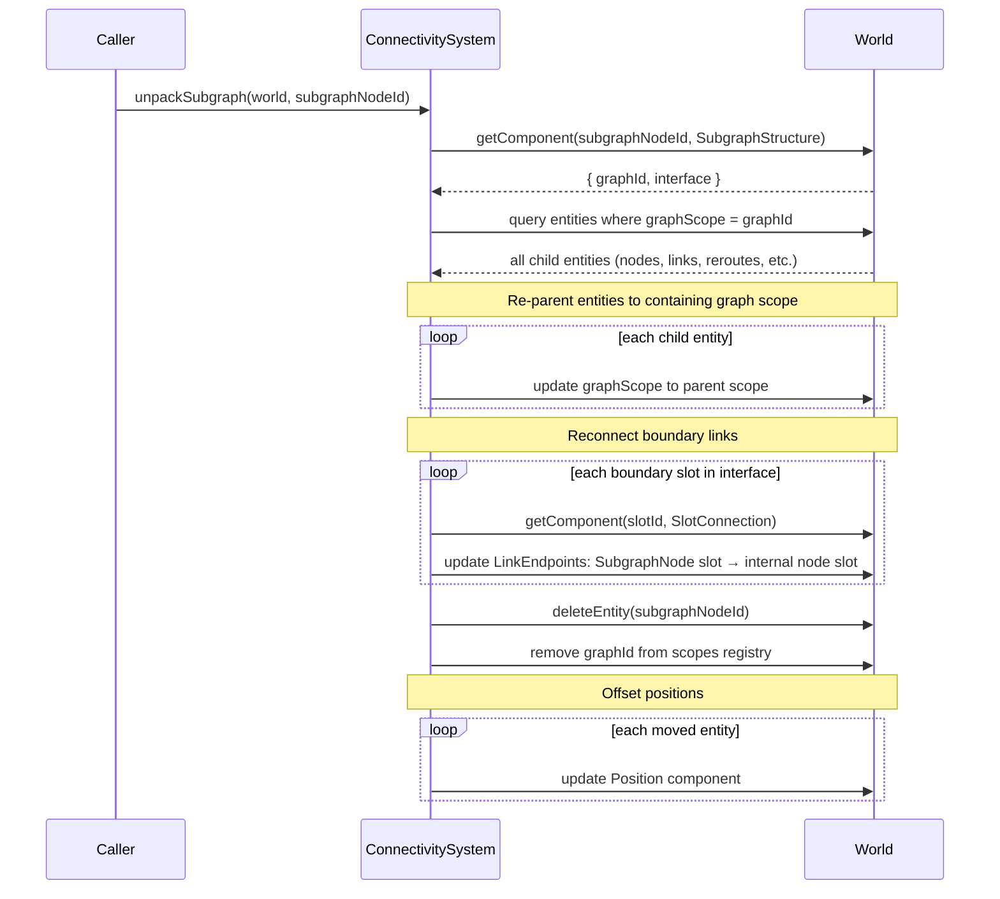
```mermaid
sequenceDiagram
    participant Caller
    participant CS as ConnectivitySystem
    participant W as World

    Caller->>CS: unpackSubgraph(world, subgraphNodeId)

    CS->>W: getComponent(subgraphNodeId, SubgraphStructure)
    W-->>CS: { graphId, interface }

    CS->>W: query entities where graphScope = graphId
    W-->>CS: all child entities (nodes, links, reroutes, etc.)

    Note over CS,W: Re-parent entities to containing graph scope

    loop each child entity
        CS->>W: update graphScope to parent scope
    end

    Note over CS,W: Reconnect boundary links

    loop each boundary slot in interface
        CS->>W: getComponent(slotId, SlotConnection)
        CS->>W: update LinkEndpoints: SubgraphNode slot → internal node slot
    end

    CS->>W: deleteEntity(subgraphNodeId)
    CS->>W: remove graphId from scopes registry

    Note over CS,W: Offset positions

    loop each moved entity
        CS->>W: update Position component
    end
```

### Key Differences

| Aspect            | Current                                             | ECS                                              |
| ----------------- | --------------------------------------------------- | ------------------------------------------------ |
| ID remapping      | `nodeIdMap[oldId] = newId` for every node and link  | No remapping — entities keep their IDs, only graphScope changes |
| Magic IDs         | SUBGRAPH_INPUT_ID = -10, SUBGRAPH_OUTPUT_ID = -20   | No magic IDs — boundary modeled as slot entities |
| Clone vs move     | Clone nodes, assign new IDs, configure from scratch | Move entity references between scopes            |
| Link reconnection | Remap origin_id/target_id, create new LLink objects | Update LinkEndpoints component in place          |
| Complexity        | ~200 lines with deduplication and reroute remapping | ~40 lines, no remapping needed                   |

## 6. Connect Slots

### Current Flow

`LGraphNode.connectSlots()` — creates link, updates both endpoints, handles reroutes:

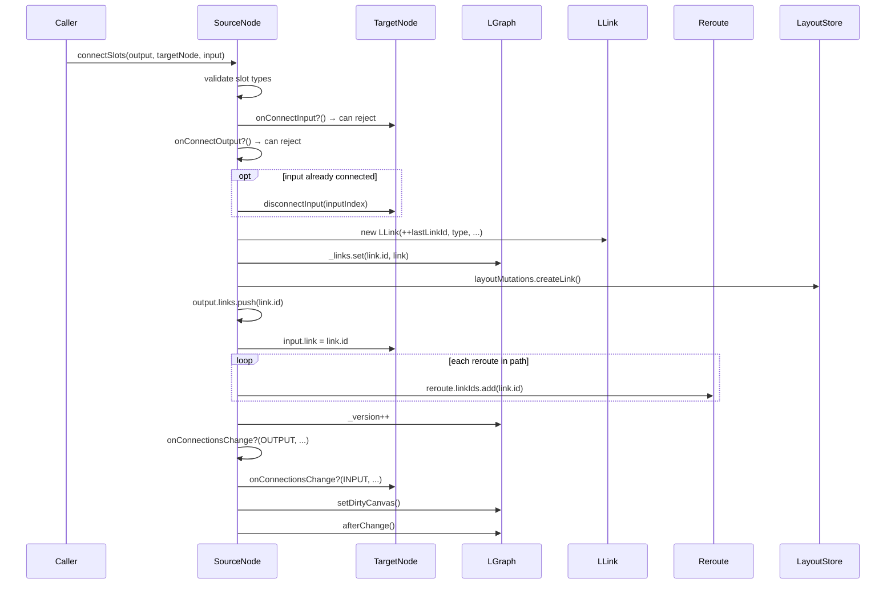
```mermaid
sequenceDiagram
    participant Caller
    participant N1 as SourceNode
    participant N2 as TargetNode
    participant G as LGraph
    participant L as LLink
    participant R as Reroute
    participant LS as LayoutStore

    Caller->>N1: connectSlots(output, targetNode, input)

    N1->>N1: validate slot types
    N1->>N2: onConnectInput?() → can reject
    N1->>N1: onConnectOutput?() → can reject

    opt input already connected
        N1->>N2: disconnectInput(inputIndex)
    end

    N1->>L: new LLink(++lastLinkId, type, ...)
    N1->>G: _links.set(link.id, link)
    N1->>LS: layoutMutations.createLink()

    N1->>N1: output.links.push(link.id)
    N1->>N2: input.link = link.id

    loop each reroute in path
        N1->>R: reroute.linkIds.add(link.id)
    end

    N1->>G: _version++
    N1->>N1: onConnectionsChange?(OUTPUT, ...)
    N1->>N2: onConnectionsChange?(INPUT, ...)
    N1->>G: setDirtyCanvas()
    N1->>G: afterChange()
```

Problems: the source node orchestrates everything — it reaches into the graph's link map, the target node's slot, the layout store, the reroute chain, and the version counter. 19 steps in one method.

### ECS Flow

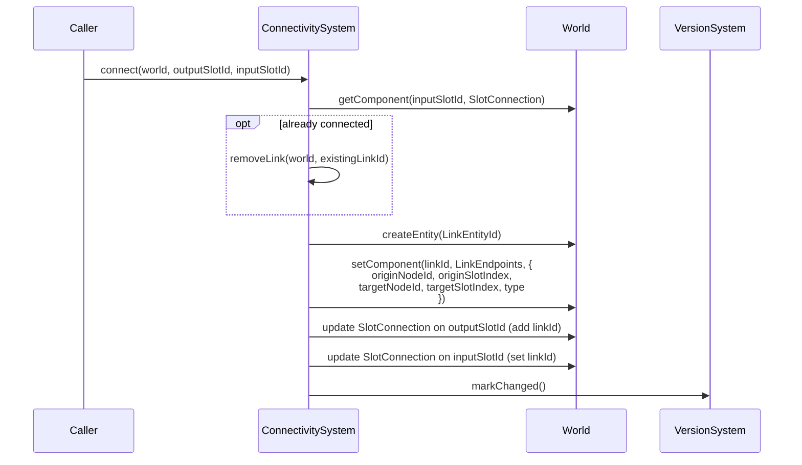
```mermaid
sequenceDiagram
    participant Caller
    participant CS as ConnectivitySystem
    participant W as World
    participant VS as VersionSystem

    Caller->>CS: connect(world, outputSlotId, inputSlotId)

    CS->>W: getComponent(inputSlotId, SlotConnection)
    opt already connected
        CS->>CS: removeLink(world, existingLinkId)
    end

    CS->>W: createEntity(LinkEntityId)
    CS->>W: setComponent(linkId, LinkEndpoints, {<br/>  originNodeId, originSlotIndex,<br/>  targetNodeId, targetSlotIndex, type<br/>})

    CS->>W: update SlotConnection on outputSlotId (add linkId)
    CS->>W: update SlotConnection on inputSlotId (set linkId)

    CS->>VS: markChanged()
```

### Key Differences

| Aspect           | Current                                                      | ECS                                                           |
| ---------------- | ------------------------------------------------------------ | ------------------------------------------------------------- |
| Orchestrator     | Source node (reaches into graph, target, reroutes)           | ConnectivitySystem (queries World)                            |
| Side effects     | `_version++`, `setDirtyCanvas()`, `afterChange()`, callbacks | `markChanged()` — one call                                    |
| Reroute handling | Manual: iterate chain, add linkId to each                    | RerouteLinks component updated by system                      |
| Slot mutation    | Direct: `output.links.push()`, `input.link = id`             | Component update: `setComponent(slotId, SlotConnection, ...)` |
| Validation       | `onConnectInput`/`onConnectOutput` callbacks on nodes        | Validation system or guard function                           |

## 7. Copy / Paste

### Current Flow

Copy: serialize selected items → clipboard. Paste: deserialize with new IDs.

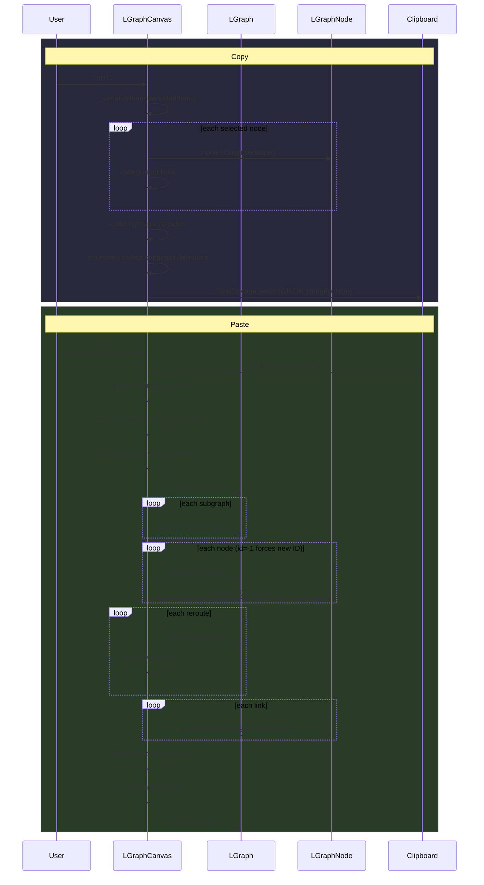
```mermaid
sequenceDiagram
    participant User
    participant C as LGraphCanvas
    participant G as LGraph
    participant N as LGraphNode
    participant CB as Clipboard

    rect rgb(40, 40, 60)
        Note over User,CB: Copy
        User->>C: Ctrl+C
        C->>C: _serializeItems(selectedItems)
        loop each selected node
            C->>N: node.clone().serialize()
            C->>C: collect input links
        end
        C->>C: collect groups, reroutes
        C->>C: recursively collect subgraph definitions
        C->>CB: localStorage.setItem(JSON.stringify(data))
    end

    rect rgb(40, 60, 40)
        Note over User,CB: Paste
        User->>C: Ctrl+V
        C->>CB: localStorage.getItem()
        C->>C: _deserializeItems(parsed)

        C->>C: remap subgraph IDs (new UUIDs)
        C->>C: deduplicateSubgraphNodeIds()
        C->>G: beforeChange()

        loop each subgraph
            C->>G: createSubgraph(data)
        end
        loop each node (id=-1 forces new ID)
            C->>G: graph.add(node)
            C->>N: node.configure(info)
        end
        loop each reroute
            C->>G: setReroute(data)
            C->>C: remap parentIds
        end
        loop each link
            C->>N: outNode.connect(slot, inNode, slot)
        end

        C->>C: offset positions to cursor
        C->>C: selectItems(created)
        C->>G: afterChange()
    end
```

Problems: clone-serialize-parse-remap-deserialize dance. Every entity type has
its own ID remapping logic. Subgraph IDs, node IDs, reroute IDs, and link
parent IDs all remapped independently. ~300 lines across multiple methods.

### ECS Flow

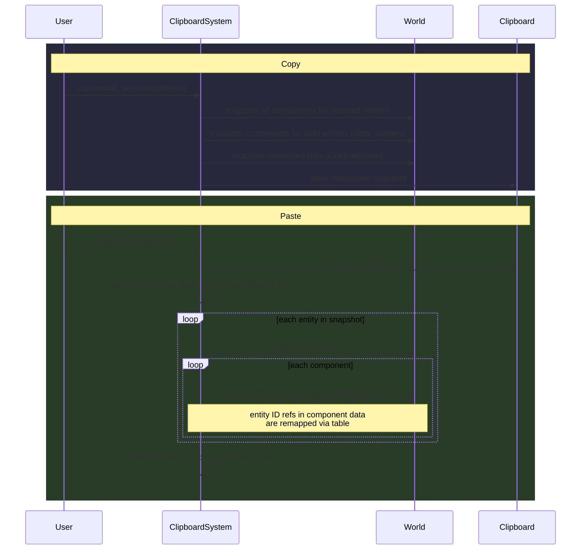
```mermaid
sequenceDiagram
    participant User
    participant CS as ClipboardSystem
    participant W as World
    participant CB as Clipboard

    rect rgb(40, 40, 60)
        Note over User,CB: Copy
        User->>CS: copy(world, selectedEntityIds)
        CS->>W: snapshot all components for selected entities
        CS->>W: snapshot components for child entities (slots, widgets)
        CS->>W: snapshot connected links (LinkEndpoints)
        CS->>CB: store component snapshot
    end

    rect rgb(40, 60, 40)
        Note over User,CB: Paste
        User->>CS: paste(world, position)
        CS->>CB: retrieve snapshot

        CS->>CS: generate ID remap table (old → new branded IDs)

        loop each entity in snapshot
            CS->>W: createEntity(newId)
            loop each component
                CS->>W: setComponent(newId, type, remappedData)
                Note over CS,W: entity ID refs in component data<br/>are remapped via table
            end
        end

        CS->>CS: offset all Position components to cursor
    end
```

### Key Differences

| Aspect               | Current                                                            | ECS                                                                |
| -------------------- | ------------------------------------------------------------------ | ------------------------------------------------------------------ |
| Copy format          | Clone → serialize → JSON (format depends on class)                 | Component snapshot (uniform format for all entities)               |
| ID remapping         | Separate logic per entity type (nodes, reroutes, subgraphs, links) | Single remap table applied to all entity ID refs in all components |
| Paste reconstruction | `createNode()` → `add()` → `configure()` → `connect()` per node    | `createEntity()` → `setComponent()` per entity (flat)              |
| Subgraph handling    | Recursive clone + UUID remap + deduplication                       | Snapshot includes SubgraphStructure component with entity refs     |
| Code complexity      | ~300 lines across 4 methods                                        | ~60 lines in one system                                            |

## Summary: Cross-Cutting Benefits

| Benefit                       | Scenarios Where It Applies                                                 |
| ----------------------------- | -------------------------------------------------------------------------- |
| **Atomic operations**         | Node Removal, Pack/Unpack — no intermediate inconsistent state             |
| **No scattered `_version++`** | All scenarios — VersionSystem handles change tracking                      |
| **No callback cascades**      | Deserialization, Connect — systems query World instead of firing callbacks |
| **Uniform ID handling**       | Copy/Paste, Unpack — one remap table instead of per-type logic             |
| **Entity deletion = cleanup** | Node Removal — `deleteEntity()` removes all components                     |
| **No two-phase creation**     | Deserialization — components reference IDs, not instances                  |
| **Move instead of clone**     | Pack/Unpack — entities keep their IDs, just change scope                   |
| **Testable in isolation**     | All scenarios — mock World, test one system                                |
| **Undo/redo for free**        | All scenarios — snapshot components before mutation, restore on undo       |
