# ECS Lifecycle Scenarios

This document walks through the major entity lifecycle operations — showing the current imperative implementation and how each transforms under the ECS architecture from [ADR 0008](../adr/0008-entity-component-system.md).

ECS principles are realized across a set of dedicated Pinia stores keyed by string IDs (shipped in PR 12617): `widgetValueStore` (keyed by `WidgetId` = `graphId:nodeId:name`, see `src/types/widgetId.ts`), `layoutStore` (mutated via `useLayoutMutations()`), `nodeOutputStore`, `domWidgetStore`, `subgraphNavigationStore`, and `previewExposureStore`. Components live as plain-data entries in these stores; systems read and mutate them through store getters and command-style mutations.

Each scenario follows the same structure: **Current Flow** (what happens today), **ECS Flow** (the store-backed target), and a **Key Differences** table.

## 1. Node Removal

### Current Flow

`LGraph.remove(node)` — 107 lines, touches 6+ entity types and 4+ external systems:

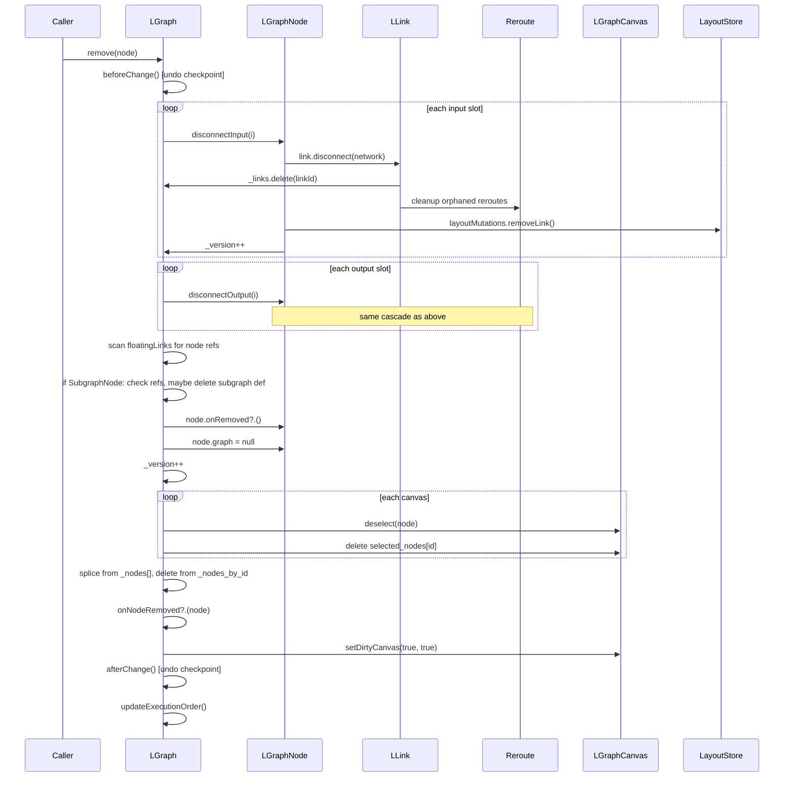

Problems: the graph method manually disconnects every slot, cleans up reroutes, scans floating links, checks subgraph references, notifies canvases, and recomputes execution order — all in one method that knows about every entity type.

### ECS Flow

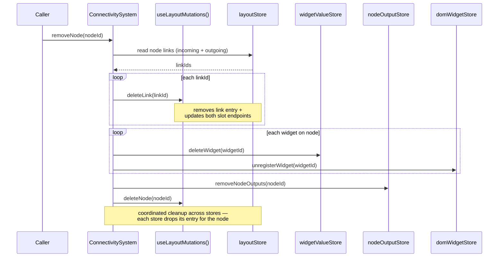

### Key Differences

| Aspect              | Current                                          | ECS                                                                                             |
| ------------------- | ------------------------------------------------ | ----------------------------------------------------------------------------------------------- |
| Lines of code       | ~107 in one method                               | ~30 in system function                                                                          |
| Entity types known  | Graph knows about all 6+ types                   | ConnectivitySystem coordinates layoutStore + widget/output stores                               |
| Cleanup             | Manual per-slot, per-link, per-reroute           | `deleteLink()`/`deleteNode()` mutations per layout entry                                        |
| Canvas notification | `setDirtyCanvas()` called explicitly             | Vue reactivity: components re-render when store entries change                                  |
| Store cleanup       | WidgetValueStore/LayoutStore NOT cleaned up      | Coordinated: `deleteWidget`, `deleteLink`/`deleteNode`, `removeNodeOutputs`, `unregisterWidget` |
| Undo/redo           | `beforeChange()`/`afterChange()` manually placed | Layout mutations are command records, replayable and undoable                                   |
| Testability         | Needs full LGraph + LGraphCanvas                 | Needs only the relevant stores + ConnectivitySystem                                             |

## 2. Serialization

### Current Flow

`LGraph.serialize()` → `asSerialisable()` — walks every collection manually:

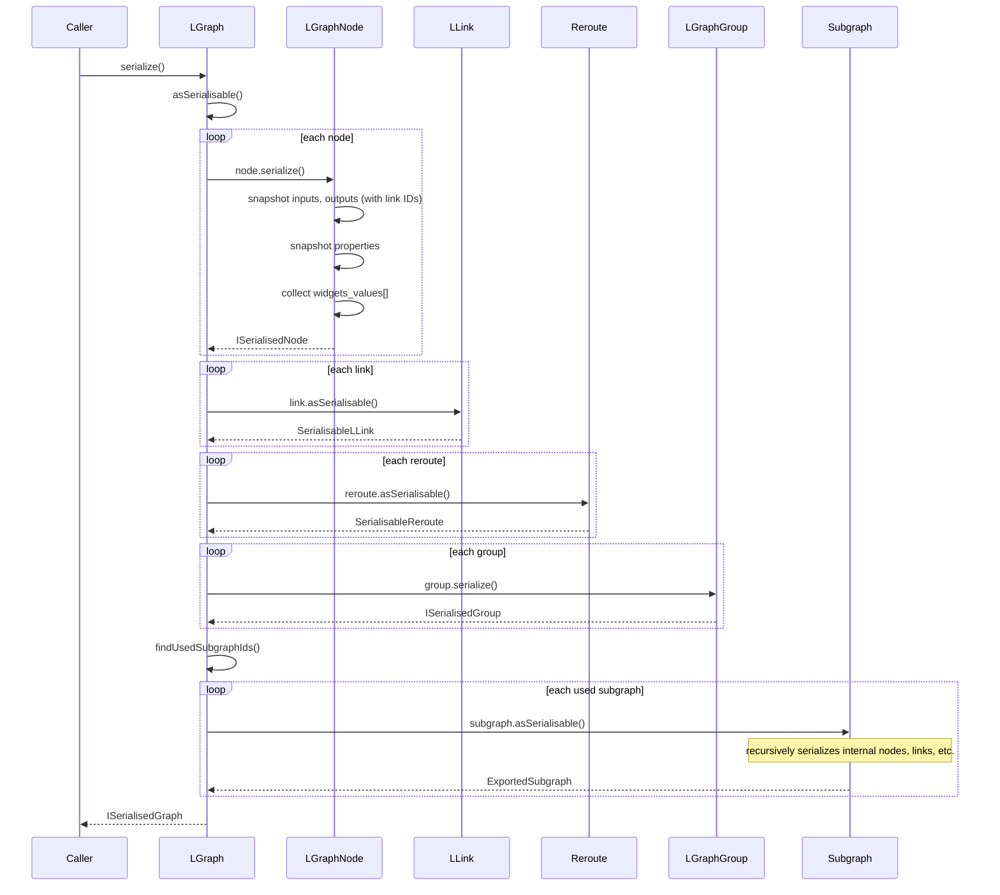

Problems: serialization logic lives in 6 different `serialize()` methods across 6 classes. Widget values are collected inline during node serialization. The graph walks its own collections — no separation of "what to serialize" from "how to serialize."

### ECS Flow

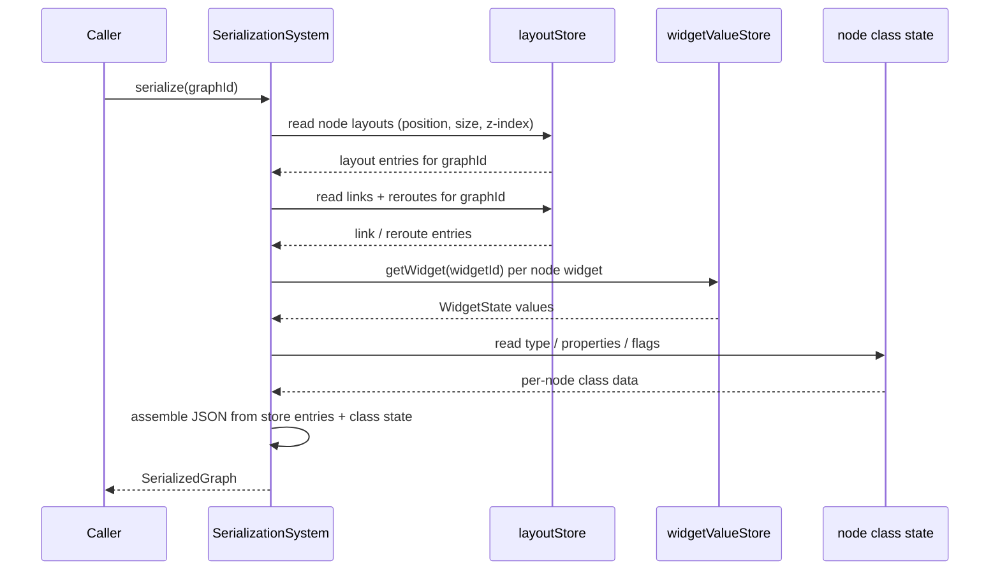

### Key Differences

| Aspect                 | Current                                         | ECS                                                       |
| ---------------------- | ----------------------------------------------- | --------------------------------------------------------- |
| Serialization logic    | Spread across 6 classes (`serialize()` on each) | Single SerializationSystem reading the stores             |
| Widget values          | Collected inline during `node.serialize()`      | `widgetValueStore.getWidget(widgetId)` read directly      |
| Subgraph recursion     | `asSerialisable()` recursively calls itself     | Flat read — layout entries carry scope tags, no recursion |
| Adding a new component | Modify the entity's `serialize()` method        | Read one more store in SerializationSystem                |
| Testing                | Need full object graph to test serialization    | Seed the stores with test entries                         |

## 3. Deserialization

### Current Flow

`LGraph.configure(data)` — ~180 lines, two-phase node creation:

```mermaid
sequenceDiagram
    participant Caller
    participant G as LGraph
    participant N as LGraphNode
    participant L as LLink
    participant WVS as WidgetValueStore

    Caller->>G: configure(data)
    G->>G: clear() [destroy all existing entities]
    G->>G: _configureBase(data) [set id, extra]

    loop each serialized link
        G->>L: LLink.create(linkData)
        G->>G: _links.set(link.id, link)
    end

    loop each serialized reroute
        G->>G: setReroute(rerouteData)
    end

    opt has subgraph definitions
        G->>G: deduplicateSubgraphNodeIds()
        loop each subgraph (topological order)
            G->>G: createSubgraph(data)
        end
    end

    rect rgb(60, 40, 40)
        Note over G,N: Phase 1: Create nodes (unlinked)
        loop each serialized node
            G->>N: LiteGraph.createNode(type)
            G->>G: graph.add(node) [assigns ID]
        end
    end

    rect rgb(40, 60, 40)
        Note over G,N: Phase 2: Configure nodes (links now resolvable)
        loop each node
            G->>N: node.configure(nodeData)
            N->>N: create slots, restore properties
            N->>N: resolve links from graph._links
            N->>N: restore widget values
            N->>WVS: widget.setNodeId() → register in store
            N->>N: fire onConnectionsChange per linked slot
        end
    end

    G->>G: add floating links
    G->>G: validate reroutes
    G->>G: _removeDuplicateLinks()

    loop each serialized group
        G->>G: create + configure group
    end

    G->>G: updateExecutionOrder()
```

Problems: two-phase creation is necessary because nodes need to reference each other's links during configure. Widget value restoration happens deep inside `node.configure()`. Store population is a side effect of configuration. Subgraph creation requires topological sorting to handle nested subgraphs.

### ECS Flow

```mermaid
sequenceDiagram
    participant Caller
    participant SS as SerializationSystem
    participant LM as useLayoutMutations()
    participant WVS as widgetValueStore
    participant ES as ExecutionSystem

    Caller->>SS: deserialize(graphId, data)

    SS->>WVS: clearGraph(graphId)
    Note over SS,WVS: drop stale widget entries for this graph

    Note over SS,LM: All entries created in one pass — no two-phase needed

    loop each node in data
        SS->>LM: createNode(nodeId, { position, size, ... })
    end

    loop each link in data
        SS->>LM: createLink(linkId, source, target)
    end

    Note over SS,LM: links reference node + slot IDs directly,<br/>no instance resolution needed

    loop each widget in data
        SS->>WVS: registerWidget(widgetId, { value, ... })
    end

    SS->>SS: create reroutes, groups via layout mutations;<br/>subgraph scopes tagged on entries

    Note over SS,ES: Systems read the populated stores

    SS->>ES: computeExecutionOrder(graphId)
```

### Key Differences

| Aspect             | Current                                                                    | ECS                                                          |
| ------------------ | -------------------------------------------------------------------------- | ------------------------------------------------------------ |
| Two-phase creation | Required (nodes must exist before link resolution)                         | Not needed — links reference string IDs, not instances       |
| Widget restoration | Hidden inside `node.configure()` line ~900                                 | Explicit: `widgetValueStore.registerWidget(widgetId, state)` |
| Store population   | Side effect of `widget.setNodeId()`                                        | Direct: writing the store entry is the population            |
| Callback cascade   | `onConnectionsChange`, `onInputAdded`, `onConfigure` fire during configure | No callbacks — systems read the stores after deserialization |
| Subgraph ordering  | Topological sort required                                                  | Flat write — scope tags on entries, no instance ordering     |
| Error handling     | Failed node → placeholder with `has_errors=true`                           | Failed entry → skip; entries that loaded are still valid     |

## 4. Pack Subgraph

### Current Flow

`LGraph.convertToSubgraph(items)` — clones nodes, computes boundaries, creates SubgraphNode:

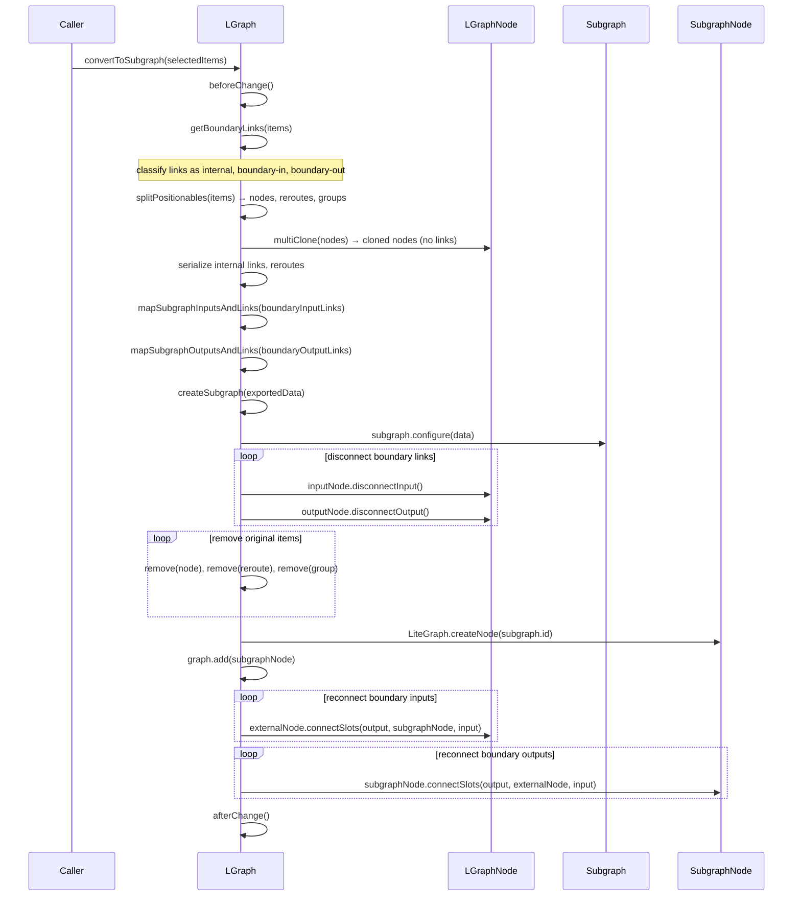

Problems: 200+ lines in one method. Manual boundary link analysis. Clone-serialize-configure dance. Disconnect-remove-recreate-reconnect sequence with many intermediate states where the graph is inconsistent.

### ECS Flow

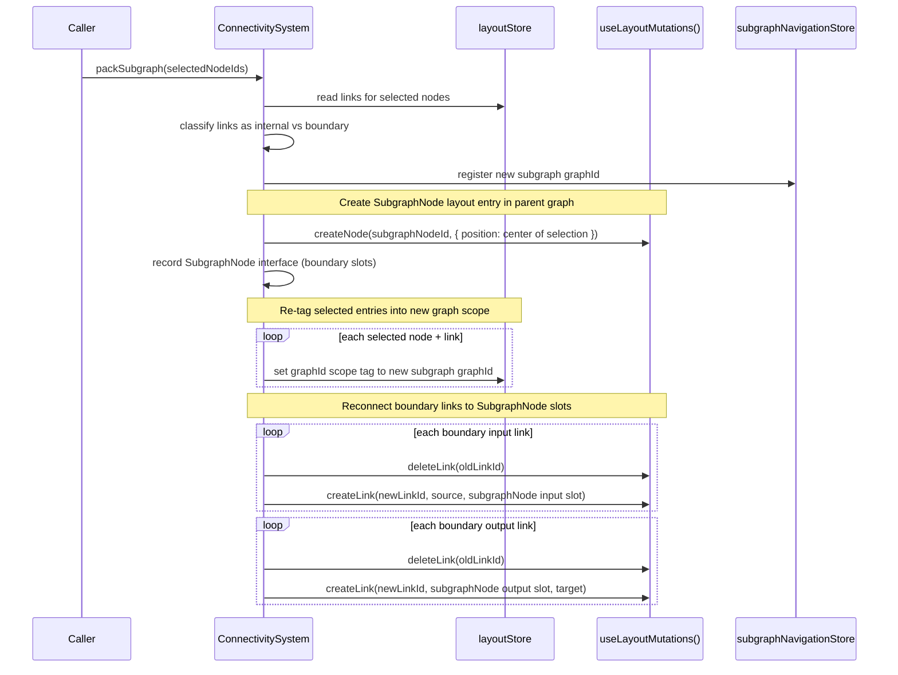

### Key Differences

| Aspect                     | Current                                           | ECS                                                          |
| -------------------------- | ------------------------------------------------- | ------------------------------------------------------------ |
| Entity movement            | Clone → serialize → configure → remove originals  | Re-tag entries: change graphId scope tag on store entries    |
| Boundary links             | Disconnect → remove → recreate → reconnect        | `deleteLink`/`createLink` against the new SubgraphNode slots |
| Intermediate inconsistency | Graph is partially disconnected during operation  | Mutations batch together as one command sequence             |
| Code size                  | 200+ lines                                        | ~50 lines in system                                          |
| Undo                       | `beforeChange()`/`afterChange()` wraps everything | Layout mutation commands replay and undo as a batch          |

## 5. Unpack Subgraph

### Current Flow

`LGraph.unpackSubgraph(subgraphNode)` — clones internal nodes, remaps IDs, reconnects boundary:

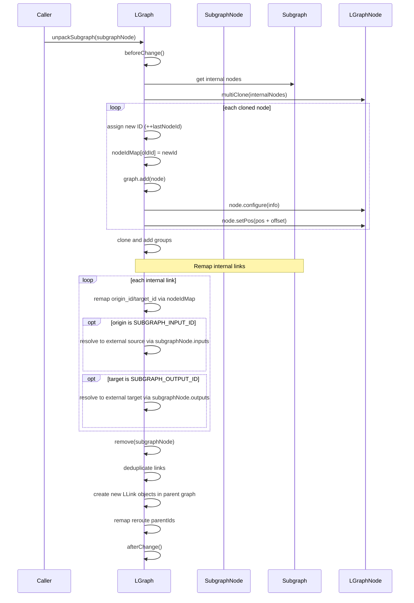

Problems: ID remapping is complex and error-prone. Magic IDs (SUBGRAPH_INPUT_ID = -10, SUBGRAPH_OUTPUT_ID = -20) require special-case handling. Boundary link resolution requires looking up the SubgraphNode's slots to find external connections.

### ECS Flow

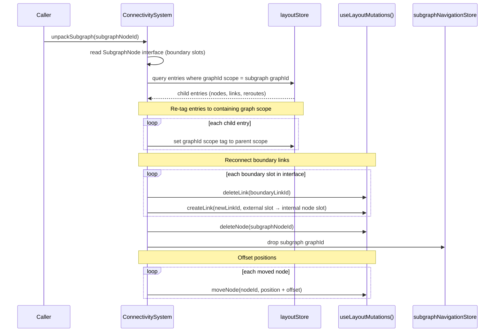

### Key Differences

| Aspect            | Current                                             | ECS                                                               |
| ----------------- | --------------------------------------------------- | ----------------------------------------------------------------- |
| ID remapping      | `nodeIdMap[oldId] = newId` for every node and link  | No remapping — entries keep their IDs, only the scope tag changes |
| Magic IDs         | SUBGRAPH_INPUT_ID = -10, SUBGRAPH_OUTPUT_ID = -20   | No magic IDs — boundary modeled as SubgraphNode interface slots   |
| Clone vs move     | Clone nodes, assign new IDs, configure from scratch | Re-tag store entries between scopes                               |
| Link reconnection | Remap origin_id/target_id, create new LLink objects | `deleteLink`/`createLink` against the resolved endpoints          |
| Complexity        | ~200 lines with deduplication and reroute remapping | ~40 lines, no remapping needed                                    |

## 6. Connect Slots

### Current Flow

`LGraphNode.connectSlots()` — creates link, updates both endpoints, handles reroutes:

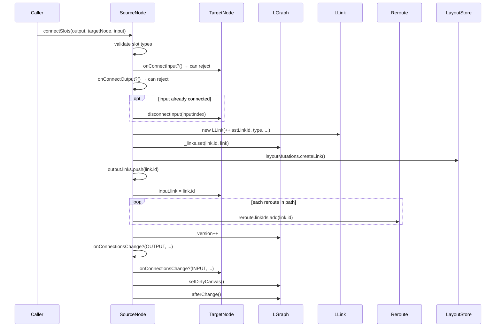

Problems: the source node orchestrates everything — it reaches into the graph's link map, the target node's slot, the layout store, the reroute chain, and the version counter. 19 steps in one method.

### ECS Flow

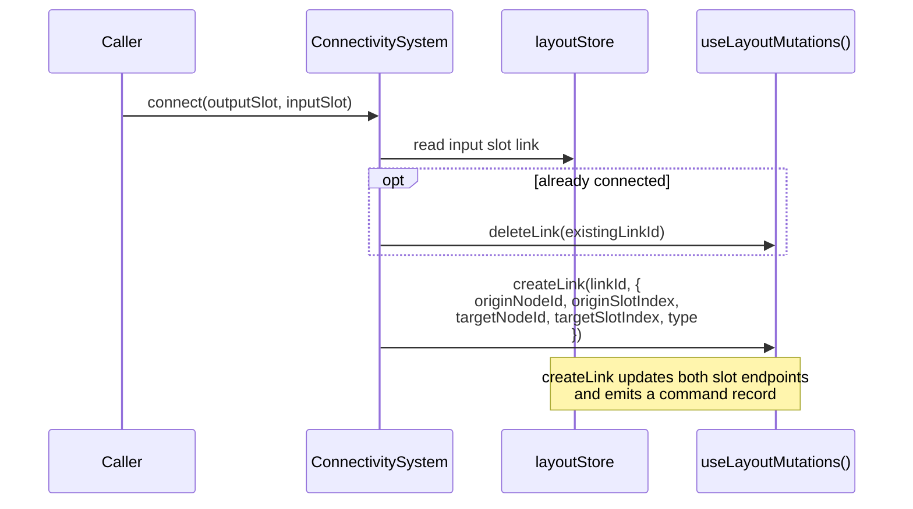

### Key Differences

| Aspect           | Current                                                      | ECS                                                           |
| ---------------- | ------------------------------------------------------------ | ------------------------------------------------------------- |
| Orchestrator     | Source node (reaches into graph, target, reroutes)           | ConnectivitySystem (reads layoutStore)                        |
| Side effects     | `_version++`, `setDirtyCanvas()`, `afterChange()`, callbacks | `createLink()` command — endpoints + change tracking included |
| Reroute handling | Manual: iterate chain, add linkId to each                    | Reroute entries updated via layout mutations                  |
| Slot mutation    | Direct: `output.links.push()`, `input.link = id`             | `createLink(linkId, ...)` updates both endpoints              |
| Validation       | `onConnectInput`/`onConnectOutput` callbacks on nodes        | Validation system or guard function                           |

## 7. Copy / Paste

### Current Flow

Copy: serialize selected items → clipboard. Paste: deserialize with new IDs.

```mermaid
sequenceDiagram
    participant User
    participant C as LGraphCanvas
    participant G as LGraph
    participant N as LGraphNode
    participant CB as Clipboard

    rect rgb(40, 40, 60)
        Note over User,CB: Copy
        User->>C: Ctrl+C
        C->>C: _serializeItems(selectedItems)
        loop each selected node
            C->>N: node.clone().serialize()
            C->>C: collect input links
        end
        C->>C: collect groups, reroutes
        C->>C: recursively collect subgraph definitions
        C->>CB: localStorage.setItem(JSON.stringify(data))
    end

    rect rgb(40, 60, 40)
        Note over User,CB: Paste
        User->>C: Ctrl+V
        C->>CB: localStorage.getItem()
        C->>C: _deserializeItems(parsed)

        C->>C: remap subgraph IDs (new UUIDs)
        C->>C: deduplicateSubgraphNodeIds()
        C->>G: beforeChange()

        loop each subgraph
            C->>G: createSubgraph(data)
        end
        loop each node (id=-1 forces new ID)
            C->>G: graph.add(node)
            C->>N: node.configure(info)
        end
        loop each reroute
            C->>G: setReroute(data)
            C->>C: remap parentIds
        end
        loop each link
            C->>N: outNode.connect(slot, inNode, slot)
        end

        C->>C: offset positions to cursor
        C->>C: selectItems(created)
        C->>G: afterChange()
    end
```

Problems: clone-serialize-parse-remap-deserialize dance. Every entity type has
its own ID remapping logic. Subgraph IDs, node IDs, reroute IDs, and link
parent IDs all remapped independently. ~300 lines across multiple methods.

### ECS Flow

```mermaid
sequenceDiagram
    participant User
    participant CS as ClipboardSystem
    participant LS as layoutStore
    participant WVS as widgetValueStore
    participant LM as useLayoutMutations()
    participant CB as Clipboard

    rect rgb(40, 40, 60)
        Note over User,CB: Copy
        User->>CS: copy(selectedNodeIds)
        CS->>LS: snapshot layout entries (nodes, links, reroutes)
        CS->>WVS: snapshot WidgetState for each widgetId
        CS->>CB: store cross-store snapshot
    end

    rect rgb(40, 60, 40)
        Note over User,CB: Paste
        User->>CS: paste(position)
        CS->>CB: retrieve snapshot

        CS->>CS: build ID remap table (old → new nodeId / WidgetId)

        loop each node in snapshot
            CS->>LM: createNode(newNodeId, remapped layout)
        end
        loop each link in snapshot
            CS->>LM: createLink(newLinkId, remapped endpoints)
            Note over CS,LM: node + slot refs remapped via table
        end
        loop each widget in snapshot
            CS->>WVS: registerWidget(newWidgetId, WidgetState)
        end

        CS->>LM: batchMoveNodes(offset all to cursor)
    end
```

### Key Differences

| Aspect               | Current                                                            | ECS                                                           |
| -------------------- | ------------------------------------------------------------------ | ------------------------------------------------------------- |
| Copy format          | Clone → serialize → JSON (format depends on class)                 | Store-entry snapshot (uniform shape across stores)            |
| ID remapping         | Separate logic per entity type (nodes, reroutes, subgraphs, links) | One remap table applied to string keys (`nodeId`, `WidgetId`) |
| Paste reconstruction | `createNode()` → `add()` → `configure()` → `connect()` per node    | `createNode`/`createLink`/`registerWidget` per entry (flat)   |
| Subgraph handling    | Recursive clone + UUID remap + deduplication                       | Snapshot carries scope tags; remap rewrites graphId keys      |
| Code complexity      | ~300 lines across 4 methods                                        | ~60 lines in one system                                       |

## Summary: Cross-Cutting Benefits

| Benefit                       | Scenarios Where It Applies                                                                           |
| ----------------------------- | ---------------------------------------------------------------------------------------------------- |
| **Batched operations**        | Node Removal, Pack/Unpack — mutations apply together as one command sequence                         |
| **No scattered `_version++`** | All scenarios — layout mutation commands carry change tracking                                       |
| **No callback cascades**      | Deserialization, Connect — systems read the stores instead of firing callbacks                       |
| **Uniform ID handling**       | Copy/Paste, Unpack — one remap table over string keys instead of per-type logic                      |
| **Coordinated cleanup**       | Node Removal — `deleteWidget` + `deleteLink`/`deleteNode` + `removeNodeOutputs` + `unregisterWidget` |
| **No two-phase creation**     | Deserialization — store entries reference string IDs, not instances                                  |
| **Move instead of clone**     | Pack/Unpack — entries keep their IDs, only the scope tag changes                                     |
| **Testable in isolation**     | All scenarios — seed the relevant stores, test one system                                            |
| **Undo/redo for free**        | All scenarios — layout mutation commands replay and undo                                             |
