# ECS Target Architecture

This document describes the target ECS architecture for the litegraph entity system. It shows how the entities and interactions from the [current system](entity-interactions.md) transform under ECS, and how the [structural problems](entity-problems.md) are resolved. For the full design rationale, see [ADR 0008](../adr/0008-entity-component-system.md).

## 1. World Overview

The World is the single source of truth for all entity state. Entities are just branded IDs. Components are plain data objects. Systems are functions that query the World.

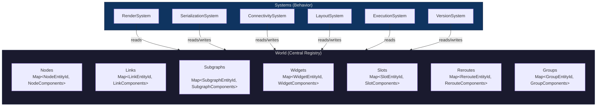

### Entity IDs

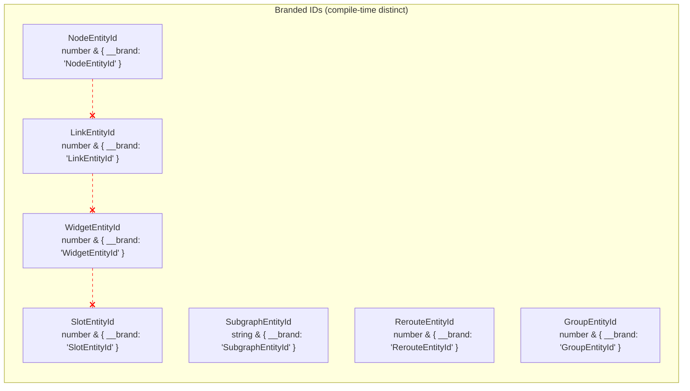

Red dashed lines = compile-time errors if mixed. No more accidentally passing a `LinkId` where a `NodeId` is expected.

## 2. Component Composition

### Node: Before vs After

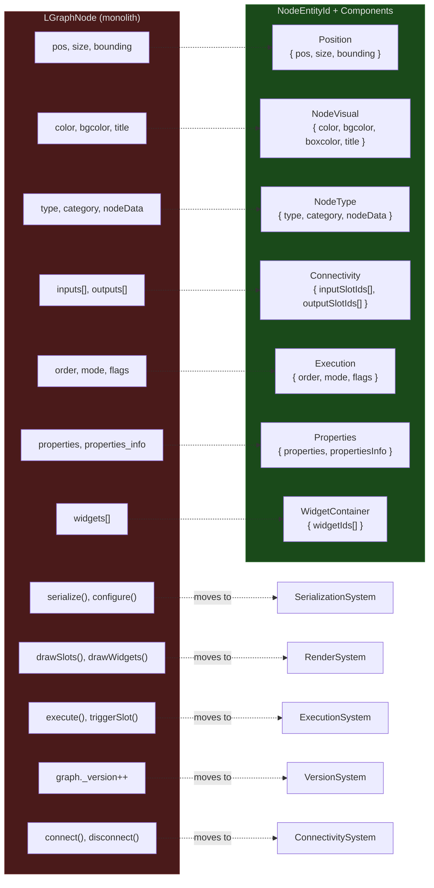

### Link: Before vs After

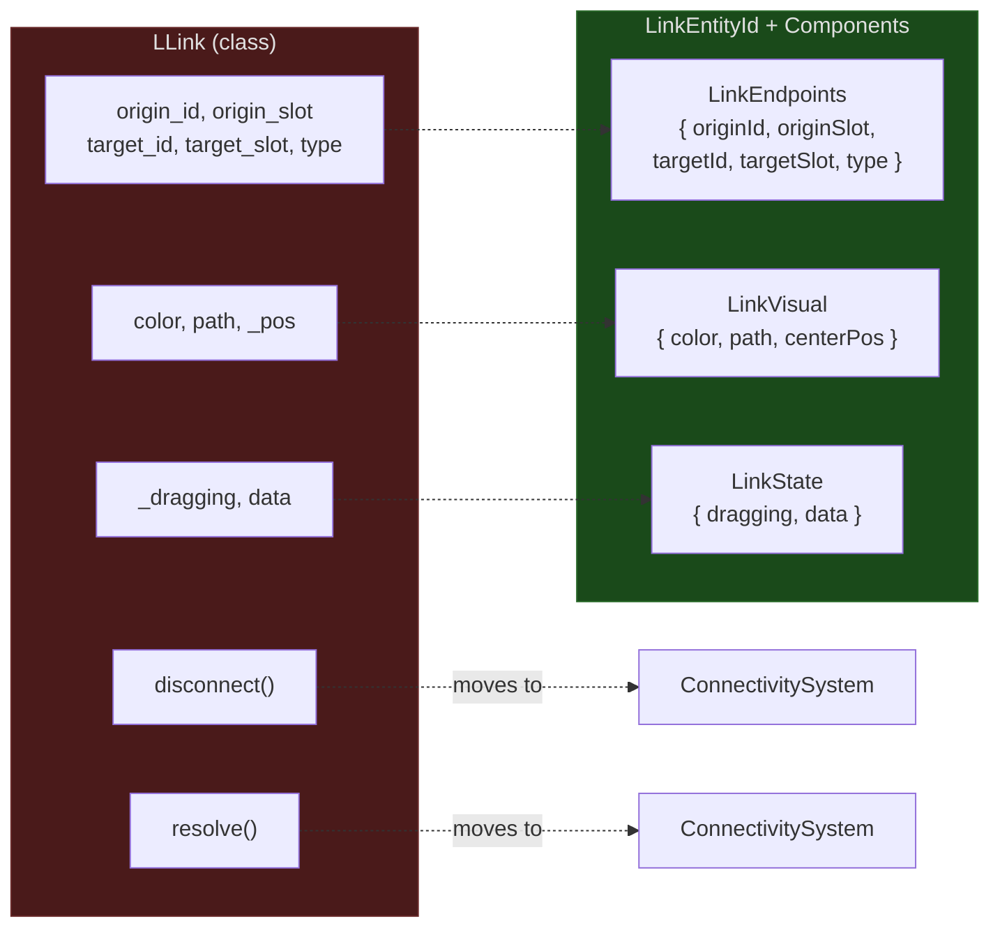

### Widget: Before vs After

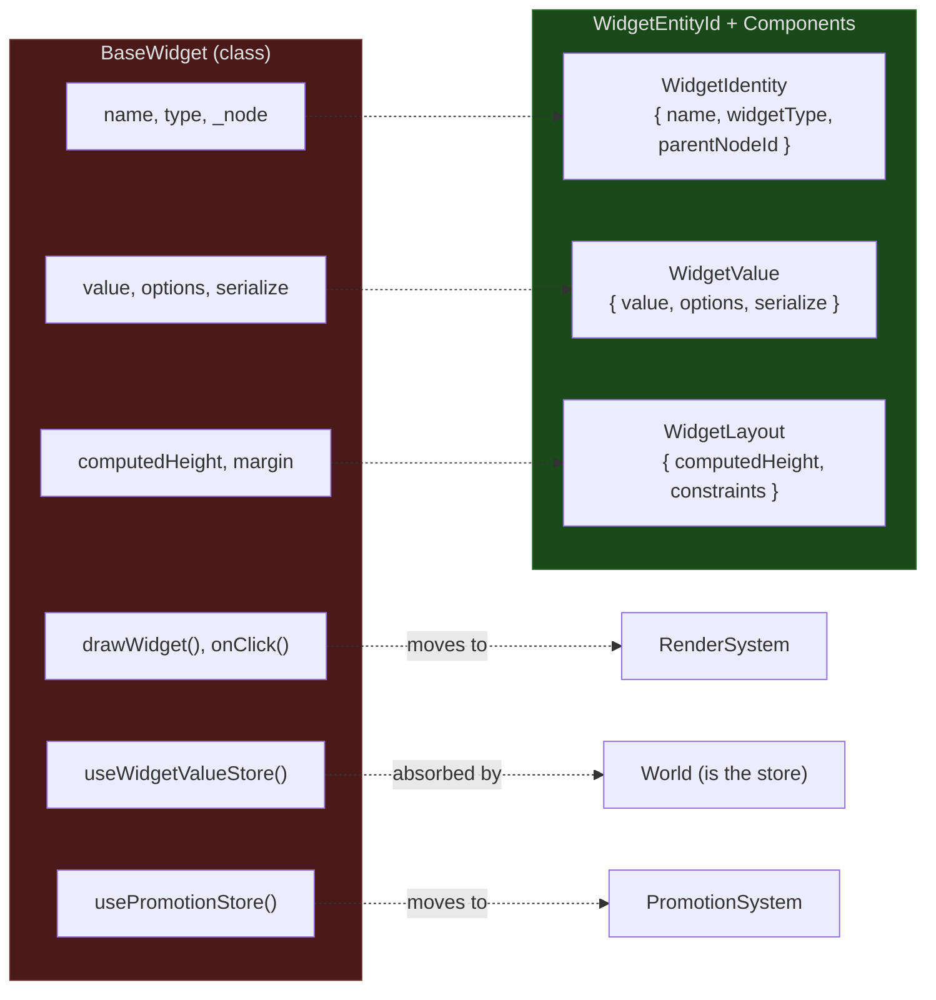

## 3. System Architecture

Systems are pure functions that query the World for entities with specific component combinations. Each system owns exactly one concern.

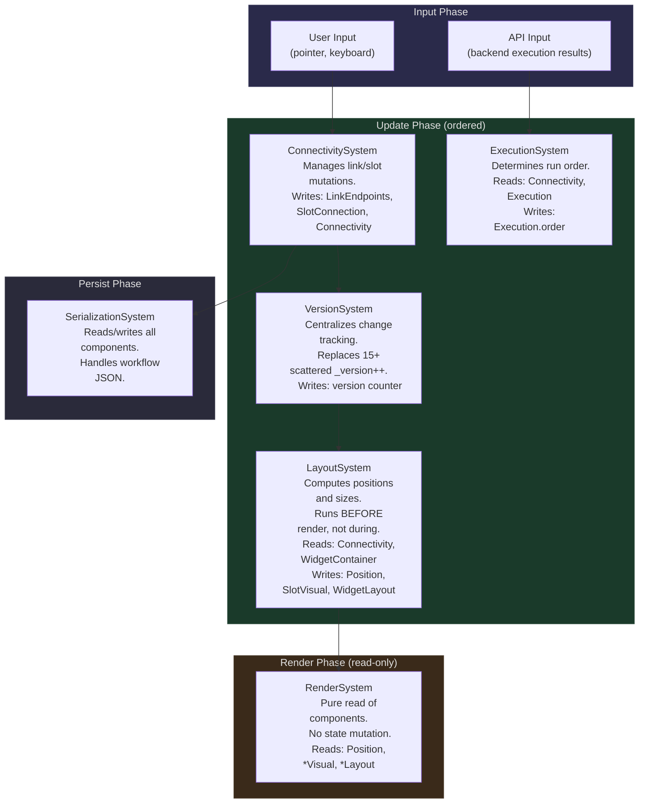

### System-Component Access Matrix

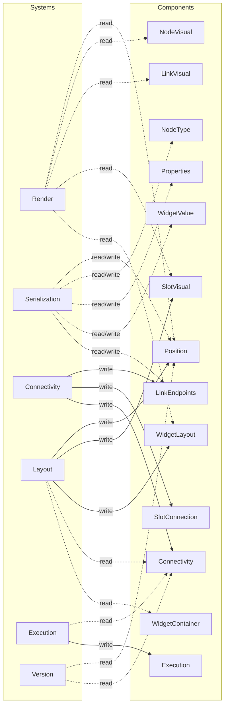

## 4. Dependency Flow

### Before: Tangled References

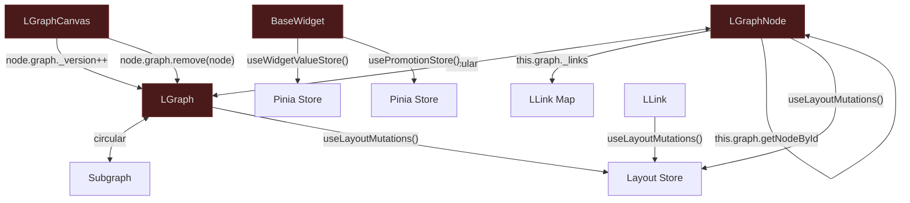

### After: Unidirectional Data Flow

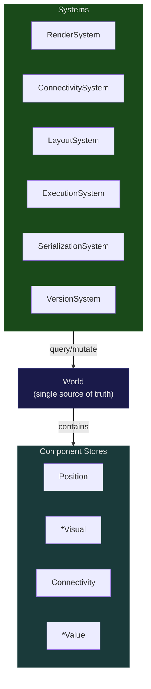

Key differences:

- **No circular dependencies**: entities are IDs, not class instances
- **No Demeter violations**: systems query the World directly, never reach through entities
- **No scattered store access**: the World _is_ the store; systems are the only writers
- **Unidirectional**: Input → Systems → World → Render (no back-edges)

## 5. Problem Resolution Map

How each problem from [entity-problems.md](entity-problems.md) is resolved:

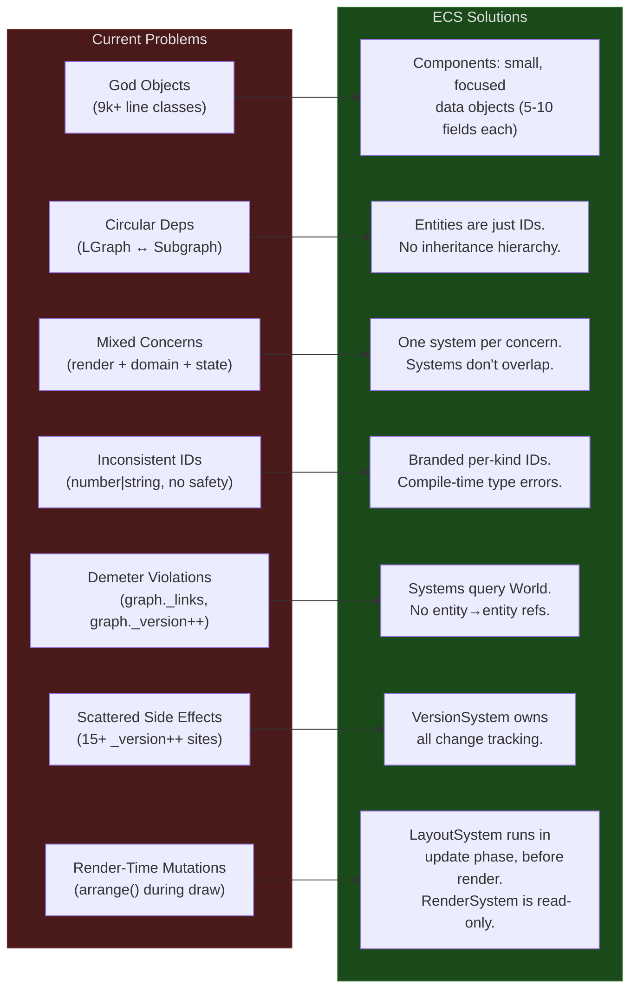

## 6. Migration Bridge

The migration is incremental. During the transition, a bridge layer keeps legacy class properties and ECS components in sync.

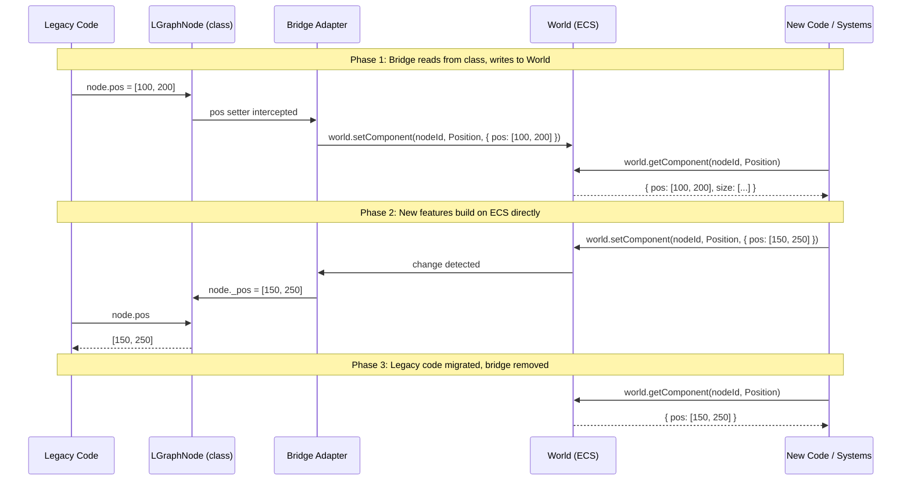

### Migration Phases

```mermaid
graph LR
    subgraph Phase1["Phase 1: Types Only"]
        T1["Define branded IDs"]
        T2["Define component interfaces"]
        T3["Define World type"]
    end

    subgraph Phase2["Phase 2: Bridge"]
        B1["Bridge adapters
        class ↔ World sync"]
        B2["New features use
        World as source"]
        B3["Old code unchanged"]
    end

    subgraph Phase3["Phase 3: Extract"]
        E1["Migrate one component
        at a time"]
        E2["Deprecate class
        properties"]
        E3["Systems replace
        methods"]
    end

    subgraph Phase4["Phase 4: Clean"]
        C1["Remove bridge"]
        C2["Remove legacy classes"]
        C3["Systems are sole
        behavior layer"]
    end

    Phase1 --> Phase2 --> Phase3 --> Phase4

    style Phase1 fill:#1a2a4a,stroke:#2a3a5a,color:#e0e0e0
    style Phase2 fill:#1a3a3a,stroke:#2a4a4a,color:#e0e0e0
    style Phase3 fill:#2a3a1a,stroke:#3a4a2a,color:#e0e0e0
    style Phase4 fill:#1a4a1a,stroke:#2a6a2a,color:#e0e0e0
```
