# Entity Interactions (Current System)

This document maps the relationships and interaction patterns between all entity types in the litegraph layer as it exists today. It serves as a baseline for the ECS migration planned in [ADR 0008](../adr/0008-entity-component-system.md).

## Entities

| Entity   | Class         | ID Type         | Primary Location                              |
| -------- | ------------- | --------------- | --------------------------------------------- |
| Graph    | `LGraph`      | `UUID`          | `src/lib/litegraph/src/LGraph.ts`             |
| Node     | `LGraphNode`  | `NodeId`        | `src/lib/litegraph/src/LGraphNode.ts`         |
| Link     | `LLink`       | `LinkId`        | `src/lib/litegraph/src/LLink.ts`              |
| Subgraph | `Subgraph`    | `UUID`          | `src/lib/litegraph/src/LGraph.ts` (ECS: node component, not separate entity) |
| Widget   | `BaseWidget`  | name + nodeId   | `src/lib/litegraph/src/widgets/BaseWidget.ts` |
| Slot     | `SlotBase`    | index on parent | `src/lib/litegraph/src/node/SlotBase.ts`      |
| Reroute  | `Reroute`     | `RerouteId`     | `src/lib/litegraph/src/Reroute.ts`            |
| Group    | `LGraphGroup` | `number`        | `src/lib/litegraph/src/LGraphGroup.ts`        |

Under the ECS model, subgraphs are not a separate entity kind — they are nodes with `SubgraphStructure` and `SubgraphMeta` components. See [Subgraph Boundaries](subgraph-boundaries-and-promotion.md).

## 1. Overview

High-level ownership and reference relationships between all entities.

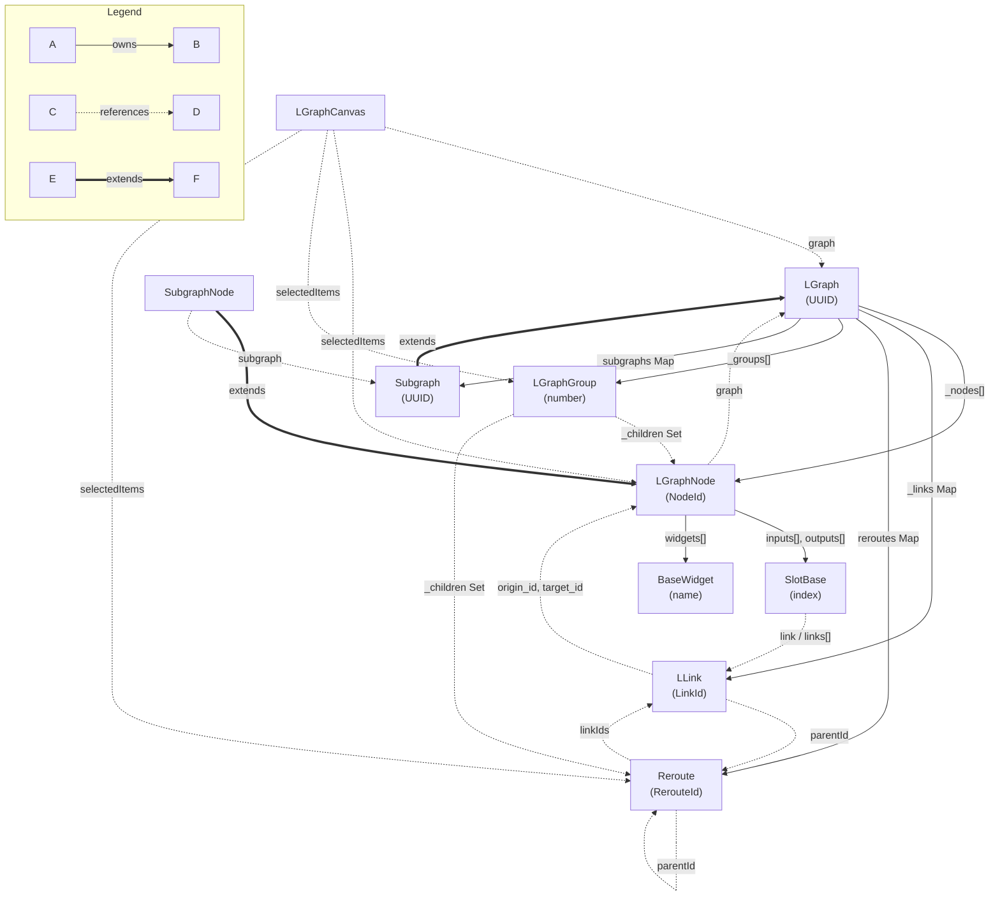

## 2. Connectivity

How Nodes, Slots, Links, and Reroutes form the graph topology.

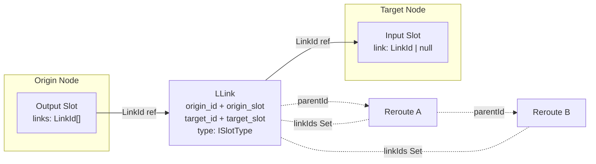

### Subgraph Boundary Connections

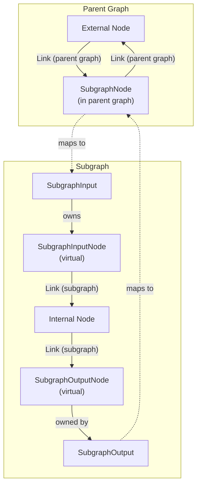

### Floating Links (In-Progress Connections)

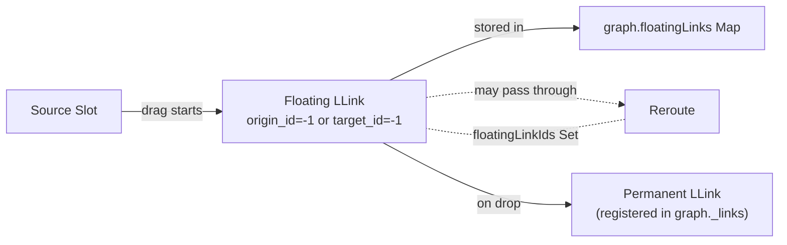

## 3. Rendering

How LGraphCanvas draws each entity type.

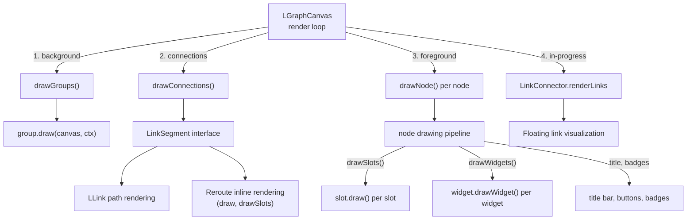

### Rendering Order Detail

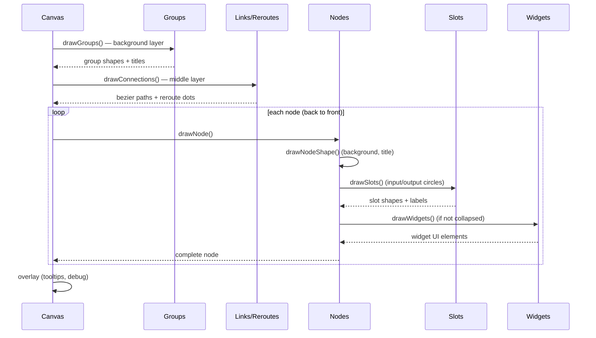

## 4. Lifecycle

Creation and destruction flows for each entity.

### Node Lifecycle

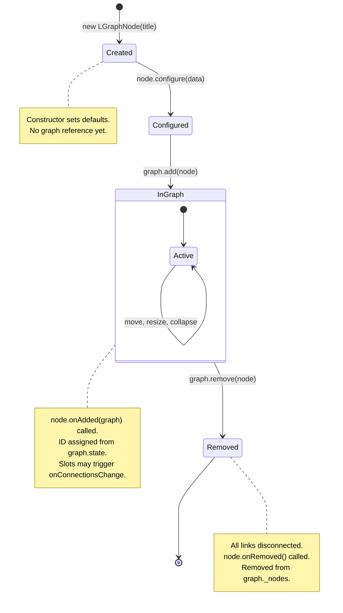

### Link Lifecycle

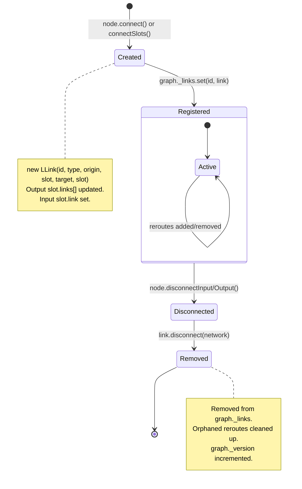

### Widget Lifecycle

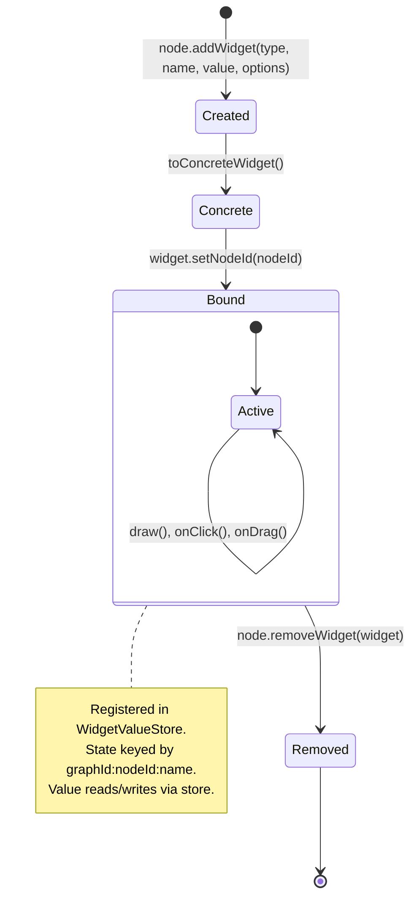

### Subgraph Lifecycle

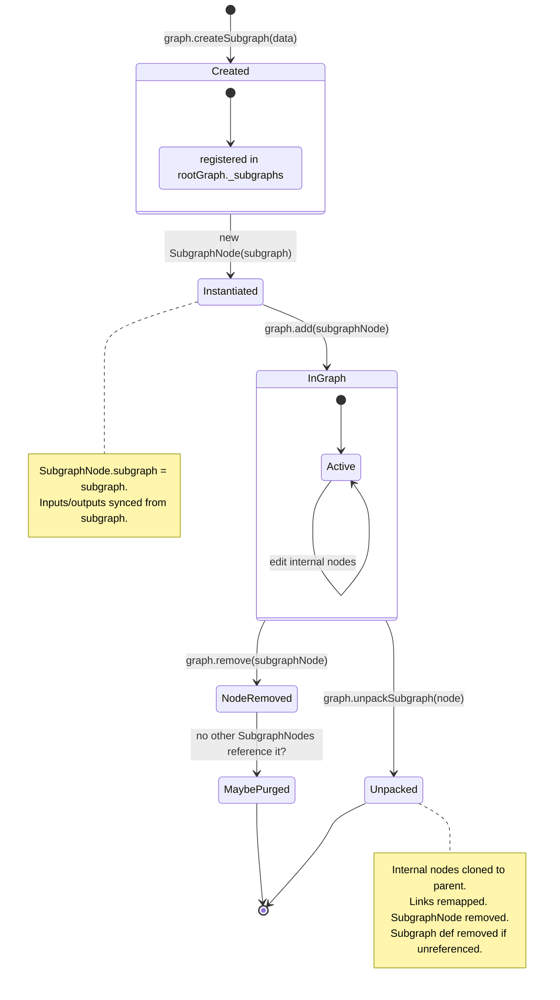

## 5. State Management

External stores and their relationships to entities.

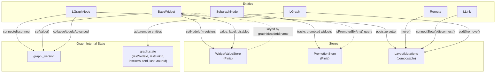

### Change Notification Flow

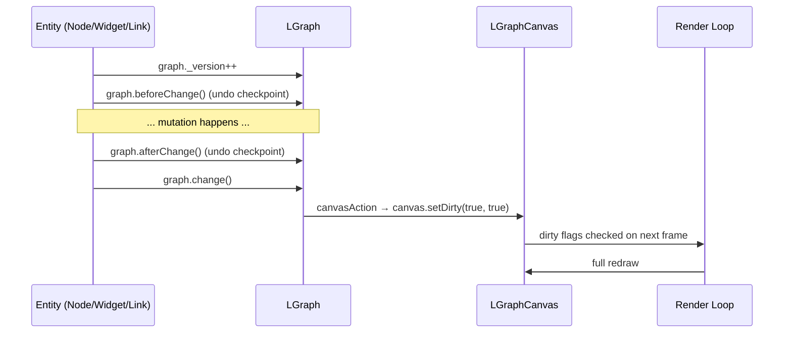

### Widget State Delegation

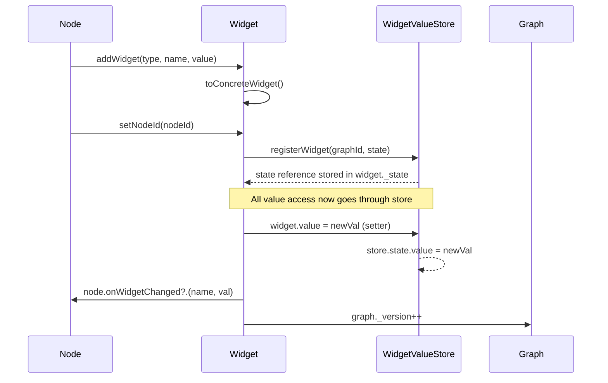
