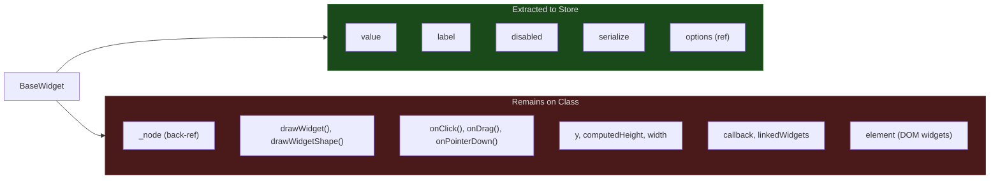
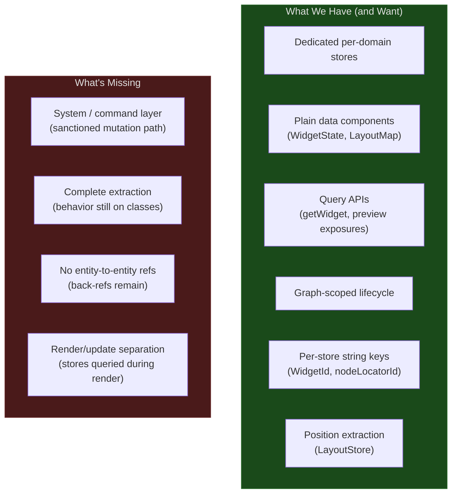
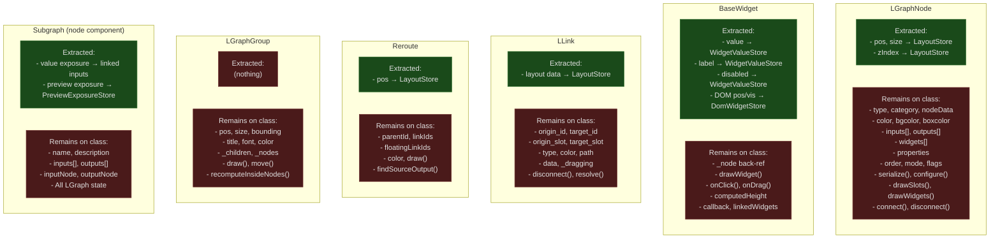

# Proto-ECS: Existing State Extraction

The codebase has already begun extracting entity state into external Pinia stores — an organic, partial migration toward the ECS principles described in [ADR 0008](../adr/0008-entity-component-system.md). This document catalogs those stores, analyzes how they align with the ECS target, and identifies what remains to be extracted.

For the full problem analysis, see [Entity Problems](entity-problems.md). For the ECS target, see [ECS Target Architecture](ecs-target-architecture.md).

## 1. What's Already Extracted

Six dedicated stores extract entity state out of class instances into focused,
queryable registries, each owning one concern. Promoted value-widget topology is
no longer a store; ADR 0009 represents it as ordinary linked `SubgraphInput`
state, and promoted value data lives in `WidgetValueStore` keyed by the input's
`WidgetId`.

| Store                   | Extracts From       | Scoping           | Key Format                         | Data Shape                    |
| ----------------------- | ------------------- | ----------------- | ---------------------------------- | ----------------------------- |
| WidgetValueStore        | `BaseWidget`        | `graphId`         | `WidgetId` (`graphId:nodeId:name`) | Plain `WidgetState` object    |
| DomWidgetStore          | `BaseDOMWidget`     | Global            | `widgetId` (UUID)                  | Position, visibility, z-index |
| LayoutStore             | Node, Link, Reroute | Workflow-level    | `nodeId`, `linkId`, `rerouteId`    | Y.js CRDT maps (pos, size)    |
| NodeOutputStore         | Execution results   | `nodeLocatorId`   | `"${subgraphId}:${nodeId}"`        | Output data, preview URLs     |
| SubgraphNavigationStore | Canvas viewport     | `subgraphId`      | `subgraphId` or `'root'`           | LRU viewport cache            |
| PreviewExposureStore    | Subgraph host node  | host node locator | host locator + exposure name       | Display-only preview state    |

ADR 0009 refines promoted-widget identity: promoted value widgets are keyed by
the host boundary (`host node locator + SubgraphInput.name`), while interior
source node/widget identity is migration and diagnostic metadata only.

## 2. WidgetValueStore

**File:** `src/stores/widgetValueStore.ts`

The closest thing to a true ECS component store in the codebase today.

### State Shape

```
Map<UUID, Map<WidgetId, WidgetState>>
     │              │           │
     graphId   "graphId:nodeId:name"  pure data object
```

`WidgetState` is a plain data object with no methods:

| Field       | Type             | Purpose                                    |
| ----------- | ---------------- | ------------------------------------------ |
| `nodeId`    | `NodeId`         | Owning node                                |
| `name`      | `string`         | Widget name                                |
| `type`      | `string`         | Widget type (e.g., `'number'`, `'toggle'`) |
| `value`     | `TWidgetValue`   | Current value                              |
| `label`     | `string?`        | Display label                              |
| `disabled`  | `boolean?`       | Disabled state                             |
| `serialize` | `boolean?`       | Whether to include in workflow JSON        |
| `options`   | `IWidgetOptions` | Configuration                              |

### Two-Phase Delegation

**Phase 1 — Construction:** Widget creates a local `_state` object with initial values.

**Phase 2 — `setNodeId()`:** Widget replaces its `_state` with a reference to the store's object:

```
widget._state = useWidgetValueStore().registerWidget(widgetId, { ...this._state, nodeId })
```

After registration, the widget's getters/setters (`value`, `label`, `disabled`) are pass-throughs to the store. Mutations to the widget automatically sync to the store via shared object reference.

### What's Extracted vs What Remains



### ECS Alignment

| Aspect                      | ECS-like | Why                                               |
| --------------------------- | -------- | ------------------------------------------------- |
| `WidgetState` is plain data | Yes      | No methods, serializable, reactive                |
| Graph-scoped lifecycle      | Yes      | `clearGraph(graphId)` cleans up                   |
| Query API                   | Yes      | `getWidget()`, `getNodeWidgets()`                 |
| Cross-subgraph sync         | Yes      | Same nodeId:name shares state across depths       |
| Back-reference (`_node`)    | **No**   | Widget still holds owning node ref                |
| Behavior on class           | **No**   | Drawing, events, callbacks still on widget        |
| Module-scope store access   | **No**   | `useWidgetValueStore()` called from domain object |

## 3. Linked promoted widgets and preview exposures

`PromotionStore` was removed by ADR 0009. Promoted value widgets are represented
by linked `SubgraphInput`s, and display-only previews are represented by
host-scoped `properties.previewExposures` / `PreviewExposureStore` entries.
Legacy `properties.proxyWidgets` is load-time migration input only.

### Runtime shape

```diagram
╭────────────────╮     ╭──────────────────╮     ╭────────────────╮
│ SubgraphInput  │────▶│ Interior slot     │────▶│ Source widget  │
╰────────────────╯     ╰──────────────────╯     ╰────────────────╯

╭────────────────╮     ╭──────────────────────╮
│ Subgraph host  │────▶│ PreviewExposureStore │
╰────────────────╯     ╰──────────────────────╯
```

A promoted host widget is ordinary `WidgetState` in `WidgetValueStore`, keyed by
the `WidgetId` carried on the `SubgraphInput` (`input.widgetId`). `SubgraphNode.widgets`
is a read-only projection over the node's inputs that resolves each value via
`useWidgetValueStore().getWidget(input.widgetId)`. There is no synthetic widget
view object and no view cache to reconcile (PR 12617 deleted `PromotedWidgetView`
and `PromotedWidgetViewManager`).

### ECS Alignment

| Aspect                       | ECS-like | Why                                                            |
| ---------------------------- | -------- | -------------------------------------------------------------- |
| Canonical topology           | Yes      | Value exposure is ordinary subgraph input/link state           |
| Host-scoped preview state    | Yes      | Preview exposure data is keyed by host locator                 |
| Legacy migration boundary    | Yes      | `proxyWidgets` is consumed into canonical state or quarantine  |
| Promoted value is plain data | Yes      | Host widget is `WidgetState` in the store, keyed by `WidgetId` |
| Projection over data         | Yes      | `SubgraphNode.widgets` derives from inputs; no view cache      |

## 4. LayoutStore (CRDT)

**File:** `src/renderer/core/layout/store/layoutStore.ts`

The most architecturally advanced extraction — uses Y.js CRDTs for collaboration-ready position state.

### State Shape

```
ynodes:    Y.Map<NodeLayoutMap>     // nodeId → { pos, size, zIndex, bounds }
ylinks:    Y.Map<Y.Map<...>>       // linkId → link layout data
yreroutes: Y.Map<Y.Map<...>>       // rerouteId → reroute layout data
```

### Write API

`useLayoutMutations()` (`src/renderer/core/layout/operations/layoutMutations.ts`) provides the mutation API:

- `moveNode(graphId, nodeId, pos)`
- `resizeNode(graphId, nodeId, size)`
- `setNodeZIndex(graphId, nodeId, zIndex)`
- `createLink(graphId, linkId, ...)`
- `removeLink(graphId, linkId)`
- `moveReroute(graphId, rerouteId, pos)`

### The Scattered Access Problem

This composable is called at **module scope** in domain objects:

- `LLink.ts:24` — `const layoutMutations = useLayoutMutations()`
- `Reroute.ts` — same pattern
- `LGraphNode.ts` — imported and called in methods

These module-scope calls create implicit dependencies on the Vue runtime and make the domain objects untestable without a full app context.

### ECS Alignment

| Aspect                       | ECS-like  | Why                                                     |
| ---------------------------- | --------- | ------------------------------------------------------- |
| Position data extracted      | Yes       | Closest to the ECS `Position` component                 |
| CRDT-ready                   | Yes       | Enables collaboration (ADR 0003)                        |
| Covers multiple entity kinds | Yes       | Nodes, links, reroutes in one store                     |
| Mutation API (composable)    | Partially | System-like, but called from entities, not a system     |
| Module-scope access          | **No**    | Domain objects import store at module level             |
| Per-store keying             | Yes       | Owns `nodeId`/`linkId`/`rerouteId` keys for its concern |

## 5. Pattern Analysis

### What These Stores Have in Common (Proto-ECS)

1. **Plain data objects**: `WidgetState`, `DomWidgetState`, CRDT maps are all methods-free data
2. **Centralized registries**: Each store is a `Map<key, data>` — structurally identical to an ECS component store
3. **Graph-scoped lifecycle**: `clearGraph(graphId)` for cleanup (WidgetValueStore, PreviewExposureStore)
4. **Query APIs**: `getWidget()`, preview exposure queries, `getNodeWidgets()` — system-like queries
5. **Separation of data from behavior**: The stores hold data; classes retain behavior

### Target Design and Remaining Gaps

Dedicated per-domain stores with their own string keys are the target, not a way
station toward one unified registry. The remaining gaps are about behavior and
data flow, not about collapsing the stores together.



### Keying Strategy Comparison

Each store owns the identity scheme that fits its concern:

| Store            | Key Format                         | Key Type           | Type-Safe?       |
| ---------------- | ---------------------------------- | ------------------ | ---------------- |
| WidgetValueStore | `WidgetId` (`graphId:nodeId:name`) | branded string     | Yes (`WidgetId`) |
| DomWidgetStore   | Widget UUID                        | UUID (string)      | No               |
| LayoutStore      | Raw nodeId/linkId/rerouteId        | Mixed number types | No               |
| NodeOutputStore  | `"${subgraphId}:${nodeId}"`        | Composite string   | No               |

`WidgetValueStore` already keys on a branded `WidgetId` string (`src/types/widgetId.ts`),
which carries its scope and survives renames at the store layer. The remaining
stores can adopt their own branded string keys where cross-kind safety pays off,
without a shared entity-ID space. For promoted value widgets, ADR 0009 keys on
the host boundary: the input's `WidgetId` (host node locator + `SubgraphInput.name`),
not interior source identity.

## 6. Extraction Map

Current state of extraction for each entity kind:



## 7. Migration Gap Analysis

What each entity needs to reach the ECS target from [ADR 0008](../adr/0008-entity-component-system.md):

| Entity       | Already Extracted                                                                | Still on Class                                                                       | ECS Target Components                                                                | Gap                                                                                        |
| ------------ | -------------------------------------------------------------------------------- | ------------------------------------------------------------------------------------ | ------------------------------------------------------------------------------------ | ------------------------------------------------------------------------------------------ |
| **Node**     | pos, size (LayoutStore)                                                          | type, visual, connectivity, execution, properties, widgets, rendering, serialization | Position, NodeVisual, NodeType, Connectivity, Execution, Properties, WidgetContainer | Large — 6 components unextracted, all behavior on class                                    |
| **Link**     | layout (LayoutStore)                                                             | endpoints, visual, state, connectivity methods                                       | LinkEndpoints, LinkVisual, LinkState                                                 | Medium — 3 components unextracted                                                          |
| **Widget**   | value, label, disabled (WidgetValueStore); DOM state (DomWidgetStore)            | node back-ref, rendering, events, layout                                             | WidgetIdentity, WidgetValue, WidgetLayout                                            | Small — value extraction done; rendering and layout remain                                 |
| **Slot**     | (nothing)                                                                        | name, type, direction, link refs, visual, position                                   | SlotIdentity, SlotConnection, SlotVisual                                             | Full — no extraction started                                                               |
| **Reroute**  | pos (LayoutStore)                                                                | links, visual, chain traversal                                                       | Position, RerouteLinks, RerouteVisual                                                | Medium — position done, rest unextracted                                                   |
| **Group**    | (nothing)                                                                        | pos, size, meta, visual, children                                                    | Position, GroupMeta, GroupVisual, GroupChildren                                      | Full — no extraction started                                                               |
| **Subgraph** | promoted value exposure (linked inputs); preview exposure (PreviewExposureStore) | structure, meta, I/O, all LGraph state                                               | SubgraphStructure, SubgraphMeta (as node components)                                 | Large — mostly unextracted; subgraph is a node with components, not a separate entity kind |

### Priority Order for Extraction

Based on existing progress and problem severity:

1. **Widget** — closest to done (value extraction complete, needs rendering/layout extraction)
2. **Node Position** — already in LayoutStore, needs branded ID and formal component type
3. **Link** — small component set, high coupling pain
4. **Slot** — no extraction yet, but small and self-contained
5. **Reroute** — partially extracted, moderate complexity
6. **Group** — no extraction, but least coupled to other entities
7. **Subgraph** — not a separate entity kind; SubgraphStructure and SubgraphMeta become node components. Depends on Node and Link extraction first. See [Subgraph Boundaries](subgraph-boundaries-and-promotion.md)
