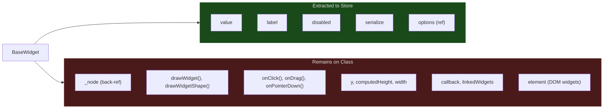
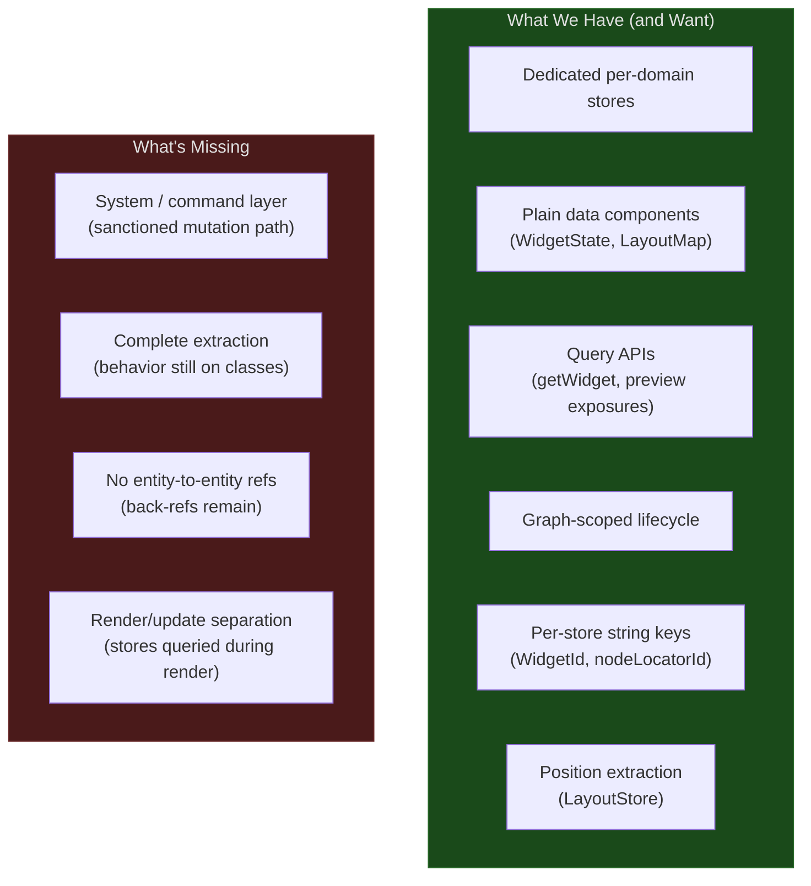

# Proto-ECS: Existing State Extraction

The codebase has already begun extracting entity state into external Pinia stores — an organic, partial migration toward the ECS principles described in [ADR-ECS](../adr/ECS-entity-component-system.md). This document catalogs those stores, analyzes how they align with the ECS target, and identifies what remains to be extracted.

For the full problem analysis, see [Entity Problems](entity-problems.md). For the ECS target, see [ECS Target Architecture](ecs-target-architecture.md).

## 1. What's Already Extracted

Dedicated stores extract entity state out of class instances into focused,
queryable registries, each owning one concern. Promoted value-widget topology is
no longer a store; ADR-PROMOTION represents it as ordinary linked `SubgraphInput`
state, and promoted value data lives in `WidgetValueStore` keyed by the input's
`WidgetId`.

| Store                   | Extracts From                 | Scoping                   | Key Format                                                     | Data Shape                    |
| ----------------------- | ----------------------------- | ------------------------- | -------------------------------------------------------------- | ----------------------------- |
| WidgetValueStore        | `BaseWidget`                  | `graphId`                 | `WidgetId` (`graphId:nodeId:name`)                             | Plain `WidgetState` object    |
| DomWidgetStore          | `BaseDOMWidget`               | Global                    | `widgetId` (UUID)                                              | Position, visibility, z-index |
| LayoutStore             | Node, Group, Reroute geometry | Root workflow             | `makeScopedLayoutKey(rootGraphId, localId)`                    | Y.js CRDT maps (pos, size)    |
| NodeOutputStore         | Execution results             | `nodeLocatorId`           | `"${subgraphUUID}:${nodeId}"`                                  | Output data, preview URLs     |
| SubgraphNavigationStore | Canvas viewport               | `subgraphId`              | `subgraphId` or `'root'`                                       | LRU viewport cache            |
| PreviewExposureStore    | Subgraph host node            | host node locator         | host locator + exposure name                                   | Display-only preview state    |
| LinkStore               | `LLink`                       | Root and owning graph     | `LinkId` primary; owner-qualified target/origin indexes        | Plain `LinkTopology` object   |
| RerouteStore            | `Reroute`                     | Root graph                | `RerouteId`                                                    | Plain `RerouteChain` object   |
| NodeDataStore           | `LGraphNode` shell state      | Root bucket + owner index | Root-unique `NodeId`; `NodeState.graphId` associates the owner | Plain `NodeState` object      |

**Update (2026-07-05):** `LinkStore` (`src/stores/linkStore.ts`, PR #13436) and
`RerouteStore` (`src/stores/rerouteStore.ts`, PR #13449) hold plain-data records
in reactive `Map` buckets — not Y.js — scoped by root graph (subgraphs share
their root's bucket). Every link topology lives in one root-wide identity map;
owner and endpoint indexes provide graph-local iteration and connectivity
queries. Design records:
[Link Topology Store](link-topology-store.md),
[Reroute Chain Store](reroute-chain-store.md).

**Update (2026-07-22):** `NodeDataStore` (`src/stores/nodeDataStore.ts`) holds
one plain `NodeState` per node in root-graph-scoped buckets keyed by `NodeId`.
`NodeState.graphId` and owner indexes provide graph-local membership and
teardown without changing the root-wide identity namespace.
`LGraphNode` adopts the store's reactive proxy as its `_state` and its shell
fields become accessors over it, so there is no copy. This deleted the
`VueNodeData` mirror and all of `useGraphNodeManager`. Design record:
[Node Data Store](node-data-store.md).

**Update (2026-07-14, reversed):** `NodeBadgeStore` shipped in PR #13458 and was
then deleted — badge rows are cheaper to derive on read than to store, so
`src/systems/badgeSystem.ts` computes them from the stores that already own the
inputs. There is no `src/stores/nodeBadgeStore.ts`. See
[Node Badge Store](node-badge-store.md) for the reversal.

ADR-PROMOTION refines promoted-widget identity: promoted value widgets are keyed by
the host boundary (`host node locator + SubgraphInput.name`), while interior
source node/widget identity is migration and diagnostic metadata only.

## 2. WidgetValueStore

**File:** `src/stores/widgetValueStore.ts`

The closest thing to a true ECS component store in the codebase today.

### State Shape

```
Map<UUID, Map<WidgetId, WidgetState>>
     │              │           │
     graphId   "graphId:nodeId:name"  pure data object
```

`WidgetState` is a plain data object with no methods:

| Field       | Type             | Purpose                                    |
| ----------- | ---------------- | ------------------------------------------ |
| `nodeId`    | `NodeId`         | Owning node                                |
| `name`      | `string`         | Widget name                                |
| `type`      | `string`         | Widget type (e.g., `'number'`, `'toggle'`) |
| `value`     | `TWidgetValue`   | Current value                              |
| `label`     | `string?`        | Display label                              |
| `disabled`  | `boolean?`       | Disabled state                             |
| `serialize` | `boolean?`       | Whether to include in workflow JSON        |
| `options`   | `IWidgetOptions` | Configuration                              |

### Two-Phase Delegation

**Phase 1 — Construction:** Widget creates a local `_state` object with initial values.

**Phase 2 — `setNodeId()`:** Widget replaces its `_state` with a reference to the store's object:

```
widget._state = useWidgetValueStore().registerWidget(widgetId, { ...this._state, nodeId })
```

After registration, the widget's getters/setters (`value`, `label`, `disabled`) are pass-throughs to the store. Mutations to the widget automatically sync to the store via shared object reference.

### What's Extracted vs What Remains


```mermaid
graph LR
    subgraph Extracted["Extracted to Store"]
        style Extracted fill:#1a4a1a,stroke:#2a6a2a,color:#e0e0e0
        V["value"]
        L["label"]
        D["disabled"]
        S["serialize"]
        O["options (ref)"]
    end

    subgraph Remains["Remains on Class"]
        style Remains fill:#4a1a1a,stroke:#6a2a2a,color:#e0e0e0
        Node["_node (back-ref)"]
        Draw["drawWidget(), drawWidgetShape()"]
        Events["onClick(), onDrag(), onPointerDown()"]
        Layout["y, computedHeight, width"]
        CB["callback, linkedWidgets"]
        DOM["element (DOM widgets)"]
    end

    BW["BaseWidget"] --> Extracted
    BW --> Remains
```

### ECS Alignment

| Aspect                      | ECS-like | Why                                               |
| --------------------------- | -------- | ------------------------------------------------- |
| `WidgetState` is plain data | Yes      | No methods, serializable, reactive                |
| Graph-scoped lifecycle      | Yes      | `clearGraph(graphId)` cleans up                   |
| Query API                   | Yes      | `getWidget()`, `getNodeWidgets()`                 |
| Cross-subgraph sync         | Yes      | Same nodeId:name shares state across depths       |
| Back-reference (`_node`)    | **No**   | Widget still holds owning node ref                |
| Behavior on class           | **No**   | Drawing, events, callbacks still on widget        |
| Module-scope store access   | **No**   | `useWidgetValueStore()` called from domain object |

## 3. Linked promoted widgets and preview exposures

`PromotionStore` was removed by ADR-PROMOTION. Promoted value widgets are represented
by linked `SubgraphInput`s, and display-only previews are represented by
host-scoped `properties.previewExposures` / `PreviewExposureStore` entries.
Legacy `properties.proxyWidgets` is load-time migration input only.

### Runtime shape

```diagram
╭────────────────╮     ╭──────────────────╮     ╭────────────────╮
│ SubgraphInput  │────▶│ Interior slot     │────▶│ Source widget  │
╰────────────────╯     ╰──────────────────╯     ╰────────────────╯

╭────────────────╮     ╭──────────────────────╮
│ Subgraph host  │────▶│ PreviewExposureStore │
╰────────────────╯     ╰──────────────────────╯
```

A promoted host widget is ordinary `WidgetState` in `WidgetValueStore`, keyed by
the `WidgetId` carried on the `SubgraphInput` (`input.widgetId`). `SubgraphNode.widgets`
is a read-only projection over the node's inputs that resolves each value via
`useWidgetValueStore().getWidget(input.widgetId)`. There is no synthetic widget
view object and no view cache to reconcile (PR 12617 deleted `PromotedWidgetView`
and `PromotedWidgetViewManager`).

### ECS Alignment

| Aspect                       | ECS-like | Why                                                            |
| ---------------------------- | -------- | -------------------------------------------------------------- |
| Canonical topology           | Yes      | Value exposure is ordinary subgraph input/link state           |
| Host-scoped preview state    | Yes      | Preview exposure data is keyed by host locator                 |
| Legacy migration boundary    | Yes      | `proxyWidgets` is consumed into canonical state or quarantine  |
| Promoted value is plain data | Yes      | Host widget is `WidgetState` in the store, keyed by `WidgetId` |
| Projection over data         | Yes      | `SubgraphNode.widgets` derives from inputs; no view cache      |

## 4. LayoutStore (CRDT)

**File:** `src/renderer/core/layout/store/layoutStore.ts`

The most architecturally advanced extraction — uses Y.js CRDTs for collaboration-ready position state.

### State Shape

```
ynodes:    Y.Map<NodeLayoutMap>     // rootGraphId:nodeId → { rect, zIndex }
ygroups:   Y.Map<GroupLayoutMap>    // rootGraphId:groupId → geometry

yreroutes: Y.Map<Y.Map<...>>       // rootGraphId:rerouteId → { id, position }
```

**Update (2026-07-05):** The link-connectivity mirror (`ylinks`, `LinkData`,
`createLink`/`removeLink` mutations, `findLinksConnectedToNode`) was deleted
when link topology moved to `LinkStore` (PR #13436). LayoutStore now owns only
link/segment _geometry_ caches, and `RerouteData` carries `{ id, position }`
only — the write-only `parentId`/`linkIds` fields were removed.

### Write API

`useLayoutMutations(source)` (`src/renderer/core/layout/operations/layoutMutations.ts`) provides the mutation API:

- `moveNode(rootGraphId, nodeId, pos)` / `batchMoveNodes(rootGraphId, ...)`
- `setNodeZIndex(rootGraphId, nodeId, zIndex)` /
  `bringNodeToFront(rootGraphId, nodeId)`

Entity lifecycle and legacy geometry proxies submit commands through
`graphLayoutAttachment`; link topology is `LinkStore`'s concern.

### Attachment boundary

`graphLayoutAttachment` owns the temporary instance-to-store bridge. Domain
objects do not instantiate the mutation composable at module scope.

### ECS Alignment

| Aspect                           | ECS-like  | Why                                                         |
| -------------------------------- | --------- | ----------------------------------------------------------- |
| Position data extracted          | Yes       | Closest to the ECS `Position` component                     |
| CRDT-ready                       | Yes       | Enables collaboration (ADR-LAYOUT)                          |
| Covers multiple entity kinds     | Yes       | Nodes, groups, and reroutes in one store                    |
| Mutation API (composable)        | Partially | System-like, but called from entities, not a system         |
| Direct store access              | Partially | Domain objects and `graphLayoutAttachment` import the store |
| Module-scope mutation composable | Yes       | Domain objects do not instantiate it at module scope        |
| Per-store keying                 | Yes       | Uses root-scoped node/group/reroute layout keys             |

## 5. Pattern Analysis

### What These Stores Have in Common (Proto-ECS)

1. **Plain data objects**: `WidgetState`, `DomWidgetState`, CRDT maps are all methods-free data
2. **Centralized registries**: Each store is a `Map<key, data>` — structurally identical to an ECS component store
3. **Graph-scoped lifecycle**: `clearGraph(graphId)` for cleanup (WidgetValueStore, PreviewExposureStore)
4. **Query APIs**: `getWidget()`, preview exposure queries, `getNodeWidgets()` — system-like queries
5. **Separation of data from behavior**: The stores hold data; classes retain behavior

### Target Design and Remaining Gaps

Dedicated per-domain stores with their own string keys are the target, not a way
station toward one unified registry. The remaining gaps are about behavior and
data flow, not about collapsing the stores together.


```mermaid
graph TD
    subgraph Have["What We Have (and Want)"]
        style Have fill:#1a4a1a,stroke:#2a6a2a,color:#e0e0e0
        H1["Dedicated per-domain stores"]
        H2["Plain data components
(WidgetState, LayoutMap)"]
        H3["Query APIs
(getWidget, preview exposures)"]
        H4["Graph-scoped lifecycle"]
        H5["Per-store string keys
(WidgetId, nodeLocatorId)"]
        H6["Position extraction
(LayoutStore)"]
    end

    subgraph Missing["What's Missing"]
        style Missing fill:#4a1a1a,stroke:#6a2a2a,color:#e0e0e0
        M3["System / command layer
(sanctioned mutation path)"]
        M4["Complete extraction
(behavior still on classes)"]
        M5["No entity-to-entity refs
(back-refs remain)"]
        M6["Render/update separation
(stores queried during render)"]
    end
```

### Keying Strategy Comparison

Each store owns the identity scheme that fits its concern:

| Store            | Key Format                                                         | Key Type         | Type-Safe?        |
| ---------------- | ------------------------------------------------------------------ | ---------------- | ----------------- |
| WidgetValueStore | `WidgetId` (`graphId:nodeId:name`)                                 | branded string   | Yes (`WidgetId`)  |
| DomWidgetStore   | Widget UUID                                                        | UUID (string)    | No                |
| LayoutStore      | `makeScopedLayoutKey(rootGraphId, localId)` for node/group/reroute | Composite string | Partially         |
| NodeOutputStore  | `"${subgraphUUID}:${nodeId}"`                                      | Composite string | No                |
| LinkStore        | `LinkId` in root buckets; owner-qualified endpoint indexes         | Branded number   | Yes               |
| RerouteStore     | `RerouteId` (root-scoped buckets)                                  | branded number   | Yes (`RerouteId`) |

`WidgetValueStore` already keys on a branded `WidgetId` string (`src/types/widgetId.ts`),
which carries its scope and survives renames at the store layer. The remaining
stores can adopt their own branded string keys where cross-kind safety pays off,
without a shared entity-ID space. For promoted value widgets, ADR-PROMOTION keys on
the host boundary: the input's `WidgetId` (host node locator + `SubgraphInput.name`),
not interior source identity.

## 6. Extraction Map

Current state of extraction for each entity kind:


```mermaid
graph TD
    subgraph Node["LGraphNode"]
        N_ext["Extracted:
- pos, size → LayoutStore
- zIndex → LayoutStore"]
        N_rem["Remains on class:
- type, category, nodeData
- color, bgcolor, boxcolor
- inputs[], outputs[]
- widgets[]
- properties
- order, mode, flags
- serialize(), configure()
- drawSlots(), drawWidgets()
- connect(), disconnect()"]
    end

    subgraph Widget["BaseWidget"]
        W_ext["Extracted:
- value → WidgetValueStore
- label → WidgetValueStore
- disabled → WidgetValueStore
- DOM pos/vis → DomWidgetStore"]
        W_rem["Remains on class:
- _node back-ref
- drawWidget()
- onClick(), onDrag()
- computedHeight
- callback, linkedWidgets"]
    end

    subgraph Link["LLink"]
        L_ext["Extracted:
- id, endpoints, type, parentId → LinkStore
  (LLink._state IS the store entry;
  fields are accessors over it)
- segment geometry → LayoutStore"]
        L_rem["Remains on class:
- color, path, _pos, _centreAngle
- data, _dragging
- disconnect(), resolve()"]
    end

    subgraph Reroute["Reroute"]
        R_ext["Extracted:
- pos → LayoutStore (sole truth)
- parentId, floating → RerouteStore
- linkIds, floatingLinkIds → derived
  from links' parentId chains"]
        R_rem["Remains on class:
- colour, draw()
- findSourceOutput()"]
    end

    subgraph Group["LGraphGroup"]
        G_ext["Extracted:
- pos, size, bounding → LayoutStore"]
        G_rem["Remains on class:
- title, font, color
- _children, _nodes
- draw(), move()
- recomputeInsideNodes()"]
    end

    subgraph Subgraph["Subgraph (node component)"]
        S_ext["Extracted:
- value exposure → linked inputs
- preview exposure → PreviewExposureStore"]
        S_rem["Remains on class:
- name, description
- inputs[], outputs[]
- inputNode, outputNode
- All LGraph state"]
    end

    style N_ext fill:#1a4a1a,stroke:#2a6a2a,color:#e0e0e0
    style W_ext fill:#1a4a1a,stroke:#2a6a2a,color:#e0e0e0
    style L_ext fill:#1a4a1a,stroke:#2a6a2a,color:#e0e0e0
    style R_ext fill:#1a4a1a,stroke:#2a6a2a,color:#e0e0e0
    style G_ext fill:#1a4a1a,stroke:#2a6a2a,color:#e0e0e0
    style S_ext fill:#1a4a1a,stroke:#2a6a2a,color:#e0e0e0

    style N_rem fill:#4a1a1a,stroke:#6a2a2a,color:#e0e0e0
    style W_rem fill:#4a1a1a,stroke:#6a2a2a,color:#e0e0e0
    style L_rem fill:#4a1a1a,stroke:#6a2a2a,color:#e0e0e0
    style R_rem fill:#4a1a1a,stroke:#6a2a2a,color:#e0e0e0
    style G_rem fill:#4a1a1a,stroke:#6a2a2a,color:#e0e0e0
    style S_rem fill:#4a1a1a,stroke:#6a2a2a,color:#e0e0e0
```

## 7. Migration Gap Analysis

What each entity needs to reach the ECS target from [ADR-ECS](../adr/ECS-entity-component-system.md):

| Entity       | Already Extracted                                                                     | Still on Class                                                              | ECS Target Components                                                                | Gap                                                                                        |
| ------------ | ------------------------------------------------------------------------------------- | --------------------------------------------------------------------------- | ------------------------------------------------------------------------------------ | ------------------------------------------------------------------------------------------ |
| **Node**     | pos, size (LayoutStore); shell state (NodeDataStore)                                  | properties, widget/slot schemas, rendering, serialization, graph membership | Position, NodeVisual, NodeType, Connectivity, Execution, Properties, WidgetContainer | Medium — shell shipped; durable properties, schemas, membership, and behavior remain       |
| **Link**     | endpoints, type, parentId (LinkStore, via `_state` proxy); transient segment geometry | visual (color, path), drag state, connectivity methods                      | LinkEndpoints ✅, LinkVisual, LinkState                                              | Small — topology shipped; visual/runtime state and orchestration remain                    |
| **Widget**   | value, label, disabled (WidgetValueStore); DOM state (DomWidgetStore)                 | node back-ref, rendering, events, layout                                    | WidgetIdentity, WidgetValue, WidgetLayout                                            | Small — value extraction done; rendering and layout remain                                 |
| **Slot**     | connectivity (LinkStore)                                                              | identity, metadata, order, visual state, position                           | SlotIdentity, SlotConnection, SlotVisual                                             | Large — connectivity shipped; slot data/order remain class-side                            |
| **Reroute**  | parentId, floating (RerouteStore); pos (LayoutStore, sole truth)                      | visual, chain traversal                                                     | Position ✅, RerouteChain ✅, RerouteVisual                                          | Small — chain shipped (PR #13449); visual remains                                          |
| **Group**    | pos, size, bounding (LayoutStore)                                                     | meta, visual, children                                                      | Position ✅, GroupMeta, GroupVisual, GroupChildren                                   | Medium — geometry shipped; meta, visual and children remain                                |
| **Subgraph** | promoted value exposure (linked inputs); preview exposure (PreviewExposureStore)      | structure, meta, I/O, all LGraph state                                      | SubgraphStructure, SubgraphMeta (as node components)                                 | Large — mostly unextracted; subgraph is a node with components, not a separate entity kind |

`RerouteChain` supersedes the earlier `RerouteLinks` component (ADR-ECS
amendment, 2026-07-04): link membership is never stored — it is derived from
the links' `parentId` chains over `LinkStore`.

### Priority Order for Extraction

Based on existing progress and problem severity:

1. **Widget** — closest to done (value extraction complete, needs rendering/layout extraction)
2. **Node Position** — already in LayoutStore, needs branded ID and formal component type
3. **Link** — ✅ topology shipped (LinkStore, PR #13436); deprecated slot
   accessors are derived, while visual/runtime state remains
4. **Slot** — connectivity is extracted for both sides; identity, metadata,
   order, visual state, and class retirement remain
5. **Reroute** — ✅ chain and position shipped (RerouteStore, PR #13449;
   LayoutStore, PR #14110); visual remains
6. **Group** — ✅ geometry shipped (LayoutStore, PR #14110); meta, visual and
   children remain
7. **Subgraph** — not a separate entity kind; SubgraphStructure and SubgraphMeta become node components. Depends on Node and Link extraction first. See [Subgraph Boundaries](subgraph-boundaries-and-promotion.md)
