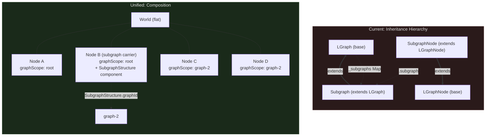
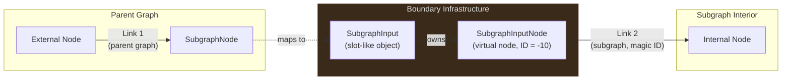
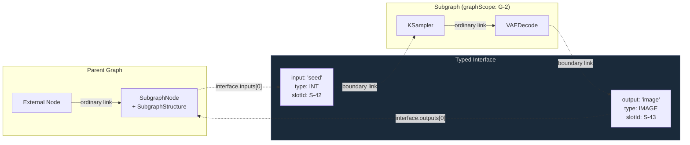
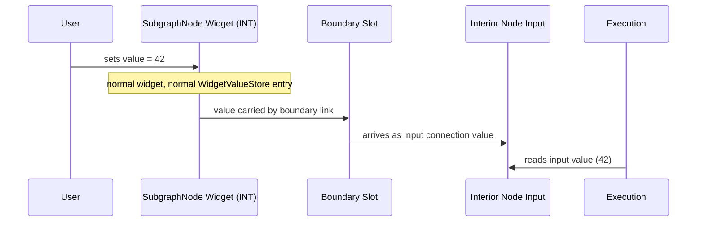

# Subgraph Boundaries and Widget Promotion

A companion to [ADR 0008](../adr/0008-entity-component-system.md). Where the ADR
defines the entity taxonomy and component decomposition, this document examines
the three questions the ADR defers — questions that turn out to be facets of a
single deeper insight.

For the structural problems motivating this work, see
[Entity Problems](entity-problems.md). For the target architecture, see
[ECS Target Architecture](ecs-target-architecture.md). For the phased migration
roadmap, see [ECS Migration Plan](ecs-migration-plan.md).

---

## 1. Graph Model Unification

### The false distinction

Consider a subgraph. It contains nodes, links, reroutes, groups. It has inputs
and outputs. It can be serialized, deserialized, copied, pasted. It has an
execution order. It has a version counter.

Now consider a graph. It contains nodes, links, reroutes, groups. It has inputs
and outputs (to the execution backend). It can be serialized, deserialized,
copied, pasted. It has an execution order. It has a version counter.

These are the same thing.

The current codebase almost knows this. `Subgraph extends LGraph` — the
inheritance hierarchy encodes the identity. But it encodes it as a special case
of a general case, when in truth there is no special case. A subgraph is not a
*kind* of graph. A subgraph *is* a graph. The root workflow is not a privileged
container — it is simply a graph that happens to have no parent.

This is the pattern that appears everywhere in nature and mathematics: the
Mandelbrot set, the branching of rivers, the structure of lungs. At every scale,
the same shape. A graph that contains a node that contains a graph that contains
a node that contains a graph. The part is isomorphic to the whole.

### What the code says

Three symptoms reveal the false distinction:

1. **`Subgraph` lives inside `LGraph.ts`** (line 2761). It cannot be extracted
   to its own file because the circular dependency between `Subgraph` and
   `LGraph` is unresolvable under the current inheritance model. The
   architecture is telling us, in the only language it has, that these two
   classes want to be one thing.

2. **`Subgraph` overrides `state` to delegate to `rootGraph.state`** (line
   2790). A subgraph does not own its own ID counters — it borrows them from the
   root. It is not independent. It never was.

3. **Execution flattens the hierarchy anyway.** `SubgraphNode.getInnerNodes()`
   dissolves the nesting boundary to produce a flat execution order. The runtime
   already treats the hierarchy as transparent. Only the data model pretends
   otherwise.

### The unified model



In the ECS World:

- **Every graph is a graph.** The "root" graph is simply the one whose
  `graphScope` has no parent.
- **Nesting is a component, not a type.** A node can carry a
  `SubgraphStructure` component, which references another graph scope. That
  scope contains its own entities — nodes, links, widgets, reroutes, groups —
  all living in the same flat World.
- **One World per workflow.** All entities across all nesting levels coexist in
  a single World, each tagged with a `graphScope` identifier. There are no
  sub-worlds, no recursive containers. The fractal structure is encoded in the
  data, not in the container hierarchy.
- **Entity taxonomy: six kinds, not seven.** ADR 0008 defines seven entity kinds
  including `SubgraphEntityId`. Under unification, "subgraph" is not an entity
  kind — it is a node with a component. The taxonomy becomes: Node, Link,
  Widget, Slot, Reroute, Group.
- **ID counters remain global.** All entity IDs are allocated from a single
  counter space, shared across all nesting levels. This preserves the current
  `rootGraph.state` behavior and guarantees ID uniqueness across the entire
  World.
- **Graph scope parentage is tracked.** The World maintains a scope registry:
  each `graphId` maps to its parent `graphId` (or null for the root). This
  enables the ancestor walk required by the acyclicity invariant and supports
  queries like "all entities transitively contained by this graph."

### The acyclicity invariant

Self-similarity is beautiful, but recursion without a base case is catastrophe.
A subgraph node must not contain a graph that contains itself, directly or
through any chain of nesting.

The current code handles this with a blunt instrument:
`Subgraph.MAX_NESTED_SUBGRAPHS = 1000`. This limits depth but does not prevent
cycles. A graph that references itself at depth 1 is just as broken as one that
does so at depth 1001.

The proper invariant is structural:

> The `graphScope` reference graph induced by `SubgraphStructure.graphId` must
> form a directed acyclic graph (DAG). Before creating or modifying a
> `SubgraphStructure`, the system must verify that the target `graphId` is not
> an ancestor of the containing graph's scope.

This is a simple ancestor walk — from the proposed target graph, follow parent
references upward. If the containing graph appears in the chain, the operation
is rejected. The check runs on every mutation that creates or modifies a
`SubgraphStructure` component, not as an offline validation pass. A cycle in the
live graph is unrecoverable; prevention must be synchronous.

---

## 2. Graph Boundary Model

### How boundaries work today

When a link crosses from a parent graph into a subgraph, the current system
interposes three layers of indirection:



Two separate links. A virtual node with a magic sentinel ID
(`SUBGRAPH_INPUT_ID = -10`). A slot-like object that is neither a slot nor a
node. Every link in the system carries a latent special case: *am I a boundary
link?* Every pack/unpack operation must remap both links and reconcile both ID
spaces.

This complexity exists because the boundary was never designed — it accreted.
The virtual nodes are wiring infrastructure with no domain semantics. The magic
IDs are an escape hatch from a type system that offers no legitimate way to
express "this connection crosses a scope boundary."

### Boundaries as typed contracts

A subgraph boundary is, mathematically, a function signature. A subgraph takes
typed inputs and produces typed outputs. The types come from the same vocabulary
used by all nodes: `"INT"`, `"FLOAT"`, `"MODEL"`, `"IMAGE"`, `"CONDITIONING"`,
and any custom type registered by extensions.

The boundary model should say exactly this:

```
SubgraphStructure {
  graphId: GraphId
  interface: {
    inputs:  Array<{ name: string, type: ISlotType, slotId: SlotEntityId }>
    outputs: Array<{ name: string, type: ISlotType, slotId: SlotEntityId }>
  }
}
```

The `interface` is the contract. Each entry declares a name, a type, and a
reference to the corresponding slot on the SubgraphNode. Inside the subgraph,
internal nodes connect to boundary slots through ordinary links — no virtual
nodes, no magic IDs, no special cases. A link is a link. A slot is a slot.



### Type-driven widget surfacing

The existing type system already knows which types get widgets. When a node
definition declares an input of type `"INT"`, the widget registry
(`widgetStore.widgets`) maps that type to a number widget constructor. When the
type is `"MODEL"`, no widget constructor exists — the input is socket-only.

This mechanism applies identically to subgraph interface inputs. If a subgraph
declares an input of type `"INT"`, the SubgraphNode gets an INT input slot, and
the type → widget mapping gives that slot a number widget. If the input is type
`"MODEL"`, the SubgraphNode gets a socket-only input. No special promotion
machinery is needed. The type system already does the work.

This is the key insight that connects graph boundaries to widget promotion, and
it is the subject of Section 3.

### Pack and unpack

Under graph unification, packing and unpacking become operations on `graphScope`
tags rather than on class hierarchies:

**Pack** (convert selection to subgraph):
1. Create a new `graphId`
2. Move selected entities: change their `graphScope` to the new graph
3. For links that crossed the selection boundary: create boundary slot mappings
   in `SubgraphStructure.interface`, infer types from the connected slots
4. Create a SubgraphNode in the parent scope with the `SubgraphStructure`
   component

**Unpack** (dissolve subgraph):
1. Move entities back: change their `graphScope` to the parent
2. Reconnect boundary links directly (remove the SubgraphNode intermediary)
3. Delete the SubgraphNode

The critical simplification: **no ID remapping.** Entities keep their IDs
throughout. Only the `graphScope` tag changes. The current system's
clone-remap-configure dance — separate logic for node IDs, link IDs, reroute
IDs, subgraph UUIDs — is eliminated entirely.

---

## 3. Widget Promotion: Open Decision

Widget promotion is the mechanism by which an interior widget surfaces on the
SubgraphNode in the parent graph. A user right-clicks a widget inside a subgraph
and selects "Promote to parent." The widget's value becomes controllable from the
outside.

This is where the document presents two candidates for the ECS model. The team
must choose before Phase 3 of the migration.

### Current mechanism

The current system has three layers:

1. **PromotionStore** (`src/stores/promotionStore.ts`): A ref-counted Pinia
   store mapping `graphId → subgraphNodeId → PromotedWidgetSource[]`. Tracks
   which interior widgets are promoted and provides O(1) `isPromotedByAny()`
   queries.

2. **PromotedWidgetViewManager**: A reconciliation layer that maintains stable
   `PromotedWidgetView` proxy widget objects, diffing against the store on each
   update — a pattern analogous to virtual DOM reconciliation.

3. **PromotedWidgetView**: A proxy widget on the SubgraphNode that mirrors the
   interior widget's type, value, and options. Reads and writes delegate to the
   original widget's entry in `WidgetValueStore`.

Serialized as `properties.proxyWidgets` on the SubgraphNode.

### Candidate A: Connections-only

Promotion is not a separate mechanism. It is adding a typed input to the
subgraph's interface.

When a user "promotes" widget X (type `INT`) on interior node N:
1. A new entry is added to `SubgraphStructure.interface.inputs`:
   `{ name: "seed", type: "INT", slotId: <new slot> }`
2. The SubgraphNode gains a new input slot of type `INT`. The type → widget
   mapping (`widgetStore`) creates an INT widget on that slot automatically.
3. Inside the subgraph, the interior node's widget input is replaced by a
   connection from the boundary input — the same transformation that occurs
   today when a user drags a link to a widget input (`forceInput` behavior).

"Demoting" is the reverse: remove the interface input, restore the interior
widget to its standalone state.

The PromotionStore, PromotedWidgetViewManager, and PromotedWidgetView are
eliminated entirely. The existing slot, link, and widget infrastructure handles
everything. Promotion becomes an operation on the subgraph's function signature,
not a parallel state management system.

**Value flow under Candidate A:**



### Candidate B: Simplified component promotion

Promotion remains a first-class concept, simplified from three layers to one:

- A `WidgetPromotion` component on a widget entity:
  `{ promotedTo: NodeEntityId, sourceWidget: WidgetEntityId }`
- The SubgraphNode's widget list includes promoted widget entity IDs directly
- Value reads/writes delegate to the source widget's `WidgetValue` component via
  World lookup
- Serialized as `properties.proxyWidgets` (unchanged)

This removes the ViewManager and proxy widget reconciliation but preserves the
concept of promotion as distinct from connection.

### Tradeoff matrix

| Dimension | A: Connections-Only | B: Simplified Promotion |
| --- | --- | --- |
| New concepts | None — reuses slots, links, widgets | `WidgetPromotion` component |
| Code removed | PromotionStore, ViewManager, PromotedWidgetView, `_syncPromotions` | ViewManager, proxy reconciliation |
| Shared subgraph compat | ✅ Each instance has independent interface inputs with independent values | ⚠️ Promotion delegates to a source widget by entity ID — when multiple SubgraphNode instances share a definition, which instance's source widget is authoritative? |
| Dynamic widgets | ✅ Input type drives widget creation via existing registry | ⚠️ Must handle type changes in promotion component |
| Serialization | Interface inputs serialized as `SubgraphIO` entries | Separate `proxyWidgets` property |
| Backward-compatible loading | Migration: old `proxyWidgets` → interface inputs + boundary links | Direct — same serialization shape |
| UX consistency | Promoted widgets look like normal input widgets | Promoted widgets look like proxy widgets (distinct) |
| Widget ordering | Slot ordering (reorderable like any input) | Explicit promotion order (`movePromotion`) |
| Nested promotion | Adding interface inputs at each nesting level — simple mechanically, but N levels = N manual promote operations for the user | `disambiguatingSourceNodeId` complexity persists |

### Constraints that hold regardless

Whichever candidate is chosen:

- **`WidgetEntityId` is internal.** Serialization uses widget name + parent node
  reference. This is settled (see Section 4).
- **The type → widget mapping is authoritative.** The widget registry
  (`widgetStore.widgets`) is the single source of truth for which types produce
  widgets. No parallel mechanism should duplicate this.
- **Backward-compatible loading is non-negotiable.** Existing workflows with
  `proxyWidgets` must load correctly, indefinitely (see Section 4).
- **The design must not foreclose functional subgraphs.** A future where
  subgraphs behave as pure functions — same inputs, same outputs, no
  instance-specific state beyond inputs — must remain reachable. This is a
  constraint, not a current requirement.

### Recommendation and decision criteria

**Lean toward A.** It eliminates an entire subsystem by recognizing a structural
truth: promotion is adding a typed input to a function signature. The type
system already handles widget creation for typed inputs. Building a parallel
mechanism for "promoted widgets" is building a second, narrower version of
something the system already does.

The cost of A is a migration path for existing `proxyWidgets` serialization. On
load, the `SerializationSystem` converts `proxyWidgets` entries into interface
inputs and boundary links. This is a one-time ratchet conversion — once
loaded and re-saved, the workflow uses the new format.

**Choose B if** the team determines that promoted widgets must remain
visually or behaviorally distinct from normal input widgets in ways the type →
widget mapping cannot express, or if the `proxyWidgets` migration burden exceeds
the current release cycle's capacity.

**Decision needed before** Phase 3 of the ECS migration, when systems are
introduced and the widget/connectivity architecture solidifies.

---

## 4. Serialization Boundary

### Principle

The internal model and the serialization format are different things, designed
for different purposes.

The World is optimized for runtime queries: branded IDs for type safety, flat
entity maps for O(1) lookup, component composition for flexible querying. The
serialization format is optimized for interchange: named keys for human
readability, nested structure for self-containment, positional widget value
arrays for compactness, backward compatibility across years of workflow files.

These are not the same optimization targets. Conflating them — forcing the
internal model to mirror the wire format, or vice versa — creates a system that
is mediocre at both jobs. The `SerializationSystem` is the membrane between
these two worlds. It translates in both directions, and it is the only component
that knows about legacy format quirks.

### Current serialization structure

```
ISerialisedGraph {
  nodes: ISerialisedNode[]          // widgets_values[], inputs[], outputs[]
  links: SerialisedLLinkArray[]     // [id, origin_id, origin_slot, target_id, target_slot, type]
  reroutes: SerialisableReroute[]
  groups: ISerialisedGroup[]
  subgraphs: ExportedSubgraph[]     // recursive: each contains its own nodes, links, etc.
}
```

Subgraphs nest recursively. Widget values are positional arrays on each node.
Link data uses tuple arrays for compactness.

### What changes under graph unification

**Internal model**: Flat. All entities across all nesting levels live in one
World, tagged with `graphScope`. No recursive containers.

**Serialized format**: Nested. The `SerializationSystem` walks the scope tree
and produces the recursive `ExportedSubgraph` structure, matching the current
format exactly. Existing workflows, the ComfyUI backend, and third-party tools
see no change.

| Direction | Format | Notes |
| --- | --- | --- |
| **Save/export** | Nested (current shape) | SerializationSystem walks scope tree |
| **Load/import** | Nested (current) or future flat | Ratchet: normalize to flat World on load |

The "ratchet conversion" pattern: load any supported format, normalize to the
internal model. The system accepts old formats indefinitely but produces the
current format on save.

### Widget identity at the boundary

| Context | Identity | Example |
| --- | --- | --- |
| **Internal (World)** | `WidgetEntityId` (opaque branded number) | `42 as WidgetEntityId` |
| **Serialized** | Position in `widgets_values[]` + name from node definition | `widgets_values[2]` → third widget |

On save: the `SerializationSystem` queries `WidgetIdentity.name` and
`WidgetValue.value`, produces the positional array ordered by widget creation
order.

On load: widget values are matched by name against the node definition's input
specs, then assigned `WidgetEntityId`s from the global counter.

This is the existing contract, preserved exactly.

### Subgraph interface at the boundary

Under graph unification, the subgraph's typed interface
(`SubgraphStructure.interface`) is serialized as the existing `SubgraphIO`
format:

```
SubgraphIO {
  id: UUID
  name: string
  type: string       // slot type (e.g. "INT", "MODEL")
  linkIds?: LinkId[]
}
```

If Candidate A (connections-only promotion) is chosen: promoted widgets become
interface inputs, serialized as additional `SubgraphIO` entries. On load, legacy
`proxyWidgets` data is converted to interface inputs and boundary links (ratchet
migration). On save, `proxyWidgets` is no longer written.

If Candidate B (simplified promotion) is chosen: `proxyWidgets` continues to be
serialized in its current format.

### Backward-compatible loading contract

This is a hard constraint with no expiration:

1. **Any workflow saved by any prior version of ComfyUI must load
   successfully.** The `SerializationSystem` is the sole custodian of legacy
   format knowledge — positional widget arrays, magic link IDs, `SubgraphIO`
   shapes, `proxyWidgets`, tuple-encoded links.

2. **The rest of the system never sees legacy formats.** On load, all data is
   normalized to ECS components. No other system, component, or query path needs
   to know that `SUBGRAPH_INPUT_ID = -10` ever existed.

3. **New format features are additive.** Old fields are never removed from the
   accepted schema. They may be deprecated in documentation, but the parser
   accepts them indefinitely.

4. **Save format may evolve.** The output format can change (e.g., dropping
   `proxyWidgets` in favor of interface inputs under Candidate A), but only when
   the corresponding load-path migration is in place and validated.

---

## 5. Impact on ADR 0008

This document proposes or surfaces the following changes to
[ADR 0008](../adr/0008-entity-component-system.md):

| Area | Current ADR 0008 | Proposed Change |
| --- | --- | --- |
| Entity taxonomy | 7 kinds including `SubgraphEntityId` | 6 kinds — subgraph is a node with `SubgraphStructure` component |
| `SubgraphEntityId` | `string & { __brand: 'SubgraphEntityId' }` | Eliminated; replaced by `GraphId` scope identifier |
| Subgraph components | `SubgraphStructure`, `SubgraphMeta` listed as separate-entity components | Become node components on SubgraphNode entities |
| World structure | Implied per-graph containment | Flat World with `graphScope` tags; one World per workflow |
| Acyclicity | Not addressed | DAG invariant on `SubgraphStructure.graphId` references, enforced on mutation |
| Boundary model | Deferred | Typed interface contracts on `SubgraphStructure`; no virtual nodes or magic IDs |
| Widget promotion | Treated as a given feature to migrate | Open decision: Candidate A (connections-only) vs B (simplified component) |
| Serialization | Not explicitly separated from internal model | Internal model ≠ wire format; `SerializationSystem` is the membrane |
| Backward compat | Implicit | Explicit contract: load any prior format, indefinitely |

These amendments should be applied to ADR 0008 and the related architecture
documents in a follow-up pass after team review of this document:

- [ECS Target Architecture](ecs-target-architecture.md) — World Overview
  diagram, Entity IDs diagram, component tables
- [ECS Migration Plan](ecs-migration-plan.md) — Phase 1c World type definition,
  dependency graph
- [ECS Lifecycle Scenarios](ecs-lifecycle-scenarios.md) — unpack flow uses
  `subgraphEntityId`
- [Proto-ECS Stores](proto-ecs-stores.md) — extraction map lists Subgraph as
  distinct entity kind
- [Entity Interactions](entity-interactions.md) — entity table and overview
  diagram list Subgraph separately
