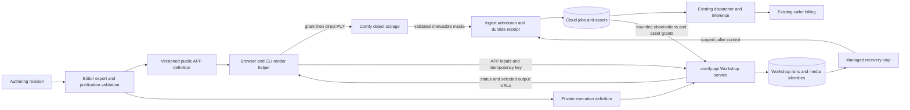

# Cloud workflows in Models / Workshop

Status: proposed architecture for FE-2736, reviewed against source on 2026-09-22.
This document describes work to build; it does not claim deployment or staging
acceptance. The decision record is
[WORKSHOP-WORKFLOWS-0036](../adr/WORKSHOP-WORKFLOWS-0036-published-app-definitions-and-durable-cloud-runs.md).
The [test strategy](../testing/workshop-cloud-workflows.md) defines the evidence
required before enablement.

## Scope and authority

Signed-in callers run reviewed, published Cloud workflows using the author's
APP controls. Execution, input assets, generated assets, and normal Cloud
billing belong to the caller's authorized workspace. A workflow author does not
lend an account, a GPU deployment, or credentials to a caller.

The controlling requirements are [FE-2736](https://linear.app/comfyorg/issue/FE-2736/implement-cloud-workflow-support-in-models-workshop-phase-1),
[Workshop TDD §17](https://app.notion.com/p/3cf6d73d3650811aab66ccaf03c0252f), and
the [workflow TDD](https://app.notion.com/p/3e26d73d3650818d9f0cf28fc9f506d4).
The earlier model-only appendix is historical context: its cancellation/billing
copy, upload deduplication example, absence of history, and browser-only gating
are not the workflow contract.

Phase 2 adds sponsored serverless execution and quota accounting. Do not add
sponsor credentials, daily quota tables, reservation accounting, a deployment
selector, or serverless workers in this phase. Preserve an adapter boundary for
that later implementation. The existing Cloud entitlement and billing policy
remains authoritative, including any currently enabled free-tier allowance.

## Findings that change the implementation plan

Frontend evidence is pinned to
[`c2c5ede4ae`](https://github.com/Comfy-Org/ComfyUI_frontend/tree/c2c5ede4ae97a4f6ea6d0bb65d597d01834084f7).
Cloud evidence is pinned to freshly fetched main
[`b1e99a58db`](https://github.com/Comfy-Org/cloud/tree/b1e99a58db0c1c4fccab6bb75c9cbcad39d2ecc0).
These are source inspections, not observations of the deployed service.

| Evidence                                                                                                                                                                                                                                                                                                                                     | Consequence                                                                                                                                                                                                                                                  |
| -------------------------------------------------------------------------------------------------------------------------------------------------------------------------------------------------------------------------------------------------------------------------------------------------------------------------------------------- | ------------------------------------------------------------------------------------------------------------------------------------------------------------------------------------------------------------------------------------------------------------ |
| The [live v2 specification](https://raw.githubusercontent.com/Comfy-Org/docs/main/openapi-v2.yaml) accepts an API graph; top-level `inputs` is reserved. Duplicate idempotency keys return 422 rather than replaying a receipt.                                                                                                              | APP mapping and browser retry identity belong in Workshop. Passing APP parameters directly to v2 will not implement this feature.                                                                                                                            |
| Cloud [`PostJobs`](https://github.com/Comfy-Org/cloud/blob/b1e99a58db0c1c4fccab6bb75c9cbcad39d2ecc0/services/public-api/server/implementation/jobs.go) scopes Redis claims to credential bytes, retains uncertain claims for 24 hours, and fails open on claim-store failure. Cloud `Job` has no upstream-key uniqueness/lookup contract.    | Public v2 submission alone cannot guarantee one Cloud job across token renewal, lost responses, outages, and worker restarts. Add a durable Cloud receipt at job creation. The serverless gateway lookup cited in the TDD does not establish a Cloud lookup. |
| [`ingestclient.SubmitPrompt`](https://github.com/Comfy-Org/cloud/blob/b1e99a58db0c1c4fccab6bb75c9cbcad39d2ecc0/services/public-api/ingestclient/client.go) forwards a credential as `X-API-Key`.                                                                                                                                             | Do not assume a browser Cloud JWT can be forwarded through this adapter, or retain that JWT for background retries.                                                                                                                                          |
| [APP documentation](https://docs.comfy.org/interface/app-mode) describes selected controls and output nodes. [`LinearData`](../../src/platform/workflow/management/stores/comfyWorkflow.ts) stores selections and limited presentation settings, not a complete executable parameter schema.                                                 | Publication must produce the missing types, constraints, defaults, bindings, and output contracts.                                                                                                                                                           |
| [`graphToPrompt`](../../src/utils/executionUtil.ts) resolves virtual nodes, custom serializers, links and nested execution IDs. [`ExecutableNodeDTO`](../../src/lib/litegraph/src/subgraph/ExecutableNodeDTO.ts) applies host input values to inner targets. APP pruning can silently remove unresolved selections.                          | Export provenance through the existing execution conversion. Reject unresolved publication instead of reusing tolerant editor pruning.                                                                                                                       |
| [`CreateCustomerStorageResource`](https://github.com/Comfy-Org/cloud/blob/b1e99a58db0c1c4fccab6bb75c9cbcad39d2ecc0/services/comfy-api/services/comfy_api/comfy_api_svc.go) signs PUT for one hour and GET for 24 hours. Its response has two URLs; its `StorageFile` record does not establish completed, workspace-scoped, immutable media. | Extend this grant flow with durable ownership and finalization. URL validity is not object retention or upload completion.                                                                                                                                   |
| Cloud [`DownloadPromptFiles`](https://github.com/Comfy-Org/cloud/blob/b1e99a58db0c1c4fccab6bb75c9cbcad39d2ecc0/services/inference/server/services/prompt/processor.go) stages loader inputs by authorized Cloud asset hash.                                                                                                                  | A storage URL is not a `LoadImage` filename. Register/stage validated media into caller-owned Cloud assets before materializing the executable graph.                                                                                                        |
| The [v2 output documentation](https://docs.comfy.org/api-reference/v2/overview) distinguishes authenticated content URLs, signed asset URLs, and placeholder job expiry.                                                                                                                                                                     | Use stable asset identity and the actual grant's expiry. Never embed `Output.url` directly in a browser media element or promise retention from the job's 30-day placeholder.                                                                                |
| [`CancelJobByID`](https://github.com/Comfy-Org/cloud/blob/b1e99a58db0c1c4fccab6bb75c9cbcad39d2ecc0/services/ingest/server/services/job/service.go) requests a state transition; its boolean does not prove execution has stopped.                                                                                                            | Observe a terminal Cloud state before reporting cancellation.                                                                                                                                                                                                |
| Ingest `GetJobDetail` uses `toFilterStatus`; its `CancelledStates` group includes nonterminal `cancel_requested`, `cancel_pending` and `cancelling_preparing`.                                                                                                                                                                               | Even polling the existing display status is insufficient cancellation confirmation. The internal observation must expose actual execution state/terminal evidence.                                                                                           |
| comfy-api's global request logger buffers bodies before route handlers; request/response loggers can record JSON at debug level.                                                                                                                                                                                                             | Install bounds before buffering and explicitly exclude Workshop bodies and grants from logging. A validator inside a handler is too late.                                                                                                                    |
| [`router-render.ts`](../../apps/website/src/config/router-render.ts) provides reusable phases. The former `workshop-run-target.ts` was reverted. Current model page/account coordination cancels on leaving a run.                                                                                                                           | Introduce a small current run-target boundary with behavioral coverage. Workflow detachment must not inherit Router cancellation semantics.                                                                                                                  |

The page template is
[PR #18325](https://github.com/Comfy-Org/ComfyUI_frontend/pull/18325), inspected at
`98d0a49dbb1b50b052936993fc41eb14140e154e`, stacked on #17878.
Its discovery hierarchy, hero/cards, detail layout and Playground / Workflow /
API tabs are the design reference. Mar's Router PRs are not implementation or
page-template dependencies.
The Cloud import/access contracts from cloud PRs #10011/#10012 are not assumed
deployed. Inspect their final contracts before choosing shared transport code.

### Applying the page template

Preserve the public routes `/models/workflows/` and
`/models/workflows/{slug}/`, and the approved layout and category ordering from
the [launch specification](https://app.notion.com/p/3de6d73d365081d0b5bafdb9d9ffbf12).
The catalog's 30 cards are a design/content set, not 30 certified executions.
Only reviewed compatible definitions become runnable.

Read the template's own `WORKFLOWS_PROTOTYPE.md` and
`WORKFLOW_API_COVERAGE.md` before porting it. Replace its direct canvas upload/
prompt transport, browser graph mutation, full-output blob downloads and
in-memory-only recovery with the boundaries below. Its simulated deployment
demo stays explicitly separate from caller-billed Cloud execution; simulated
startup stages are not production telemetry. API-tab examples for this feature
use the Workshop contract and share browser/CLI defaults.

Its curated field list is not authoritative APP metadata. Two inspected
examples establish required regression fixtures: `match-portrait-lighting`
omits the authored `103.prompt` selection; `change-camera-angle` replaces the
selected `camera_preview` custom control with hand-selected numeric fields.
Other inspected candidates, including background removal and material change,
have no `extra.linearData`. Publish an explicit reviewed authoring revision
with APP selections for those candidates; do not infer that the prototype's
fields are the author's selections. Custom controls need a reviewed adapter or
browse-only status. The prototype's altered API graphs also need the same
publication/provenance checks as every other definition.

The graph tab currently depends on deprecated standalone `@comfyorg/litegraph`
0.17.2. Resolve its maintained renderer strategy as a bounded frontend spike
before porting that dependency. Keep the read-only graph viewer behind its own
interface; it must not load custom-node code, authenticate or submit runs.
Renderer selection is still open and does not block backend correctness work.

## Ownership and service boundaries

| Owner                           | Responsibility                                                                                                | Must not own                                                            |
| ------------------------------- | ------------------------------------------------------------------------------------------------------------- | ----------------------------------------------------------------------- |
| Editor/publication tooling      | Same-revision export, binding provenance, reviewed definition artifacts                                       | Browser-time generic graph conversion                                   |
| comfy-api Workshop package      | Definition validation, caller admission, idempotency, durable intent, recovery, public result serialization   | GPU scheduling or a second billing ledger                               |
| Ingest                          | Trusted actor revalidation, ordinary Cloud policy, atomic submission receipt/job creation, job-scoped control | Public APP forms or Workshop browser sessions                           |
| Existing Cloud execution/assets | Execution truth, usage, immutable assets, output provenance and access policy                                 | Client UI state                                                         |
| Browser/CLI helper              | Shared defaults, upload preparation, submit/observe/normalize                                                 | Service credentials or choosing a billing workspace in the request body |
| Website controller              | One active run pointer, caller scope, observation lifecycle, drafts, delivery refresh                         | Durable execution truth                                                 |
| Presentation components         | Controls, status, ordered media, history interaction                                                          | Polling schedules, auth refresh, or dispatch                            |

Keep comfy-api build-isolated: use a versioned HTTP contract and generated
client for ingest, not imports from Cloud `common/` or other service modules.
Use focused packages around definitions, admission/recovery, and the Cloud
adapter. Do not grow the existing large service class or `ModelDetail.vue` into
a feature-wide coordinator.

## Publication is a compiler boundary

One immutable bundle contains a public projection and a private execution
definition. Record definition version, authoring revision/content digest,
exporter version, graph digest, binding digest, and required runtime/node
compatibility. A display title or widget position is never binding identity.

The public projection supplies attribution, stable ID/slug, availability,
`cloud-workflow` execution kind, `caller-workspace` billing, ordered fields,
types, constraints, defaults/examples, standard-parameter mappings, and ordered
output roles. The private definition supplies the API graph, exact named input
targets, output bindings, approved conversions, model dependencies and cost
bounds. No execution credential belongs in either file.

Export from an isolated authoring snapshot using existing graph-to-prompt
semantics. The exporter currently snapshots UI JSON before awaiting custom
widget serializers; reading the live editor again later can mix revisions.
Capture the document revision and host-scoped widget values together, serialize
that snapshot, and fail if a serializer depends on uncaptured mutable state.
Do not substitute a second JSON converter in the website or backend.

Extend export tracing at the points that resolve actual executable inputs.
Represent each selected field as an APP identity plus **all** resolved
`executionNodeId/inputName` targets and a reviewed conversion. A promoted
control's representative widget supplies presentation/schema; it is not proof
of the complete target set. Trace fan-out through nested host instances and
detect overlapping/conflicting bindings. Preserve distinct host instances of
the same subgraph. Keep behavior in utilities/systems, with no new graph entity
methods or durable instance properties.

Publication rejects missing or ambiguous selections, linked inputs incorrectly
advertised as editable, nonserializing widgets, unrepresentable custom
serializers, incompatible fan-out types, stale node definitions, and missing
outputs. Mute/bypass/virtual-node expansion must agree with the exported graph.
Legacy selections are accepted only when resolution is unique. Never silently
publish a reduced form after editor pruning. Unsupported controls may remain
browse-only, with an explicit reason.

Resolve output selections to execution IDs and explicit supported output keys,
roles and cardinality. Preserve APP selection order and each output's file
order. Nested display IDs and preview exposures must resolve to real producing
nodes; a root-local numeric ID alone is insufficient. Zero editable inputs is
valid; an executable definition still needs selected deliverable outputs.

The server revalidates every materialized input against both its published
constraint and named graph target. Fixed/unexposed graph fields stay immutable.
Validate resolution, duration, steps, batch count and relevant combinations,
not just individual numeric maxima. File/model selectors must be approved
choices available in the execution environment. Do not assume the author has
made private models available to every caller.

Cloud does not expose the serverless deployment-release pinning contract.
Record compatibility explicitly and compare it with the deployed Cloud runtime
manifest. Reject incompatible versions; do not claim that recording an image
version pins a GPU to it. Retain graph/binding versions for recovery, and record
the actual executing runtime when available. A queued job crossing a runtime
rollout must still receive a compatibility check before execution.

Publish backend definitions first, then their public projection. A new version
can be disabled without deleting versions used by existing runs. Unknown or
retired versions return `409 definition_changed`; incompatible runtime/bindings
return a distinct stable error. A stale page never executes against a silently
substituted graph.

## Shared inputs and request identity

`workflow_render()` follows resolve, prepare, submit/observe, normalize phases.
The browser and CLI call the same implementations. The [TypeScript SDK](https://github.com/Comfy-Org/comfy-typescript-sdk/blob/main/README.md)
currently excludes browser support in its requirements; use the website's HTTP
boundary rather than importing its Node client into an island.

Default precedence is authored defaults/example values, supported standard
overrides, then explicit `workflow_specific` overrides. An explicit form
snapshot is an alternative to overrides. Unknown parameters/APP IDs fail;
known standard parameters without a binding follow Router's omission rule.
Conversions such as size-to-width/height are versioned publication data, not
name inference. Preserve `0`, `false` and intentional empty strings; distinguish
missing fields from invalid nulls. Restrict numeric inputs to exactly
representable values shared by Go and TypeScript; reject unsafe defaults rather
than rounding large seeds.

Preparation reuses the signed-grant/direct-PUT transport, with workflow limits
and mandatory URL mode. Do not reuse Router base64 encoders or file-size
accounting that counts base64 inside JSON. The helper's local `File` or stream
is not a wire input. Snippets derive from the same resolved form and contract;
show stable IDs and upload steps, not a user's signed media URLs or credentials.

At admission, canonicalize defaults and APP values by stable field identity.
Reject duplicate JSON keys and unexpected nested objects. The request identity
includes caller workspace, workflow/version and canonical media identities;
exclude bearer bytes, signed query parameters, UI labels and object key order.
Define canonical number and absent/default handling in shared conformance
fixtures. Random seed intent needs special treatment: compare retry intent
before drawing randomness, then store the resolved seed once. Keep the request
fingerprint distinct from a materialized-graph digest.

Uniqueness is `(caller_user_id, idempotency_key)`, not per token or workspace.
The first admitted row fixes workspace and definition. An identical request
returns that run, including after flags change or source URLs expire. A changed
workspace/version/input returns `409 idempotency_conflict` without revealing
the other workspace's run. Check a retained receipt before current new-run
availability gates or resolving new randomness.

## Two durable boundaries for one execution

### Workshop admission

Authenticate and resolve canonical user/workspace through existing auth. Bound
the body before any buffering, validate the published definition and inputs,
resolve/validate completed media, then commit the intent in comfy-api Postgres.
Do not hold a transaction open across storage transfer or network calls.
Idempotent media finalization can precede admission; abandoned finalized assets
need cleanup. A committed intent is recoverable without an HTTP process or
browser remaining alive. Return `202` only after commit.

`workshop_workflow_runs` stores public run ID; caller user/workspace and execution
workspace; billing mode; workflow and pinned definition/binding versions;
compatibility information; normalized inputs, resolved seed and stable media
references; request hash; caller idempotency key; globally unique upstream key;
upstream job ID; execution and output states; cancellation request time;
observation version/time; recovery lease owner/epoch/expiry; next attempt time;
attempt count, bounded error code, lifecycle timestamps and output retention.
For phase 1, execution workspace equals caller workspace by validation.

Use a bounded typed output manifest (maximum 16 files) on the row initially,
with stable output IDs, binding/file order, asset references and per-file
delivery state. A separate output table is unnecessary unless independent
queries/writes justify it. Signed URLs are generated for responses, not saved
in the identity manifest. Add unique caller/key and upstream-key constraints,
caller/workspace/history cursor indexes, a due-recovery index, and cleanup
indexes. Schema and migrations must pass comfy-api's independent parity gate.

### Cloud acceptance

Add a narrow Workshop M2M interface to ingest. It needs atomic submit-or-lookup,
receipt lookup, cancel-by-key (including before a job ID is known), bounded job
observation, caller-owned asset staging/access, and optional runtime observation.
These are new contracts, not names for already deployed endpoints.

Persist a Cloud submission receipt keyed by the globally unique upstream key,
bound to caller/workspace and the materialized request fingerprint. Insert the
receipt and create its Cloud job in the **same Cloud database transaction**,
including existing transactional admission accounting. On conflict, compare
identity/hash and return the original accepted/rejected/closed receipt. An
accepted receipt must never exist without its job, and a Workshop job must not be
committed without its receipt. Preserve a tombstone if the job is later removed.
This requires a global Cloud schema/migration as well as the comfy-api schema.
The execution fingerprint covers pinned graph/bindings, resolved scalars and
immutable asset identities. Refreshed signed URLs and per-attempt capabilities
are excluded; hashing the raw dispatched JSON would incorrectly conflict on a
legitimate recovery attempt.

Extract a narrow admission service from `ExecutePrompt`, used by both ordinary
and Workshop submission. Preserve its entitlement, provider-policy, queue,
runtime, and current billing/free-allowance behavior. Do not use the privileged
partner execution workspace bypass. Do not add Workshop charging on top of
Cloud usage reporting. Definitive rejection is distinguishable from an unknown
network/commit outcome.

Receipts outlive retry/recovery and do not inherit the public v2 Redis TTL. A
lookup miss alone cannot prove rejection while an earlier submit is in flight.
Retrying the same key is safe only because Cloud atomically arbitrates that key
with job creation. No recovery path invents a new key. If receipt integrity is
unavailable, retain `submission_unknown` for reconciliation instead of risking
a second billable job. This is at-most-one job admission, not a claim that every
upstream computation or usage delivery is exactly-once.

### Caller context for background work

Use the existing network-isolated `/m2m` rail, with a dedicated service identity
and a separately signed, short-lived Workshop capability. The existing async
BYOK capability pattern is precedent, not a token to reuse for this purpose.
`/internal` is publicly routed and is not an alternative trust boundary.

The capability issuer consumes only an authenticated, durably admitted run;
bind subject, workspace, run/upstream key, definition/materialization digest,
auth provenance, allowed operations, audience and expiry. Mint fresh scoped
capabilities for recovery from that record; never persist the browser token or
allow browser/body actor fields to drive minting. Ingest verifies both factors
and derives identity exclusively from verified claims, then reloads membership,
account state and applicable policy before a **new** Cloud admission. Preserve
API-key identity/scope and check revocation where applicable; do not upgrade an
API-key caller into a general user JWT. Key rotation and recovery after expiry
must be covered before this interface is enabled.
The current comfy-api `Principal` exposes auth method and permissions but not a
stable credential ID. Extend the verified auth projection for revocable API-key
provenance; a token hash or a body-supplied ID is not a substitute. Recovered
dispatch can only use the intersection of admitted and current permissions.

Accepted-job reconciliation needs only run-scoped observation/control rights.
It continues after browser token expiry and can settle records after membership
removal; that does not authorize new compute or exposing results to that user.
Public operations always recheck current access. No admin read bypass is
inherited by public Workshop handlers.

The first Cloud boundary is implemented in Cloud commit `1b6c5abdaa`.
Its dedicated Ed25519 capabilities have a five-minute maximum lifetime, a key
ID for rotation, and exactly one submit/observe/cancel operation. Ingest holds
verification keys only. API-key verification now exposes the stable Cloud key
ID, and new compute rechecks that key and current membership. Capability issuance
from comfy-api's durable run record remains part of the worker implementation.

Policy preparation happens before opening the receipt transaction. An integration
test reproduced connection-pool exhaustion when same-key waiters held every
connection while the active transaction performed another billing lookup.
The transaction rechecks access on its own connection, serializes queue admission
per caller/workspace, and creates the job, allowance debit and receipt together.
Definitive rejection rolls admission changes back to a savepoint before recording
the rejection. Receipt tombstones survive job deletion. Both internal auth factors
default to unconfigured, so the new routes remain unavailable until deployed
with the worker and reviewed definitions.

Partner API nodes require a supported execution-time credential path in the
caller's workspace. Today's submit-time JWT refresh is conditional on an
existing browser token and excludes API-key callers. It is insufficient for
this worker. Extend the supported scoped execution credential mechanism and
test its billing/expiry behavior, or mark affected definitions unrunnable until
that work is complete. Do not substitute a service/sponsor key or quietly omit
the credential. Review this trust contract with the Cloud auth owner first.

## Recovery, cancellation and observable state

Run one bounded reconciler under the comfy-api service lifecycle, following
existing managed sweeper conventions. The database is the work queue; an
in-memory wakeup only reduces latency. Short transactions claim due rows using
leases and fencing epochs; I/O happens outside the transaction. Every write
checks epoch and row version. Renew leases for bounded long operations, impose
concurrency/transfer limits, and shut down by releasing or expiring work safely.
Do not introduce Temporal workflow semantics or reuse Router provider states
just to dispatch this adapter.

On startup and lease expiry, reconcile the stored upstream key before deciding
what remains to do. Record upstream observation sequence numbers where
available (`state_update_index`); stale observations cannot overwrite newer or
terminal results. Back off transient outages with jitter and deadlines. A
deadline triggers reconciliation/cancellation, not an invented terminal state.
Recovery continues when new admission is disabled.

| Fact         | States/meaning                                                                                                             |
| ------------ | -------------------------------------------------------------------------------------------------------------------------- |
| Execution    | `submitting`, `submission_unknown`, `queued`, `running`, `succeeded`, `failed`, `cancelled`; terminal states are monotonic |
| Cancellation | Durable `cancelRequestedAt`; a request is not a terminal execution result                                                  |
| Outputs      | `pending`, `ready`, `partial`, `failed`, `expired`, with independent per-file recovery                                     |
| Observation  | Last confirmed state plus timestamp/sequence; transport/auth failure does not change execution truth                       |
| Compute hint | `ready`, `starting`, `idle`, `unavailable`, `unknown`, with observation time and freshness                                 |

For cancellation before Cloud acceptance, close the upstream key durably in
the same receipt namespace used by submit. A racing submit either sees that
closed receipt or wins with one job, which is then cancelled by job ID. Without
this fence, cancelling an unsubmitted local row could race a delayed worker
into starting paid work. Report `cancelled` only after this no-job fence or a
confirmed terminal Cloud cancellation. If completion wins, show completion.
Abort/navigation/refresh/account switch stop local observation only.
Consume actual Cloud state, not `toFilterStatus` or membership in its
`CancelledStates`/`FailedStates` display groups. Those groups include intermediate
states. Test the distinction explicitly without changing unrelated editor UI
semantics.

Use actual inference-start evidence for generation. Preparing assets,
allocating compute and waiting in the queue are not generation. Do not derive a
percent complete or an ETA from elapsed time. Unknown upstream statuses remain
an observation error with telemetry and the last known state.

Cloud's shared pool is not a per-workflow serverless deployment. A read-only
runtime adapter may report a sanitized relevant observation, coalesced for
approximately 15 seconds and considered stale after two minutes per the TDD.
Where no such observation exists, return `unknown`. `/system_stats` version
information is not GPU readiness. Runtime reads must not submit, allocate,
send keepalives, extend idle timers, or start compute. Include the same hint in
run polling without another browser polling loop.

## Media admission and output delivery

Cloud commit `b55e26bb50` adds the comfy-api upload service, GCS/IAM adapters,
Ent schema and migration. Follow-up `05415b7597` wires opt-in grants and upload
access to live Cloud caller/workspace revalidation, bounded HTTP parsing,
private/no-store responses and managed cleanup. Cloud asset staging remains
unimplemented. It uses a dedicated private bucket with default event-based holds;
cleanup claims expiry before releasing a hold and deleting the pinned
generation. Grants are capped at 15 minutes, base retention at 24 hours and
run extensions at seven days from creation. Retained quota is serialized per
caller/workspace (32 files / 250 MiB). Four concurrent finalizations stream to
bounded temporary files; metadata inspection has separate process/output limits.
Publication must apply lower per-definition limits and the total run input
budget. These local proofs do not replace real storage/CORS acceptance.

Reuse `POST /customers/storage` and direct signed PUT. Add an opt-in workflow
upload contract, backward compatible with existing Router clients, that records
caller, workspace, opaque upload identity, allowed type/size, canonical object,
grant expiry and retention policy. Return authoritative expiries and any
required signed headers. Generate unique object names on the server. Sign a
create-only upload precondition; test real storage/CORS behavior, not only a
mock. GCS supports [generation preconditions](https://docs.cloud.google.com/storage/docs/request-preconditions),
including create-only writes, and [generation in the signed request](https://cloud.google.com/storage/docs/authentication/canonical-requests).
Bind the PUT byte ceiling in the signed `x-goog-content-length-range` header;
the [storage header contract](https://docs.cloud.google.com/storage/docs/json_api/v1/parameters)
defines the inclusive bound and the
[release notes](https://docs.cloud.google.com/storage/docs/release-notes)
document XML as well as JSON support. Verify enforcement through real signed
PUTs, including chunked/oversized uploads; post-upload validation alone does not
bound malicious uploads.

At finalization, use server-side storage metadata and bounded inspection to
verify completion, bytes, actual media type, decoded dimensions and duration.
Persist the observed generation/digest and never replace it. Admission accepts
only approved HTTPS object URLs resolving to these owned records (or explicitly
published example assets). Hostname, file extension, or the possession of a
signed URL alone is not ownership. Reject credentials in URLs, external import,
redirect-based substitutions, data/blob URLs and inline bytes without echoing
their value. Avoid generic base64 heuristics on ordinary text prompts.

Register the immutable media in the caller's Cloud workspace through a bounded,
idempotent asset operation. Reuse a suitable immutable object where Cloud asset
policy permits; otherwise copy the pinned generation or stream it with a byte
limit. Persist the resulting Cloud asset reference. Publication's explicit
`url-to-execution-asset` conversion supplies the correct loader scalar. The
Workshop JSON uses URLs/scalars; internal graphs may use Cloud asset references
as the TDD specifies. Never teach loaders to fetch arbitrary request URLs.

Retries use the finalized upload record even after the submitted signature
expires. Do not require a fresh PUT for an already admitted run. Input retention
must cover queueing, retries and execution. Do not assume bucket lifecycle
honors a database lease: verify lifecycle settings and use protected execution
storage when necessary. Cleanup must not race active asset references.

Prefer the existing Cloud output asset and access service to copying it. Bind
outputs to the admitted job, selected execution node/key, and file order using
trusted asset records. Custom-node fields are untrusted: current generic v2
mapping can drop malformed entries; Workshop must instead record selected
output delivery errors. Never accept a node-supplied asset ID without proving
the job/owner relationship. If current history is the only node-to-asset
mapping, add a bounded trusted output manifest at the Cloud persistence
boundary rather than fetching arbitrary history JSON into comfy-api.

Project only the selected outputs. A file result has a stable output ID, kind,
MIME type, size, actual signed URL expiry, asset availability/expiry when known,
and an authenticated refresh link. Refresh reauthorizes and signs the same
asset; it cannot dispatch inference. A missing or malformed selected file is
an explicit partial/failed delivery result. Signer failure, including an empty
URL returned without an error, produces a small delivery error. Never fall
back to inline media, raw provider bodies, or Cloud JPEG preview events.

Proposed ceilings from the TDD are 256 KiB per control JSON message; 25 MiB per
input and 50 MiB total inputs; 64 MiB per output and 128 MiB total outputs; at
most 16 outputs. A definition or deployed component may lower them. Contract
defaults proposed here are 8 KiB per URL, 128 APP fields, 16 input files,
128 bytes per idempotency key, and 1 KiB of sanitized error text. These are new
Workshop limits to validate, not inherited Router limits. Validate a definition's
worst-case response budget; never truncate a valid output list to fit. Status
does not echo the full request/graph. Paginated history must enforce both item
count (default 20, maximum 100) and serialized byte budget, returning a
continuation cursor when the byte budget wins.

Enforce limits on actual bytes, not just `Content-Length`; reject unsupported
compressed control bodies or cap decompressed bytes before parsing. Bound
transfer concurrency, inspection CPU/time, temporary disk and outstanding
uploads independently of run admission. Use streams or bounded files, not
whole-file `[]byte`, `arrayBuffer()` or base64 conversions. Exercise image,
video and audio separately. Direct browser playback/download must support
the real signed URL, CORS and Range behavior without Comfy auth headers.

## Public API and client lifecycle

OpenAPI in comfy-api owns the wire schemas; publish generated registry types.
Generate the internal Cloud client separately. Validate remote input at service
boundaries and use strict output projection. Do not hand-maintain parallel API
response types in website code.

The initial public contract is authored in Cloud commit `4d1c96f1ed`.
Admission returns a run summary containing its ID, state and status URL. Status
and command observations wrap that summary as `run`, alongside `runtime`,
ordered `outputs` and `retryOutputDeliveryUrl`. History returns compact summaries
and a continuation cursor; clients load selected outputs through the status link
and refresh grants only when visible. Numeric APP scalars explicitly use double
precision, with a generated-client regression for the largest safe integer.

Run/runtime contracts are not served. The upload grant/access integration is
available only with explicit backend storage configuration; new grants also
require `WORKSHOP_UPLOADS_ENABLED`. A code-generation overlay removes the
remaining draft paths and their response roots before generating routes and the embedded API document.
Operation-ID exclusion alone retains empty path metadata in the current
generator. Contract tests cover actual generated route absence; runtime wiring,
internal Cloud contracts and boundary proofs remain separate implementation work.

| Route                                                                | Contract                                                                                                                                                                                                        |
| -------------------------------------------------------------------- | --------------------------------------------------------------------------------------------------------------------------------------------------------------------------------------------------------------- |
| `POST /v1/workshop/workflow-runs`                                    | Required `Idempotency-Key`; only `workflowId`, `definitionVersion`, `appInputs`. `202` after durable intent, with public ID, state and status URL. Identical replay returns the same ID; changed intent is 409. |
| `GET /v1/workshop/workflow-runs/{run_id}`                            | Caller/workspace-owned observation, selected outputs, delivery state, compute hint and refresh links. No graph or provider credentials.                                                                         |
| `GET /v1/workshop/workflow-runs`                                     | Caller/workspace-scoped keyset pagination by `(created_at, id)`, workflow filter, bounded results. Cursor is not authorization.                                                                                 |
| `POST /v1/workshop/workflow-runs/{run_id}/cancel`                    | Durable cancellation request; returns current observation, normally 202 while confirmation is pending. Repeat requests are harmless.                                                                            |
| `GET /v1/workshop/workflows/{workflow_id}/runtime`                   | Authenticated sanitized read; unknown when unsupported. No compute side effect.                                                                                                                                 |
| `GET /v1/workshop/workflow-runs/{run_id}/outputs/{output_id}/access` | Reauthorize and mint a URL/expiry for the same available output; does not rerun or copy inference.                                                                                                              |
| `POST /v1/workshop/workflow-runs/{run_id}/outputs/retry`             | Idempotently schedule unfinished delivery for existing artifacts; no execution transition or new job.                                                                                                           |
| `GET /customers/storage/{upload_id}/access`                          | Additive owned workflow-upload lookup for draft recovery; returns a fresh URL for the same completed immutable upload, or an explicit unavailable/pending state.                                                |

The last three routes make the TDD's refresh/retry links concrete; they are
proposed additions alongside the five ticket endpoints. GET may mint access to
an existing file; expensive persistence retries use the explicit idempotent
delivery command. Every link operation repeats ownership/access checks. Do not
add phase-2 quota fields with fictional values.

All personalized responses, including errors, use `Cache-Control: no-store`
through the edge. Return stable error codes plus public run/support IDs;
field errors use APP IDs and never repeat rejected values. Separate validation,
definition change, payment/entitlement, unknown admission and delivery errors.

The website controller holds one discriminated state with scoped run data and
named events. Pure transitions own identity/observation changes; commands own
network effects. A caller generation (user, workspace, session epoch) guards
every completion. Token renewal within that identity resumes; switching
identity detaches and discards late responses and in-memory grants.

Before POST, persist the logical attempt key and prepared intent in a draft
scoped by caller/workspace/workflow/version. Persist the admitted public ID as
soon as it is known; one controller owns its URL recovery pointer. An uncertain
POST reuses the same intent/key after reload. Do not store signed URLs as draft
identity: retain an upload handle and obtain fresh authorized access. Unuploaded
files may use bounded local draft storage; unavailable browser storage must be
reported as limited draft recovery, not as failed execution.

Reuse controls and `RunOutput` presentation after strict workflow wire
validation. `RunOutput`'s broader Router/blob possibilities do not widen the
workflow protocol. New workflow identity is distinct from model `routerId`;
preserve existing model URLs and catalog identities. Keep the shared run-target
union small (`router-model` and `cloud-workflow` initially), and share only
input/output presentation and explicit lifecycle operations. Do not force both
transports into the same cancellation or persistence semantics.

History is a canonical server snapshot with cursor paging, not an append-only
client union. The active run may be supplemented by an independent best-effort
lookup. Resolve grants only for visible outputs, deduplicate access requests,
preserve still-valid grants across renewal failures and video/audio playback
across same-asset grant replacement. Rendering and polling remain separate.

## Rollout and operational completion

The supplied PostHog key is **`workshop-workflows-enabled`**. Resolve it for the
current identified user, default off on missing/error/stale identity, and test
late flag answers across sign-out/account switch. Reuse the existing Workshop
flag infrastructure without conflating workflow visibility with the Router
saved-assets build flag. A browser flag is not authorization or an embargo.

Backend admission has an independently enforceable gate and reviewed workflow
allowlist. Evaluate eligibility server-side; a forged browser flag cannot run
an unenabled definition. Keep read/cancel/recovery/delivery available for
previously admitted runs after admission is disabled. Static catalog assets
must contain only approved public content; keep unreleased material out of
public builds. Deployment order is migrations/internal Cloud contracts,
comfy-api admission and recovery, private definitions, generated clients/public
definitions, website with flag off, staging evidence, then staged enablement.

Log and measure public run ID, allowlisted phase/error, latency, queue age,
recovery lag, uncertain submissions, cancellation delay, delivery failures,
expired assets and transfer resource usage. IDs belong in logs, not metric
dimensions. Explicitly exclude prompts, media payloads, signed URLs, credentials
and raw upstream errors from body loggers, traces and browser telemetry. Verify
the actual server middleware chain at debug logging level.

Clean incomplete uploads and expired media independently of compact run and
receipt retention. Keep fingerprints and closed keys sufficient to prevent
later retries from creating new work. Rollback disables admission first; it
does not remove receipt data, retained definitions or the recovery worker.

Before rollout, select an approved pilot authoring revision, verify Cloud
runtime/model compatibility, actual bucket lifecycle and effective media
limits, establish staging caller/workspace access, and record actual caller
billing. The [test strategy](../testing/workshop-cloud-workflows.md) requires a
real upload/generation/playback/download run plus cancellation and recovery
evidence. No paid staging execution or rollout has been performed by this
design review.
