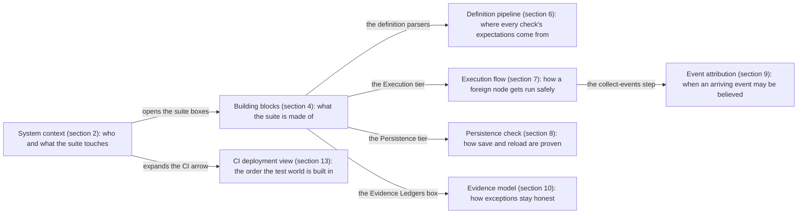
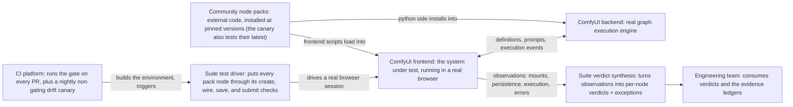
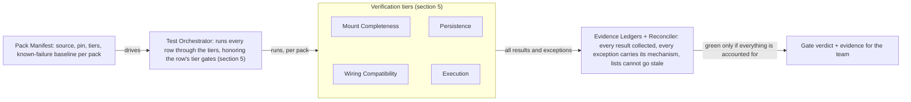
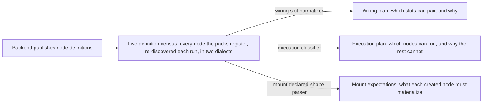
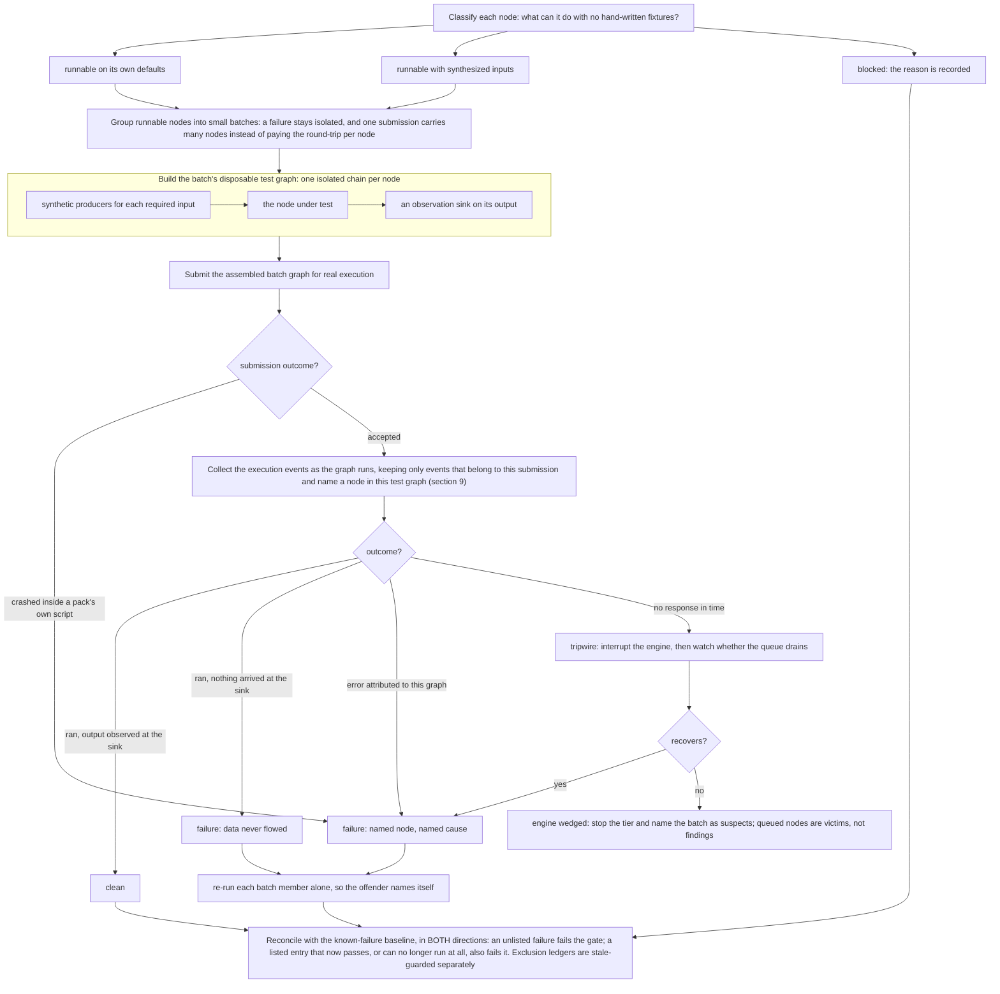
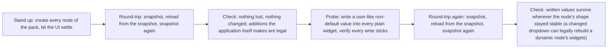
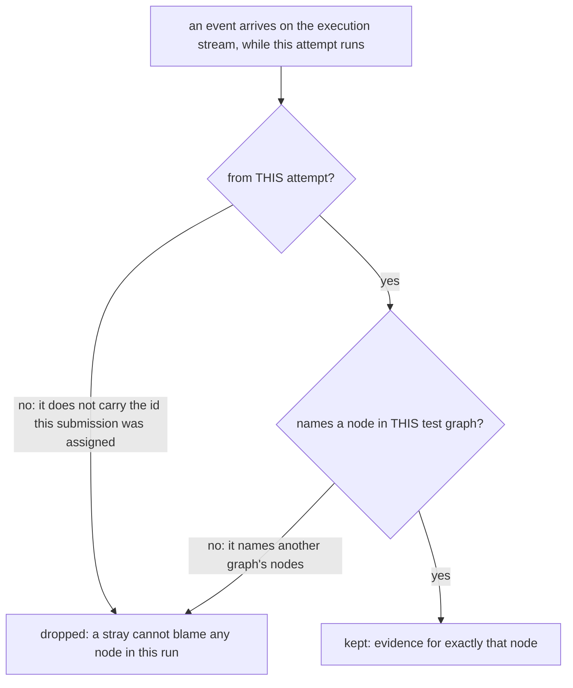
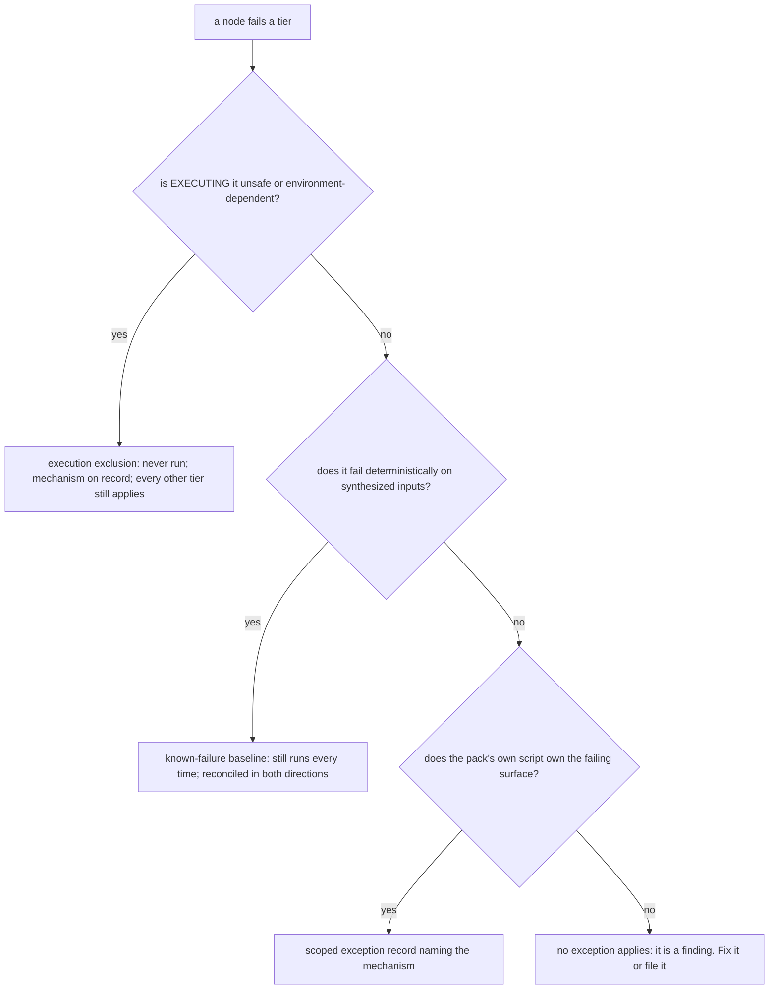
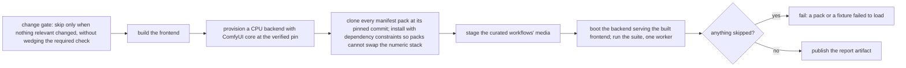
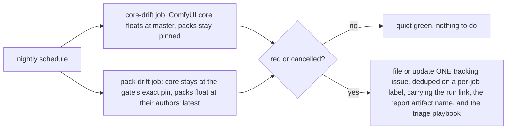

# Custom-Node Regression Suite - Technical Design Doc

## 1. Overview

Proves community custom-node packs work against this frontend across both
renderers: nodes register, render under LiteGraph (canvas) AND Vue Nodes 2.0
(DOM), and execute real workflows end to end. Manifest-driven: adding a pack
is one JSON row, no new test code.

The design of the suite: what it is made of, how the pieces cooperate, the
decisions behind them, and the gotchas that shaped them. How to run it:
[section 4](#4-running-the-suite-locally). How to onboard a pack:
[section 6](#6-onboarding-a-pack).

The architecture core is eight views - seven numbered under
[Architecture](#3-architecture), plus the
[CI deployment view](#5-ci-deployment); the diagram map under "Reading
paths" shows what question each answers and how they nest. Implementation
symbols live in one place: the implementation map at the end
([section 8](#8-implementation-map)).

### What / Why / How, in one minute

**What it proves.** On every PR, for every node that the manifest's
community packs register on a real backend, the suite proves four concrete
things: the node mounts completely in both renderers (the canvas renderer,
LiteGraph, and the DOM renderer, Vue Nodes 2.0), it survives save/reload,
its slots wire type-correctly, and it executes when its inputs allow.
[Section 2.1](#21-what-the-suite-proves) states each proof precisely.

> **Scale snapshot (example, at the time of writing):** 6 packs, 799
> registered nodes, about 5,000 planned wiring checks, about 440 nodes
> executing clean per run. These are observations printed by the run, not
> properties of the design; they move whenever the manifest or a pin moves.

**What it does NOT prove.** Output semantics, frontend-only nodes, and
hour-scale soak behavior are out of scope; [section 2.2](#22-deliberately-out-of-scope)
states the non-goals precisely. Green means "every registered node still mounts, saves, wires,
and runs," and nothing wider: a compatibility and regression gate, not a
behavior certifier.

**Why it exists.** Regressions against real community packs used to be
invisible: the frontend could break widely installed packs and no test
would fail, because nothing exercised those packs at all. Claims about
which packs worked were anecdotes with no receipts. The suite turns "most
packs are broken" or "this one is fine" from an opinion into a per-node,
reproducible result attached to a PR.

**How it works, in one paragraph.** One manifest row per pack (source,
pinned version, tiers, a tiny curated workflow) drives everything; there is
no per-pack test code. The suite reads each pack's real node list live from
the backend, derives what every node should be able to do, and verifies it
in a real browser against a real backend with the pack's own frontend
scripts active. Every exception is a reviewed record that carries its
causal mechanism, every exception list is guarded against going stale
(section 10 grades the strength of each guard), and execution results are
reconciled in both directions against a known-failure baseline, so the
gate can neither hide a regression nor accumulate dead exemptions.
Nothing is ever skipped; a skip fails the job.

### Reading paths

- **Skeptical about what green actually covers?** [Section 2](#2-scope--milestones) (what it proves
  and the non-goals) and section 12 (the gotchas: every real incident, its
  root cause, and the defense).
- **Deciding pack strategy** (which packs to keep, which renderers to
  support): section 11 (design decisions and their trade-offs) and the [Vue
  Nodes compatibility policy](#vue-nodes-20-compatibility-policy). A pack is one
  manifest row to add or remove.
- **Onboarding a pack:** [section 6](#6-onboarding-a-pack). The architecture
  views are the why; that section is the step-by-step.
- **Debugging a red run:** the
  [failure-class list](#failure-classes-and-what-they-mean)
  maps each red message to a cause; sections 7 and 10 show where in the pipeline it
  happened; section 12 gives symptom-first triage.

How to read the diagrams: a rectangle is one step, named by its purpose; a
diamond is a short question, drawn only where the flow genuinely forks; a
check that cannot fork is a "Check:" step, not a diamond; a titled group
is a thing with internal structure; mechanism detail lives in the prose
under each diagram, not stacked inside boxes.

The eight views are zoom levels of one mental model, not eight parallel
pictures. Every arrow below names the element of the parent view that the
child expands. The map is ordered by zoom, not by page order: arrows say
what contains what, section numbers say where to read.



The mount and wiring tiers have no diagram on purpose: each is a
single-shot comparison with nothing to sequence, so they live as prose and
tables in section 5.

## 2. Scope & Milestones

### 2.1 What the suite proves

For every node that the manifest's packs register on the backend,
re-discovered live on every run:

- the node **mounts completely** in both renderers: the instance
  materializes every input and output its definition declares, and under
  the DOM renderer the page renders at least the instance's widget and
  slot counts
- the node **survives save/reload**: no widget silently disappears and no
  serialized value silently changes across a save/reload round-trip, and a
  user-like non-default write sticks and survives a second reload, under
  both renderers (dynamic widgets the application itself adds on reload are
  expected and allowed, see section 8)
- the node's concrete slots **wire type-correctly** through the real
  connection validator, and the wires survive save, reload, and prompt
  serialization
- the node **executes on a real backend** when its inputs allow it, and its
  output observably arrives at an observation sink
- the pack's **frontend extensions actually load**: every extension name the
  manifest declares (`expectedExtensions`) is registered in the browser.
  Backend nodes can register while the pack's JS silently fails to load
  (wrong web dir, a loadExtensions regression), which would strip every
  JS-driven behavior and quietly downgrade this suite to testing vanilla
  nodes
- **dynamic input slots grow and shrink** for the curated autogrow nodes:
  connecting the last input adds a slot (via both a real drag and a
  programmatic connect, under both renderers, in the graph AND, in the Vue
  renderer, as a rendered row), disconnecting removes the trailing empty. This behavior lives in
  pack JS (`onConnectionsChange` overrides), invisible to `/object_info`, so
  the def-driven tiers above cannot see it
- the node's **rendered layout matches a committed baseline**, in
  both renderers: node size, widget-row offsets and heights, and slot
  positions, recorded in the CI environment and compared to within a
  0.01px tolerance (absorbs cross-runner sub-pixel float; still reds on
  any real shift, ~100x finer than a 1px move). CI-only (local runs log
  and skip: baselines encode CI fonts and pack-JS layout); nodes with a
  nondeterministic or content-variable layout are excluded by mechanism
  (section 12, G15)

Every tier also asserts the app shows **zero visible errors** while doing
this, except the execution tier, which deliberately provokes expected
failures (section 7).

### 2.2 Deliberately out of scope

Deliberately out of scope: output semantics (does a blur actually blur),
frontend-virtual nodes that never register on the backend, and hour-scale
soak behavior. A rare intermittent glitch that only surfaces after long
interactive use (a widget that occasionally shrinks on its own) is soak
behavior: this per-PR gate will not catch it, and does not claim to.

The screenshot tier (story S16) is backlog: not implemented, deliberately
out of scope.

### 2.3 Milestones

| #   | Milestone                                                                                                                                                                                                                                                                                                                                             | Status      |
| --- | ----------------------------------------------------------------------------------------------------------------------------------------------------------------------------------------------------------------------------------------------------------------------------------------------------------------------------------------------------- | ----------- |
| M1  | Suite merges into primary CI for all PRs: `custom-nodes-e2e-core` and `custom-nodes-e2e-cloud` become required checks. Exit evidence: both gates green on the suite PR, plus the detection-proof matrix run [30392502687](https://github.com/Comfy-Org/ComfyUI_frontend/actions/runs/30392502687) all 15 legs green ([section 7](#7-detection-proof)) | in progress |
| M2  | Evaluate splitting into FE + backend CI suites                                                                                                                                                                                                                                                                                                        | not started |
| M3  | If splitting: design and deploy the backend CI suite                                                                                                                                                                                                                                                                                                  | not started |

## 3. Architecture

The architecture views below keep their original numbering (2-12 here; the
CI deployment view, 13, lives in [section 5](#5-ci-deployment)): in-prose
references like "(section 9)" and the reading-path diagram cite these
numbers.

### 2. System context

Who and what the suite touches.



The two "Suite" boxes are the same system, split so the flow reads one way:
the driver puts the frontend through its paces, and verdict synthesis turns
what came back into the per-node verdicts and mechanism-carrying exceptions
the team consumes. Nothing flows backwards.

The load-bearing property: the suite tests the same stack a user runs. The
pack's own frontend scripts are active, the backend actually executes
graphs, and nothing is mocked.

### 3. The verification environment

The environment must have these properties, or the suite reports green
while testing the wrong thing:

| Requirement                                                               | Why                                                                                                                                                                                                                                                             |
| ------------------------------------------------------------------------- | --------------------------------------------------------------------------------------------------------------------------------------------------------------------------------------------------------------------------------------------------------------- |
| The backend serves the **built** frontend, and tests point at the backend | The dev server loads core extension scripts only, so pack frontend scripts never run under it. Packs that restyle nodes, rebuild widgets, or hook the submission path behave completely differently. Both early "green locally, red on CI" incidents were this. |
| Execution caching disabled                                                | Per-node "it actually ran" signals are only emitted for non-cached executions; with caching on, a node can pass without running.                                                                                                                                |
| Isolated test users                                                       | Test state must not leak between runs or into a developer's real workspace.                                                                                                                                                                                     |
| One test worker                                                           | The backend's execution queue is a shared, exclusive resource. Two workers interrupt each other's work and misattribute events.                                                                                                                                 |

### 4. Building blocks

What the suite is made of. The main flow is a straight pipeline; the shared
services that support the tiers are listed in the table below it.



The shared services behind the tiers:

| Service               | Used by                                                                 | Responsibility                                                                                                                                                          |
| --------------------- | ----------------------------------------------------------------------- | ----------------------------------------------------------------------------------------------------------------------------------------------------------------------- |
| Definition Normalizer | Wiring (slot model); every all-nodes tier (pack attribution, node keys) | one canonical connectable-slot model out of the multiple definition dialects (section 6), feeding the pairing planner                                                   |
| Capability Classifier | Execution                                                               | decides, per node, what it can do without hand-written fixtures: run on its own defaults, run with synthesized inputs, or blocked, with the reason recorded (section 7) |
| Execution Harness     | Execution                                                               | runs nodes for real and attributes every outcome to the right node despite an asynchronous, noisy event stream (sections 7 and 9)                                       |

Two further tiers (curated workflows, core smoke) sit alongside these four
but are fixture-driven rather than derived from the node corpus; section 5
lists all six.

Dialect handling is deliberately not centralized. Mount and the Capability
Classifier read the raw definitions through their own purpose-built
parsers (`declaredShape`, `classifyInput`), because each needs a different
slice of a definition (declared parts vs. runnability); the normalizer's
slot model feeds the wiring planner alone, though the all-nodes tiers
also call it for pack attribution and node-key derivation. What keeps the
three parsers from drifting is shared evidence, not shared code: each is
pinned by fixtures copied from a live census of both definition dialects
(section 6).

- **Pack Manifest**: the single extension point. Adding a pack is one row;
  no tier knows pack names.
- **Evidence Ledgers**: the honesty mechanism. An exception without a
  recorded mechanism is not allowed to exist (section 10).

### 5. The verification tiers

| Tier                 | Verifies                                                                                                                                                                                       | Renderers                                                  | Notes                                                                                                                                                                              |
| -------------------- | ---------------------------------------------------------------------------------------------------------------------------------------------------------------------------------------------- | ---------------------------------------------------------- | ---------------------------------------------------------------------------------------------------------------------------------------------------------------------------------- |
| Mount Completeness   | every declared input and output actually materializes on the created node; the DOM renderer additionally shows at least the instance's widget/slot counts                                      | both; a pack declared Vue-incompatible runs canvas only    | missing parts fail; extras are tolerated                                                                                                                                           |
| Layout Geometry      | every node's rendered geometry (canvas model numbers; DOM rects normalized to graph space) matches a committed per-pack baseline to within 0.01px - the shrinking/collapse class fails by name | both; a pack declared Vue-incompatible records canvas only | baselines recorded in CI for font parity; compared in CI only (local runs log and skip); nondeterministic or content-variable nodes ledgered by mechanism and registration-guarded |
| Persistence          | save/reload loses nothing and changes nothing; user-like writes stick and survive reload                                                                                                       | both; a pack declared Vue-incompatible runs canvas only    | application-added dynamic widgets are legal; see section 8                                                                                                                         |
| Wiring Compatibility | one representative typed wire per slot connects through the real validator and survives save, reload, and prompt serialization                                                                 | breadth sweep: one, by decision 7; curated drags: both     | dropdown slots pair only on identical option sets; see section 10 for exception routing                                                                                            |
| Execution            | the node runs on a real backend and its output arrives at an observation sink                                                                                                                  | one, by decision 7                                         | the full flow is section 7                                                                                                                                                         |
| Curated workflows    | a small hand-authored graph per pack executes end to end; its named must-exist nodes are asserted present (a missing one fails the tier, catching a pack that renamed or dropped a node)       | both (render pass)                                         | plus a forced-error self-check proving the harness detects real failures                                                                                                           |
| Core smoke           | the core app loads a workflow cleanly with packs installed                                                                                                                                     | both                                                       | guards against packs breaking the base app                                                                                                                                         |

One vocabulary bridge, because the manifest predates these tier names: the
manifest row's `tiers` field takes `load`, `run`, `connectivity`, and
`io`. Today `run` gates the curated workflow execution, `connectivity`
gates the wiring tier, and everything else ignores the field: mount,
persistence, execution, and the curated render pass run for every row
unconditionally, and core smoke is pack-independent. `load` and `io` are
accepted by the schema but currently gate nothing.

#### Tier detail, spec-level

The same tiers at spec-file altitude:

- **T0 load**: pack nodes are registered in `/object_info`, added to a
  cleared graph, counted exactly, and each added node's own `[data-node-id]`
  element mounts under Vue Nodes 2.0. Both renderer passes - unless the pack
  declares `vueNodesCompatible: false` in the manifest (evidence required;
  see the [Vue Nodes 2.0 compatibility policy](#vue-nodes-20-compatibility-policy)), in which case its tests run their
  LiteGraph-canvas assertions only. Never a skip. T0 also asserts each
  pack's declared frontend extensions registered (`expectedExtensions`).
- **T1 run**: the manifest workflow is loaded and queued; the backend's
  `executing` event stream must contain every expected node id, and the run
  must end in `execution_success`.
- **Dynamic inputs** (`dynamicInputs.spec.ts`): autogrow nodes (pack JS adds
  an input when the last one is connected, removes trailing empties on
  disconnect) grow and shrink correctly, via BOTH a real mouse drag and a
  programmatic connect, under both renderers, asserted in the graph AND (in
  the Vue renderer) as a rendered slot row, both directions.
  Curated cases live in the spec's `AUTOGROW_CASES` table.
- **Every-node tiers** (`allNodes.spec.ts`): the pack's FULL node list,
  discovered live from `/object_info`, is exercised with zero
  configuration, in ONE test per pack (one app boot serves all three
  tiers; a tier's failure is collected, never allowed to skip the tiers
  after it) - every registered node mounts in both renderers (chunked
  at an empirically measured batch size), survives a serialize/configure
  save-reload round-trip, and executes for real on the backend when
  self-sufficient (all required inputs are widgets with valid defaults).
  Nodes that cannot run alone are classified and logged
  (`NEEDS_WIRES` / `NEEDS_MODELS` / `NO_OBSERVABLE_OUTPUT` / rejected-at-validation),
  never silently dropped; the documented exception ledgers (see
  [the ledger table](#the-exception-ledgers-all-reasons-on-the-record)) carry a written mechanism for every
  escape hatch.
- **Layout geometry**: while the mount sweep has each node on screen, its
  geometry (node size, widget-row positions, slot positions, in both
  renderers) is measured and compared against committed per-pack baselines
  to within a 0.01px tolerance (absorbs cross-runner sub-pixel float, still
  catches any real shift) - any layout move, the "shrinking node" class,
  fails naming the node and field. The compare runs in CI only (local runs log and
  skip: baselines encode CI fonts and pack-JS layout, which local
  environments cannot reproduce). Baselines are recorded automatically by
  the record workflow (`.github/workflows/record-custom-nodes-geometry.yaml`);
  nodes whose layout is racy or follows environment content are ledgered by mechanism in
  `GEOMETRY_UNSTABLE_NODES` (see
  [Step 5b](#step-5b---record-the-packs-geometry-baseline)).
- **connectivity (contract)**: wiring-only, no execution. A
  type-pairing generator (`fixtures/customNode/typePairing.ts`) indexes
  `/object_info` producers/consumers and plans one representative typed edge
  per slot (wildcard `*` slots excluded - they bypass the real type compare
  and prove nothing). Each planned edge must connect through the real
  `isValidConnection` veto, then survive `serialize()` -> `configure()` and
  appear in `graphToPrompt()` output. A curated subset is additionally
  dragged for real - slot dot to slot dot - under both renderers. Orphan
  types (no partner in the corpus) are reported, never fake-failed. One
  representative edge per slot bounds cost; it does not prove all pairs.
- **Zero visible errors**: the mount, persistence, connectivity, core
  smoke, and curated workflow tests assert the app's error surfaces (error
  overlay, error dialog, node render errors, error toasts) are absent at
  start and after every pass - green means a human watching those runs sees
  no errors. Two deliberate exceptions: the auto-run execution tier
  provokes expected failures (baselined cannotRunAlone nodes surface as
  real error UI by design), and the self-check inverts the invariant - it
  forces a real execution error and asserts the overlay IS visible, proving
  the selectors stay live.
- **Console-error window**: the console/page-error ledger (curated run,
  save/reload) starts collecting inside each tier, so it covers the tier's
  own actions - load, run, wire, save. Pure console noise a pack logs at
  app boot, before the first tier action, is out of that window by design:
  the shared app fixture navigates once at setup, so boot output predates
  any per-pack collector. Boot breakage that MATTERS still fails the gate -
  the zero-visible-errors check runs at startup and catches any boot error
  that reaches a visible surface; only invisible, functionally-inert boot
  console noise (the ledger's whole reason to exist) is out of scope.

### 6. The node-definition pipeline

Where the suite's knowledge of every node comes from: definitions flow left
to right, and three independent parsers derive three plans from one live
census.



The three plans are independent consumers of the same census, each through
its own dialect-aware parser (section 4 names the symbols): the wiring
plan feeds the Wiring Compatibility tier, the execution plan feeds the
Execution tier, and the mount expectations feed Mount Completeness.

Design rule that came from a real bug: every consumer must handle **both
definition dialects** (legacy list-form and V2 object-form), and anything
with an unknown shape is excluded with a record, never silently matched or
skipped. The dialects differ in where dropdown options live, how "must be
wired" is flagged, and how growable input groups are declared; details and
evidence rules are in
[Evidence rules for changing the harness itself](#evidence-rules-for-changing-the-harness-itself).

### 7. The execution flow

How the suite runs hundreds of foreign nodes safely, with no fixtures, and
still attributes every failure to the right node.



Synthesized inputs are produced by a small set of self-sufficient producer
nodes (an empty image, an empty latent, a solid mask, primitive values), so
"runnable with synthesized inputs" needs no per-node authoring. The
observation sink is what upgrades "it finished" to "its output actually
arrived somewhere."

The submission guard is why a crash inside a pack's own script can never
abort the tier: the throw is caught in the page, recorded as that node's
failure with the client error text, and the run moves on.

### 7b. The output-regression tier (S15)

execution_success proves a curated workflow RAN; nothing above proves it
produced the SAME outputs. A serialization regression can drift a widget
value without invalidating it: validation passes, execution succeeds, every
def-driven tier stays green, and only the produced content changes.

After a T1 curated run PASSes (core env, CI only), each sink's `executed` ui
payload is canonicalized (sorted keys; file refs keep their sibling keys and
collapse only the run-varying filename to its extension; PNG refs embed a
pixel hash over IDAT chunks only, because ComfyUI writes the prompt into
tEXt metadata) and hashed. One digest per sink, compared against the
CI-recorded `fixtures/data/curatedOutputHashes.core.json`.

Fail-closed drift classes, all red: a curated run workflow with no committed
entry (enrollment is explicit), a changed hash (the drift message names both
digests and the baseline's provenance), a committed output that vanished,
and a NEW output with no entry. The fixture carries `recordedAt`
(core SHA + record run id) because hashes are only comparable against the
environment that recorded them; compare is CI-gated for the same reason
(the geometry-tier convention). Cloud is excluded: the fetch is node-side,
which carries no cloud session; cloud enrolls when an in-app fetch lands.

### 7c. The interaction-profile tier (S13)

The def-driven tiers cannot see what pack JS does IN RESPONSE to an
interaction, and the curated tiers (S12 autogrow, S15 outputs) cover
hand-picked nodes only. S13 locks the observed interaction behavior of
EVERY registered node without understanding any pack: probe each node with
instantiate / connect-first-input / connect-last-input / disconnect
(producers synthesized from the auto-run tier's model-free set), snapshot
the node's logical shape (inputs, outputs, widgets as `kind:name:type`
entries) before and after, and record the DELTAS. Whatever a node's JS does
today is the baseline; a frontend change that alters it reds against the
committed delta. Deltas, not absolute shapes, keep baselines invariant to
def changes a pin bump legitimately makes.

Probes queue no prompts - pure browser-side graph interaction - so the tier
carries no backend-queue exclusivity constraint and the same spec runs
unchanged under core and cloud, with per-environment baseline fixtures
(`fixtures/customNode/interactionProfiles/`, cloud under `cloud/`),
provenance-stamped like every recorded fixture family. Nodes with no
compatible model-free producer record `NO_PRODUCER`; input-less nodes
record `NO_INPUTS` - markers are locked observations too, so a node whose
inputs vanish drifts loudly. `INTERACTION_UNSTABLE_NODES` is the
mechanism-keyed escape hatch, empty until instability is observed across a
record/compare cycle.

### 8. The persistence check

Why it is staged: the DOM renderer's widget components react to creation
and reload on their own schedule, and a check that snapshots synchronously
would compare state those reactions never touched. The whole pass runs once
per renderer.



Between phases the rig yields to the UI so renderer effects flush before
the next snapshot; those settle points are what makes the staging real.

Widgets whose values the pack's own script owns (canonicalized references,
embedded editors) are exempt from probe writes, each with a recorded
mechanism: writing probe markers into them only makes the pack's script
choke on the probe.

### 9. Event attribution

Real execution reports back over an asynchronous event stream, and the
stream can mislead in two specific ways. Both produced real misattributed
failures before the filters existed. The primary defense is positive: when
the harness submits a graph, it captures the id the backend assigns to
that submission from the submission response itself, so an event's
ownership is checked against a known id, never inferred from history.
Every arriving event passes the same two questions before it may count as
evidence:



Both no-answers are checkable, not hopeful. The first is a comparison
against the captured submission id: an event either carries it or it does
not. If that capture ever misses, the harness says so on the console and
falls back to identity bookkeeping, recording every attempt identity it
has ever seen so a late event from an observed attempt still identifies
itself. The second question defeats the one stray the first cannot: a
retried duplicate arriving under a never-seen identity. Node identities
are never reused within a session, so such an event can only name an
earlier graph's nodes. Membership is decisive.

### 10. The evidence model

The suite's honesty mechanism. Every exception is a reviewed record that
names its causal mechanism, and every list is guarded: an entry naming a
node the pack no longer registers fails the suite. Full per-record
semantics live in
[the exception ledgers table](#the-exception-ledgers-all-reasons-on-the-record).



What the first question means in practice: runtime downloads or installs,
infinite loops, host-specific results, mutable-content dropdowns,
unreliable completion signals. What a pack script owning the failing
surface looks like: rewritten values, custom widgets, vetoed wires,
console noise.

The two-way baseline is what stops the whole evidence model from rotting: a
failure that is not listed fails the gate, and a listed node that starts
passing ALSO fails the gate until its stale entry is removed. Exemptions
cannot silently accumulate.

Not every ledger can earn that two-way strength; the guards come in three
grades. Ledgers whose nodes still execute (the known-failure baseline) are
two-way behavioral: a new failure and a stale entry both flip the gate.
Ledgers that stop a path from running at all (execution exclusions,
probe-write exemptions, geometry-unstable exclusions) are registration
guarded: the suite proves the
named node still exists, but the excluded path never runs, so an entry
that stopped being necessary cannot be observed; staleness there is
caught by review, not observation. Weakest are the pattern allowlists
(the console-error ledger): an entry that no longer matches anything
simply filters nothing, and usage tracking cannot be naively bolted on,
because some patterns are environment conditional (a missing-model 404
fires only on hosts without the model), so an entry can be legitimately
idle in one environment and load-bearing in the next.

The console-error ledger also has a bounded window, not just bounded
strength. Collection starts inside each tier, so it covers that tier's
own actions (load, run, wire, save); console noise a pack logs at app
boot, before the first tier action, is outside it - the shared app
fixture navigates once at setup, so boot output predates any per-pack
collector. This is deliberate: boot breakage that reaches a visible
surface is still caught by the startup zero-visible-errors check, and
invisible boot console noise is exactly what the ledger exists to
tolerate rather than gate on.

### 11. Design decisions

The decisions that define the suite, with their trade-offs. Each is
deliberate, and each is cheap to reverse or narrow later. The suite's one
deliberate extension seam is the curated-workflow fixture: anything the
manifest cannot derive from the live node corpus (pack-specific semantics,
multi-node behavior) is expressed there (decisions 6 and 11).

| #   | Decision                                                                                                                                                                                                    | Why                                                                                                                                                   | Trade-off accepted                                                                                                                                                  |
| --- | ----------------------------------------------------------------------------------------------------------------------------------------------------------------------------------------------------------- | ----------------------------------------------------------------------------------------------------------------------------------------------------- | ------------------------------------------------------------------------------------------------------------------------------------------------------------------- |
| 0   | Drive a real browser, not just the backend API                                                                                                                                                              | Pack frontend scripts (widget rebuilds, restyles, submission hooks) are half of what breaks; only a browser running the built frontend exercises them | Browser e2e is the slowest, most race-prone tier; mitigated by the attribution filters (section 9) and the staged settle points (section 8)                         |
| 1   | Real environment only: real browser, real backend, pack scripts active, nothing mocked                                                                                                                      | The failures worth catching live in the integration, not in units                                                                                     | Slower than unit tests; needs a backend in CI                                                                                                                       |
| 2   | The backend serves the built frontend                                                                                                                                                                       | The dev server never loads pack scripts, so it tests a different product                                                                              | Local iteration needs a build + restart for pack-script changes                                                                                                     |
| 3   | One test worker                                                                                                                                                                                             | The execution queue is exclusive; parallel workers corrupt each other's evidence                                                                      | Wall-clock time grows with the manifest                                                                                                                             |
| 4   | Execution caching disabled                                                                                                                                                                                  | The per-node "actually ran" signal only exists for uncached executions                                                                                | Every run pays full execution cost                                                                                                                                  |
| 5   | Packs AND ComfyUI core installed at pinned, verified versions in the PR gate                                                                                                                                | An upstream push must not change what the gate tests mid-flight; a gate red must be attributable to the PR                                            | Pins need deliberate bumps (gate + canary Job B together); git-level drift detection lives in the non-gating nightly canary (Job A floats core, Job B floats packs) |
| 6   | One manifest row per pack, zero per-pack test code                                                                                                                                                          | Extension cost stays constant as coverage grows                                                                                                       | The generic tiers cannot assert pack-specific semantics; curated workflows exist for that                                                                           |
| 7   | Both renderers only where the renderer can change the outcome: mount, persistence, the curated render pass, the curated pointer drags, core smoke; one renderer elsewhere (breadth wiring sweep, execution) | Widget values flow through the same store under both renderers (verified by probe), so doubling execution buys no new failure surface                 | If that store unification ever changes, revisit this decision                                                                                                       |
| 8   | Every exception carries its mechanism and is stale-guarded                                                                                                                                                  | An unexplained exemption is indistinguishable from a hidden bug                                                                                       | Onboarding a flaky pack takes more effort than a blanket skip                                                                                                       |
| 9   | Known-failure baseline reconciled in both directions                                                                                                                                                        | One-way baselines rot into permanent blind spots                                                                                                      | A node that gets fixed upstream turns the gate red until its entry is removed (by design)                                                                           |
| 10  | Small batches with single-node bisection                                                                                                                                                                    | Batching amortizes queue latency; bisection restores per-node attribution on failure                                                                  | A failing batch costs one extra pass over its members                                                                                                               |
| 11  | Scope excludes output semantics and frontend-virtual nodes                                                                                                                                                  | Both need per-node knowledge a manifest cannot derive; curated workflows and future behavior tests are the extension point                            | "Green" is narrower than "the pack fully works," and says so                                                                                                        |

### 12. Gotchas: every incident, its root cause, and the defense

These failure modes shaped the suite. Each was real: something passed that
should have failed, or failed for a reason that had nothing to do with the
node under test. Named nodes below are worked examples of their class,
kept because specifics are what make a mechanism checkable. Do not remove
a defense without re-reading its incident. The two recurring team concerns
these answer: "green but broken" and "tests can never catch random bugs."

#### G1. Dev-server pack-script blindspot

- **You hit it when**: a node behaves perfectly in local dev but breaks on
  CI, or vice versa, on any pack that restyles nodes, rebuilds widgets, or
  hooks the submission path.
- **Root cause**: the dev server loads core extension scripts only; pack
  frontend scripts never run under it. The node tested there is a
  different node than the one users get.
- **Defense**: the environment contract (section 3): the backend serves the
  built frontend and tests point at the backend. CI does exactly this (section 13).
- **Answers**: green but broken.

#### G2. Widget-state bleed through recycled node identities

- **You hit it when**: a node fails validation with a value it was never
  given, specifically a dropdown carrying an option that belongs to some
  OTHER node created earlier in the same session.
- **Root cause**: the frontend keeps widget state keyed by node identity,
  and that state survives clearing the graph. A new node that reuses a
  cleared node's identity inherits its same-named widget values. Core
  frontend bug, distinct from this suite; the defense below stands
  regardless of when it is fixed.
- **Defense**: the suite never reuses a node identity within a browser
  session: every builder hands out monotonically increasing identities
  across graph clears.
- **Answers**: green but broken (a neighbor's leftover value produces a
  false failure and hides the real store bug).

#### G3. Event misattribution races

- **You hit it when**: node A is reported failing, but the error belongs to
  node B tested just before it, or to a duplicate submission of an earlier
  graph.
- **Root cause**: two races over the asynchronous event stream: late
  arrivals from a previous attempt, and duplicate attempts created by a
  submission retry erroring under a fresh identity.
- **Defense**: the positive submission-id match plus the graph-membership
  filter of section 9, made decisive by G2's never-reuse-identities rule.
- **Answers**: tests can never catch random bugs (a misattributed error is
  noise that erodes trust in every verdict).

#### G4. Pack scripts crashing the submission path

- **You hit it when**: an entire pack's execution tier aborts, not just one
  node.
- **Root cause**: pack scripts can hook workflow submission and throw on a
  graph shape they do not expect. Observed example: a video pack's
  "apply to graph" hook copies its latest file into downstream widget
  inputs and throws when its output feeds a plain socket while matching
  files exist; the trigger is content-dependent.
- **Defense**: submission runs guarded; a throw records as that node's
  failure, carrying the exception text, so the node names itself instead
  of aborting the tier. The proven case is also excluded with its
  mechanism in the exclusion ledger, and remains an upstream-report
  candidate.
- **Answers**: tests can never catch random bugs (uncaught, one crash masks
  every node queued behind it).

#### G5. Two definition dialects

- **You hit it when**: a set of nodes silently never executes: they are
  classified as needing wires they do not need, so the planner skips them
  and nothing goes red.
- **Root cause**: node definitions reach the suite in two dialects (legacy
  list-form and V2 object-form), and a parser written against one dialect
  misreads the other. Measured example: 8 nodes of one pack were invisibly
  unexecuted until the classifier learned the second dialect.
- **Defense**: each consumer's parser handles both dialects
  (`declaredShape` for mount, `classifyInput` for execution, the
  normalizer for wiring; section 4); parser fixtures are copied from a
  live census of the real corpus so tests cannot self-confirm a parser's
  assumptions; unknown shapes are excluded with a record, never silently
  matched (section 6).
- **Answers**: green but broken (a whole class of nodes was uncovered while
  the tier stayed green).

#### G6. "Must be wired" beats every dialect

- **You hit it when**: an input the pack marked as wire-only is treated as
  a widget, so the node runs without the wire it requires.
- **Root cause**: the wire-only flag can appear on any input form; a
  classifier that checks the form before the flag misreads it.
- **Defense**: the classifier checks the wire-only flag first, before any
  form-specific branch; fixtures pin the ordering.
- **Answers**: green but broken.

#### G7. Dropdown pairing semantics

- **You hit it when**: the wiring tier pairs two unrelated dropdowns (a
  checkpoint list into a scheduler list), a pass that proves nothing, or
  refuses to pair two dropdowns that differ only in menu order.
- **Root cause**: a wired dropdown input bypasses its own menu, so the wire
  contract is set membership of options, not their order. And dropdowns
  whose options are not statically known cannot prove anything by pairing.
- **Defense**: dropdowns pair only on identical option SETS
  (order-insensitive); dropdowns with unknown option lists are excluded
  from pairing with a record instead of blind-matched.
- **Answers**: green but broken.

#### G8. Environment flips

- **You hit it when**: a node fails on one OS but is clean on another, run
  to run, with no code change. A subtle variant is the warm-cache
  illusion: a node that downloads model weights inside execution runs
  clean only where the cache is already warm.
- **Root cause**: execution depends on the host, not on the node's
  frontend contract: numeric-stack differences, codec differences, cached
  downloads, directory-handling differences.
- **Defense**: the environment-variable class of execution exclusions,
  each entry naming its per-host mechanism, reconciled against observation
  runs on both hosts. The node keeps every non-execution tier.
- **Answers**: tests can never catch random bugs (host-dependent flips are
  flake that trains people to ignore red).

#### G9. Queue jams from non-interruptible execution

- **You hit it when**: the execution tier hangs and every node queued
  BEHIND one offender reports failure.
- **Root cause**: some execution paths never respond to interrupt:
  installing packages at runtime, pure-Python infinite loops (observed
  example: a text-replace node spinning forever on an empty search
  string), minutes-long per-pixel loops, non-interruptible weight
  downloads.
- **Defense**: a timeout interrupts and checks that the queue recovers; a
  queue that will not drain stops the tier immediately and names the batch
  as suspects. Triage is explicitly offender-versus-victims, and a
  preflight asserts the queue is idle before the tier starts. Proven
  offenders are excluded with their mechanism.
- **Answers**: tests can never catch random bugs (a jam failing a whole
  batch is pure noise; the tripwire converts it into one named offender).

#### G10. Renderer effect timing

- **You hit it when**: the persistence tier passes under the canvas
  renderer but silently tests nothing under the DOM renderer.
- **Root cause**: DOM-renderer widget components react to creation and
  reload asynchronously, writing back into the value store on frame
  boundaries; a synchronous snapshot compares state those reactions never
  touched.
- **Defense**: the persistence check is staged with explicit settle points
  between build, snapshot, reload, and write phases (section 8), and runs once
  per renderer.
- **Answers**: green but broken (a synchronous pass certifies a value path
  it never observed).

#### G11. Growable input groups materialize under expanded names

- **You hit it when**: mount completeness reports a declared input missing
  on a node that uses growable input groups, when the renderer actually
  materialized it under expanded per-slot names.
- **Root cause**: growable input groups do not materialize under their
  declared group name; they expand into per-slot names derived from it.
- **Defense**: mount expectations accept either the group name or its
  required expansion; this was the only definition-shape special case
  found across the full corpus.
- **Answers**: keeps mount fidelity strict without false-failing
  group-typed nodes.

#### G12. Legal dynamic growth on reload

- **You hit it when**: a node legitimately gains a widget on reload (the
  application attaches a seed-control widget; a pack appends a
  value-driven widget) and a naive equality check flags it as a
  regression.
- **Root cause**: reload is allowed to APPEND; what must never happen is
  the inverse: a widget disappearing or a saved value changing.
- **Defense**: the persistence comparison is asymmetric by design: growth
  passes, loss or mutation fails; after probe writes, values are compared
  only where the node's shape stayed stable, because a changed dropdown
  can legally rebuild a dynamic node.
- **Answers**: green but broken, from the other side: a check that
  rejected legal growth would get relaxed into uselessness.

#### G13. Mutable-content dropdowns

- **You hit it when**: a file-list node flips between clean and failing
  across runs, tracking whatever content the backend happens to hold.
- **Root cause**: some dropdowns populate from mutable backend content
  (file listings, run history), so their default value and validity change
  as content changes.
- **Defense**: the state-dependent class of execution exclusions, with the
  mechanism on record; where the same dropdown also re-resolves on reload,
  a scoped persistence exception skips the value comparison while the
  no-shrink rule still applies. All other tiers are retained.
- **Answers**: tests can never catch random bugs.

#### G14. Unreliable completion signals

- **You hit it when**: a node reports clean on one run and incomplete on
  the next with no change to anything.
- **Root cause**: the per-node "actually ran" signal is reliable for
  ordinary nodes with caching disabled, but list-expanded and
  remote-control nodes do not emit it on every run.
- **Defense**: only nodes with a PROVEN signal flip are excluded from
  execution, each recorded with the shared mechanism, so an incomplete
  result stays meaningful everywhere else.
- **Answers**: tests can never catch random bugs.

#### G15. Layout that is not reproducible run to run (two mechanisms)

The geometry tier's first live compare found exactly one delta across the
then-823-node corpus: SplineEditor's widget block sat at y 915 in the
record run and 920 in the compare run, at identical code. Root cause is
the same editor_base init race the console ledger documents for editor
creation: whether the pack's editor DOM finished initializing when the
frame drew decides the widget offsets.

A later compare surfaced a second, different mechanism. Across two
ephemeral runners on an identical pinned image and pinned bundled
Chromium, 3187 measured geometry values jittered by up to 2e-4px - float
residuals from the scale division, not a layout change - while
LoadAndResizeImage's litegraph height moved 566 to 354, because that
node's height follows whatever the backend's input dir holds.

Defense, by mechanism and never per incident: `GEOMETRY_UNSTABLE_NODES`
excludes the two editor_base subclasses (init race) plus
LoadAndResizeImage (content-variable height), registration guarded and
logged per run, and omitted from baselines entirely. Every other node
compares within `GEOMETRY_EPSILON_PX` (0.01px), which absorbs the
cross-runner float residual while still reding on any real shift - about
100x finer than a 1px move, and pinned on both sides by
`geometry.pure.spec.ts`.

## 4. Running the suite locally

### Prerequisites

1. A ComfyUI backend on `127.0.0.1:8288` with every manifest pack (the
   `pack` entries in `browser_tests/fixtures/data/customNodeManifest.core.json`)
   and ComfyUI_devtools
   installed. Launch it with `--multi-user` (the repo-wide browser-test
   prerequisite; the fixture writes per-worker user settings and the suite
   depends on them landing), `--cache-none` (repeat runs must re-execute
   every node or the executed-set check fails honestly with `PARTIAL`), and
   with `browser_tests/assets/plain_video.mp4` copied into its `input/` dir.
2. The dev server proxying that backend:
   `DEV_SERVER_COMFYUI_URL=http://127.0.0.1:8288 pnpm dev`

### Running

One-command runs, composed from the building blocks below with
`start-server-and-test` (starts what is missing, waits on real readiness
URLs, reuses services already running, tears down what it started):

| Script                               | What it does                                                                                                                                                    |
| ------------------------------------ | --------------------------------------------------------------------------------------------------------------------------------------------------------------- |
| `pnpm test:custom-nodes:local`       | CORE: boots the `TEST_COMFYUI_DIR` backend on :8288 (`--multi-user --cache-none`, venv auto-detected, video asset staged) + the dev server, then runs the suite |
| `pnpm test:custom-nodes:local:cloud` | CLOUD: builds the cloud dist, serves the preview (`/api` -> testcloud), runs the suite with the `.env` smoke credentials                                        |

Both still require the one-time setup above (core: packs + devtools
installed in the checkout; cloud: `SMOKE_ACCOUNT_EMAIL` /
`SMOKE_ACCOUNT_PASSWORD` in the gitignored `.env` - the suite fails
closed with the exact remedy if they are missing). Cloud caution: it
drives the ONE shared Cloud test instance - do not overlap with a CI
cloud run. For a `-g`-filtered run, use the building blocks directly.

The building blocks, runnable individually:

| Script                                | What it does                                                                                                                                                                                                                                                                                     |
| ------------------------------------- | ------------------------------------------------------------------------------------------------------------------------------------------------------------------------------------------------------------------------------------------------------------------------------------------------ |
| `pnpm test:custom-nodes`              | whole suite headless against the Vite dev server - the fast local loop for suite-code iteration. NOT the gate: the dev server never loads pack frontend JS (see Gotchas)                                                                                                                         |
| `pnpm test:custom-nodes:ci`           | whole suite headless against the backend-served BUILT frontend - the gate-equivalent run (every tier passes, zero skips). Requires a backend serving the built dist on :8188 (a separate endpoint from the :8288 dev-proxy backend in Prerequisites); set `PLAYWRIGHT_TEST_URL` if yours differs |
| `pnpm test:custom-nodes:watch`        | headed slow-motion run of the browser tiers, hands-off watching                                                                                                                                                                                                                                  |
| `pnpm test:custom-nodes:debug`        | step through the browser tiers in the Playwright Inspector (F10 step, F8 resume)                                                                                                                                                                                                                 |
| `pnpm test:custom-nodes:connectivity` | slot/type contract: type-paired links + real slot drags in both renderers (Inspector)                                                                                                                                                                                                            |
| `pnpm test:custom-nodes:self-check`   | watches the harness catch a deliberate execution error                                                                                                                                                                                                                                           |

Scope any run to one pack or tier with Playwright's `-g` filter (titles follow
`<pack>` / `T0` / `T1` patterns) instead of adding per-pack scripts - the
script list stays fixed while the manifest grows:

Example - watch the VHS video-decode run step by step:

```bash
pnpm test:custom-nodes:debug -g "VideoHelperSuite.*T1"
```

Two windows open: the app under test and the Playwright Inspector. Press F10
to execute one robot action at a time (workflow loads, queue fires, backend
decodes the video), F8 to run to the end. While paused, look but do not click
inside the app window - your clicks change the state the next assertion
checks.

Any `-g` pattern works against the generic scripts, e.g.
`pnpm test:custom-nodes:debug -g "Impact-Pack.*T0"`.

### Gotchas

- `playwright.chrome.config.ts` runs against system-installed Chrome, so no
  bundled Chromium is downloaded; that is what it buys. Tracing for the
  `custom-nodes` project comes from `playwright.config.ts` either way (the
  project's setting wins): retained on failure, and off under
  `CUSTOM_NODES_ENV=cloud` so a seeded cloud session cannot ride an artifact.
- In a git worktree whose `node_modules` is symlinked from another checkout,
  prefix scripts with `pnpm --config.verify-deps-before-run=false ...` to
  skip pnpm's auto-install check.
- First run against a cold dev server can exceed the 15s per-test setup
  budget while Vite compiles; just run again.

## 5. CI deployment

### 13. The CI deployment view

In today's implementation, the suite is Playwright driving bundled
Chromium, and the CI platform is GitHub Actions. The same suite deploys
against two backends, chosen by `CUSTOM_NODES_ENV` - a local Python backend
(`core`) and the remote Comfy Cloud backend (`cloud`) - each as its own
gating PR check, plus a nightly non-gating canary where git-level drift is
allowed to show up instead. The manifest, tiers, and every assertion are
shared; only the backend and its calibrated expectations differ.

#### The PR gate (`custom-nodes-e2e-core`, gating)

Everything git-level is pinned: ComfyUI core is provisioned at the exact
commit the suite was last verified green against, and every pack at its
manifest pin, enforced per pack before it installs. A gate red therefore
points at the PR itself. Python dependencies and the runner image still
resolve fresh per run - a red that appears everywhere at once right after
a dependency release is environment, not the PR. Mark it as a required check
in branch protection once this lands.



Fork PRs skip the job (the install loop is a code-execution surface) and
keep coverage via the main test shards. Sharding is deliberately deferred:
every shard would pay the full environment setup, which is a large share of
the job; the workflow states the threshold at which sharding starts paying.
Ballpark at the time of writing, moving like the scale snapshot: about
eight minutes of suite on top of about four and a half minutes of
environment setup, with sharding starting to pay once the whole job
passes roughly twelve minutes.

#### The cloud PR gate (`custom-nodes-e2e-cloud`, gating)

The same suite pointed at the remote Comfy Cloud backend by
`CUSTOM_NODES_ENV=cloud`, in `ci-tests-custom-nodes-cloud.yaml`. The core
gate's flow above holds with its backend half swapped out - no ComfyUI
checkout, no pack install, no torch constraints, because Cloud already runs
every supported pack - and with one more deliberate difference: the dist is
built as the CLOUD distribution (`build:cloud-e2e`), because `DISTRIBUTION`
is a build-time constant and a localhost build would compile out the
`isCloud` code paths this gate exists to exercise. In place of "provision a
CPU backend ... install every pack", one step serves that cloud dist through
`vite preview` with `/api` proxied to the Cloud URL (the two dev-only proxy
bypasses turned off, so pack frontend JS and real auth are exercised rather
than faked), and the suite signs in as Cloud's shared smoke user before it
runs. Everything downstream -
one worker, the skip gate - is identical, so the flow
gets no second diagram: it is the same picture with the environment and
install boxes replaced by one serve-against-Cloud box.

Where the core gate PINS its world, the cloud gate FLOATS with Cloud. Its
expectations are not hand-pinned but generated into the cloud manifest from a
Cloud `/object_info` snapshot, so a Cloud redeploy that moves the installed
pack set is recalibrated by regenerating that manifest (a regenerate-and-diff),
not by editing pins. Drift detection is therefore intrinsic on the cloud side:
a per-PR cloud red after a deploy is the deploy drifting, which is why the
cloud side needs no separate drift canary the way the pinned core side does.

Fork-safety matches the core gate: the same same-repo `if:` skips fork PRs
(which have no secrets), and a skipped job counts as passing. Three
cloud-specific differences: tracing is off under `CUSTOM_NODES_ENV=cloud`
(`playwright.config.ts`), because the seeded smoke-user session rides
`page.evaluate` arguments and a trace records those verbatim into a report
this workflow uploads as a public artifact - so a cloud red is triaged from
the list/json/html report, not a trace, and the fixture refuses to seed at
all if it ever finds itself in a traced project; because runs share one
Cloud test instance, the
gate and the cloud geometry record serialize on one shared literal
`concurrency` group (`cancel-in-progress: false`) instead of per-ref, so no
two runs cross-talk on the shared backend's execution stream - at the cost
that a newly queued run CANCELS a pending (not in-progress) one, which is
why this check must not be marked required until a per-run instance (open
item: run isolation) or an in-job lock replaces group serialization; and
because
the smoke user credentials may be unset (pre-calibration, or on a fork clone)
and the generated cloud manifest may not be committed yet, a gate step
checks BOTH first - either absent, it emits a loud `::notice` naming which
and no-ops the job green without running a test (secrets landing before the
manifest would otherwise red the suite at collection); both present, the
suite runs for real. Until then that no-op is the honest state, never a
green "0 tests". Run-tier enrollment for cloud rows comes from the curated
overlay (`fixtures/data/cloud/curatedCloudWorkflows.json`); rows without an
overlay entry register no run test.

**Release-pipeline stage (the cloud drift leg).** Beyond the per-PR gate, this
same cloud suite is the custom-node stage of the release pipeline - nightly
cut, staging Cloud, CI, QA, canary, rollout - pointed at the STAGING Cloud
carrying the version being cut and blocking rollout progression on red. It
reuses everything here and is triggered by the release pipeline, not a cron in
this repo. In the drift-leg naming this is the **cloud** leg (floats the Cloud
deployment, holds the frontend at the nightly cut); the **core** and **node
packs** legs are the nightly canary's two jobs below.

#### The nightly canary (non-gating drift radar)

The gate's pins mean git drift never breaks a PR, so drift needs its own
surface. The canary reruns the identical suite nightly, two jobs, each
moving exactly one git variable so every red names its own culprit. The
suite itself runs unmodified and fully strict in both jobs - no loosened
assertions, no special environment flags.



What a red means, and who acts:

- **Core-drift red**: a core change broke the frontend contract or
  exposed a pack bug (the 2026-07-18 KJNodes editor crashes were this).
  Fix the code, ledger the pack bug by mechanism, or bump the gate's core
  pin in its own PR.
- **Pack-drift red**: the authors' latest diverges from what we
  verified - the expected steady state whenever our pins lag. CI cannot
  classify author intent (an added node, a removed node, and a rename can
  each be healthy or breakage), so the job only detects divergence and a
  human classifies from the report: crashes or execution failures are
  reported upstream by a maintainer; count or membership drift alone
  means bump the pins and recalibrate the manifest.

The paging path is deliberate: a canary red blocks nothing, but it must
never rot unseen. The filing step fires on failure and on cancellation (a
job-level timeout cancels rather than fails, and a cancelled red must
still page), and dedups on a label so one standing issue accumulates
comments instead of spawning a new issue per night. The two labels
(`custom-nodes-canary`, `custom-nodes-canary-packs`) must exist in the
repo for filing to work; both are created.

The core pin deliberately lives in two places - the gate and the
pack-drift job, which needs the same pin so its reds isolate pack
drift - and both copies are bumped in the same PR.
[Step 5](#step-5---add-the-manifest-row) has the bump procedure.

## 6. Onboarding a pack

The authoritative, step-by-step process for onboarding a new pack. Written to
be followable by a human or an agent with no prior context. The suite itself
(what it asserts, how to run it) is documented in
[sections 3](#3-architecture) and [4](#4-running-the-suite-locally); this
section is only about adding coverage for a new pack.

The short version: install the pack on a local test backend, read the pack's
real node keys out of `/object_info`, author one small model-free workflow,
add one row to the manifest, prove it green locally, push. No new test code
is ever needed - the specs iterate the manifest. (One exception: a pack
whose JS grows/shrinks input slots dynamically also adds one case row to
`AUTOGROW_CASES` in `dynamicInputs.spec.ts` to enroll that behavior.)

### What a manifest row buys you (the tiers)

Adding the one row enrolls the pack in two kinds of coverage
([section 5's tier table](#5-the-verification-tiers) is the
architecture-level view of the same tiers):

- **Every-node tiers (automatic, zero configuration).** The suite reads the
  pack's FULL node list from the live backend and, for every registered
  node: mounts it in both renderers and asserts under EACH renderer that the
  instance materializes everything its def declares - every non-socketless
  input exists as a widget or a socket (autogrow templates count via their
  expansion slots) and every declared output exists; the Vue pass
  additionally asserts the DOM renders at least the instance's widget and
  slot counts - a mount with missing controls fails. It then round-trips
  every node through save/reload (every widget
  is first written with a non-default value that must stick, and the
  serialized `widgets_values` must survive configure unchanged), plans typed
  connections for all its concrete slots (COMBO slots pair when they offer
  the same option SET - order-insensitive, since a wired input bypasses its
  own widget and only membership matters), and executes it for real when it
  can run:
  either self-sufficient (every required input is a widget with a valid
  default) or `CHAINABLE` - every required socket type has a model-free
  producer (`EmptyImage`, `EmptyLatentImage`, `SolidMask`, `Primitive*`,
  `EmptyAudio`, ...) that the runner synthesizes and wires automatically.
  Executed nodes must observably produce: the `PreviewAny` sink wired to the
  node's first output must emit a ui payload, or the node is its own
  terminus (`OUTPUT_NODE`). Nodes that cannot run are classified and
  logged, never silently dropped: `NEEDS_WIRES` (a required socket type has
  no model-free producer - MODEL, SEGS, CONDITIONING...), `NEEDS_MODELS`
  (empty model/file combo on the bare backend), `NO_OBSERVABLE_OUTPUT`
  (nothing observable to queue), or "rejected at validation on defaults"
  (needs a curated fixture).
- **Curated tiers (the row's fields).** `expectedNodes` + `workflow` drive
  the hand-authored run-tier chain (Step 4) proving a real multi-node
  wiring executes end to end, and serve as must-exist sentinels.

Every-node coverage means a pack update is tested the moment CI installs
it - including nodes you never listed.

### Step 0 - prerequisites

- A local test backend and dev server set up exactly per the
  [prerequisites](#prerequisites). Do not skip `--multi-user`
  or `--cache-none`.
- The pack's GitHub URL. The CI job clones and pip-installs it, so the repo
  must be public and its `requirements.txt` must install on a CPU-only
  runner. Packs that hard-require CUDA at import time cannot be onboarded
  until they guard that import.

### Step 1 - install the pack on the test backend

```bash
cd <test-backend>/custom_nodes
git clone https://github.com/<owner>/<pack>
pip install -r <pack>/requirements.txt   # if the pack has one
```

The clone directory name must equal the manifest `pack` key: node
attribution keys on that directory via `python_module`, and CI installs
into `custom_nodes/<pack>` for the same reason.

If you run a CPU-only backend, constrain pip so the pack cannot swap in a
different torch (CI does the same):

```bash
pip freeze | grep -iE '^(torch|torchvision|torchaudio)==' > /tmp/torch-constraints.txt
pip install -r <pack>/requirements.txt -c /tmp/torch-constraints.txt
```

Restart the backend and check its log: the `Import times for custom nodes`
block must list the pack with no `IMPORT FAILED` marker. An import failure is
a pack bug or a missing dependency - fix that first; nothing downstream can
work without a clean import.

While you are here, note whether the pack ships frontend JS:

```bash
curl -s http://127.0.0.1:8288/extensions | python3 -c '
import json, sys
print(sum(1 for p in json.load(sys.stdin) if p.startswith("/extensions/<pack-dir-name>/")))
'
```

Non-zero means the pack patches the frontend at runtime (restyled nodes,
rebuilt widgets, injected page chrome). Write that down - it decides whether
Step 6 needs the CI-parity run. Both "green locally, red on CI" failures in
the first 5-pack onboarding came from exactly this.

### Step 2 - read the pack's real node keys

The manifest's `expectedNodes` are the pack's `object_info` keys (the same
strings the API uses as `class_type`). They are NOT Python class names and
NOT display names. Get them from the running backend:

```bash
curl -s http://127.0.0.1:8288/object_info | python3 -c '
import json, sys
d = json.load(sys.stdin)
for key, node in sorted(d.items()):
    if node.get("python_module") == "custom_nodes.<pack-dir-name>":
        print(key)
'
```

Real traps this step catches (each one shipped in a real pack):

| Pack                   | Correct key         | Wrong guesses that look right                                                   |
| ---------------------- | ------------------- | ------------------------------------------------------------------------------- |
| ComfyUI_essentials     | `SimpleMathInt+`    | `SimpleMathInt` (keys carry a trailing `+`, except `DisplayAny` which has none) |
| ComfyUI-KJNodes        | `INTConstant`       | `INT Constant` (that is the display name)                                       |
| ComfyUI-Custom-Scripts | `ShowText\|pysssss` | `ShowText` (keys carry a `\|pysssss` suffix)                                    |
| rgthree-comfy          | `Seed (rgthree)`    | `RgthreeSeed` (the Python class name)                                           |

### Step 3 - pick the expected nodes

Choose 2-3 nodes that are:

- **Model-free**: no checkpoint / VAE / CLIP inputs, no file downloads. The
  gate runs on CPU with no models installed. Constants, math, text, and
  display nodes are ideal.
- **Wireable into a chain**: at least one producer (has a typed output) and
  one terminal node. A terminal node either has `output_node: true` in
  `/object_info` (it terminates a workflow by itself) or you end the chain in
  the core `PreviewAny` node, which accepts any type.

Check a candidate's inputs, outputs, and `output_node` flag:

```bash
curl -s http://127.0.0.1:8288/object_info | python3 -c '
import json, sys
node = json.load(sys.stdin)["<exact key>"]
print(json.dumps({k: node[k] for k in ("input", "output", "output_name", "output_node")}, indent=1))
'
```

Every node you list in `expectedNodes` must appear in the run workflow: the
run tier asserts each one actually executes on the backend.

### Step 4 - author the run-tier workflow

Add one JSON file under `browser_tests/assets/customNodes/`, named
`<pack>_<what it does>_run.json`. Copy an existing asset as the template
(`essentials_math_display_run.json` is the simplest two-node example;
`was_number_text_run.json` shows a 3-node chain). It is the frontend
workflow format, hand-authorable:

- `nodes[].type` is the exact `object_info` key from Step 2.
- `widgets_values` is an array in the node's widget order: the `input`
  entries from `/object_info` in declaration order (`required` first, then
  `optional`), keeping only widget-type inputs (INT, FLOAT, STRING, BOOLEAN,
  and combo lists) and skipping any input whose options say
  `"forceInput": true` (those are sockets, never widgets). A required input
  that is neither a widget type nor `forceInput` (a custom type like
  `NUMBER`) is also a socket: wire a link into it or the run fails on a
  missing required input.
- A link is one row in `links`: `[link_id, from_node_id, from_slot,
to_node_id, to_slot, "TYPE"]`, plus the matching `link`/`links` ids on the
  two nodes' `inputs`/`outputs` entries.
- To wire INTO an input that would normally be a widget (no `forceInput`),
  the input entry also needs a `"widget": { "name": "<input name>" }` key -
  see `browser_tests/assets/vueNodes/linked-int-widget.json`.
- Keep it tiny. Two to four nodes proving "this pack executes" is the whole
  job; feature-depth testing belongs to the pack's own repo.
- If the workflow needs a media file, reuse something already under
  `browser_tests/assets/` (e.g. `plain_video.mp4`) - never commit new binary
  assets. CI stages `plain_video.mp4` into the backend's `input/` dir; if
  your workflow needs a different existing asset staged, extend the
  `Stage run-tier assets` step in
  `.github/workflows/ci-tests-custom-nodes.yaml`.
- A media path in the workflow (e.g. `input/plain_video.mp4`) resolves
  against the backend process's working directory, not the repo. Locally,
  copy the file into the `input/` dir of the directory you launched
  `main.py` from, or the run tier fails validation with
  `Invalid file path` and the test reports `TIMEOUT`.

### Step 5 - add the manifest row

Append one object to `browser_tests/fixtures/data/customNodeManifest.core.json`:

| Field                | Meaning                                                                                                                                                                                                                                                                                                                                                                                                                                                                                                                                                                                                                                                                                                                                                                                                                    |
| -------------------- | -------------------------------------------------------------------------------------------------------------------------------------------------------------------------------------------------------------------------------------------------------------------------------------------------------------------------------------------------------------------------------------------------------------------------------------------------------------------------------------------------------------------------------------------------------------------------------------------------------------------------------------------------------------------------------------------------------------------------------------------------------------------------------------------------------------------------- |
| `pack`               | The pack's directory name under `custom_nodes/` (what `git clone` creates).                                                                                                                                                                                                                                                                                                                                                                                                                                                                                                                                                                                                                                                                                                                                                |
| `repo`               | The GitHub URL CI clones. Required non-empty.                                                                                                                                                                                                                                                                                                                                                                                                                                                                                                                                                                                                                                                                                                                                                                              |
| `pin`                | Required: the full 40-char commit SHA you verified locally. The manifest loader rejects anything else at load and CI fails before install (empty is accepted only under `CUSTOM_NODES_ALLOW_UNPINNED=1`, a loader escape hatch currently exercised only by the pure spec). CI checks it out after cloning, so the gate tests exactly what you tested. The nightly canary's pack-drift job ignores the pin fields in its own install step and tests pack HEADs; the pins themselves never change for it. ComfyUI core is pinned the same way in the gate workflow (`comfyui_ref`) - that SHA alone has a second copy in the canary's Job B, so when bumping the core pin update both in the same PR (pack pins live only in this manifest, no second copy), and recalibrate `expectedNodeCount`/ledgers if the run says so. |
| `tiers`              | Tier gates: `connectivity` (typed links + slot drags) and `run` (executes the workflow) enable their tiers; `load` is descriptive only - the register+render pass runs for every row regardless. Keep all three unless a tier is impossible for the pack.                                                                                                                                                                                                                                                                                                                                                                                                                                                                                                                                                                  |
| `workflow`           | Path relative to `browser_tests/` of the Step 4 file. `""` only while the pack has no `run` tier.                                                                                                                                                                                                                                                                                                                                                                                                                                                                                                                                                                                                                                                                                                                          |
| `expectedNodes`      | The Step 2/3 keys. The load tier mounts each in both renderers; the run tier asserts each executes.                                                                                                                                                                                                                                                                                                                                                                                                                                                                                                                                                                                                                                                                                                                        |
| `expectedNodeCount`  | Required. The exact number of nodes the pack registers at its pin - read it from the gating CI's `custom-nodes count: <pack> = N` log line (or count the pack's `/object_info` keys locally). The all-nodes tier fails on any delta in either direction: fewer means a node silently failed to register (shrunk coverage would otherwise stay green), more means the pack or a core change moved the surface. Recalibrate only in the same commit as the pin/core change that moved it.                                                                                                                                                                                                                                                                                                                                    |
| `expectedExtensions` | Required. Frontend extension names the pack's JS registers at boot (`app.registerExtension({ name })` in the pinned source - grep its web/js dir). The load tier asserts each is present in `window.app.extensions`, catching a pack whose frontend JS silently fails to load while its backend nodes still register. One boot-registered sentinel name per pack is enough for the pack-level failure modes this assert targets (wrong web dir, a loadExtensions regression); extension files load per-file, so a single-file failure inside a multi-file pack is out of scope for this tier. Do not enumerate every extension. `[]` only when the pinned pack ships no frontend JS.                                                                                                                                       |
| `requiresGpu`        | `true` only if execution genuinely needs CUDA. Such packs cannot use the `run` tier on the CPU gate.                                                                                                                                                                                                                                                                                                                                                                                                                                                                                                                                                                                                                                                                                                                       |
| `requiresModels`     | Model files the workflow needs (`[]` for the packs onboarded so far - keep it that way whenever possible).                                                                                                                                                                                                                                                                                                                                                                                                                                                                                                                                                                                                                                                                                                                 |
| `timeoutMs`          | Per-test budget. `30000` unless the workflow does real work (video decode uses `90000`).                                                                                                                                                                                                                                                                                                                                                                                                                                                                                                                                                                                                                                                                                                                                   |
| `vueNodesCompatible` | Optional, default `true`. See the policy below. Only ever set `false`, and only with evidence.                                                                                                                                                                                                                                                                                                                                                                                                                                                                                                                                                                                                                                                                                                                             |

`loadManifest()` (`browser_tests/fixtures/customNode/manifest.ts`) validates
every row and fails loudly on a missing field, an empty `repo`, a misspelled
tier, or a `run` tier with an empty `workflow`.

### Step 5b - record the pack's geometry baseline

Every pack commits a layout baseline
(`browser_tests/fixtures/customNode/geometry/<pack>.json`): the mount sweep
measures every node's geometry and compares it to within a 0.01px tolerance, so a missing
baseline fails CI rather than silently skipping the new pack. Record it in
the CI environment, not on a dev machine: font metrics differ across
platforms by whole pixels, and the baselines encode pack-JS-built layout
that the dev server never produces. Run the record workflow
(`.github/workflows/record-custom-nodes-geometry.yaml`, manual dispatch -
dispatched ON YOUR PR BRANCH, so the run sees your manifest row and pins):
it runs the mount tests with `CN_GEOMETRY=record` plus `CN_GEOMETRY_CORE`
set to the gate's pinned core SHA (stamping provenance into each file) and
uploads `browser_tests/fixtures/customNode/geometry/` as an artifact.
Commit the artifact; the next gate run compares against it, and its green
is the confirmation. Local runs log and skip the compare for the same two
reasons recording is CI-only. A node whose layout is genuinely
non-deterministic run to run, or that follows environment content (an input dir, a preview), goes into `GEOMETRY_UNSTABLE_NODES`
(`browser_tests/fixtures/customNode/geometry.ts`) with its mechanism
written down; entries are registration-guarded, so a stale one fails the
suite. Re-record only with the pin/core change that legitimately moved the
layout, in the same commit.

### Step 5c - record the pack's output hashes (curated run workflows only)

A row enrolled in the run tier is also enrolled in the S15 output-regression
tier: its T1 run fails closed ON CI with `S15: no committed hashes` until the
workflow's sink hashes are recorded. Record them the same way as geometry
(Step 5b): push the branch to a `record/custom-nodes-*` ref (or dispatch the
record workflow), download the `custom-nodes-output-hashes` artifact, and
commit it as `browser_tests/fixtures/data/curatedOutputHashes.core.json`.
The record run stamps `recordedAt` provenance; never hand-edit hashes. A
workflow whose only sinks are console-style (no ui payload) records an empty
entry - that is the documented state, and a sink appearing later fails the
run until re-recorded. Local runs log and skip the compare, same as geometry.

### Step 5d - record the pack's interaction profiles (S13)

Every registered node is probed automatically - there is nothing to curate.
The tier fails closed ON CI with `S13: no committed interaction profiles`
until the pack's baselines are recorded: same flow as Steps 5b/5c (push a
`record/custom-nodes-*` ref or dispatch the record workflow, download the
`custom-nodes-interaction-profiles` artifact, commit it under
`browser_tests/fixtures/customNode/interactionProfiles/`). The record run
stamps provenance; never hand-edit deltas. Local runs log and skip the
compare, same as geometry. A node whose deltas prove unstable across the
record/compare cycle gets an `INTERACTION_UNSTABLE_NODES` entry with its
mechanism, like the geometry ledger.

### Step 6 - prove it green locally, in both environments

#### 6a - fast loop (dev server)

```bash
pnpm test:custom-nodes
```

Green means: every tier for every pack passes, zero skips, and the
zero-visible-errors invariant held for the tiers that assert it (mount,
persistence, connectivity, core smoke, curated workflows): no error
overlay, dialog, node error, or error toast. Two deliberate exceptions,
same as the [tier detail](#tier-detail-spec-level): the auto-run execution tier provokes expected
failures, and the self-check inverts the invariant. Iterate here - it is
the fastest loop.

Two surfaces fail under 6a BY DESIGN and are proven in 6b/CI instead: the
T0 `expectedExtensions` assert and the dynamic-inputs tier. Both depend on
pack frontend JS, which the dev server never loads (see 6b) - so their 6a
red is the assert working, not a setup problem. The geometry compare does
not run here at all: it logs and skips off-CI, because the baselines
encode CI fonts and pack-JS layout (Step 5b). Everything else must be
green here.

#### 6b - CI-parity run (required if the pack ships frontend JS)

The dev server never loads pack frontend JS (its `/extensions` list is
core-only), so 6a exercises vanilla nodes. If Step 1 found frontend JS, a
6a green proves nothing about the pack's real runtime behavior. CI serves
the built frontend from the backend, so reproduce that exactly:

```bash
pnpm build
# relaunch the test backend with the same flags plus:
#   --front-end-root <repo>/dist
# and make sure any run-tier media is in that process's input/ dir
PLAYWRIGHT_TEST_URL=http://127.0.0.1:8288 pnpm exec playwright test \
  browser_tests/tests/customNodes/ --config playwright.chrome.config.ts --workers=1
```

Both real failures during the first 5-pack onboarding only existed here:
rgthree's progress bar shifted the canvas and broke slot-drag coordinates,
and rgthree's Seed rebuilt a declared input as widget-only. Skipping 6b
means discovering that class of problem one CI round at a time.

#### Failure classes and what they mean

- **T0 fails only in the Vue Nodes pass** (the LiteGraph pass is green):
  suspected Vue Nodes 2.0 incompatibility. Follow the policy below - do not
  delete the pack, do not skip the test.
- **Run tier fails with `PARTIAL`** (some expected nodes never executed):
  either the backend is missing `--cache-none` (cached nodes emit no
  `executing` event) or an expected node is not actually in the workflow.
- **Run tier fails with an execution error**: the workflow JSON is wrong
  (bad key, wrong `widgets_values` order, type-mismatched link) or the pack
  cannot execute model-free. Fix the workflow or drop the node for a
  simpler one.
- **Connectivity reports zero planned pairs**: the pack's slots are all
  wildcard typed, or combo typed with no same-vocabulary partner (wildcards
  bypass the real type compare; combos pair only when their option lists
  match exactly). The pack still gets load/run coverage.
- **Connectivity logs `widget-only on instance` exclusions**: the pack's own
  frontend JS rebuilt a declared input as a widget-only control (rgthree's
  Seed does this to `seed`), so there is no socket to wire. Recorded and
  excluded, like wildcards - pack design, not a regression.
- **Geometry delta under the mount test** (`...: expected X, got Y`): the
  node's rendered layout moved vs the committed baseline. Four causes,
  three actions: a real layout regression - fix the code; an intended
  restyle or a deliberate pin/core bump - re-record via the record
  workflow in the same PR (Step 5b); the delta flips between identical
  runs - the layout is racy, ledger the node by mechanism in
  `GEOMETRY_UNSTABLE_NODES`; the delta tracks environment content rather
  than code (a backend input dir, a preview) - ledger it the same
  way. A `no geometry baseline` red means a new
  pack or node needs Step 5b; a `stale baseline` red means a baselined
  node left the corpus - re-record.
- **Auto-run reports a node "not in cannotRunAlone"**: the node failed to
  execute on pure defaults or synthesized chain inputs (validation reject,
  or a real exception from degenerate inputs - empty expression, empty
  coordinate JSON, single-frame batch, missing optional python dep). If the
  node USED to run clean this is a regression; otherwise add it to the
  row's `cannotRunAlone` baseline with the run log in the PR. The check is
  two-way: a listed node that starts running clean fails the suite until
  the stale entry is removed. Confidence note: a chain failure proves the
  node cannot run on synthesized inputs, not that it is broken - the inputs
  may be semantically insufficient (e.g. a coordinates STRING fed an empty
  string).
- **Auto-run reports `NO_OUTPUT`**: the node executed but its `PreviewAny`
  sink emitted no ui payload - data never actually flowed out of the node.
  Treat like any other cannot-run failure: regression or baseline entry.
- **Auto-run fails with `HUNG_BACKEND`**: a node blocked forever during
  execution. Observed mechanism classes so far: model downloads at execute
  (BLIP/SAM/MiDaS/rembg/CLIPSeg `from_pretrained`), runtime
  `pip install` inside execute (WAS lazy-install), minutes-long pure-Python
  per-pixel loops, and an infinite `while` on empty-string defaults. The
  failure names the suspects and the remedy: add the offender to
  `AUTO_RUN_EXCLUDE` in `allNodes.spec.ts` with its mechanism, and restart
  the test backend (the hang is non-interruptible). Everything queued
  behind the offender reports `HUNG_BACKEND` too - identify the true
  offender (backend log, `/queue`) before excluding victims.
- **Mount test fails on console errors**: a pack's JS logged real errors
  while its nodes mounted. If it is pack-attributed noise with no visible
  error surface (KJNodes' loader previews fetching `filename=undefined`),
  add a scoped `CONSOLE_ERROR_ALLOWLIST` entry (in
  `fixtures/customNode/consoleErrorLedger.ts`, shared by the all-nodes
  tiers and the curated run) with the mechanism; otherwise it is a
  finding.

#### The exception ledgers (all reasons on the record)

Every escape hatch is a reviewed list whose entries carry the mechanism, so
the gate stays honest and none can grow silently:

| Ledger                       | Lives in                                    | Covers                                                                                                                                                                                                                                         |
| ---------------------------- | ------------------------------------------- | ---------------------------------------------------------------------------------------------------------------------------------------------------------------------------------------------------------------------------------------------- |
| `vueIncompatibleNodes`       | manifest row                                | node cannot mount under Vue Nodes 2.0 (evidence rule below)                                                                                                                                                                                    |
| `cannotRunAlone`             | manifest row                                | node cannot execute standalone on a bare backend; asserted both ways so entries cannot rot                                                                                                                                                     |
| `AUTO_RUN_EXCLUDE`           | `allNodes.spec.ts`                          | executing the node is unsafe or unstable (runtime downloads/pip installs, infinite loops, non-interruptible hangs, environment/state-variable results, flip-flopping executed signals)                                                         |
| `WIDGET_SET_ALLOWLIST`       | `allNodes.spec.ts`                          | plain-typed widget whose value is owned by pack JS (menu-action combos, canonicalized refs) - set-and-stick does not apply                                                                                                                     |
| `ROUNDTRIP_VALUE_ALLOWLIST`  | `allNodes.spec.ts`                          | node whose serialized widgets_values legitimately change on reload (pack JS initializes or rebuilds them); the widget-shrink check still applies                                                                                               |
| `MOUNT_WIDGET_ALLOWLIST`     | `allNodes.spec.ts`                          | node whose pack JS renders custom editor/preview widgets outside the node-widget rows; slot fidelity still applies                                                                                                                             |
| `CONSOLE_ERROR_ALLOWLIST`    | `fixtures/customNode/consoleErrorLedger.ts` | pack-attributed console noise with no visible error surface; shared by the all-nodes tiers and the curated run                                                                                                                                 |
| `GEOMETRY_UNSTABLE_NODES`    | `fixtures/customNode/geometry.ts`           | node's initial layout is not reproducible run to run - a race (editor_base init) or environment-content dependence (LoadAndResizeImage's preview dir); excluded from measurement and baselines, registration-guarded, exclusion logged per run |
| `CONNECT_REJECTED_ALLOWLIST` | `connectivity.spec.ts`                      | pack JS legitimately vetoes a planned wiring                                                                                                                                                                                                   |
| `ROUNDTRIP_LOST_ALLOWLIST`   | `connectivity.spec.ts`                      | pack's own serialize/configure drops links it manages itself                                                                                                                                                                                   |

#### Evidence rules for changing the harness itself

Two bug classes shipped past green tests once, so these are now policy:

- **Ground assertions in an oracle you did not write.** A semantic claim
  about how ComfyUI behaves (what a wire accepts, what an event means, when
  a widget exists) must cite a live probe, the backend/frontend source, or
  a CI observation - never plausibility. If every layer agreeing with you
  was authored from your own mental model (code, fixtures, measurement
  script), their agreement is not evidence.
- **Parse live data against a shape census, not memory.** Node defs reach
  the suite through `getNodeDefs`, which emits BOTH schema forms (combo as
  an option-list literal AND as the string `COMBO` with `options`/`remote`
  in the opts; `forceInput` on any form; autogrow `template` inputs;
  `socketless`). Any parser of def shapes must handle every form the census
  shows, its pure-spec fixtures must include each form (copied from real
  census examples, not invented), and an unrecognized shape must be
  excluded WITH a record - never silently matched or silently skipped.
- **Verify against the source the code consumes.** Measuring raw
  `/object_info` proves nothing about code that reads the transformed
  `getNodeDefs` object.

### Step 7 - push and watch CI

The `CI: Tests Custom Nodes` job (gating) re-does Steps 1-6 from scratch on
every PR: clones every manifest `repo` at its `pin`, pip-installs under CPU
torch constraints, boots the backend, runs the suite, and fails on any
install error, any test failure, or any skipped test. A new pack row is
automatically picked up; no workflow edit is needed unless you must stage an
extra asset (Step 4).

If CI goes red where local was green, reproduce under the Step 6b
environment before changing anything - the first such failure looked like
upstream drift but was actually pack frontend JS that never loads under
the dev server. Only after 6b reproduces it, decide: adjust the suite's
expectation honestly (the way widget-only instance slots became a recorded
exclusion) or, for genuine upstream drift after a pin bump, re-pin the
pack to its last good commit. Never paper
over it with a skip.

### Cloud packs (`CUSTOM_NODES_ENV=cloud`)

Everything above is the CORE path (`customNodeManifest.core.json`, local
backend). The cloud gate runs the same suite against the remote Comfy Cloud
backend off a SECOND manifest, `customNodeManifest.cloud.json`, and its rows
are authored differently:

- **Cloud rows are GENERATED, never hand-edited.** `pnpm gen:cloud-manifest`
  builds `.cloud.json` by joining Cloud's `supported_nodes.yaml` (the
  Cloud-ops source of truth for which packs are deployed and how they are
  pinned) with a Cloud `/object_info` snapshot, then applying the curated
  workflow overlay (next bullets). Do not add or edit a cloud row by hand -
  it is overwritten on the next regeneration and a hand-edit hides real
  drift. Fix the inputs (the vendored yaml, the snapshot, or the overlay)
  and regenerate.
- **Cloud `expectedExtensions` come from the JS Cloud serves, and are not yet
  burn-in confirmed.** Core rows are calibrated by grepping the pinned source;
  cloud packs are not checked out locally, so the sentinels in
  `browser_tests/fixtures/data/cloud/cloudExtensionSentinels.json` (the second
  hand-maintained generator input) were read off the live
  `/extensions/<pack>/...` files, which Cloud serves unauthenticated, taking
  the name from each `registerExtension({ name })` call site. 21 of 87 packs
  carry one; the rest serve no JS the listing exposes and keep `[]`. Caveat
  for whoever runs the first cloud burn-in: a name appearing at a
  `registerExtension` call site does NOT prove it registers UNCONDITIONALLY at
  boot, and the assert requires boot registration. If the load tier reds with
  `frontend extension "X" not registered`, first check whether that extension
  is conditional (a setting, a feature flag, a try/catch) before assuming the
  pack's JS failed - the fix is to swap in an unconditional sentinel from the
  same pack, never to delete the assert or empty the list, because `[]` means
  "this pack ships no frontend JS" and would be a false declaration.

- **Regeneration tracks Cloud deploys, not our pins.** A `.cloud.json` change
  belongs in the commit that re-vendors `supported_nodes.yaml` or re-takes the
  snapshot after Cloud redeploys; `.core.json` still tracks our own pin bumps.
  The recalibration path is regenerate-and-diff, the same discipline as
  re-recording geometry.
- **`disabledNodes` carry their label mechanisms.** Cloud disables individual
  nodes (usually for security); each is a `disabledNodes` entry whose labels
  ARE the mechanism (`DisabledOnCloud`, `ReadsArbitraryFile`, `WritesToDisk`,
  ...), the same "every exception carries its mechanism" rule the core ledgers
  use. The generator emits them - you do not write them.
- **Curated cloud workflows are AUTHORED (Steps 1-7, upload-based media),
  then ATTACHED via the overlay.** A cloud pack still gets a hand-authored
  run workflow the same way, but a node disabled on Cloud cannot appear in
  it: use the unlabeled equivalent (e.g. the upload-based `VHS_LoadVideo` in
  place of the disabled disk-path `VHS_LoadVideoPath`), and stage media by
  uploading it through the running session, not by copying into a backend
  `input/` dir (there is no local backend to copy into). Enrollment is NOT a
  manifest edit: add an entry to the curated overlay
  (`browser_tests/fixtures/data/cloud/curatedCloudWorkflows.json`, the one
  hand-maintained generator input) and regenerate. Overlay entries are keyed
  by the pack's snapshot dirname (= the generated row's `pack` field, the
  same key the exclusion ledgers and geometry baselines use - not the yaml
  pack name, whose URL-pinned form churns with every Cloud deploy sha) and
  carry `workflow` (path relative to `browser_tests/`, same convention as
  core rows), the row's FULL replacement `tiers` list (include `run`), and
  optionally `timeoutMs`. An overlay key matching no generated row fails
  generation loudly, so a Cloud rename cannot silently drop enrollment.
  Generated rows without an overlay entry stay load+connectivity and
  register no run test. Cloud geometry baselines record into
  `geometry/cloud/<pack>.json` via the cloud record workflow
  (`.github/workflows/record-custom-nodes-geometry-cloud.yaml`), the cloud
  sibling of Step 5b.
- **Three pre-calibration assertions are waiting to be flipped.** The pure
  specs currently assert the not-yet-landed artifacts are ABSENT (marked
  `PRE-CALIBRATION assertion: INVERT`): `manifest.pure.spec.ts` expects
  `loadManifest()` / `loadCloudCoreDisabledNodes()` to throw under
  `CUSTOM_NODES_ENV=cloud`, and `geometry.pure.spec.ts` expects the cloud
  baseline load to be null. Invert each in the same commit that lands its
  artifact (the generated `.cloud.json`; the recorded cloud baselines) or
  that commit fails the pure specs.

### Vue Nodes 2.0 compatibility policy

Some packs only work under the LiteGraph canvas renderer and fail to mount
under Vue Nodes 2.0. The suite must state that fact without producing false
failures and without skipping tests:

1. **Default**: every pack is assumed compatible. New rows omit
   `vueNodesCompatible`.
2. **Evidence rule**: set `"vueNodesCompatible": false` ONLY after the T0
   Vue pass fails for the pack locally while the LiteGraph pass is green,
   and the failure reproduces on a retry. A README grumble, a hunch, or an
   old forum thread is not evidence. Record the evidence (the failing
   assertion and the pack version) in the PR description of the change that
   sets the flag. When only SOME of a pack's nodes fail to mount, use the
   per-node `vueIncompatibleNodes` ledger in the manifest row instead of
   flagging the whole pack - compatibility is per-node, not per-pack (all
   799 nodes across the 6 manifest packs mount clean, so both mechanisms
   ship unused; the every-node mount tier is what earns an entry).
3. **Effect of `false`**: the load tier runs its LiteGraph pass only, and
   the connectivity drag test does not drag that pack's edges under Vue
   Nodes. The tests still run and pass their canvas assertions - nothing is
   `test.skip`ped, so the CI skip gate stays honest. The run tier and the
   connectivity contract sweep are renderer-independent (they never toggle
   the Vue Nodes setting) and run for the pack regardless of the flag - a
   flagged pack must still execute and wire cleanly there.
4. **Un-flagging**: if a pack ships Vue Nodes support later, delete the flag
   and prove T0 green in both passes locally.

### Checklist

- [ ] Pack installs clean on the test backend (no `IMPORT FAILED`)
- [ ] Checked whether the pack ships frontend JS (Step 1 `/extensions` probe)
- [ ] `expectedNodes` copied exactly from `/object_info` (Step 2 traps checked)
- [ ] All expected nodes are model-free and present in the run workflow
- [ ] Workflow JSON under `browser_tests/assets/customNodes/`, no new binaries
- [ ] Any media staged into the backend's own `input/` dir locally (Step 4)
- [ ] Manifest row appended with every field (Step 5 table)
- [ ] `vueNodesCompatible` omitted, or set `false` with recorded evidence
- [ ] 6a green: `pnpm test:custom-nodes` against the dev server, zero skips
      (except the T0 `expectedExtensions` assert and the dynamic-inputs
      tier, red by design under the dev server - 6b proves those)
- [ ] 6b green when the pack ships frontend JS: built dist + backend-served run
- [ ] Every-node tiers green: no unexplained mount/save-reload/auto-run
      failures; any new ledger entry carries its mechanism
- [ ] Pushed; `CI: Tests Custom Nodes` green on the PR

## 7. Detection proof

How we prove the custom-node regression suite actually catches every failure
mode it claims to in [Scope & Milestones](#2-scope--milestones) and
[Architecture](#3-architecture). The proof is a
separate, never-merge pull request branched off the suite branch whose CI job
is a matrix: **one leg per matrix row, each leg applying exactly one break to
an otherwise-clean tree**, running the whole suite, and then asserting that
the suite redded with that row's own class-stable message. Isolation is the
point: with one break live per leg, every red is attributable to its break,
and no break can mask, starve, or be shaped around another. (A frontend break
may also trip other layers, e.g. unit tests - that is layered coverage, not
noise.)

Leg semantics: the suite run inside a leg is EXPECTED to fail; the leg's final
assert step is the verdict. **Leg green = the break was caught with its
promised red. Leg red = the proof failed** - either the suite missed the break,
or it redded with an unattributable message, or the patch no longer applies
(which fails loudly rather than running a clean tree and faking a catch).

This replaces the earlier ad-hoc "kill-test" name. The verb is **falsify**: we
falsify each guard by breaking the thing it watches and confirming it fires.

### Why this exists

The suite's value claim is that a frontend PR can no longer silently break a
widely-installed custom-node pack. That claim is only worth as much as its
ability to go red on a real break. A green suite proves nothing on its own -
it could be green because everything works, or green because it checks nothing.
The Detection Proof PR removes that doubt: it shows, break by break, that every
tier in [Architecture](#3-architecture) turns red on the exact class of
regression it was built to catch, and names the offender in the failure message.

### How to read the proof PR

- **It must never merge.** The branch carries the break patches and the matrix
  workflow. A reviewer reads it, they do not ship it.
- **One patch file per surface.** Each src-mode row is a checked-in patch under
  `detection-proof/row-NN-*.patch` naming the historical regression it
  recreates and the red it should produce; each pack-mode row is one fenced
  case in the workflow's pack-break step. The tree itself carries ZERO live
  breaks - a break exists only inside the one CI leg that applies it. Open a
  leg, read its assert step's verdict, move on.
- **CI is the source of truth, not a local full run.** The CI job runs the
  suite against one fresh backend on an unloaded runner, which keeps every
  execution inside its budget. A local run of the whole
  suite against a single CPU backend is not reliable for this (see
  [Honest caveat](#honest-caveat-local-full-runs-and-machine-load)); run CI, or
  run one pack locally at a time.

### Two protection modes

The gate protects against two distinct things, and the proof covers both:

- **FE-regression** - a change to _this frontend_ breaks installed packs. This
  is the primary thing the gate guards on every frontend PR. These breaks live
  in `src/`.
- **Pack-bug** - a pack itself ships a bug (or a pinned pack is bumped to a
  broken version). The gate catches these too. CI clones every pack fresh at
  its pin, so editing pack files in the frontend repo does nothing - the clone
  overwrites them. Two ways deliver a pack break on CI: (a) point the manifest
  (`browser_tests/fixtures/data/customNodeManifest.core.json`) `repo`/`pin` at a
  broken fork, which is exactly the pinned-bump scenario and the most
  production-faithful; or (b) a self-contained CI step that patches each cloned
  pack in place right after install. The proof PR uses (b) - no external repos,
  and each patch asserts it landed (`grep`, fails the job otherwise) so a silent
  no-op cannot fake a pass. Both reproduce the same edits captured against a
  local backend (which is how the exact reds below were captured).

Each row below is labelled with its mode.

### The correlation matrix

Every "Exact red" below is the real message captured when the break was applied
and the tier was run against a real backend - not a prediction. The canonical
per-row evidence is the matrix leg: one CI leg per row, one break live in that
leg, the leg's assert step requiring the row's class-stable message. Earlier
captures (from the retired stacked design, or the two one-off isolated
branches for rows 12/13) remain quoted where the message text is instructive,
but a stacked capture is NOT attribution evidence - only a leg is. One scope
note:
for the corpus-derived tiers (rows 2, 3, 4, 6, 9) the named offender and pair
list are re-derived from `/object_info` each run, so a pin bump can legitimately
change WHICH pair or node the message names without weakening the catch - the
promise is the tier and the failure class, not byte-identical offender text
across pin changes. Rows 2 and 3 name rgthree-comfy, which left the manifest in
PR #13389: those two captures are historical and re-running the break now names
a node from a currently installed pack instead. Row 11 names SplineEditor, since
ledgered in `GEOMETRY_UNSTABLE_NODES` and excluded from measurement, so that
capture is historical too; the geometry tier's live coverage is the remaining
baselined nodes.

Sections refer to the numbered architecture views in
[Architecture](#3-architecture); s1 is the scope statement, now
[Scope & Milestones](#2-scope--milestones).

**Proof run:** matrix run
[30392502687](https://github.com/Comfy-Org/ComfyUI_frontend/actions/runs/30392502687) -
ALL FIFTEEN story-aligned legs green on this branch HEAD, every leg's assert
step individually verified (patterns match failure MESSAGES extracted via
jq, never raw results text - an earlier design's raw grep once matched a
SOURCE SNIPPET, exactly the fraud class this closes). Leg 13's first S13
catch, verbatim: `ImpactMakeImageBatch: interaction delta drifted -
disconnect: expected ["-input:image2:IMAGE"], got []` with the baseline's
provenance in the message. Every push to this branch re-runs the whole
matrix, so the proof is repeatable, not archival.

| #   | Surface (ARCH section)                           | Mode | Real regression it recreates                                                                                                                                                                                                       | The one-file break                                                                                                                                                                                                            | CI check that catches it                   | Exact red                                                                                                                                                       |
| --- | ------------------------------------------------ | ---- | ---------------------------------------------------------------------------------------------------------------------------------------------------------------------------------------------------------------------------------- | ----------------------------------------------------------------------------------------------------------------------------------------------------------------------------------------------------------------------------- | ------------------------------------------ | --------------------------------------------------------------------------------------------------------------------------------------------------------------- |
| 1   | Mount completeness, canvas / v1 (s1, s5)         | FE   | A change dropping declared parts on the canvas renderer (class; no single ticket - the v2 wave below shows how this family presents)                                                                                               | `row-01` patch: `src/services/litegraphService.ts` `addInputs` stops materializing the last declared input, for every node                                                                                                    | Tests Custom Nodes / mount tier            | `ImpactBoolean: instance is missing declared input "value" (litegraph)`                                                                                         |
| 2   | Mount completeness, DOM / v2 (s1, s5)            | FE   | Widgets missing under Nodes 2.0 (FE-627/FE-634 iTools buttons; FE-841 is the adjacent wrong-style class, present but unproven caught)                                                                                              | `src/renderer/extensions/vueNodes/composables/useProcessedWidgets.ts`: skip numeric widgets in the Vue processing pipeline (see the registry self-heal note below)                                                            | Tests Custom Nodes / mount tier (Vue pass) | `Image Inset Crop (rgthree): Vue mounts 1 of 5 widgets`                                                                                                         |
| 3   | Persistence, save/reload (s1, s8)                | FE   | Widgets reverting to socket-only on reload: the defaultInput migration regression that PR #12279 (open) exists to fix                                                                                                              | `src/lib/litegraph/src/LGraphNode.ts` `configure`: off-by-one drops the last `widgets_values` entry                                                                                                                           | Tests Custom Nodes / persistence tier      | `Image Inset Crop (rgthree): widgets_values ["Percentage",8,8,8,8] -> ["Percentage",8,8,8,0] on set-values reload`                                              |
| 4   | Wiring - type compatibility (s5, s6)             | FE   | A frontend change narrowing connectable types (class; no single verified ticket)                                                                                                                                                   | `src/lib/litegraph/src/LiteGraphGlobal.ts` `isValidConnection`: reject IMAGE links                                                                                                                                            | Tests Custom Nodes / connectivity sweep    | `AddLabel.IMAGE -> FastPreviewBatch.input: CONNECT_REJECTED` (full pair list)                                                                                   |
| 5   | Wiring - drop resolution (s5)                    | FE   | Drag/slot resolution family (nearest reported symptoms: FE-625/FE-632 EditUtils connections shift after drag)                                                                                                                      | `src/lib/litegraph/src/canvas/measureSlots.ts` `getNodeInputOnPos`: return undefined                                                                                                                                          | Tests Custom Nodes / connectivity drag     | `EmptyImage.IMAGE -> ImageBatch.image2 with VueNodes=false`                                                                                                     |
| 6   | Execution - frontend prompt serialization (s7)   | FE   | A prompt-serialization change corrupting inputs (class; no single verified ticket)                                                                                                                                                 | `row-06` patch: `src/utils/executionUtil.ts` drops numeric widget values from the API prompt, for every node                                                                                                                  | Tests Custom Nodes / curated run (T1)      | `Prompt outputs failed validation; ImpactInt: value; ImpactFloat: value` (offender names re-derive per run; the leg asserts the class-stable `VALIDATION_FAIL`) |
| 7   | Zero-visible-errors / load hook (s1)             | FE   | An extension hook crashing on graph load, the mechanism packs hook (FE-751 class; the break is in a core extension, hence FE mode)                                                                                                 | `src/composables/node/useNodeBadge.ts` `afterConfigureGraph`: throw                                                                                                                                                           | Tests Custom Nodes / curated run (T1)      | `Error calling extension 'Comfy.NodeBadge' method 'afterConfigureGraph' ...`                                                                                    |
| 8   | Console / pageerror ledger (s10)                 | Pack | An uncaught pack-JS error during save/reload (the betterCombos.js `typeof null` bug this suite found)                                                                                                                              | CI step patches the cloned ComfyUI-Custom-Scripts `showText.js` to log a `console.error` in `onConfigure` - where the betterCombos class actually fires                                                                       | Tests Custom Nodes / curated run (T1)      | `console errors during curated run` + the exact text + script URL                                                                                               |
| 9   | Execution - runtime (s7)                         | Pack | A pack node raising at execution (WAS Text Find/Replace infinite loop; KJ ImageGridtoBatch min violation)                                                                                                                          | CI step patches the cloned was-node-suite `return_constant_number` to raise on entry (captured locally by editing the installed pack directly)                                                                                | Tests Custom Nodes / auto-run tier         | `Constant Number: EXECUTION_ERROR (Constant Number: ValueError) - not in cannotRunAlone; a regression, ...`                                                     |
| 10  | Registration / expectedNodes sentinels (s5, s10) | Pack | A pinned pack bump renaming a node key                                                                                                                                                                                             | CI step patches the cloned ComfyUI-Impact-Pack `__init__.py` to rename the `ImpactInt` mapping key (captured locally by editing the installed pack directly)                                                                  | Tests Custom Nodes / zero-skip gate        | job goes red on `skipped != 0` (T0 + T1 skip; the workflow's "Forbid skipped tests" step fails)                                                                 |
| 14  | Layout geometry (story S14; s5)                  | FE   | The "shrinking node" class: layout moves with no error anywhere. CAUGHT LIVE, no synthetic break needed: on the tier's first compare, a real cross-run render difference redded at identical code                                  | `row-14` patch: widget layout drifts every row 2px lower - the shrinking-node class, no error anywhere (bonus: also CAUGHT LIVE pre-leg, runs 29842484256/29843618522)                                                        | Tests Custom Nodes / mount tier (geometry) | `SplineEditor.litegraph.widgets[13].y: expected 915, got 920`                                                                                                   |
| 11  | Frontend extension load (story S11; s1)          | FE   | A pack's frontend JS silently fails to load - a wrong web dir, a `loadExtensions` regression - while its backend nodes stay in `/object_info`, so every JS-driven behavior vanishes and the suite would quietly test vanilla nodes | `row-11` patch: `src/services/extensionService.ts` `loadExtensions` drops `ComfyUI-KJNodes` from the import list so its JS never loads (first captured in isolation on branch `nathaniel/cap-s11`, CI run 30292373406)        | Tests Custom Nodes / mount tier (T0 load)  | `ComfyUI-KJNodes: frontend extension "KJNodes.appearance" not registered - pack JS did not load` (`customNode.regression.spec.ts:118`)                          |
| 12  | Dynamic inputs / autogrow (story S12; s1)        | FE   | A change that stops pack JS's `onConnectionsChange` autogrow override from firing on a live connect - a class no def-driven tier can see, because the behavior is invisible to `/object_info`                                      | `row-12` patch: `src/lib/litegraph/src/LGraphNode.ts` connect suppresses the live-connect INPUT `onConnectionsChange` call the pack overrides (first captured in isolation on branch `nathaniel/cap-s12`, CI run 30292391836) | Tests Custom Nodes / dynamic-inputs tier   | `ImpactMakeImageList via drag with VueNodes=false: input count grows by one on connect` (expected 2, got 1; `dynamicInputs.spec.ts:229`)                        |
| 13  | Interaction profiles (story S13; s5)             | FE   | Pack JS reaction to an unplug silently vanishing - the CombineRegionalPrompts class generalized to every node: no error, no def change, curated tiers blind unless the node was hand-picked                                        | `row-13` patch: the disconnect-side INPUT `onConnectionsChange` never fires                                                                                                                                                   | Tests Custom Nodes / interaction profiles  | `interaction delta drifted - disconnect: expected [...], got []` (leg asserts the class-stable `interaction delta drifted`)                                     |
| 15  | Output regression (story S15; s7)                | FE   | A serialization change that drifts widget VALUES while staying valid: validation passes, execution succeeds, every def-driven tier stays green - the class only S15 can see                                                        | `row-15` patch: `src/utils/executionUtil.ts` serializes every integer widget off by one                                                                                                                                       | Tests Custom Nodes / curated run (S15)     | `output hash changed - expected sha256:..., got sha256:...` (leg asserts the class-stable `output hash changed`)                                                |

#### Links of various types (surface 4/5 expanded)

"Links of various types" is covered breadth-first: the connectivity tier
plans one representative typed edge per slot across the whole installed corpus,
so a single break in the validator (#4) fails a broad, named list of concrete
pairs - not one hand-picked wire. The drag break (#5) additionally proves the
_pointer_ path resolves the exact slot. To show breadth explicitly, the proof PR
can add two more validator mutations, each turning a different link class red:

- Break the COMBO option-vocabulary compare (`vocabOf`) - the committed pure
  specs (typePairing.pure.spec.ts, same-vocabulary pairing tests) go red;
  dropdown slots are checked, not just primitive types.
- Break the wildcard exclusion (`isWildcard`) - the committed pure specs
  ("wildcard slots are excluded" test) go red; the exclusion is pinned as a
  design decision, not an accident. Both catches are at the pure-spec layer;
  whether the live corpus also exercises them per run is not asserted here.

#### Execution of various types (surface 6/7/9 expanded)

Three distinct execution break-points, each caught by a different tier:

- **Frontend serialization** (#6) - the value never leaves the browser correctly;
  caught at submit as a named `VALIDATION_FAIL`.
- **Load-time hook** (#7) - an extension hook crashes the graph load (the same
  hook mechanism pack scripts use); caught by the console/pageerror ledger.
- **Backend runtime** (#9) - the node runs and raises; caught by the auto-run
  tier's two-way baseline, which isolates each node (single-node re-run) so
  the failing node names itself; a chain that fails because its synthesized
  producer raised still carries that producer's name in the backend's error
  event.

### Story coverage: S1-S15 -> rows -> legs

Every story the suite claims maps to a proof surface. Row = the matrix table
above; leg = job `custom-nodes-e2e-core (row)` in the proof run.

| Stories                                                                                                                                     | Surface                                                                                                                                                                                                                                                                                                                                                   | Proof                                                                                                      |
| ------------------------------------------------------------------------------------------------------------------------------------------- | --------------------------------------------------------------------------------------------------------------------------------------------------------------------------------------------------------------------------------------------------------------------------------------------------------------------------------------------------------- | ---------------------------------------------------------------------------------------------------------- |
| S1-S10 (mount both renderers, persistence, wiring type+drop, execution serialize/load-hook/runtime, console ledger, registration sentinels) | rows 1-10                                                                                                                                                                                                                                                                                                                                                 | legs 1-10                                                                                                  |
| S11 frontend extension load                                                                                                                 | row 11                                                                                                                                                                                                                                                                                                                                                    | leg 11                                                                                                     |
| S12 dynamic-input autogrow                                                                                                                  | row 12                                                                                                                                                                                                                                                                                                                                                    | leg 12                                                                                                     |
| S13 interaction profiles                                                                                                                    | differential interaction-profile baselines for UNKNOWN side effects (probe every node: instantiate / connect-first / connect-last / disconnect; snapshot logical+DOM shape deltas; per-pack committed baselines; diff on PRs with pins frozen so drift = frontend-caused). Decision note: shelved 2026-07-11, resumed and shipped as row 13 on 2026-07-28 | leg 13, green in run [30392502687](https://github.com/Comfy-Org/ComfyUI_frontend/actions/runs/30392502687) |
| S14 layout geometry                                                                                                                         | row 14                                                                                                                                                                                                                                                                                                                                                    | leg 14 (bonus: also CAUGHT LIVE pre-leg, runs 29842484256/29843618522)                                     |
| S15 output regression                                                                                                                       | row 15                                                                                                                                                                                                                                                                                                                                                    | leg 15                                                                                                     |
| S16 screenshot tier                                                                                                                         | backlog, not implemented, deliberately out of scope                                                                                                                                                                                                                                                                                                       | none                                                                                                       |

### What is already proven (the falsification pass)

Before writing this plan, every break in the matrix was applied one at a time
against a real backend and the tier was confirmed to catch and name it. That is
where the "Exact red" column comes from. Two of those runs also corrected the
suite itself, and those fixes are already committed on the suite branch:

- **Drag drop-resolution (#5)** was originally a _miss_: the curated drag test
  only targeted first-slot inputs, and a broken drop resolver falls back to the
  first compatible input (LinkConnector's drop-on-node path), so such a
  regression could not fail a first-slot-only pair. Fixed by adding the
  second-slot anchor (`EmptyImage.IMAGE -> ImageBatch.image2`); the matrix red
  above is from the fixed test.
- **Curated-run failure naming (#6)** originally reported `{}` for a backend
  validation rejection. Fixed by capturing and flattening the backend
  `node_errors`; the matrix now shows the named nodes and input.
- **Boot-time console noise** was confirmed out of the ledger's window by
  design (documented in [the evidence model, section 10](#10-the-evidence-model)
  and the [tier detail](#tier-detail-spec-level)), backstopped by
  the startup zero-visible-errors check.

### Honest caveat: local full runs and machine load

All tests share ONE backend, locally and on CI alike (the CI job is
deliberately unsharded), and the suite enforces per-test backend isolation
itself: every test's
afterEach drains the backend to idle (`drainBackendToIdle`), the auto-run tier
waits out a still-draining prior execution instead of hard-failing, and the
non-executing tiers filter a foreign execution's async console lines
(`isForeignExecutionNoise`). This fixed the cross-test bleed class outright: a
test can no longer leave work running for the next test to inherit, and the
mount/persistence/wiring tiers no longer catch a neighbor's execution errors.

What remains genuinely load-sensitive is execution TIMING, not isolation: on a
machine that is busy with other work, slow CPU nodes can exceed even the raised
budgets (20s batch, 60s single re-run), which flips their classification and
trips the two-way cannotRunAlone baseline. That is the baseline doing its job
against an environment that changed under it, not a suite defect. Therefore:

- Use **CI** as the pass/fail oracle for the Detection Proof (a fresh backend
  on an unloaded runner, every run).
- A local full run is meaningful on an otherwise-idle machine; do not run it
  concurrently with heavy local work and expect baseline-exact results.

### Building the proof PR

1. Branch off the suite branch: `git checkout -b nathaniel/detection-proof nathaniel/custom-node-e2e-suite`.
2. The tree stays CLEAN: `src/` is byte-identical to the suite branch. Each
   src-mode row (1-7, 11-15) is a checked-in patch file under
   `browser_tests/tests/customNodes/detection-proof/`, carrying an inline
   comment naming the regression class and the expected red.
3. The CI job becomes a matrix (`row: [1..15]`, `fail-fast: false`).
   A src-mode leg applies its one patch BEFORE the frontend build and fails
   loudly if it does not apply - a silently-clean tree reporting a catch is
   the worst possible outcome. A pack-mode leg (8-10) pokes its one break
   into its cloned pack right after install, grep-asserted the same way. The
   matrix and both break steps are fenced to this never-merge branch.
4. The suite step runs `continue-on-error`; the leg's final step asserts
   (a) the suite failed and (b) that row's class-stable message is present
   in the results json (row 10 instead asserts `skipped != 0`, since its
   catch IS the forbid-skips gate). Patterns are class-stable (the assert
   text), never offender-stable (a node name): in isolation the first
   offender can differ from any earlier capture.
5. Open the PR against the suite branch (not main) with the correlation
   matrix as the description and a bold header: **This PR must never merge.
   Every leg applies a deliberate break; a red LEG means the gate missed or
   misattributed a regression.**
6. Never shape a break so it can coexist with another. That was this proof's
   original sin: with all 12 breaks stacked in one tree, breaks masked each
   other along assert order, and rows 1, 6, and 8 were distorted (node-prefix
   scoping, a moved fire-point) to survive their neighbors. Isolation makes
   every such distortion unnecessary: each break is the plain, unscoped
   version of its regression class, because nothing else is broken in its leg.
7. Budget each leg for a red run: a red retries (3x on CI) and walks failure
   paths, so `timeout-minutes` stays raised on this branch (90).

#### Registry self-heal: why row 2 targets the pipeline, not the registry

The first row 2 variant deleted the `int` entry from `widgetRegistry.ts`, and
the suite rightly stayed green: `useProcessedWidgets` falls back to
`WidgetLegacy` when a registry lookup misses, so the widget row still renders
and the mount count matches (INT/FLOAT widgets are runtime type `number`,
served by the `float` entry's aliases, so the `int` entry is not even on the
standard path). The falsification falsified the break, not the suite, and
documented a real resilience property of the Vue renderer. To make a widget
row genuinely disappear (the FE-627/FE-634 class), skip it in the
`useProcessedWidgets` pipeline - the suite catches that immediately.

## 8. Implementation map

The one place where architecture names meet code symbols.

| Building block                        | File                                                                       | Key symbols                                                                                                                                                                                                                     |
| ------------------------------------- | -------------------------------------------------------------------------- | ------------------------------------------------------------------------------------------------------------------------------------------------------------------------------------------------------------------------------- |
| Pack Manifest                         | `browser_tests/fixtures/data/customNodeManifest.core.json`                 | one row per pack: `pack`, `repo`, `pin`, `tiers`, `workflow`, `expectedNodes`, `expectedExtensions`, `requiresGpu`, `requiresModels`, `timeoutMs`, plus optional `vueNodesCompatible`, `vueIncompatibleNodes`, `cannotRunAlone` |
| Manifest loader                       | `browser_tests/fixtures/customNode/manifest.ts`                            | `loadManifest`, `rendererPassesFor`                                                                                                                                                                                             |
| Suite env switch (`core`/`cloud`)     | `browser_tests/fixtures/customNode/manifest.ts`                            | `customNodesEnv()` reads `CUSTOM_NODES_ENV` (default `core`); selects `customNodeManifest.core.json` vs `.cloud.json`, `geometry/` vs `geometry/cloud/`; `cloud` seeds the smoke session via `fixtures/helpers/smokeAuth.ts`    |
| Test Orchestrator                     | each spec file                                                             | the `for (const entry of loadManifest())` loop heading allNodes.spec.ts, connectivity.spec.ts, customNode.regression.spec.ts                                                                                                    |
| Evidence Ledgers + Reconciler         | `browser_tests/tests/customNodes/allNodes.spec.ts`, `connectivity.spec.ts` | the `*_ALLOWLIST` maps, `AUTO_RUN_EXCLUDE`, the `cannotRunAlone` two-way reconciliation, stale-entry guards                                                                                                                     |
| Definition Normalizer                 | `browser_tests/fixtures/customNode/typePairing.ts`                         | `normalizeNodeDefs`, `packOf`                                                                                                                                                                                                   |
| Wiring planner                        | `browser_tests/fixtures/customNode/typePairing.ts`                         | `planPairs`, `isTypeCompatible`, `vocabOf`                                                                                                                                                                                      |
| Capability Classifier                 | `browser_tests/fixtures/customNode/autoRun.ts`                             | `classifyAutoRunnable`, `classifyInput`, `planAutoRuns`, `batchAutoRunnable`, `SYNTH_PRODUCERS`                                                                                                                                 |
| Execution Harness                     | `browser_tests/fixtures/customNode/ComfyTarget.ts`                         | `LocalDesktopTarget.runWorkflow`: event tap, attempt + graph-membership filters, guarded submission                                                                                                                             |
| Outcome classification                | `browser_tests/fixtures/customNode/runResult.ts`                           | `classifyRun`, `RunResult`                                                                                                                                                                                                      |
| Mount / Persistence / Execution tiers | `browser_tests/tests/customNodes/allNodes.spec.ts`                         | `addChunk`, `declaredShape`, the staged rig on `window.__cnRt`, `runBatch`, monotonic identities via `window.__cnIdBase`, four in-spec exception ledgers                                                                        |
| Layout geometry tier                  | `browser_tests/fixtures/customNode/geometry.ts` + `geometry/<pack>.json`   | `measureChunkGeometry` (in allNodes.spec.ts), `diffGeometry`, `GEOMETRY_UNSTABLE_NODES`, `CN_GEOMETRY=record` mode plus the default CI-only compare                                                                             |
| Wiring tier                           | `browser_tests/tests/customNodes/connectivity.spec.ts`                     | breadth sweep, executor self-check, curated drags, two allowlists                                                                                                                                                               |
| Curated workflows + self-check        | `browser_tests/tests/customNodes/customNode.regression.spec.ts`            | T0/T1 per pack, forced-error positive control                                                                                                                                                                                   |
| Core smoke                            | `browser_tests/tests/customNodes/coreSmoke.spec.ts`                        |                                                                                                                                                                                                                                 |
| Dynamic-input (autogrow) tier         | `browser_tests/tests/customNodes/dynamicInputs.spec.ts`                    | `AUTOGROW_CASES` (curated cases), `consumerShape` (graph + DOM census), per-path connect/disconnect loop                                                                                                                        |
| Parser/classifier fixtures            | `browser_tests/tests/customNodes/*.pure.spec.ts`                           | census-derived cases for both definition dialects                                                                                                                                                                               |
| PR gate                               | `.github/workflows/ci-tests-custom-nodes.yaml`                             | gating check `custom-nodes-e2e-core`; core pin via `comfyui_ref`                                                                                                                                                                |
| Cloud PR gate                         | `.github/workflows/ci-tests-custom-nodes-cloud.yaml`                       | gating check `custom-nodes-e2e-cloud`; `CUSTOM_NODES_ENV=cloud`; credentials+manifest no-op gate; served dist proxied to testcloud.comfy.org                                                                                    |
| Nightly canary                        | `.github/workflows/ci-nightly-custom-nodes-canary.yaml`                    | `canary-core-drift` (core floats), `canary-pack-drift` (packs float at HEAD), label-deduped issue filing                                                                                                                        |

## 9. References

- Linear "Custom Node Bugs" project issues (symptoms): FE-841, FE-627, FE-634,
  FE-630, FE-637, FE-629, FE-625, FE-632, FE-751, FE-489, FE-491, FE-492.
- The defaultInput migration regression (widgets revert to socket-only on reload) and its open fix: Comfy-Org/ComfyUI_frontend #12279.
- Suite-discovered bugs with no upstream ticket yet (betterCombos `typeof null`,
  WAS infinite-loop, WAS pip-install-in-execute, KJ ImageGridtoBatch min) are
  pending upstream filing.
