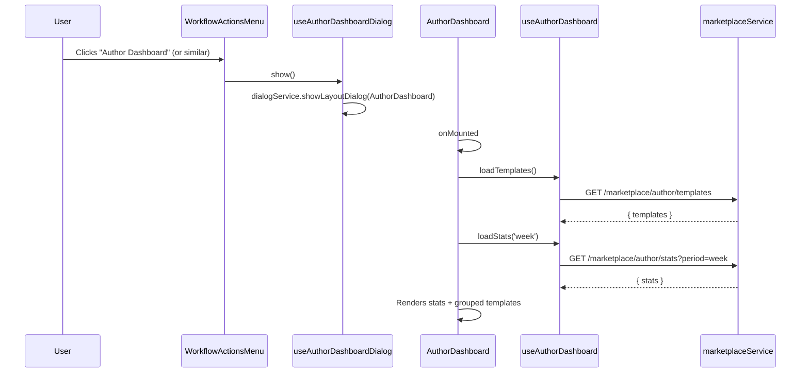
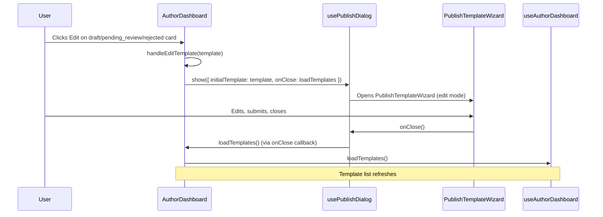
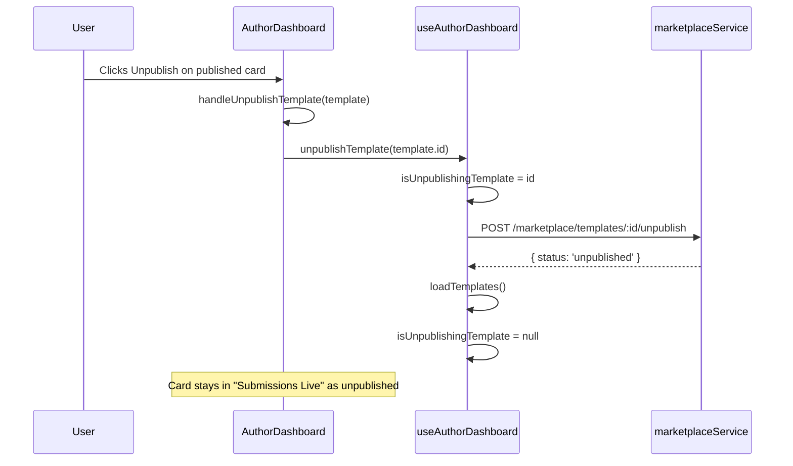
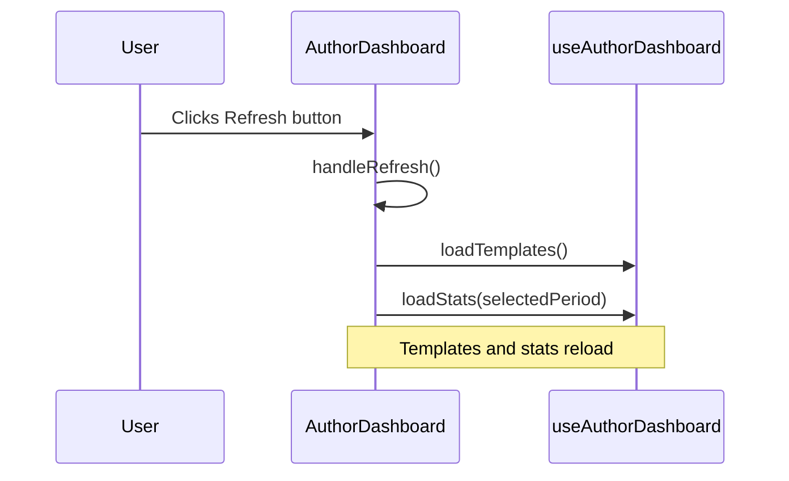

# Author Dashboard

The Author Dashboard is a full-screen modal that displays an author's marketplace templates and aggregate stats. It groups templates by lifecycle status and provides actions to edit, view, publish, and unpublish.

## Structure

### Component Hierarchy

```
AuthorDashboard (modal container)
├── BaseModalLayout
│   ├── #header — "Author Dashboard"
│   └── #content
│       ├── Loading state (spinner)
│       ├── Error state (icon + message)
│       └── Content
│           ├── Stats grid (4 cards: downloads, favorites, rating, trend)
│           ├── "My Templates" section + Refresh button
│           └── Three-column grid
│               ├── My Drafts (draft)
│               ├── Submissions in Review (pending_review, approved, rejected)
│               └── Submissions Live (published, unpublished)
│                   └── AuthorTemplateCard (per template)
```

### Key Components

| Component | Role |
|-----------|------|
| `AuthorDashboard.vue` | Orchestrator: loads templates/stats, groups by status, handles card actions, opens PublishTemplateWizard via `usePublishDialog` |
| `AuthorTemplateCard.vue` | Per-template card: thumbnail, workflow preview, title, shortDescription, download count; Edit/View/Publish/Unpublish buttons based on status |

### Composables & Services

| Module | Responsibility |
|--------|----------------|
| `useAuthorDashboard` | templates, stats, templatesByStatus, loadTemplates, loadStats, publishTemplate, unpublishTemplate |
| `useAuthorDashboardDialog` | show/hide the dashboard modal via dialogService |
| `usePublishDialog` | show PublishTemplateWizard (edit or read-only) |
| `marketplaceService` | getAuthorTemplates, getAuthorStats, publishTemplate, unpublishTemplate |

### Props

| Prop | Type | Purpose |
|------|------|---------|
| `onClose` | `() => void` | Called when modal closes; provided via `OnCloseKey` |

---

## Template Grouping

Templates are grouped into three columns by status:

| Column | Statuses | i18n key |
|--------|----------|----------|
| My Drafts | `draft` | `marketplace.myDrafts` |
| Submissions in Review | `pending_review`, `approved`, `rejected` | `marketplace.submissionsInReview` |
| Submissions Live | `published`, `unpublished` | `marketplace.submissionsLive` |

`templatesByStatus` is a computed record keyed by `TemplateStatus`; each value is an array of templates.

---

## AuthorTemplateCard Actions

Actions shown depend on the template's status:

| Status | Edit | View | Publish | Unpublish | Download stats |
|--------|------|------|---------|-----------|----------------|
| draft | ✓ | — | — | — | — |
| pending_review | ✓ | — | — | — | — |
| rejected | ✓ | — | — | — | — |
| approved | — | ✓ | ✓ | — | — |
| unpublished | — | ✓ | ✓ | — | ✓ |
| published | — | ✓ | — | ✓ | ✓ |

- **Editable** (`draft`, `pending_review`, `rejected`): Edit button opens PublishTemplateWizard in edit mode.
- **Not editable** (`approved`, `published`, `unpublished`): View button opens PublishTemplateWizard in read-only mode.
- **Publishable** (`approved`, `unpublished`): Publish button calls `publishTemplate(id)`.
- **Unpublishable** (`published`): Unpublish button calls `unpublishTemplate(id)`.

---

## Flows

### Flow 1: Open Dashboard & Load Data



### Flow 2: Edit Template



### Flow 3: View Template (Read-Only)

```mermaid
sequenceDiagram
    participant U as User
    participant A as AuthorDashboard
    participant P as usePublishDialog
    participant W as PublishTemplateWizard

    U->>A: Clicks View on approved/published/unpublished card
    A->>A: handleViewTemplate(template)
    A->>P: show({ initialTemplate: template, readOnly: true })
    P->>W: Opens PublishTemplateWizard (read-only)
    U->>W: Previews, clicks Done
    W->>P: onClose()
    Note over P: No refresh; dashboard unchanged
```

### Flow 4: Publish Template

```mermaid
sequenceDiagram
    participant U as User
    participant A as AuthorDashboard
    participant H as useAuthorDashboard
    participant S as marketplaceService

    U->>A: Clicks Publish on approved/unpublished card
    A->>A: handlePublishTemplate(template)
    A->>H: publishTemplate(template.id)
    H->>H: isPublishingTemplate = id
    H->>S: POST /marketplace/templates/:id/publish
    S-->>H: { status: 'published' }
    H->>H: loadTemplates()
    H->>H: isPublishingTemplate = null
    Note over A: Card moves from "Submissions Live" to published; list refreshes
```

### Flow 5: Unpublish Template



### Flow 6: Refresh



---

## State Summary

| State | Owner | Purpose |
|-------|-------|---------|
| `templates` | useAuthorDashboard | Raw list from API |
| `templatesByStatus` | useAuthorDashboard (computed) | Grouped by TemplateStatus |
| `stats` | useAuthorDashboard | AuthorStats (downloads, favorites, rating, trend) |
| `selectedPeriod` | useAuthorDashboard | 'day' \| 'week' \| 'month' for stats |
| `isLoading` | useAuthorDashboard | True while loadTemplates in progress |
| `isPublishingTemplate` | useAuthorDashboard | Template ID being published (disables Publish button) |
| `isUnpublishingTemplate` | useAuthorDashboard | Template ID being unpublished (disables Unpublish button) |
| `error` | useAuthorDashboard | Error message when API calls fail |
| `thumbErrors` | AuthorDashboard | Record of template IDs with thumbnail load errors |
| `previewErrors` | AuthorDashboard | Record of template IDs with workflow preview load errors |

---

## API Calls Used

| Action | Service Method | Endpoint |
|--------|----------------|----------|
| Load templates | `getAuthorTemplates` | GET `/marketplace/author/templates` |
| Load stats | `getAuthorStats` | GET `/marketplace/author/stats?period=week` |
| Publish | `publishTemplate` | POST `/marketplace/templates/:id/publish` |
| Unpublish | `unpublishTemplate` | POST `/marketplace/templates/:id/unpublish` |

---

## Entry Point

The dashboard is opened from the workflow actions menu via `useAuthorDashboardDialog().show()` (e.g. `useWorkflowActionsMenu.ts`).
