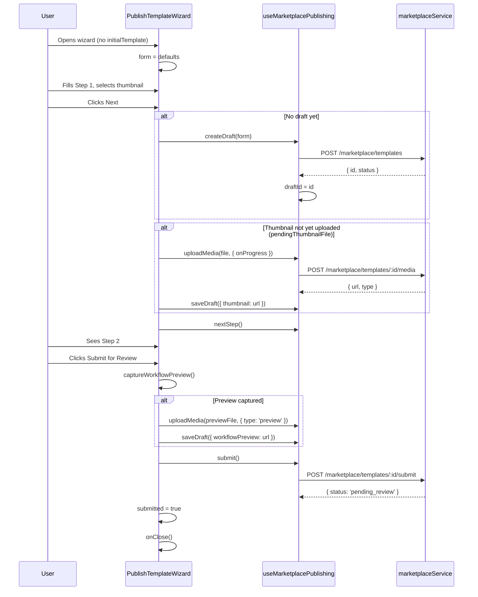
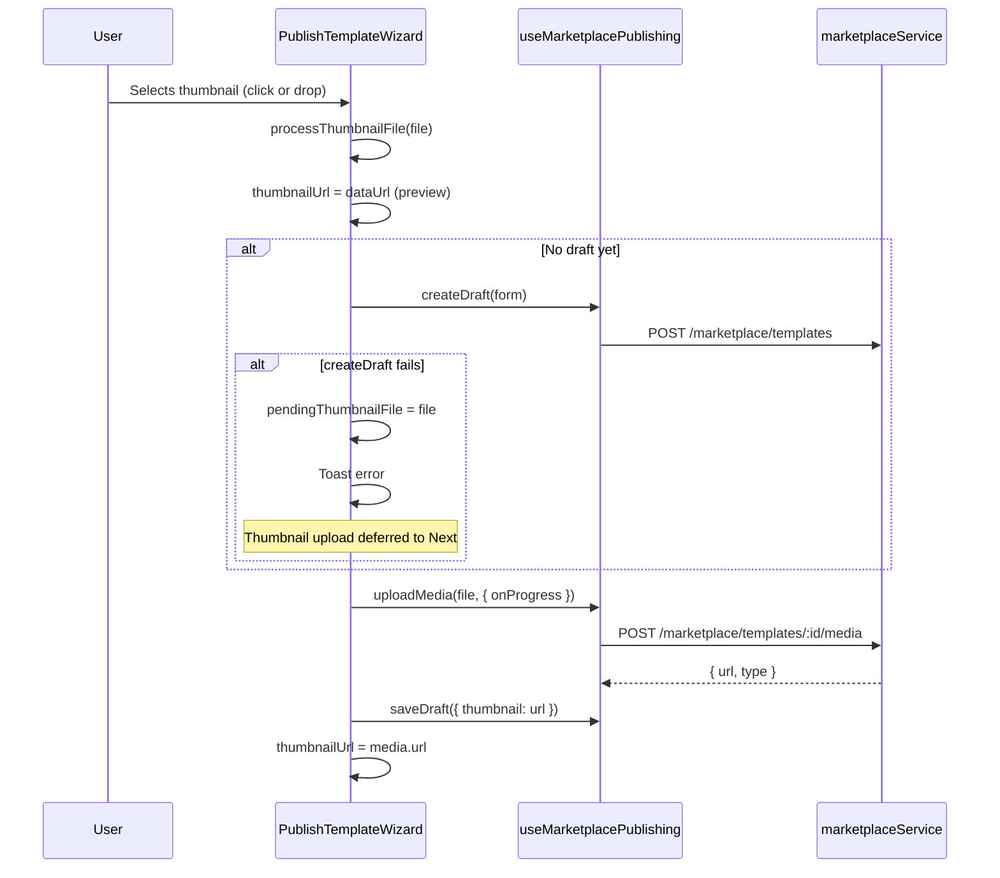
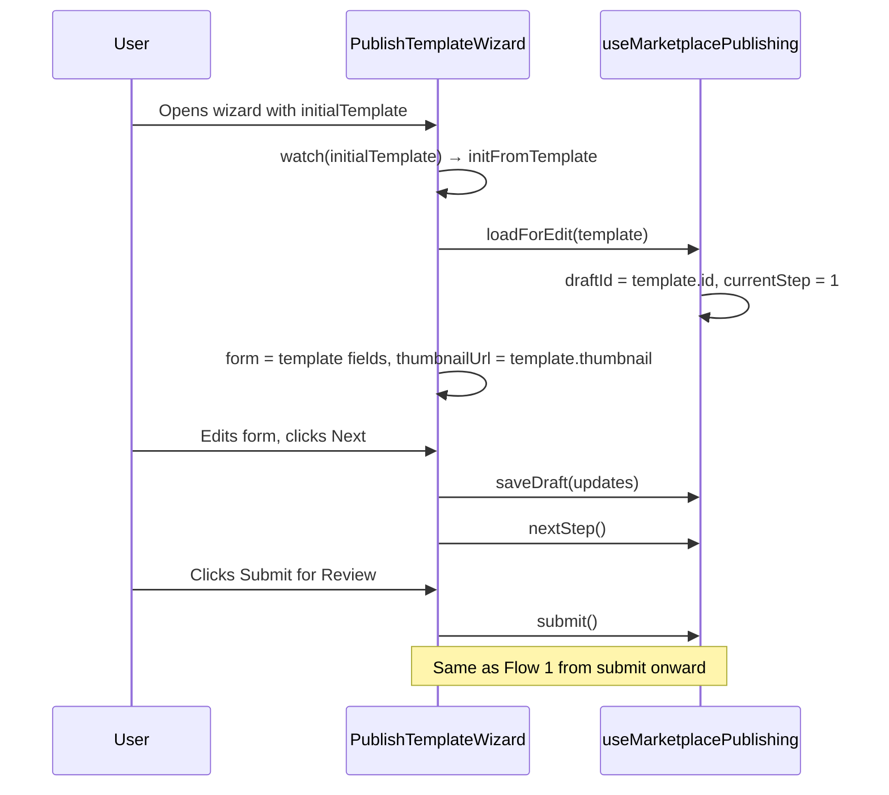

# Publish Template Wizard

The Publish Template Wizard is a two-step modal flow for creating, editing, and submitting workflow templates to the marketplace. It supports both **create** (new draft) and **edit** (existing template) modes, plus a **read-only preview** mode.

## Structure

### Component Hierarchy

```
PublishTemplateWizard (modal container)
├── BaseModalLayout
│   ├── #header — title ("Publish to Marketplace" or "Template Details")
│   └── #content
│       ├── Step content (conditional on currentStep)
│       │   ├── PublishTemplateWizardStepDetails (step 1)
│       │   └── PublishTemplateWizardStepSubmit (step 2)
│       └── PublishTemplateWizardFooter
```

### Key Components

| Component | Role |
|-----------|------|
| `PublishTemplateWizard.vue` | Orchestrator: form state, step navigation, API calls via `useMarketplacePublishing` |
| `PublishTemplateWizardStepDetails.vue` | Step 1: title, description, shortDescription, license, difficulty, tags, thumbnail |
| `PublishTemplateWizardStepSubmit.vue` | Step 2: preview card + surrounding template cards; shows "Submitted" when done |
| `PublishTemplateWizardFooter.vue` | Back / Next / Preview / Submit / Close / Done buttons |

### Composables & Services

| Module | Responsibility |
|--------|----------------|
| `useMarketplacePublishing` | Step index, draftId, createDraft, saveDraft, uploadMedia, submit, loadForEdit |
| `marketplaceService` | HTTP calls: createTemplate, updateTemplate, uploadTemplateMedia, submitTemplate |

### Props

| Prop | Type | Purpose |
|------|------|---------|
| `onClose` | `() => void` | Called when modal closes; provided via `OnCloseKey` |
| `initialTemplate` | `MarketplaceTemplate?` | When set, wizard loads in edit mode with pre-filled form |
| `readOnly` | `boolean` | Preview-only mode: no Next/Submit, shows Preview/Done instead |

---

## Step Flow

### Step 1 — Details

User fills in:

- **Required**: title, description, shortDescription, difficulty, thumbnail
- **Optional**: license, tags

**Validation (`canAdvance`)**:

- title, description, shortDescription must be non-empty and not placeholders
- difficulty must be set
- thumbnail must be present (`thumbnailUrl`)

**Footer**: Back (hidden), Next (disabled until valid)

### Step 2 — Submit

Shows a preview card of the template and surrounding marketplace cards. User confirms and submits.

**Footer**:

- Back
- Submit for Review (or "Submitting…" when loading)
- Done (only when `isPendingReview` — template already in review)

---

## Submission Flows

### Flow 1: New Draft → Submit



### Flow 2: Thumbnail Selected Before Next (Early Draft Creation)

When the user selects a thumbnail on Step 1 before clicking Next:



If `createDraft` fails, the file is stored in `pendingThumbnailFile` and will be uploaded when the user clicks Next (Flow 1).

### Flow 3: Edit Existing Template



### Flow 4: Read-Only Preview

When `readOnly` is true:

- Step 1: All inputs readonly; footer shows Preview + Done
- Step 2: Footer shows Back + Done
- No create/save/submit calls; user only views the template

---

## State Summary

| State | Owner | Purpose |
|-------|-------|---------|
| `currentStep` | useMarketplacePublishing | 1 or 2 |
| `draftId` | useMarketplacePublishing | Template ID once created/loaded |
| `form` | PublishTemplateWizard | title, description, shortDescription, license, difficulty, tags |
| `thumbnailUrl` | PublishTemplateWizard | Current thumbnail (data URL or media URL) |
| `pendingThumbnailFile` | PublishTemplateWizard | File to upload on Next when createDraft failed earlier |
| `submitted` | PublishTemplateWizard | True after successful submit; shows "Submitted" and closes |
| `isPendingReview` | computed | initialTemplate?.status === 'pending_review' |

---

## API Calls Used

| Action | Service Method | Endpoint |
|--------|----------------|----------|
| Create draft | `createTemplate` | POST `/marketplace/templates` |
| Update draft | `updateTemplate` | PUT `/marketplace/templates/:id` |
| Upload thumbnail | `uploadTemplateMedia` | POST `/marketplace/templates/:id/media` |
| Upload workflow preview | `uploadTemplateMedia` (type: preview) | POST `/marketplace/templates/:id/media` |
| Submit for review | `submitTemplate` | POST `/marketplace/templates/:id/submit` |
