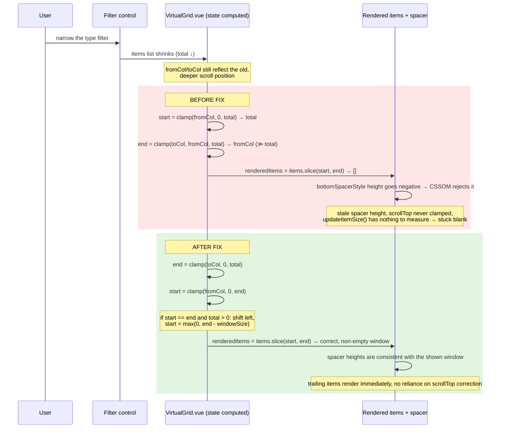

# TDD: 1.54 QA follow-up — security and stability fixes — production-design

## Part 0 — Header

| Field                | Value                                                                                                                                                                                                                                                                                                                                                                                                                                                                                                                                                                                                                                                                                                                                                                                                                                                                                                                                                                                                                                                                                |
| -------------------- | ------------------------------------------------------------------------------------------------------------------------------------------------------------------------------------------------------------------------------------------------------------------------------------------------------------------------------------------------------------------------------------------------------------------------------------------------------------------------------------------------------------------------------------------------------------------------------------------------------------------------------------------------------------------------------------------------------------------------------------------------------------------------------------------------------------------------------------------------------------------------------------------------------------------------------------------------------------------------------------------------------------------------------------------------------------------------------------ |
| Title                | `TDD: 1.54 QA follow-up — security and stability fixes — production-design`                                                                                                                                                                                                                                                                                                                                                                                                                                                                                                                                                                                                                                                                                                                                                                                                                                                                                                                                                                                                          |
| Status · Iteration   | Draft · `production-design` (first iteration; no prior TDD exists for this workstream)                                                                                                                                                                                                                                                                                                                                                                                                                                                                                                                                                                                                                                                                                                                                                                                                                                                                                                                                                                                               |
| PRD · Linear project | N/A — this workstream originates from a manual QA sweep of the 1.54 release, not a PRD. This document is the scope contract for the four fix PRs it lists.                                                                                                                                                                                                                                                                                                                                                                                                                                                                                                                                                                                                                                                                                                                                                                                                                                                                                                                           |
| DRI · Approver       | TBD — not assigned at time of writing. Flagged as an open question in Part 5; the 1.54 release owner is the natural approver.                                                                                                                                                                                                                                                                                                                                                                                                                                                                                                                                                                                                                                                                                                                                                                                                                                                                                                                                                        |
| Reviewers (required) | TBD — each fix PR carries its own code reviewer(s) per normal review; no cross-cutting reviewer has been named for the workstream as a whole.                                                                                                                                                                                                                                                                                                                                                                                                                                                                                                                                                                                                                                                                                                                                                                                                                                                                                                                                        |
| Tier · Risk lane     | T0, with one T1-adjacent item — six independent, narrowly-scoped bug fixes / hardening changes, no new user-facing behavior, no flags, no schema/API/migration surface. One item (sanitization hardening) touches an XSS-relevant surface (the `javascript:`-href gap specifically — see Part 2, item 3), which is why it gets its own reviewer attention even though the workstream as a whole stays T0; no separate T0/T1 policy document exists in this repo to cite for that framing. Risk lane: R1 — derived from `.github/risk.json`'s actual grading mechanism (`grade = worst(path_floor, provenance, reversibility)`), not from any standalone definition of R1 as "small, reversible, single-repo diffs" (the file defines only path-rule tiers R0–R3 and never characterizes R1 that way). None of the six touched files matches an R2/R3 path rule, so `path_floor` is the R0 default; `provenance_tiers.human` is R1; each fix PR adds a test under `reversibility.test_path_patterns`, keeping `reversibility` at `clean_tier: R0`. The worst of the three axes is R1. |
| Repos                | `Comfy-Org/ComfyUI_frontend` only                                                                                                                                                                                                                                                                                                                                                                                                                                                                                                                                                                                                                                                                                                                                                                                                                                                                                                                                                                                                                                                    |

**Summary.** A manual QA pass on the 1.54 release found seven bugs; one (a workflow-delete crash) is already fixed and merged. This document is the shared scope contract for the remaining six, which are being fixed as four independent, parallel pull requests: sanitization hardening (two HTML/form/UI-redress-injection gaps and one genuine XSS gap — a clickable `javascript:` href), a group-node widget-value misassignment bug, a VirtualGrid blank-render bug, and a preview-widget text-stripping bug. None of the six requires a feature flag, a schema change, or a rollout ramp — each is a direct, mechanical correction to already-broken behavior. The key ask of the reader is to review the four fix PRs against the root-cause analysis and fix approach recorded here, and to decide separately (not in this document) whether any of them should be backported to `core/1.54`.

---

## Part 1 — The contract

| Field                     | Value                                                                                                                                                                                                                                                                                                                                                                                                                                                                                                                                                                                                                                                                                                                                                                                                                                                                                                                                                                                                                                                                                                                                                                                                                                                                                                                                                                                                                                                                                                                                                                                                                                                                                                                                                                     |
| ------------------------- | ------------------------------------------------------------------------------------------------------------------------------------------------------------------------------------------------------------------------------------------------------------------------------------------------------------------------------------------------------------------------------------------------------------------------------------------------------------------------------------------------------------------------------------------------------------------------------------------------------------------------------------------------------------------------------------------------------------------------------------------------------------------------------------------------------------------------------------------------------------------------------------------------------------------------------------------------------------------------------------------------------------------------------------------------------------------------------------------------------------------------------------------------------------------------------------------------------------------------------------------------------------------------------------------------------------------------------------------------------------------------------------------------------------------------------------------------------------------------------------------------------------------------------------------------------------------------------------------------------------------------------------------------------------------------------------------------------------------------------------------------------------------------- |
| Outcome                   | Six specific, QA-confirmed defects in the 1.54 release are fixed: three sanitization/injection gaps are closed (two HTML/form/UI-redress injection, one genuine XSS), group-node-to-subgraph conversion no longer corrupts widget values, the Assets/Models virtual grid no longer goes blank on filter or resize, and the execution-progress preview widget no longer drops bracket-delimited text such as LoRA tags.                                                                                                                                                                                                                                                                                                                                                                                                                                                                                                                                                                                                                                                                                                                                                                                                                                                                                                                                                                                                                                                                                                                                                                                                                                                                                                                                                    |
| Acceptance criteria       | 1. A markdown image/link `title` containing `"` cannot inject additional HTML attributes or tags into rendered markdown (`markdownRendererUtil.ts`). 2. `SanitizedHtml.vue` output never contains a `<form>` element or a `style` attribute, for any input. 3. A registry-supplied `repository` URL, or a license URL `DescriptionTabPanel.vue` derives from `repository` plus a license filename, with a `javascript:` scheme — including mixed-case or ASCII-whitespace-obfuscated variants — is never rendered as a clickable link; only `http:`/`https:` reach `href` on either binding, and an unsafe or unparseable value renders as non-clickable text rather than a `#`/disabled link. (Direct `licenseObj.text` license strings are always rendered as plain text, never as a link, so they are outside this criterion's anchor attack surface.) 4. Converting a group node with two or more interior nodes that share a widget name (`convertToNodes()` in `groupNode.ts`) assigns every widget its own originating value, proven by asserting both colliding widgets' values by stable node identity rather than only downstream values on other, non-colliding nodes — the previously-pinned `test.fail()` case in `browser_tests/tests/groupNode.spec.ts` (from PR #17464) passes as a real assertion of that. 5. `VirtualGrid.vue` keeps rendering items after the backing list shrinks below the previously-scrolled-to index, and after the column count grows while scrolled deep — the two `it.fails` pins in `src/components/common/VirtualGrid.test.ts` (from PR #17626) pass as real assertions. 6. `TextPreviewWidget.vue` renders literal bracket-delimited text (e.g. `<lora:name:0.8>`) as visible escaped text instead of silently dropping it. |
| Scope                     | **In:** the six fixes above, each in the single file (or small file set) named for it, plus the unit/component test each fix PR adds or converts. **Depends on:** nothing — each of the four fix PRs is independent of the others and of this document; none blocks on the others landing first. **Not being built:** the seventh QA-found issue (workflow-delete crash) — already fixed and merged separately, out of scope here; QA report 1 from PR #17626 ("tiles stay as skeletons after fast scrolling") — investigated but not reproduced, no fix attempted, left as an open lead in that PR's description; any `core/1.54` backport decision — explicitly deferred to the release owner (see Part 4).                                                                                                                                                                                                                                                                                                                                                                                                                                                                                                                                                                                                                                                                                                                                                                                                                                                                                                                                                                                                                                                             |
| Ownership boundary        | This workstream may change only the specific files named for each fix (`src/utils/markdownRendererUtil.ts`, `src/components/common/SanitizedHtml.vue`, `src/workbench/extensions/manager/components/manager/infoPanel/tabs/DescriptionTabPanel.vue`, `src/extensions/core/groupNode.ts`, `src/components/common/VirtualGrid.vue`, `src/components/graph/widgets/TextPreviewWidget.vue`) plus their tests. `VirtualGrid.vue` is shared by `AssetGrid`, `AssetsSidebarGridView`, `AssetsSidebarListView`, `ManagerDialog`, and `FormDropdownMenu` — a real finding in any of those consumers that is not the clamp-ordering bug itself is out of scope and gets filed as its own issue, not folded into `fix/virtual-grid-clamp-blank`. Any other issue this QA sweep surfaces belongs to the unlabelled general backlog, not this workstream.                                                                                                                                                                                                                                                                                                                                                                                                                                                                                                                                                                                                                                                                                                                                                                                                                                                                                                                              |
| Per-artifact deliverables | Each of the four fix PRs ships: the code fix, a unit/component (or, for the two already-pinned cases, converted E2E) test proving the specific defect is gone, and a PR description naming root cause and fix. No SDK schema, output contract, or doc page applies — these are internal implementation fixes with no external contract change.                                                                                                                                                                                                                                                                                                                                                                                                                                                                                                                                                                                                                                                                                                                                                                                                                                                                                                                                                                                                                                                                                                                                                                                                                                                                                                                                                                                                                            |
| Interfaces touched        | None of the six fixes touches a gated interface (no public HTTP surface, no custom-node/extension API, no schema/migration, no auth/billing, no deprecation of documented behavior). `human_design_review` is therefore `false` for the workstream as a whole.                                                                                                                                                                                                                                                                                                                                                                                                                                                                                                                                                                                                                                                                                                                                                                                                                                                                                                                                                                                                                                                                                                                                                                                                                                                                                                                                                                                                                                                                                                            |

---

## Part 2 — The design

### Context and constraints

The 1.54 release underwent a manual QA pass. Two of the defects below were already known and deliberately left unfixed, pinned with `test.fail()`/`it.fails` so CI stays green while the bug exists and turns red the instant someone fixes it (see PR #17464 for the group-node case and PR #17626 for the VirtualGrid case — both authored by Christian Byrne). The other four defects (three sanitization gaps plus the preview-widget text-stripping bug) are new findings from this same QA pass with no prior pin. This document ties all six together as one scope contract because they were found together, are being fixed together as a batch of parallel PRs, and share the same "ship as plain merges, no flag" rollout shape — not because they share a root cause; they do not.

No PRD or prior TDD exists for this workstream; searched the repo's `docs/adr/` index and found no existing ADR covering any of these six code paths.

### Spike findings

No spike or POC preceded these fixes; each is a direct, understood, single-file (or near-single-file) correction found by manual QA rather than by an exploratory build. Per the T0 guidance in the TDD template, spike findings are not applicable here.

### Approach and exact changes, per item

**1. Sanitization hardening — markdown-attribute-breakout HTML/form/UI-redress injection (`src/utils/markdownRendererUtil.ts`, branch `fix/sanitization-hardening`).**
`createMarkdownRenderer()`'s custom `renderer.image` builds `` `` `` where `titleAttr` is `` ` title="${title}"` `` — the markdown `title` text is interpolated straight into a double-quoted HTML attribute with no escaping. A markdown image whose title contains a `"` closes that attribute early and lets the rest of the title string add arbitrary attributes or open a new tag, before the string is ever handed to DOMPurify. This is an attribute-breakout: the attacker never needs to write raw HTML, only markdown syntax with a crafted title. The demonstrated, post-sanitizer impact is HTML attribute/tag injection: a breakout can add a `style` attribute or a `<form>` element that survives this file's final `DOMPurify.sanitize()` call, which — unlike `SanitizedHtml.vue`'s hardened config — sets no `FORBID_TAGS`/`FORBID_ATTR`, enough for a full-screen overlay or a fake sign-in box. DOMPurify strips `on*` event-handler attributes by default regardless of this bug, so no script-executing payload is demonstrated here; this is HTML/form/UI-redress injection, not proven script execution. Fix approach: HTML-escape `title` (and, defensively, `text`) before interpolating them into the renderer's template strings, so the renderer can never emit an unescaped attacker-controlled value inside an attribute.

**2. Sanitization hardening — `<form>`/`style` surviving sanitization (`src/components/common/SanitizedHtml.vue`, same branch).**
The component's `purifier.sanitize(html, { ADD_TAGS: [...], ADD_ATTR: [...] })` call only _adds_ to DOMPurify's default allowlist; it never narrows it. DOMPurify's stock defaults permit `<form>` and the generic `style` attribute, so any markdown/registry-sourced HTML rendered through this shared component can carry a working form (pointed at an attacker-controlled action URL) or an inline `style` attribute (usable for CSS-based data exfiltration or UI redress) and survive sanitization untouched. Fix approach: add `FORBID_TAGS: ['form']` and `FORBID_ATTR: ['style']` alongside the existing `ADD_TAGS`/`ADD_ATTR`, since DOMPurify's `FORBID_*` options subtract from the default allowlist the way `ADD_*` cannot.

**3. Sanitization hardening — unsanitized `javascript:` hrefs from registry data (`src/workbench/extensions/manager/components/manager/infoPanel/tabs/DescriptionTabPanel.vue`, same branch).**
`safeRepositoryHref` and `safeLicenseHref` (computed properties in `DescriptionTabPanel.vue`) are the only two paths that reach a real, clickable `:href`: `safeRepositoryHref` gates `nodePack.repository` directly, and `safeLicenseHref` gates the URL `createLicenseUrl()` derives from `nodePack.repository` plus a license filename (e.g. `LICENSE`) when the license value names a license file. Direct `licenseObj.text` (a license string that isn't a filename) is always rendered as plain text inside a `<span>`, never bound to `href` — it is not part of the anchor attack surface. Both real sinks are gated by a shared helper, `isSafeExternalUrl()` (`packages/shared-frontend-utils/src/urlSafety.ts`), which parses the candidate with `new URL()` and checks `.protocol` against one exact allowed-scheme set, `{http:, https:}` — no `mailto:`. `new URL().protocol` canonicalizes the scheme the way a browser would before comparing it, so a mixed-case `JavaScript:alert(1)` or an ASCII-whitespace-obfuscated `java\tscript:alert(1)` (browsers strip embedded tab/newline characters during URL parsing) both normalize to `javascript:` and are rejected the same as a lower-case one; an unparseable value also returns `false`. On an unsafe or invalid value, both computed properties resolve to `undefined`, so the template never binds anything to `href` (no clickable link, not a `#`/disabled link). Fix approach: `isSafeExternalUrl()` already exists and already gates both sinks on the branch; the fix PR's remaining work is adding the mixed-case and ASCII-whitespace canonicalization test cases above to `urlSafety.test.ts`, which are not yet present.

**4. Group-node widget-pairing fix (`src/extensions/core/groupNode.ts`, branch `fix/group-node-widget-pairing`).**
`convertToNodes()` misassigns widget values when two or more interior nodes inside a group node share a widget name (e.g. two `KSampler`s each having `seed`, `steps`, `denoise`, …). QA's repro converting a v1.3.3 group node showed values shifting two positions — `denoise` received `'euler'`, `filename_prefix` received `'normal'`, a string landed in a numeric field (`noise_seed = 'enable'`), and a number landed in a combo (`control_after_generate = 0`) — deterministically, on every load, and the corrupted values get written back to disk on save. This is the defect pinned with `test.fail()` in PR #17464's rewrite of `Preserves group node widget values through subgraph conversion` (`browser_tests/tests/groupNode.spec.ts`), which asserts name→value _pairing_ per interior node rather than flattening every value into one array (the old assertion could not fail on this bug at all — a multiset/length check is blind to values shuffled between widgets). Fix approach: pair each flattened value to its originating `(interior node id, widget name)` at flatten time and re-apply it by that same compound key during conversion, instead of a lookup that only keys on widget name and therefore collides whenever the same name appears on more than one interior node.

**5. VirtualGrid clamp fix (`src/components/common/VirtualGrid.vue`, branch `fix/virtual-grid-clamp-blank`).**
`state` computed `end: clamp(toCol, fromCol, items?.length)`. `es-toolkit/compat`'s `clamp(value, min, max)` applies the **upper** bound first and the **lower** bound last, so whenever `fromCol` (passed in as the _lower_ bound) exceeds `items.length` — which happens the instant a filter shrinks the list, or a resize/zoom grows the column count while scrolled deep — the lower bound wins and `end` resolves to `fromCol`, far past the list length, while `start` is already clamped down to `total`. `items.slice(start, end)` then returns nothing but garbage bounds, and `renderedItems` goes empty. It doesn't self-heal: `bottomSpacerStyle` computes a negative height in this state, which the CSSOM rejects, so the scroll container keeps its stale (too-tall) height and the browser never clamps `scrollTop`; and `updateItemSize()` early-returns once there is nothing on screen to measure, so the stale item size that produced the bad window can never be corrected. This is the defect behind both `it.fails` pins added in PR #17626 (`goes blank when the filtered list shrinks below the scrolled-to index` and `goes blank when the column count grows while scrolled deep`). Fix approach (landed on the branch at commit `589fe5d76b3bac74de1cdab0426e3f16cd20e88f`): clamp `end` first against `[0, total]`, then clamp `start` against `[0, end]` — using the already-clamped `end`, not the raw `fromCol`, as the upper bound — which guarantees `0 <= start <= end <= total` in every case. When that leaves `start === end` with `total > 0` (the window collapsed to empty), shift the window left by its previous size (`start = max(0, end - windowSize)`) so the trailing items render immediately, rather than relying on the browser to clamp `scrollTop` once the spacer height shrinks — a stale/negative spacer height can get rejected by the CSSOM and prevent that correction from ever happening on its own.

**6. Preview-widget text fix (`src/components/graph/widgets/TextPreviewWidget.vue`, branch `fix/preview-widget-bracket-text`).**
`formattedText` takes the raw websocket progress text — which can legitimately contain literal bracket-delimited substrings such as a LoRA tag `<lora:name:0.8>` — and passes it straight through `linkifyHtml`/`nl2br`, then `DOMPurify.sanitize(html, { ALLOWED_TAGS: ['a', 'br'] })`, without ever HTML-escaping the literal source text first. The HTML parser (both the browser's and DOMPurify's) reads any `<word:...>`-shaped substring as an element open tag; since that tag name isn't in the `['a', 'br']` allowlist, DOMPurify strips it — and, depending on how the parser nests unclosed tags, text that follows it can be swallowed along with it. The bug is a trust-boundary ordering error: raw, untrusted text is treated as if it were already-safe markup before it is escaped, rather than escaping the literal text and only ever constructing the two intentional tags (`<a>`, `<br>`) explicitly. Fix approach: HTML-escape the literal text segments before running `linkifyHtml`/`nl2br`, so a literal `<lora:name:0.8>` becomes `&lt;lora:name:0.8&gt;` and survives DOMPurify as visible text, while the deliberately constructed `<a>`/`<br>` tags continue to be built from separately-escaped label content exactly as today.

### Sequence diagram

Required only where it clarifies a runtime path; five of the six fixes are local, stateless corrections with no cross-component flow worth diagramming. The VirtualGrid fix is the one genuinely time-ordered, stateful case (a filter change followed by a render), so it's the one diagram included:



### Alternatives and recorded decisions

| We did not                                                                                                       | Because                                                                                                                                                                                                            | We would revisit if                                                                                           |
| ---------------------------------------------------------------------------------------------------------------- | ------------------------------------------------------------------------------------------------------------------------------------------------------------------------------------------------------------------ | ------------------------------------------------------------------------------------------------------------- |
| Write four separate TDDs, one per fix PR                                                                         | The six fixes were found together in one QA pass, ship as one batch of parallel PRs with the same "no-flag, plain-merge" rollout shape, and a reader benefits from seeing the whole 1.54 QA follow-up in one place | The workstream grows large enough, or spans enough repos/releases, that a single document stops being legible |
| Fix `VirtualGrid.vue`'s reported "tiles stay as skeletons after fast scrolling" issue (QA report 1 in PR #17626) | It was investigated but never reproduced against a real backend/library in that PR, and is explicitly called out there as a lead, not a confirmed defect                                                           | Someone reproduces it deterministically and pins it the way the other two VirtualGrid defects are pinned      |
| Decide the `core/1.54` backport question in this document                                                        | That is a release-management call for the release owner, informed by risk and timing, not a design question this contract should pre-empt                                                                          | Never — this is deliberately left to Part 4/Part 5, not folded into scope                                     |

> **Provenance rule.** Every root-cause and fix-approach claim above is sourced either from reading the named file directly, from the two existing pinned-test PRs (#17464, #17626) quoted where relevant, or — for the VirtualGrid fix specifically — from the landed commit `589fe5d76b3bac74de1cdab0426e3f16cd20e88f` on branch `fix/virtual-grid-clamp-blank`, not an in-progress draft. Nothing here is inferred product behavior; there is no product/billing behavior in this workstream to source.

### Failure modes

| Failure                                                                                                                                       | Who notices                                                               | How fast                                       | Bound                                                   | Detected by                                                                                                                                                         |
| --------------------------------------------------------------------------------------------------------------------------------------------- | ------------------------------------------------------------------------- | ---------------------------------------------- | ------------------------------------------------------- | ------------------------------------------------------------------------------------------------------------------------------------------------------------------- |
| A fix PR's test doesn't actually exercise the fixed code path (vacuous pass)                                                                  | Reviewer / CI                                                             | At PR review                                   | Single PR, caught before merge                          | Manual review of the diff between the old pinned assertion and the new passing one, per the pattern PR #17626 used (mutate the fix once, confirm the test goes red) |
| `FORBID_TAGS`/`FORBID_ATTR` hardening in `SanitizedHtml.vue` breaks a legitimate consumer that relied on `style` or a `<form>`-shaped snippet | Whoever owns the consuming surface, via visual regression or a bug report | Within normal QA/regression cycles after merge | Single PR, easy revert                                  | Existing component/snapshot tests for `SanitizedHtml.vue` consumers, plus manual smoke of the description/manager panels that render markdown                       |
| `VirtualGrid.vue` fix has a second, undiscovered edge case beyond the two pinned scenarios                                                    | QA / users of Assets, Models, or `ManagerDialog` panels                   | Days, via a new bug report                     | Single shared component, but used across five consumers | The one already-passing precondition test in `VirtualGrid.test.ts`, plus normal QA of those five consumers post-merge                                               |

---

## Part 3 — Verification

| Proving                                                          | Acceptance criterion | How                                                                                                                                                                                                                                                                                                                                                                                                                                              | Where it lives                                                                                                     | Gate     |
| ---------------------------------------------------------------- | -------------------- | ------------------------------------------------------------------------------------------------------------------------------------------------------------------------------------------------------------------------------------------------------------------------------------------------------------------------------------------------------------------------------------------------------------------------------------------------ | ------------------------------------------------------------------------------------------------------------------ | -------- |
| Markdown `title` breakout is closed                              | AC1                  | Unit test using a marker DOMPurify's default sanitize pass does not remove on its own (e.g. an injected `id="injected"` attribute), not an `onerror`-only payload — DOMPurify strips `on*` handlers regardless of this bug, so that payload would also pass against the unfixed renderer and prove nothing; asserts the marker is absent and the complete literal title renders as escaped text, for both the image and link cases               | `src/utils/markdownRendererUtil.test.ts` (fix PR adds this)                                                        | PR       |
| `<form>`/`style` never survive `SanitizedHtml`                   | AC2                  | Unit/component test asserting sanitized output for `<form>...</form>` and `style="..."` payloads contains neither                                                                                                                                                                                                                                                                                                                                | `src/components/common/SanitizedHtml.test.ts` (fix PR adds this)                                                   | PR       |
| `javascript:` hrefs from registry data are neutralized           | AC3                  | Unit tests on `isSafeExternalUrl()` covering the allowed set (`http:`, `https:`) and the rejected set (`javascript:`, `data:`, `vbscript:`, `file:`, non-URL strings, and mixed-case/ASCII-whitespace-obfuscated `javascript:` variants), plus a component test asserting `safeRepositoryHref` and `safeLicenseHref` both resolve to `undefined` for an unsafe repository binding and an unsafe repository-plus-filename-derived license binding | `packages/shared-frontend-utils/src/urlSafety.test.ts` / `DescriptionTabPanel.test.ts` (fix PR extends/adds these) | PR       |
| Group-node widget pairing survives conversion when names collide | AC4                  | The existing `test.fail()`-pinned case in `browser_tests/tests/groupNode.spec.ts` (PR #17464) is converted to a real, passing assertion that reads both colliding `CLIPTextEncode.text` widget values by each node's stable identity, not just the downstream `KSampler`/`SaveImage` values — a fix could preserve those while still swapping or duplicating the two prompt values — and asserts they remain distinct and correctly paired       | `browser_tests/tests/groupNode.spec.ts`                                                                            | PR (E2E) |
| VirtualGrid stays populated on filter-shrink and column-grow     | AC5                  | Both `it.fails` pins in `src/components/common/VirtualGrid.test.ts` (PR #17626) are converted to real, passing assertions; the existing passing precondition test keeps guarding against either pin going vacuous                                                                                                                                                                                                                                | `src/components/common/VirtualGrid.test.ts`                                                                        | PR       |
| Bracket-delimited literal text survives the preview widget       | AC6                  | Unit test asserting `formattedText`'s output for input containing `<lora:name:0.8>` renders it as escaped, visible text rather than dropping it                                                                                                                                                                                                                                                                                                  | `src/components/graph/widgets/TextPreviewWidget.test.ts` (fix PR adds this)                                        | PR       |

All six criteria are provable with fast, hermetic PR-gate tests (unit/component, or in the group-node case an existing E2E case). None of the six involves a live upstream, so no nightly smoke applies; none is an MCP/agent-facing surface, so no evals apply.

No new Datadog monitor or dashboard is required: these are corrective fixes to already-shipped, already-broken behavior with no new code path to observe in aggregate, not new features. If the sanitization hardening or the group-node fix later turns up in a Sentry report (Sentry instrumentation for markdown/HTML rendering paths remains active, per the org's ongoing Datadog migration), that is normal post-merge monitoring, not a new monitor this document commits to building.

**QA owner:** Christian Byrne (ran the 1.54 QA sweep that found all six items and the two prior pins).
**Post-merge owner:** TBD — the 1.54 release owner should confirm who watches these four PRs after merge; see Part 5.

---

## Part 4 — Rollout

None of the six fixes ships behind a flag.

**No-flag reason:** every item is a direct correction to already-broken, already-shipped behavior (data corruption, an injection gap, a blank render, or dropped text) — the "off" state a flag would gate to _is_ the bug. These fixes do change visible output — a previously blank grid now renders its items, and previously dropped bracket text such as `<lora:name:0.8>` now renders as visible escaped text — so the accurate, narrower claim is that none of the six adds a new feature or behavior beyond restoring each item's stated, intended outcome; there is accordingly no percentage rollout to ramp and no cohort to stage. This matches the task framing for this workstream: "rollout" here is "merge each fix PR," not a ramp.

| Artifact              | How it ships                                                                          | "Off" means   | Abort                                                                                                                                     |
| --------------------- | ------------------------------------------------------------------------------------- | ------------- | ----------------------------------------------------------------------------------------------------------------------------------------- |
| Each of the 4 fix PRs | Plain merge to `main` once its own review + CI pass, independently of the other three | N/A — no flag | Revert the specific merge commit via `git revert`; each fix is isolated to its own file(s), so a revert of one does not affect the others |

**Rollback.** A single `git revert <merge-commit>` on `main`, per PR, takes effect on the next deploy of `main`; any maintainer with merge rights can do it without further approval, the same as reverting any other merged PR. No migration, no data cleanup, and no flag flip is involved in a revert for any of the six fixes.

**Backport.** Whether any or all of these four PRs backport to `core/1.54` is explicitly **not decided in this document** — it is a call for the 1.54 release owner, made after each PR merges to `main`, weighing each fix's risk against the value of shipping it in the current release line. This document only records what changed and why; it does not schedule the backport.

---

## Part 5 — Questions and decisions

| Question                                                                                             | Why it matters                                                                                                                                                           | Owner                                                     | Blocks implementation?                                    |
| ---------------------------------------------------------------------------------------------------- | ------------------------------------------------------------------------------------------------------------------------------------------------------------------------ | --------------------------------------------------------- | --------------------------------------------------------- |
| Who is DRI/approver for this workstream as a whole?                                                  | Each fix PR can be reviewed and merged independently today under normal review; a named DRI matters only if this document needs a single accountable owner going forward | 1.54 release owner (unassigned as of this writing)        | No — the four fix PRs proceed on normal review regardless |
| Who is post-merge owner for watching all four fixes after merge?                                     | A change nobody watches after merge has not really been verified                                                                                                         | TBD                                                       | No                                                        |
| Should any of the four fixes backport to `core/1.54`?                                                | Determines whether the current release line gets these corrections or waits for the next one                                                                             | 1.54 release owner                                        | No — deliberately deferred, see Part 4                    |
| Is PR #17626's QA report 1 ("tiles stay as skeletons after fast scrolling") a real, separate defect? | If real, it would need its own investigation/pin/fix outside this workstream's scope                                                                                     | Whoever picks up the lead left in PR #17626's description | No — out of scope here either way                         |

| Date       | Decision                                                                                                                        | Options                                                                          | Decided by                                   | Link                                                                                                      |
| ---------- | ------------------------------------------------------------------------------------------------------------------------------- | -------------------------------------------------------------------------------- | -------------------------------------------- | --------------------------------------------------------------------------------------------------------- |
| 2026-09-23 | Document all six QA-follow-up fixes as one TDD covering four parallel PRs, rather than four separate design docs or none at all | (a) one shared TDD, (b) four separate TDDs, (c) no TDD, PRs speak for themselves | Requested via Slack thread (Christian Byrne) | N/A — Slack thread, not linked from a public-repo doc per this repo's public/private-reference convention |

| Date | Section | Planned | Built | Why                                                    |
| ---- | ------- | ------- | ----- | ------------------------------------------------------ |
| —    | —       | —       | —     | Filled at close-out, once all four fix PRs have merged |

---

## Completeness block

```yaml
tdd: 3
iteration: 'production-design'
prd: 'N/A — QA-sweep-originated bug-fix workstream, no PRD; see Part 0'
linear_project: ''
dri: ''
approver: ''
reviewers: []
tier: 'T0'
change_type: 'bugfix'
surface: ['frontend']
artifact: ['library']
repos: ['Comfy-Org/ComfyUI_frontend']
human_design_review: false
one_way_door: false
migration_required: false
spike: 'none'
ownership_route: 'unlabelled general backlog for any finding outside the six named files/fixes'
assumed_contract: ''
verification:
  tests_per_criterion: false # each fix PR adds/converts its own test; not all four PRs have landed as of this document
  smoke: false
  evals: false
  monitors: []
  dashboards: []
  qa_owner: 'Christian Byrne'
  post_merge_owner: ''
rollout:
  ships_dark: false
  flags: []
  no_flag_reason: 'Direct fixes to already-broken/insecure behavior (data corruption, injection, blank render, dropped text); each restores the stated outcome for its item and adds no new feature or behavior beyond that, so there is nothing new to gate; see Part 4.'
  flag_exercised_on: false
  ramp: []
  ramp_unit: ''
  abort_criteria: []
  baseline: 'new surface'
rollback: 'git revert <merge-commit> on main, per PR'
rollback_owner: 'any maintainer with merge rights'
risk_lane: 'R1'
blocking_questions: 0
close_out:
  deviations: ''
  final_flag_state: ''
```

**Known gaps (honest, not waived):** `dri`, `approver`, `verification.post_merge_owner`, and `verification.tests_per_criterion` are unfilled because this document was written as the shared scope contract for four PRs, three of which had not yet started their fix at the time of writing (only `fix/virtual-grid-clamp-blank` had a drafted diff). These are flagged in Part 5 as open questions for the 1.54 release owner rather than filled with placeholders.
