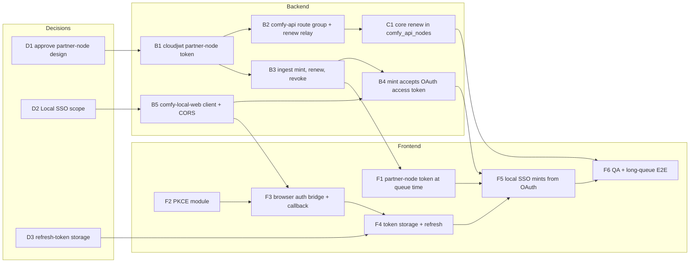

# TDD: SSO sign-in for local ComfyUI

| Field        | Value                                                                                                                                             |
| ------------ | ------------------------------------------------------------------------------------------------------------------------------------------------- |
| Status       | Draft. Not in the SSO pilot scope (Cloud + Desktop); this records the work so it can be scheduled.                                                |
| Linear       | FE-3099 (local sign-in), FE-2170 (execution token). Action items: see below.                                                                      |
| Decision     | [ADR-AUTH-LOCAL-0043](../adr/AUTH-LOCAL-0043-local-comfyui-signs-in-through-cloud-oauth.md)                                                       |
| Repos        | `Comfy-Org/cloud` (ingest, comfy-api), `comfyanonymous/ComfyUI` (core), `Comfy-Org/ComfyUI_frontend`                                              |
| Out of scope | `--listen` over the LAN and remote hosts (no loopback redirect possible); Desktop local (already shipped behind `desktop_embedded_oauth_session`) |

## Problem

An SSO organization's members are refused Firebase sign-in and personal API
keys (`sso_required`). On local ComfyUI those are the only ways to sign in,
so an SSO member loses API nodes. Desktop local avoids this through the
Desktop main process's OAuth session; a plain browser has no equivalent.

## Current state (verified Oct 10)

**Cloud OAuth (`services/ingest`)**

- Native clients may register loopback redirects. The port is ignored, but
  the path and host must match exactly (`127.0.0.1` and `localhost` are not
  interchangeable). PKCE is S256 only.
- `comfy-desktop` registers `http://127.0.0.1/callback` and
  `http://[::1]/callback`, with `comfy-cloud` scopes.
- `/oauth/token` is public but has no CORS for loopback origins. Loopback
  CORS is limited to an allowlist (`allowsLocalDesktopCORSRequest`:
  `/api/auth/token`, `/api/workspaces`, `/api/features`, `/api/billing/*`,
  and a few more), so a browser page at `127.0.0.1:8188` cannot read the
  token response. There is no revoke endpoint.

**comfy-api** accepts Cloud JWTs with audience `comfy-cloud`, so an OAuth
access token already authenticates API-node requests.

**ComfyUI core** serves `index.html` at `/` and static files below it.
There is no auth route; `GET /callback` returns 404. API nodes read
`auth_token_comfy_org` / `api_key_comfy_org` from the prompt's `extra_data`
and send them as `Authorization: Bearer` / `X-API-KEY`.

**Frontend**

- `src/main.ts` starts the host session only when
  `window.__comfyDesktop2.Auth` exists.
- `src/platform/auth/desktopHost/desktopHostSession.ts` depends only on the
  bridge interface (`getState`, `onChanged`, `getWorkspaceToken`,
  `requestSignIn`, `signOut`, optional `switchWorkspace`). The sign-in
  entry, credential selection, prompt credential and workspace switcher
  already follow it.
- There is no PKCE code anywhere in the repo.

## Action items

The source of truth is section 16 of the Notion TDD
[Resolving stale authentication tokens in Local API Nodes](https://app.notion.com/p/3d76d73d36508186b202fb04a95cd6fa),
which combines local sign-in with the partner-node execution token. IDs here
match it. Prefixes: **D** decision, **B** cloud backend, **C** ComfyUI core,
**F** frontend.

Two tracks meet at F5: the execution token (D1 → B1–B3 → C1, F1) and local
sign-in (D2 → B5 → F2–F4). F2 has no dependency and can start now.

### Decisions

| #   | Decision                                                                                  | Who decides                  |
| --- | ----------------------------------------------------------------------------------------- | ---------------------------- |
| D1  | Approve the partner-node token design and its five decisions; the fate of core #16242     | Christian, security reviewer |
| D2  | When is local SSO in scope, and for which customers                                       | Anupreet                     |
| D3  | May a refresh token live in browser storage, or is sign-in per browser session acceptable | Christian, security          |

### Backend

| #   | Action                                                                                                                                                                          | Repo    | Depends on |
| --- | ------------------------------------------------------------------------------------------------------------------------------------------------------------------------------- | ------- | ---------- |
| B1  | Partner-node token in `common/cloudjwt`: `sid`, single audience `comfy-partner-node`, own lifetime                                                                              | cloud   | D1         |
| B2  | comfy-api: accept the audience on the partner route group only, 403 elsewhere; renew relay that tolerates expiry; denied-route counter                                          | cloud   | B1         |
| B3  | Ingest: `resource: partner-node` on `/api/auth/token`; sessions table; renew and revoke; auth-method bit on billing status and secrets resolve; CORS for revoke                 | cloud   | B1         |
| B4  | Ingest: `/api/auth/token` accepts the OAuth access token from local web, for the workspace token and the partner-node token                                                     | cloud   | B3, B5     |
| B5  | Native public client `comfy-local-web` with redirects `http://127.0.0.1/`, `http://[::1]/`, `http://localhost/` (path `/` needs no core route); loopback CORS on `/oauth/token` | cloud   | D2         |
| C1  | Core `comfy_api_nodes/util`: read `exp`, renew before a request or after a 401, resend once. No change to `server.py` or the prompt format                                      | ComfyUI | B2         |

### Frontend

| #   | Action                                                                                                                                                                             | Ticket           | Depends on |
| --- | ---------------------------------------------------------------------------------------------------------------------------------------------------------------------------------- | ---------------- | ---------- |
| F1  | Request the partner-node token at queue time behind a flag; fall back to the workspace token; revoke on logout and account switch                                                  | FE-2170          | B3         |
| F2  | PKCE module in `packages/account-core`: verifier, S256 challenge, `state`, authorize URL, code exchange and refresh, with unit tests                                               | FE-3099          | none       |
| F3  | Browser auth bridge with the `DesktopHostAuthBridge` shape, started from `src/main.ts` behind flag `local_web_sso`; read and check `code`/`state` on boot, exchange, clean the URL | FE-3099          | F2, B5     |
| F4  | Token storage and refresh: access token in memory, refresh token per D3; clear both on sign-out                                                                                    | FE-3099          | F3, D3     |
| F5  | The local SSO session mints the workspace and partner-node tokens from the OAuth credential                                                                                        | FE-3099, FE-2170 | F1, F4, B4 |
| F6  | QA: port Desktop cases D1–D11 to web local; fake-clock long-queue E2E; E2E for flag off, on and token-endpoint failure                                                             | FE-3099          | F5, C1     |

## Related documents

Notion (Documents Hub):

- [Decision: Renewable partner-node token for Local API nodes](https://app.notion.com/p/3df6d73d365081b8b765c43406061d97) — Alexander Piskun, Feedback Wanted. B5, C2.
- [TDD: Resolving stale authentication tokens in Local API Nodes](https://app.notion.com/p/3d76d73d36508186b202fb04a95cd6fa) — Jaewon Yoon, Approved + WIP. FE-2170, BE-13269.
- [TDD: SSO across all services (OIDC/SAML/SCIM)](https://app.notion.com/p/3e66d73d3650815c9394f5b6d7d4ff9f) — Deep Mehta, Approved + WIP.
- [Before / after: SSO system design proposal](https://app.notion.com/p/3e66d73d365081d0b5e4df4eeabf9403) — a subpage of the SSO TDD above.
- [TDD: Universal Auth Flow for the Comfy Ecosystem](https://app.notion.com/p/3256d73d36508141a96df1ec38b123d4) — Christian Byrne, Shipped.
- [SSO frontend test plan](https://app.notion.com/p/3f16d73d365081cd86fcfa1b58374530) and [SSO QA guide](https://app.notion.com/p/3f36d73d365081ffa18df6ffca9aab15) — Jaewon Yoon. Desktop cases D1–D11 to port.

Slack: #proj-sso scope thread (Oct 6–7); #bug-dump execution-auth options (Christian, Aug 25).

## Open questions

Q1 and Q2 became decisions D2 and D3 above.

| #   | Question                                                                                            | Owner               |
| --- | --------------------------------------------------------------------------------------------------- | ------------------- |
| Q3  | Is loopback-only acceptable, or must `--listen` and remote hosts be covered (device authorization)? | Anupreet, Christian |
| Q4  | Does the partner-node token also become the gate for turning Desktop local on in prod?              | Christian           |
