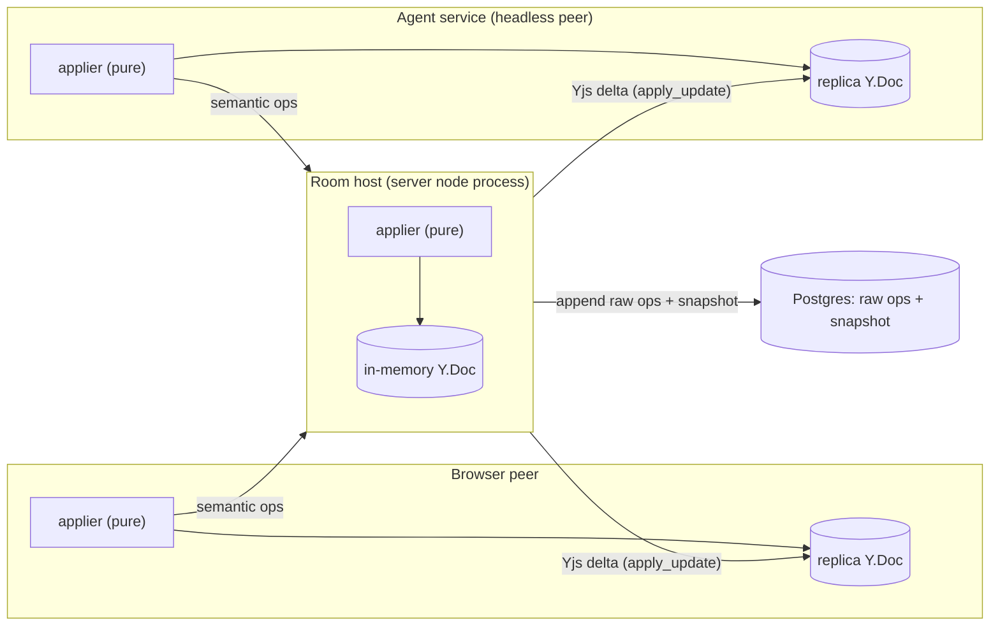

# ADR-0001: Op-based CRDT for in-app-agent graph state (V1)

**Status:** Proposed (aligned 2026-08-17 CRDT handoff sync)
**Date:** 2026-08-17
**Deciders:** Kishore Shimikeri (BE/CRDT), Christian Byrne (FE)

## Context

The in-app Comfy Cloud Agent edits a user's workflow graph. Two models were in play:

- **V0:** a server-owned draft (full save-format JSON) with an integer `version` compare-and-set,
  pushed to the browser as a full-document replace. Pragmatic, but full-doc replace clobbers
  concurrent edits, blows up ingress/egress, and forecloses replay/observability and future
  decentralization.
- **V1 (this ADR):** an op-based CRDT where the agent runs headless (no browser required) and every
  participant holds a materialized replica.

The 2026-08-17 sync resolved a recurring confusion: the "single live writer / merge authority"
language in earlier docs described an implementation convenience (the server is currently the only
process running the applier), not a foundational authority model. Both leads aligned that the
target is true CRDT — all peers equal, every replica identical, eventually consistent. "Merge
authority" is therefore not a design axis; the axes that matter are (a) applier purity/portability,
(b) op persistence + replay, (c) what drives ordering.

## Decision

1. **Headless agent; every peer owns a replica.** The browser, the agent service, and any future
   peer each hold a fully materialized graph replica and run the same pure, portable applier.
   "Client owns the graph" and "headless agent" are the same statement.
2. **Semantic ops are the replication unit.** V1 wire shape: the server node process acts as a
   room host with an in-memory Yjs doc; it applies semantic operations (not raw Yjs ops on the
   wire), then emits the incremental Yjs delta (`apply_update`) that every client integrates.
   Bootstrap/reconnect uses one naive full seeded snapshot (acknowledged to need later iteration).
3. **Persist raw ops end-to-end (V1 target).** Store raw ops so the system is replayable; derive
   ordering directly from the ops. The server-driven sequence number must NOT be the
   conflict-resolution key — it may advance `base_version` but must never be the sole ordering
   authority. (Today only an incrementing sequence pointer is persisted, so the system is not
   replayable and all reconnection hinges on that counter; fixing it needs new tables. Ops are
   small — data volume is not the blocker.)
4. **Persistence is separate from merge.** Every writer applies then writes; ensure no pending ops
   before a write; never pull the DB as a higher authority (that collapses back to de-facto
   full-document last-writer-wins).
5. **Defer the logical clock past V1.** A scalar `base_version` gives deterministic convergence for
   V1; a vector/Lamport/HLC clock (faithful causality across long offline branches) is deferred and
   requires op-sharing + replay first. See `src/types.ts` (`[base_version, actor, op_id]`) and
   `src/stamps.ts`.
6. **Applier stays a pure, portable package** with no client-idiosyncratic local state and no
   DOM/framework/server-only deps, so it runs identically in browser and host (and a future peer).
   Assert yjs-only as a runtime dependency directly (not merely a denylist).

   > **STALENESS FLAG (2026-08-22):** The package now also exports a constrained read-only snapshot
   > surface from `src/read.ts`; it returns deep-frozen plain data and applies the KA-11 schema read
   > gate rather than exposing mutable Yjs handles. See PR #55 (ADR-005) and the A12 schema-guard
   > correction in PR #76.
7. **Conflict UX disabled for V1** (conflicts are now node-level, not full-doc); re-derive later.

## Topology

## V1 replication & durability contract

- **Follower model.** Followers are host-authoritative Yjs replicas: the room host applies semantic
  ops to its in-memory Yjs doc and fans out incremental Yjs deltas (`apply_update`) that followers
  integrate. Followers send semantic ops upstream and never write the shared doc directly. The
  applier is identical everywhere, so this split is a V1 convenience, not a permanent authority
  model.
- **Catch-up after missed deltas.** V1 reconnect is a single naive full seeded snapshot: on
  reconnect a follower discards its delta position and re-forks from one host-provided snapshot
  (`applyUpdate` of a common snapshot). Incremental gap-fill from the op log is a post-V1
  refinement.
- **Room reconstruction after host loss.** A room is rebuildable from durable storage: rehydrate the
  in-memory Yjs doc from the persisted snapshot, then replay the raw op log after it. This is why
  raw-op persistence is load-bearing rather than optional.
- **Durability is the commit point.** Raw ops are persisted durably before any delta is fanned out;
  no delta is delivered before its operation can be reconstructed from durable storage. On restart
  the writer recovers and replays pending (persisted-but-unacknowledged) ops. A persistence failure
  aborts the op (nothing fanned out); a delivery failure retries using the original `op_id` (never
  re-minted).
- **Ordering is independent of arrival order.** The canonical winner of two concurrent ops is
  computed from the op stamp `[base_version, actor, op_id]`, which every replica evaluates
  identically offline — never from receive order. `base_version` is a scalar version cursor the host
  advances on apply, not a causal clock; `actor` and `op_id` are pure tie-breakers applied only
  after it. The known limitation — a scalar cursor cannot faithfully represent causality across long
  independent offline branches — is the deferred logical-clock item, out of V1 scope. Convergence
  tests must deliver concurrent ops in both arrival orders and assert an identical winner.
- **Invalid-op batch semantics: valid-prefix commit, abort remainder.** Ops in a batch apply in
  stamp order. The first invalid op aborts the remainder: the applied valid prefix is committed and
  persisted, `base_version` advances only for committed ops, and the unprocessed suffix (from the
  invalid op onward) is returned to the caller for correction/retry. Fan-out reflects only committed
  ops. Test with an invalid op at the first, middle, and last positions.

  > **STALENESS FLAG (2026-08-22):** The package now rejects additional malformed/untrusted input
  > before mutation, including changed-payload reuse of an `op_id` (`op_id_reuse`), unencodable or
  > cyclic values, excessive nesting, and bounded batch/collection/payload cost. Current ceilings are
  > `MAX_OPS_PER_BATCH = 1024`, `MAX_COLLECTION_ENTRIES = 4096`, and `MAX_OP_COST = 262144`. See
  > PR #33 and schema Amendments A8-A11 (PRs #59, #61, #68, and #71).

## Invariants (a low-context contributor must not break these silently)

**KEEP-ALIVE — guard these (preserve decentralization / offline / P2P / multiplayer):**

1. Ops are the replication unit end-to-end; never exchange raw Yjs updates between two
   independently-edited replicas.
2. The ordering/identity key rides inside the op (`[base_version, actor, op_id]`), a total order any
   replica can evaluate offline. `op_id` is minted once by the creator, never regenerated.
3. The op layer is pure and portable (assert yjs-only; no DOM/framework/litegraph/server-only deps).
4. The applier is deterministic and idempotent (a duplicate `op_id` is a byte-identical no-op).

   > **STALENESS FLAG (2026-08-22):** This is true only for an identical canonical payload. Reusing
   > an `op_id` with a different payload is now an `op_id_reuse` rejection that leaves the document
   > byte-identical and does not consume the retry. See PR #33 (Amendment A8).
5. IDs are collision-free without coordination.
6. Raw Yjs struct updates flow host -> follower one-way only; followers never write the shared doc.
7. Presence/awareness is ephemeral (never persisted into the doc).
8. Layout/view state is a separate front-end-owned Y.Doc (not in the shared semantic doc).
9. Optimistic overlay is presentation-only (cleared on effect, never encoded as a Yjs update).
10. Bootstrap/reconnect forks from ONE seeded snapshot; never independently re-seed the same base.
11. Schema-version discipline enforced on read (fail-closed; provide a `migrate()` path).
12. Catalog pinned at mint by SHA (not branch); reject widget writes to uncatalogued classes.

**FORECLOSE — avoid these (they silently kill the future):**

1. Exchanging raw Yjs struct updates between two independently-edited docs.
2. Making the server the only thing that can assign order (server sequence as the sole conflict
   resolver) — kills hostless peer-to-peer ordering.
3. Coupling the applier/op layer to server-only or DOM/framework-only deps.
4. Treating full-document replace as the mutation primitive.
5. Letting a follower write the shared doc, or merging an optimistic overlay back in.
6. Persisting presence into the doc, or putting layout/view state in the shared semantic doc.
7. Regenerating `op_id` on retry, or resolving conflicts by client-id instead of the stamp.
8. Re-deriving `add_node` payloads from a schema on replay (defaults drift).
9. Locking `base_version` to a server-assigned scalar counter as the permanent design (fine for V1
   convergence; leave room for a logical clock).
10. Citing the frozen vocabulary/catalog by moving branch instead of SHA.

## Consequences

- **Positive:** future peer-to-peer / LAN, hostless multiplayer on hosted or enterprise
  deployments, multi-agent replay, offline and double-offline all remain reachable from the V1
  shape. Ops give replay, observability, and cheap deltas.
- **Cost:** raw-ops persistence needs new DB tables; reconnect seeding is naive in V1; a proper
  logical clock and conflict UX are deferred.
- **Non-goals for V1:** vector clock, node-level conflict UX, separate-repo extraction of the
  applier (the package boundary is kept, but extraction into a standalone repo is not required yet).

## Alternatives considered

- **Keep V0 full-doc replace + integer-`version` CAS:** rejected as the target — clobbers
  concurrent edits, no replay, forecloses decentralization. Retained only as the shipped V0.
- **Server as permanent merge authority:** rejected — not needed for correctness under a pure
  shared applier, and it forecloses hostless topologies.

## Glossary

- **Applier** — pure function folding a semantic op into a replica's state; identical and
  side-effect-free on every peer.
- **Semantic op** — an app-domain mutation (`add_node`, `set_widget`, ...) carrying a stamp
  `[base_version, actor, op_id]`; the replication unit.
- **Raw struct fan-out** — host-generated incremental Yjs binary deltas (`apply_update`) broadcast
  to followers; not full-document reloads.
- **Room host** — the server node process holding the in-memory Yjs doc for a workflow; a V1
  convenience, not a conflict authority.
- **Headless peer** — the agent replica running with no browser attached.
- **base_version** — scalar version pointer; advances on apply. A V1 ordering aid, not the
  permanent conflict key.
- **LWW** — last-writer-wins; here resolved by the op stamp, never by client-id or a DB read.
