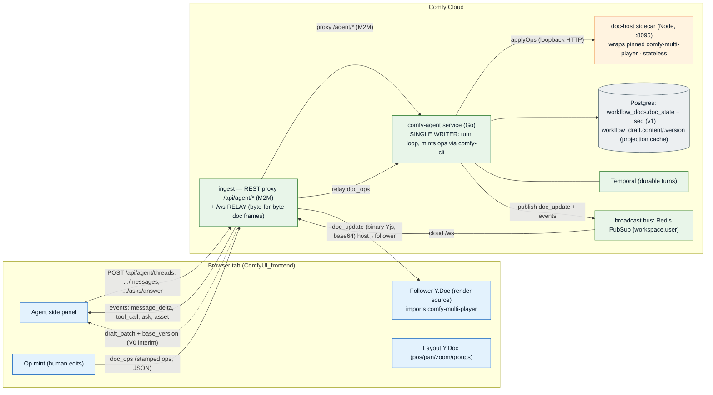
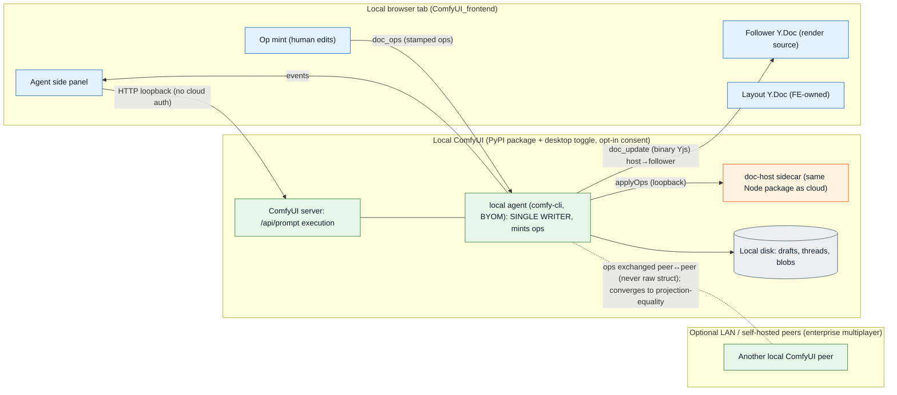

# ADR 0002 — In-App Agent: systems, public APIs, and data flows (cloud and local)

- Status: Draft (for review)
- Date: 2026-08-20
- Verified against: `Comfy-Org/cloud` @ `070dce96` (`origin/main`, 2026-08-21) —
  `services/agent/ARCHITECTURE.md`, `common/websocket/messages/crdt.go`,
  `.github/workflows/multiplayer-contract.yml`, `services/agent/dochost/`.
  (Originally verified at branch ref `8d062714`, which is **not an ancestor of `main`**;
  the CRDT surfaces merged to `main` on 2026-08-20 and `main` is a superset of that ref.)

  > **STALENESS FLAG (2026-08-22):** Cloud `main` has advanced to `84890f9a`; spot checks at that
  > revision still confirm the listed REST routes, CRDT frame types/caps, event schema, and doc-host,
  > but this document has not been exhaustively re-verified against every intervening cloud change.
- Related: ADR 0001 (op-based CRDT for graph state), `docs/multiplayer-schema.md`,
  `docs/api-contract-proposal.md`

## Context

The in-app agent edits a user's live workflow. Reviewers keep re-deriving "who talks to whom,
over what channel, in what unit" from scattered code. This ADR records the system decomposition
and public API surface as one reference, for the **cloud** deployment (shipped V0 + V1 CRDT
target) and the **local** deployment (PyPI package + desktop toggle).

Two contracts exist and only one is REST:

1. **Agent control plane (shipped).** REST over the ingest proxy `/api/agent/*` → the
   `comfy-agent` service `/agent/*`, plus a live event stream (turn deltas, tool calls,
   `draft_patch`) over the existing client WebSocket via a Redis broadcast bus. The draft ships
   today as a whole-ish `draft_patch` + `base_version`, **not** CRDT ops.
2. **CRDT replication (V1 target).** Stamped semantic **ops** client→host and **binary Yjs
   struct updates** host→follower, plus awareness and an FE-owned layout Y.Doc, carried as
   `{type,data}` frames on the same `/ws` socket.

The applier is one shared package — `@comfyorg/comfy-multi-player`, pinned by git SHA. The
browser imports it, and the cloud backend runs the **same** package inside a small Node sidecar
(`services/agent/dochost`) rather than reimplementing op semantics in Go. There is deliberately
**no Go applier**.

> **STALENESS FLAG (2026-08-22):** The dependency-source claim is obsolete. The package is now
> published publicly as `@comfyorg/comfy-multi-player@0.1.0`; cloud `main` consumes version `0.1.0`
> from `services/agent/dochost/package.json`, and the frontend integration branch consumes the
> published package as well. ADR-004's “git SHA; no registry publish yet” policy is pending separate
> supersession under `CMP-ADR004-SUPERSEDE`.

## Cloud topology (verified)

The browser and the sidecar run the identical applier; the Go service is the only process that
mutates the shared Y types, and ingest never mutates — it relays.

### Public API — shipped control plane (REST)

| Method | ingest path | agent path | purpose |
|---|---|---|---|
| POST | `/api/agent/threads` | `/agent/threads` | create thread |
| GET | `/api/agent/threads` | `/agent/threads` | list threads |
| POST | `/api/agent/threads/:id/messages` | `.../messages` | start a turn (single-active-turn → 409) |
| GET | `/api/agent/threads/:id/messages` | `.../messages` | message history (not the live stream) |
| POST | `/api/agent/threads/:id/messages/:message_id/cancel` | `.../cancel` | cancel a turn |
| POST | `/api/agent/threads/:id/asks/:ask_id/answer` | `.../asks/.../answer` | answer an agent ask |
| GET | `/api/agent/draft?workflow_id=` | `/agent/draft` | fetch current draft |

Live turn events do **not** come back on the `messages` GET; they publish to the Redis
broadcast bus (channel = {workspace, user}) and reach the browser over the cloud WebSocket.
Event contract: `services/agent/api/agent_events.schema.json`.

### CRDT wire protocol (V1-036, `common/websocket/messages/crdt.go`)

- Universal envelope `{ "type": ..., "data": { "v": 1, ... } }`, identical to every other `/ws`
  frame so ingest relays it unchanged. `DocProtocolVersion = 1` in `data.v`; a parser **rejects**
  any other value (a mis-parse is a corrupted doc, not a dropped event).
- client→server: `doc_subscribe`, `doc_unsubscribe`, `doc_ops`. server→client:
  `doc_subscribed`, `doc_ops_result`, `doc_update`. `awareness`: both ways (ephemeral).
- `doc_ops` carries stamped ops; `update_b64` (binary Yjs, base64-in-JSON) travels
  **host→follower only**. A binary WS subprotocol (~33% smaller) is deferred.
- Transport caps: frame 8 MiB, 256 ops/frame, 4 MiB/batch, workflow-id 128, awareness 8 KiB,
  actor 256. Actor grammar is closed and server-validated: `agent:<thread>:<turn>`,
  `human:<user>:<tab>`, `system:mint` (actors are the LWW tiebreak).

### The write path — two modes, per workflow (V1-037/041)

| | `off` (V0 default) | `on` (V1) |
|---|---|---|
| Unit | whole graph | CLI's stamped ops |
| Applier of record | comfy-cli, local scratch | **doc-host sidecar** |
| Source of truth | `workflow_draft.content` | `workflow_docs.doc_state` (Yjs) |
| Concurrency | `workflow_draft.version` (CAS) | `workflow_docs.seq` (`docstore.Advance`) |
| Concurrent canvas edit | CAS fails → reload + re-apply | merges; nothing fails |

Dual-write refreshes `workflow_draft` on every doc advance, so V0 reads keep working and
rollback is a flag flip. Two flags, never conflated: storage = per-workflow
`workflows.crdt_enabled` × `AGENT_CRDT_MODE`; product = per-user PostHog
`agent-in-app-experience` (whether ingest exposes `/api/agent/*` at all). Lazy mint converts a
flagged workflow's first touch into the doc's initial snapshot (`system:mint`), once.

### Widget catalog (V1-038)

Workflows store widget values positionally; the shared doc stores them by name. Every op and
projection in `on` mode resolves against a widget catalog — a derived `object_info` projection,
`catalog_version` = sha256, acquired once per process via `comfy nodes widget-catalog`
(offline, no creds). Configured-but-unreadable = startup failure; with no source, `on` fails
**closed** at startup.

## Local topology

Local is cloud with the sidecar co-located and cloud-only concerns (M2M, billing, Neon)
removed. The same applier package and the same op/struct/awareness/layout channels apply over
loopback. Because ops are the replication unit, LAN / self-hosted **peer-to-peer** multiplayer
stays possible. Offline product mode (a lightweight SQLite-backed durable runner) is later work;
Temporal is not required on every local machine.

> **UNVERIFIED-2026-08-22:** This local deployment topology is directional prose. This grooming pass
> did not find a cheap authoritative cloud-main source that proves the in-process local doc host,
> loopback channel set, BYOM wiring, or optional LAN peer path end to end; re-check the local
> ComfyUI/desktop implementation before treating these elements as shipped.

## What is shared vs different across cloud and local

| Concern | Cloud | Local |
|---|---|---|
| Applier / op→doc semantics | **SAME** (`comfy-multi-player` via doc-host sidecar) | **SAME** |
| Harness loop, tools, event schema, Temporal turn model | **SAME** | **SAME** |
| CLI routing | `--where cloud` | `--where local [--project-dir]` |
| Assets | managed assets, signed URLs | user filesystem |
| Run watching | native `loop.JobWaiter` (Redis + jobs API) | CLI `jobs wait` over local `/ws` + `/history` |
| Spend gate | cloud credits/quotas | user GPU time |
| Security | sandboxed multi-tenant runner | user-owned CLI (no pretend sandbox) |
| Persistence | Postgres + Temporal history | disk; local-first is future |

Only `internal/target` (`Runtime`) and `internal/boundary` (`Policy`) differ.

## Decision: openapi / typegen fit

- **REST control plane** (threads/messages/asks/draft) SHOULD be added to cloud
  `api/v2/openapi.yaml` for generated FE types + breaking-change/freshness CI; it is not there
  today.
- **The event stream** (`agent_events.schema.json`) stays a standalone JSON Schema (openapi 3.0
  has no server-push event model) and generates TS + Go from that file.
- **The CRDT op envelope + wire frames** are cross-language contracts owned by the shared
  package's types, enforced by `multiplayer-contract.yml` (pin integrity + fixture conformance
  through the real sidecar) — not through the REST openapi. This does not fold into the existing
  openapi typegen; it is a separate, versioned protocol contract. (Migrating the package into the
  ComfyUI_frontend monorepo later is a dependency-source swap, not a protocol change.)
- **The binary Yjs struct stream** is opaque bytes; nothing to typegen.

## Verification note (V1-042 §7, re-corrected 2026-08-21 after the CRDT surfaces merged to `main`)

**Superseded framing (2026-08-20):** an earlier version of this note reasoned about a "CRDT
integration branch" (`8d062714`, PR #6711) versus a `main` that "has no doc-host". That split no
longer exists — the server-side CRDT surfaces merged to `cloud` `main` on 2026-08-20, and any
argument that leans on "#6711 is do-not-merge" as containment is void.

Current state at `main@070dce96`:

- The doc-host ships on `main` (`services/agent/dochost/`, chart template
  `charts/comfy-agent/base/templates/deployment.yaml`). The base chart disables the sidecar
  (`base/values.yaml:58-60`), but the **prod-v2, stg-v2, and ephemeral overlays all enable it**
  with `AGENT_CRDT_MODE: "on"` — the CRDT write path runs in production, not just previews.
- `preview-provision.yml` advertises the `agent` smoke capability unconditionally
  (`smoke_target_capabilities=…,agent`, lines 89-100), so a **provisioned** `main` preview runs
  the agent scenarios including `agent_crdt_shadow_diff` — the old self-skip caveat is gone for
  previews. A green CI run that never provisions a preview still proves nothing.
- The env that genuinely excludes comfy-agent remains the fixed shared `comfy-cloud-test-v2`
  (no comfy-agent overlay exists for it); V1-042 §7 conflated it with PR ephemerals.
- What "pre-ship" still accurately describes is the **client**: no frontend subscriber exists on
  any released branch (see "Not yet built"), so the shipped server path has no consumer yet.

  > **STALENESS FLAG (2026-08-22):** A frontend integration branch now consumes the published
  > package, so “no consumer yet” is no longer true without the narrower “released frontend”
  > qualifier. The released-branch status itself was not changed by this flag.

Real evidence = local stack (`SMOKE_TARGET_CAPABILITIES=agent` + `SMOKE_DOC_HOST_ENDPOINT` +
`SMOKE_WIDGET_CATALOG_PATH`) + `agenteval` + any provisioned `main` preview/staging +
`crdt-shadow-diff`.

## Not yet built (do not describe as shipped)

- The frontend has **no** CRDT doc-frame client (`doc_ops`/`doc_update`/`doc_subscribe`), no
  follower Y.Doc/applier consumer, and no `comfy-multi-player` dependency — only the V0
  `draft_patch` apply path. This is the FE-1330 work.

  > **STALENESS FLAG (2026-08-22):** This remains a statement about released frontend branches,
  > not all active development: the FE integration branch now depends on
  > `@comfyorg/comfy-multi-player@0.1.0`. Its complete doc-frame behavior was not re-verified here.
- Typed E2E clients are not wired (the FE generates JSON schemas, not an openapi client).

## Glossary

- **doc host / sidecar** — the Node process (`services/agent/dochost`) that runs the shared
  applier over loopback HTTP; the applier of record in `on` mode.
- **single writer** — the agent service (Go) is the only process that mutates the shared Y types.
- **relay** — ingest forwards `/ws` doc frames byte-for-byte; it never mutates the doc.
- **doc_ops / doc_update** — inbound stamped-op frame / outbound binary Yjs struct frame.
- **stamped op** — the frozen op envelope; `op_id` is a uuid4 hex minted once, never regenerated.
- **seq** — `workflow_docs.seq`, the v1 concurrency counter advanced by `docstore.Advance`.
- **draft_patch** — the interim V0 whole-ish draft + `base_version` over the event stream.
- **projection** — `project(doc, catalog)`: the canonical workflow JSON a replica renders.
- **widget catalog / catalog_version** — derived `object_info` projection resolving positional
  widgets by name; sha256-pinned, fail-closed.
- **crdt_enabled vs agent-in-app-experience** — per-workflow storage flag vs per-user product
  flag; never the same lever.
- **BYOM** — bring your own (local) model, a local headless op-writer configuration.
- **M2M** — machine-to-machine shared-secret gate the ingest proxy presents to the agent service.
