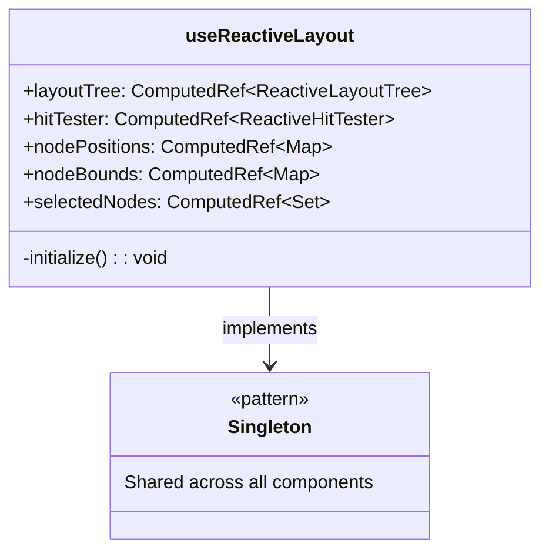
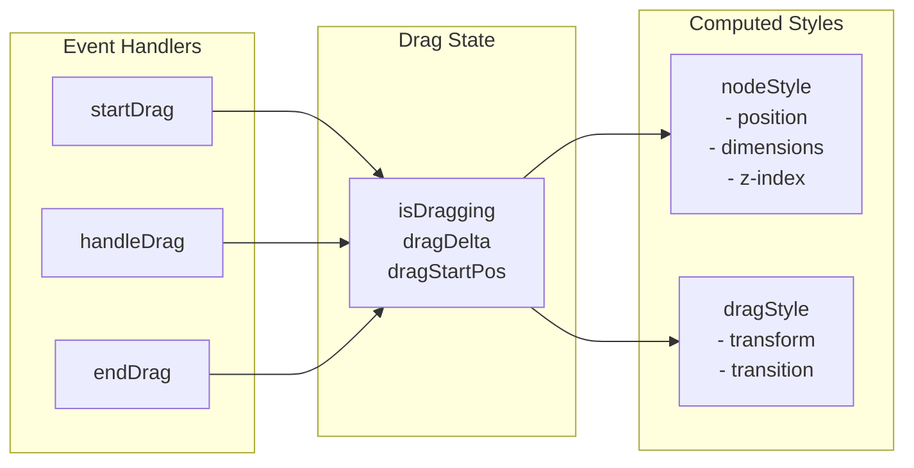
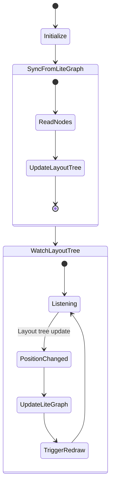

# Graph Composables - Reactive Layout System

This directory contains composables for the reactive layout system, enabling Vue nodes to handle their own interactions while maintaining synchronization with LiteGraph.

## Composable Architecture

```mermaid
graph TB
    subgraph "Composables"
        URL[useReactiveLayout<br/>- Singleton Management<br/>- Service Access]
        UVNI[useVueNodeInteraction<br/>- Node Dragging<br/>- CSS Transforms]
        ULGS[useLiteGraphSync<br/>- Bidirectional Sync<br/>- Position Updates]
    end

    subgraph "Services"
        LT[ReactiveLayoutTree]
        HT[ReactiveHitTester]
    end

    subgraph "Components"
        GC[GraphCanvas]
        VN[Vue Nodes]
        TP[TransformPane]
    end

    URL --> LT
    URL --> HT
    UVNI --> URL
    ULGS --> URL
    
    GC --> ULGS
    VN --> UVNI
    TP --> URL
</mermaid>

## Interaction Flow

```mermaid
sequenceDiagram
    participant User
    participant VueNode
    participant UVNI as useVueNodeInteraction
    participant LT as LayoutTree
    participant LG as LiteGraph

    User->>VueNode: pointerdown
    VueNode->>UVNI: startDrag(event)
    UVNI->>UVNI: Set drag state
    UVNI->>UVNI: Capture pointer
    
    User->>VueNode: pointermove
    VueNode->>UVNI: handleDrag(event)
    UVNI->>UVNI: Calculate delta
    UVNI->>VueNode: Update CSS transform
    Note over VueNode: Visual feedback only
    
    User->>VueNode: pointerup
    VueNode->>UVNI: endDrag(event)
    UVNI->>LT: updateNodePosition(finalPos)
    LT->>LG: Trigger reactive sync
    LG->>LG: Update canvas
```

## useReactiveLayout

Singleton management for the reactive layout system.



## useVueNodeInteraction

Handles individual node interactions with CSS transforms.



### Transform Calculation

```mermaid
graph TB
    subgraph "Mouse Delta"
        MD[event.clientX/Y - startMouse]
    end
    
    subgraph "Canvas Transform"
        CT[screenToCanvas conversion]
    end
    
    subgraph "Drag Delta"
        DD[Canvas-space delta]
    end
    
    subgraph "CSS Transform"
        CSS[translate(deltaX, deltaY)]
    end
    
    MD --> CT
    CT --> DD
    DD --> CSS
```

## useLiteGraphSync

Bidirectional synchronization between LiteGraph and the reactive layout tree.



## Integration Example

```typescript
// In GraphCanvas.vue
const { initializeSync } = useLiteGraphSync()
onMounted(() => {
  initializeSync() // Start bidirectional sync
})

// In LGraphNode.vue
const {
  isDragging,
  startDrag,
  handleDrag,
  endDrag,
  dragStyle,
  updatePosition
} = useVueNodeInteraction(props.nodeData.id)

// Template
<div
  :style="[
    {
      transform: `translate(${position.x}px, ${position.y}px)`,
      // ... other styles
    },
    dragStyle // Applied during drag
  ]"
  @pointerdown="handlePointerDown"
  @pointermove="handlePointerMove"
  @pointerup="handlePointerUp"
>
```

## Performance Considerations

1. **CSS Transforms During Drag**: No layout recalculation, GPU accelerated
2. **Batch Position Updates**: Layout tree updates trigger single LiteGraph sync
3. **Reactive Efficiency**: Vue's computed properties cache results
4. **Spatial Indexing**: QuadTree integration for fast hit testing

## Future Migration Path

Currently: Vue nodes use CSS transforms, commit to layout tree on drag end
Future: Each renderer owns complete interaction handling and layout state