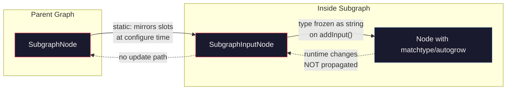

# Subgraph Limitations: Dynamic Inputs (MatchType / Autogrow)

MatchType and autogrow do not work inside subgraphs. Subgraph boundary slots freeze their type at connection time — whatever type exists at that moment is permanently captured as a fixed string. There is no runtime type resolution or reactivity across the boundary: matchtype mutations and autogrow slot additions on internal nodes are never propagated to the `SubgraphNode`.

## MatchType

`SubgraphInputNode.connectByType` captures the type as a fixed string via `subgraph.addInput(name, String(type))`. `SubgraphNode` mirrors this once via the `input-added` event.

The subgraph boundary slot type is frozen at connection time with no subsequent reactivity. If the first connection carries a specific type (e.g., `IMAGE`), the slot is correctly typed and incompatible connections are properly blocked on the `SubgraphNode`. However, if the first connection carries `*` (any type) — for example from a switch node — the slot is permanently set to `*`, accepting any connection regardless of the internal node's actual type requirements. Once frozen, the type never updates, even if internal matchtype mutations change the connected node's type.

## Autogrow

Autogrow hooks `onConnectionsChange` and splices new inputs into the node's `inputs` array when the last slot is connected. These inputs are added to the **internal node**, not to the subgraph's input/output definitions. `SubgraphNode` only listens for events on the subgraph definition — there is no bridge.

Open UX questions (from the autogrow author):
- Should promoting an autogrow connection cause the `SubgraphNode` to autogrow from that slot?
- How to distinguish "promote this specific input" vs "promote the autogrow behavior"?

## Workarounds

- Use explicitly typed subgraph inputs instead of matchtype at the boundary.
- Move matchtype/autogrow outside the subgraph; pass stable typed values in.
- Create separate subgraph variants per type instead of switching dynamically.

## References

- `src/core/graph/widgets/dynamicWidgets.ts` — `applyMatchType`, `applyAutogrow`
- `src/lib/litegraph/src/subgraph/SubgraphInputNode.ts` — `connectByType`
- `src/lib/litegraph/src/subgraph/SubgraphNode.ts` — `input-added` event listener
- [#8352](https://github.com/Comfy-Org/ComfyUI_frontend/pull/8352) (closed) — attempted fix, unresolved edge cases
- [#7837](https://github.com/Comfy-Org/ComfyUI_frontend/pull/7837) (merged) — partial fix only
