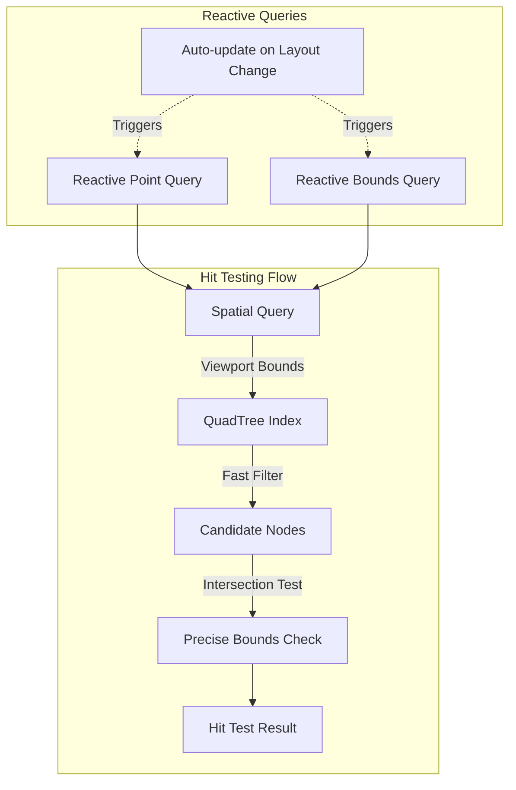
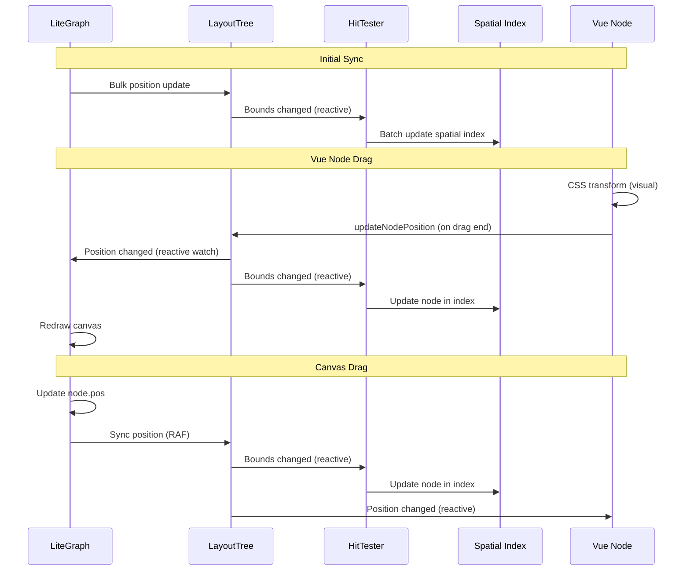

# Reactive Layout Services

This directory contains the core implementations of the reactive layout system that bridges Vue node interactions with LiteGraph.

## Service Architecture

```mermaid
graph LR
    subgraph "Services"
        RLT[ReactiveLayoutTree<br/>- Position/Bounds State<br/>- Selection State]
        RHT[ReactiveHitTester<br/>- Spatial Queries<br/>- QuadTree Integration]
    end

    subgraph "Renderers"
        Canvas[Canvas Renderer<br/>(LiteGraph)]
        Vue[Vue Renderer<br/>(DOM Nodes)]
    end

    subgraph "Spatial Index"
        QT[QuadTree<br/>Spatial Index]
    end

    Canvas -->|Write| RLT
    Vue -->|Write| RLT
    RLT -->|Reactive Updates| Canvas
    RLT -->|Reactive Updates| Vue
    
    RHT -->|Query| QT
    RLT -->|Sync Bounds| RHT
    RHT -->|Hit Testing| Vue
</mermaid>

## ReactiveLayoutTree Implementation

```mermaid
classDiagram
    class ReactiveLayoutTree {
        -_nodePositions: Ref~Map~
        -_nodeBounds: Ref~Map~
        -_selectedNodes: Ref~Set~
        +nodePositions: ComputedRef~Map~
        +nodeBounds: ComputedRef~Map~
        +selectedNodes: Ref~Set~
        +updateNodePosition(nodeId, position)
        +updateNodeBounds(nodeId, bounds)
        +selectNodes(nodeIds, addToSelection)
        +clearSelection()
    }

    class customRef {
        <<Vue Reactivity>>
        +track()
        +trigger()
    }

    ReactiveLayoutTree --> customRef : uses for shared write access
```

### Key Features
- Uses Vue's `customRef` to allow both renderers to write
- Provides reactive computed properties for automatic updates
- Maintains immutable update pattern (creates new Maps on change)
- Supports both single and bulk updates

## ReactiveHitTester Implementation



### Performance Optimizations
- Integrates with existing QuadTree spatial indexing
- Two-phase hit testing: spatial index filter + precise bounds check
- Reactive queries use Vue's computed for efficient caching
- Direct queries available for immediate results during interactions

## Data Synchronization



## Usage Example

```typescript
// In Vue component
const { layoutTree, hitTester } = useReactiveLayout()

// Initialize layout tree sync
const { initializeSync } = useLiteGraphSync()
initializeSync()

// In Vue node component
const { 
  isDragging,
  startDrag,
  handleDrag,
  endDrag,
  dragStyle 
} = useVueNodeInteraction(nodeId)

// Reactive position tracking
const nodePos = hitTester.getNodePosition(nodeId)
watch(nodePos, (newPos) => {
  console.log('Node moved to:', newPos)
})
```