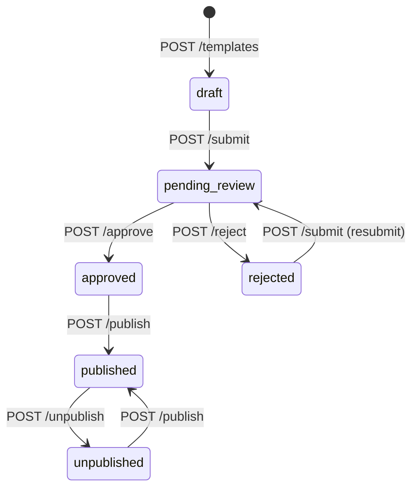
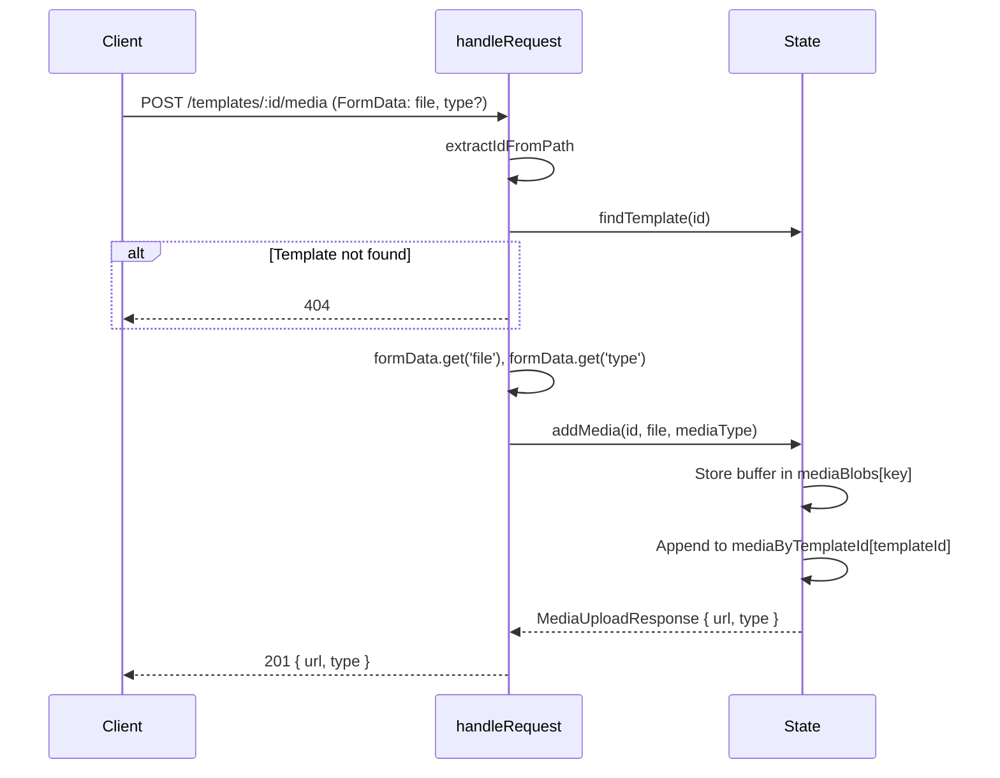

# Mock Marketplace API Diagrams

### Endpoint Summary Table

| Method | Path | Handler | State |
|--------|------|---------|-------|
| POST | `/api/marketplace/templates` | createTemplate | db |
| PUT | `/api/marketplace/templates/:id` | updateTemplate | db |
| POST | `/api/marketplace/templates/:id/submit` | transitionStatus | db |
| POST | `/api/marketplace/templates/:id/approve` | transitionStatus | db |
| POST | `/api/marketplace/templates/:id/reject` | transitionStatus | db |
| POST | `/api/marketplace/templates/:id/publish` | transitionStatus | db |
| POST | `/api/marketplace/templates/:id/unpublish` | transitionStatus | db |
| POST | `/api/marketplace/templates/:id/media` | addMedia | db, mediaBlobs |
| GET | `/api/marketplace/media/seed/*` | readFile (fs) | seed-media/ |
| GET | `/api/marketplace/media/:templateId/:filename` | getMediaBlob | mediaBlobs |
| GET | `/api/marketplace/author/templates` | getDb | db |
| GET | `/api/marketplace/author/stats` | getDb | db |
| GET | `/api/marketplace/categories` | getDb | db |
| GET | `/api/marketplace/tags/suggest` | getDb | db |
| POST | `/api/marketplace/_reset` | resetDb | db, mediaBlobs |
| GET | `/review` | static HTML | — |

### Template Status Flow

### Media Upload Flow

